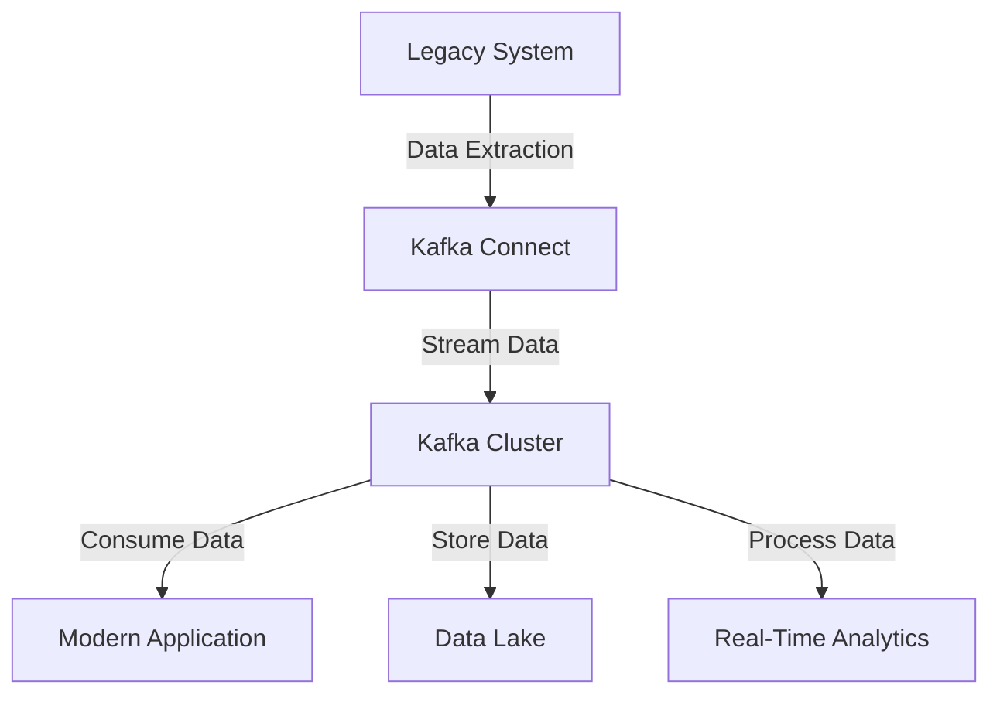

## 7.2 Integration with Databases and Legacy Systems

Integrating Apache Kafka with databases and legacy systems is a crucial step for organizations aiming to modernize their data infrastructure. This section explores the challenges and solutions associated with such integrations, focusing on Change Data Capture (CDC) techniques and bulk data movement patterns. By leveraging Kafka, enterprises can enhance their data processing capabilities without disrupting existing systems.

### Challenges in Integrating Kafka with Legacy Systems

Legacy systems, often built on outdated technologies, pose several challenges when integrating with modern platforms like Kafka:

- **Data Inconsistency**: Legacy systems may not support real-time data synchronization, leading to inconsistencies.
- **Complex Data Models**: Older systems often have complex and rigid data models that are difficult to adapt.
- **Limited Connectivity**: Many legacy systems lack APIs or connectors for seamless integration.
- **Performance Bottlenecks**: Legacy systems may not handle the high throughput and low latency requirements of modern data streams.
- **Security Concerns**: Ensuring secure data transfer between legacy systems and Kafka can be challenging.

### Kafka Connect and Connectors

Kafka Connect is a powerful tool for integrating Kafka with various data sources and sinks, including databases and legacy systems. It simplifies the process of streaming data to and from Kafka, providing a scalable and reliable solution.

#### Key Features of Kafka Connect

- **Scalability**: Kafka Connect can scale horizontally, handling large volumes of data efficiently.
- **Fault Tolerance**: It offers built-in fault tolerance, ensuring data integrity even in case of failures.
- **Extensibility**: With a wide range of connectors available, Kafka Connect can integrate with numerous systems.
- **Configuration Simplicity**: Connectors can be configured easily using JSON files, reducing the complexity of integration.

#### Commonly Used Connectors

- **JDBC Connector**: Facilitates integration with relational databases like MySQL, PostgreSQL, and Oracle.
- **Debezium**: A popular CDC tool that captures changes from databases and streams them to Kafka.
- **HDFS Connector**: Streams data from Kafka to Hadoop Distributed File System (HDFS) for big data processing.

### Change Data Capture (CDC)

Change Data Capture (CDC) is a technique used to identify and capture changes made to data in a database. It plays a vital role in integrating databases with Kafka, enabling real-time data streaming.

#### Importance of CDC

- **Real-Time Data Processing**: CDC allows for real-time data updates, ensuring that Kafka streams are always up-to-date.
- **Data Consistency**: By capturing changes as they occur, CDC maintains data consistency across systems.
- **Reduced Load**: CDC minimizes the load on source systems by only capturing changes rather than full data sets.

#### Implementing CDC with Kafka

Debezium is a widely used CDC tool that integrates seamlessly with Kafka. It supports various databases, including MySQL, PostgreSQL, and MongoDB.

```java
// Example of configuring Debezium for MySQL
{
  "name": "mysql-connector",
  "config": {
    "connector.class": "io.debezium.connector.mysql.MySqlConnector",
    "database.hostname": "localhost",
    "database.port": "3306",
    "database.user": "debezium",
    "database.password": "dbz",
    "database.server.id": "184054",
    "database.server.name": "dbserver1",
    "database.include.list": "inventory",
    "database.history.kafka.bootstrap.servers": "kafka:9092",
    "database.history.kafka.topic": "schema-changes.inventory"
  }
}
```

### Integrating with Common Databases

#### MySQL Integration

MySQL is a widely used relational database, and integrating it with Kafka can be achieved using the JDBC connector or Debezium for CDC.

```java
// Example of using JDBC Source Connector for MySQL
{
  "name": "jdbc-source-mysql",
  "config": {
    "connector.class": "io.confluent.connect.jdbc.JdbcSourceConnector",
    "connection.url": "jdbc:mysql://localhost:3306/mydb",
    "connection.user": "user",
    "connection.password": "password",
    "table.whitelist": "my_table",
    "mode": "incrementing",
    "incrementing.column.name": "id",
    "topic.prefix": "mysql-"
  }
}
```

#### Oracle Integration

Oracle databases can be integrated with Kafka using the Oracle CDC connector, which captures changes and streams them to Kafka.

```java
// Example of configuring Oracle CDC Connector
{
  "name": "oracle-cdc-connector",
  "config": {
    "connector.class": "io.debezium.connector.oracle.OracleConnector",
    "database.hostname": "oracle-db-host",
    "database.port": "1521",
    "database.user": "oracle_user",
    "database.password": "oracle_password",
    "database.dbname": "ORCL",
    "database.pdb.name": "pdb1",
    "database.server.name": "server1",
    "table.include.list": "schema.table",
    "database.history.kafka.bootstrap.servers": "kafka:9092",
    "database.history.kafka.topic": "schema-changes.oracle"
  }
}
```

### Best Practices for Ensuring Data Consistency and Reliability

- **Use Idempotent Producers**: Ensure that producers are idempotent to avoid duplicate data in Kafka.
- **Implement Exactly-Once Semantics**: Use Kafka's exactly-once processing capabilities to maintain data integrity.
- **Monitor Data Streams**: Continuously monitor data streams for anomalies or inconsistencies.
- **Leverage Schema Registry**: Use [1.3.3 Schema Registry]( "Schema Registry") to manage and enforce data schemas.
- **Ensure Secure Data Transfer**: Implement SSL/TLS encryption and authentication mechanisms to secure data in transit.

### Visualizing Integration Patterns



**Diagram**: This flowchart illustrates the integration of legacy systems with modern applications using Kafka. Data is extracted from legacy systems, streamed through Kafka Connect, and consumed by modern applications or stored in data lakes for further processing.

### Real-World Scenarios

- **Financial Services**: Integrating Kafka with legacy banking systems to enable real-time fraud detection and transaction processing.
- **Retail**: Streaming inventory updates from legacy ERP systems to Kafka for real-time stock management.
- **Healthcare**: Capturing changes from legacy health record systems and streaming them to Kafka for analytics and reporting.

### Related Patterns

- **[1.4.4 Big Data Integration]( "Big Data Integration")**: Explore how Kafka integrates with big data platforms for enhanced analytics.
- **[9.1 Designing Event-Driven Microservices]( "Designing Event-Driven Microservices")**: Learn about designing microservices architectures using Kafka.

### Conclusion

Integrating Kafka with databases and legacy systems is a transformative step for organizations looking to modernize their data infrastructure. By leveraging tools like Kafka Connect and techniques such as CDC, enterprises can achieve real-time data processing and maintain data consistency across systems. Implementing best practices ensures reliable and secure data integration, paving the way for advanced analytics and improved decision-making.

## Test Your Knowledge: Advanced Kafka Integration Quiz



### What is the primary challenge when integrating Kafka with legacy systems?

- [x] Data inconsistency
- [ ] High throughput
- [ ] Low latency
- [ ] Scalability

> **Explanation:** Legacy systems often struggle with maintaining data consistency when integrated with modern platforms like Kafka.

### Which tool is commonly used for Change Data Capture (CDC) with Kafka?

- [x] Debezium
- [ ] Flink
- [ ] Spark
- [ ] Hadoop

> **Explanation:** Debezium is a popular CDC tool that integrates with Kafka to capture changes from databases.

### What is the role of Kafka Connect in integration?

- [x] Facilitates data streaming between Kafka and external systems
- [ ] Provides a user interface for Kafka
- [ ] Manages Kafka clusters
- [ ] Secures Kafka data

> **Explanation:** Kafka Connect is used to stream data between Kafka and various data sources and sinks.

### How does CDC help in maintaining data consistency?

- [x] By capturing changes as they occur
- [ ] By storing full data sets
- [ ] By reducing data volume
- [ ] By increasing data latency

> **Explanation:** CDC captures changes in real-time, ensuring that data streams remain consistent.

### Which connector is used for integrating Kafka with MySQL?

- [x] JDBC Connector
- [ ] HDFS Connector
- [ ] Oracle Connector
- [ ] MongoDB Connector

> **Explanation:** The JDBC Connector is commonly used for integrating Kafka with relational databases like MySQL.

### What is a key benefit of using Kafka Connect?

- [x] Scalability
- [ ] Complexity
- [ ] Manual configuration
- [ ] Limited connectivity

> **Explanation:** Kafka Connect is highly scalable, allowing it to handle large volumes of data efficiently.

### What is the purpose of the Schema Registry in Kafka?

- [x] To manage and enforce data schemas
- [ ] To store Kafka topics
- [ ] To monitor Kafka clusters
- [ ] To secure Kafka data

> **Explanation:** The Schema Registry is used to manage and enforce data schemas in Kafka.

### Which security mechanism is recommended for securing data in transit?

- [x] SSL/TLS encryption
- [ ] Plaintext communication
- [ ] Basic authentication
- [ ] No security

> **Explanation:** SSL/TLS encryption is recommended for securing data in transit.

### What is a common use case for integrating Kafka with legacy systems?

- [x] Real-time fraud detection
- [ ] Batch processing
- [ ] Static reporting
- [ ] Manual data entry

> **Explanation:** Real-time fraud detection is a common use case for integrating Kafka with legacy systems.

### True or False: Kafka Connect can only be used with relational databases.

- [ ] True
- [x] False

> **Explanation:** Kafka Connect can be used with a variety of data sources and sinks, not just relational databases.


