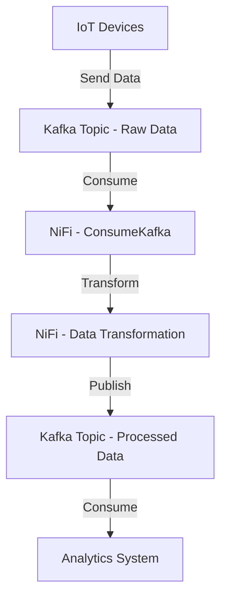

## 7.3.2 Data Flow Integration with Apache NiFi

Apache NiFi is a powerful data flow management tool that enables the automation of data movement between disparate systems. Its flow-based programming model allows for the design of complex data flows that can integrate with Apache Kafka, providing a robust solution for real-time data processing and integration. This section explores the integration of Kafka with Apache NiFi, detailing how to leverage NiFi's capabilities to manage data flows effectively.

### Introduction to Apache NiFi

Apache NiFi is an open-source data integration tool designed to automate the flow of data between systems. It is built on a flow-based programming model, which allows users to design data flows using a graphical user interface. NiFi provides a wide range of processors that can perform various tasks such as data ingestion, transformation, routing, and delivery.

#### Key Features of Apache NiFi

- **Flow-Based Programming**: NiFi's drag-and-drop interface allows users to create complex data flows without writing code.
- **Data Provenance**: NiFi tracks the data flow, providing a detailed history of data movement and transformations.
- **Extensibility**: Users can create custom processors to extend NiFi's capabilities.
- **Security**: NiFi offers features like SSL/TLS encryption, user authentication, and access control.
- **Scalability**: NiFi can be scaled horizontally to handle large volumes of data.

For more information, visit the official [Apache NiFi](https://nifi.apache.org/) website.

### Integrating Apache NiFi with Apache Kafka

Integrating Apache NiFi with Apache Kafka allows for seamless data flow management and real-time data processing. NiFi provides built-in processors for Kafka that enable data ingestion from and delivery to Kafka topics.

#### NiFi Processors for Kafka Integration

NiFi includes several processors specifically designed for Kafka integration:

- **ConsumeKafka**: Reads messages from a Kafka topic.
- **PublishKafka**: Writes messages to a Kafka topic.
- **ConsumeKafkaRecord**: Reads records from a Kafka topic using a record reader.
- **PublishKafkaRecord**: Writes records to a Kafka topic using a record writer.

These processors can be configured to connect to Kafka clusters, specify topics, and handle message serialization and deserialization.

### Building Data Flows with NiFi and Kafka

To build a data flow involving Kafka topics, follow these steps:

1. **Design the Flow**: Use NiFi's graphical interface to design the data flow. Drag and drop the necessary processors onto the canvas and connect them to define the flow of data.

2. **Configure Kafka Processors**: Configure the Kafka processors with the appropriate Kafka cluster details, topics, and serialization settings.

3. **Add Data Transformation**: Use NiFi's transformation processors to modify the data as needed. This can include filtering, enriching, or aggregating data.

4. **Route Data**: Use routing processors to direct data to different destinations based on specific conditions.

5. **Monitor and Manage**: Use NiFi's monitoring tools to track the flow of data and manage the system's performance.

#### Example: Real-Time Data Processing with NiFi and Kafka

Consider a scenario where you need to process real-time sensor data from IoT devices. You can use NiFi to consume data from a Kafka topic, transform the data, and publish the processed data to another Kafka topic for further analysis.

**Diagram**: This flowchart illustrates the data flow from IoT devices to an analytics system using NiFi and Kafka.

### Best Practices for Resource Management and Security

When integrating NiFi with Kafka, consider the following best practices:

#### Resource Management

- **Optimize Processor Configuration**: Fine-tune processor settings to balance performance and resource usage.
- **Monitor System Performance**: Use NiFi's monitoring tools to track resource utilization and identify bottlenecks.
- **Scale Horizontally**: Deploy additional NiFi nodes to handle increased data volumes.

#### Security

- **Enable SSL/TLS**: Encrypt data in transit between NiFi and Kafka using SSL/TLS.
- **Implement Authentication**: Use NiFi's authentication mechanisms to secure access to the system.
- **Manage Access Control**: Define user roles and permissions to control access to NiFi resources.

### Conclusion

Integrating Apache NiFi with Apache Kafka provides a powerful solution for managing complex data flows and real-time data processing. By leveraging NiFi's flow-based programming model and Kafka's distributed messaging capabilities, organizations can build scalable, secure, and efficient data integration solutions.

## Test Your Knowledge: Apache NiFi and Kafka Integration Quiz



### What is the primary purpose of Apache NiFi?

- [x] To automate the flow of data between systems
- [ ] To store large volumes of data
- [ ] To provide a database management system
- [ ] To perform complex data analytics

> **Explanation:** Apache NiFi is designed to automate the flow of data between systems, enabling seamless data integration and processing.

### Which NiFi processor is used to read messages from a Kafka topic?

- [x] ConsumeKafka
- [ ] PublishKafka
- [ ] ConsumeKafkaRecord
- [ ] PublishKafkaRecord

> **Explanation:** The ConsumeKafka processor is used to read messages from a Kafka topic.

### What is a key feature of NiFi's flow-based programming model?

- [x] Drag-and-drop interface for designing data flows
- [ ] Command-line interface for data processing
- [ ] Built-in SQL query support
- [ ] Real-time data visualization

> **Explanation:** NiFi's flow-based programming model features a drag-and-drop interface for designing data flows without writing code.

### How can you secure data in transit between NiFi and Kafka?

- [x] Enable SSL/TLS encryption
- [ ] Use plain text communication
- [ ] Disable authentication
- [ ] Use a VPN

> **Explanation:** Enabling SSL/TLS encryption secures data in transit between NiFi and Kafka.

### What is the role of the PublishKafka processor in NiFi?

- [x] To write messages to a Kafka topic
- [ ] To read messages from a Kafka topic
- [ ] To transform data within NiFi
- [ ] To monitor Kafka cluster performance

> **Explanation:** The PublishKafka processor is used to write messages to a Kafka topic.

### Which of the following is a best practice for resource management in NiFi?

- [x] Optimize processor configuration
- [ ] Disable monitoring tools
- [ ] Use a single NiFi node for all data flows
- [ ] Ignore system performance metrics

> **Explanation:** Optimizing processor configuration helps balance performance and resource usage in NiFi.

### What is the benefit of using NiFi's data provenance feature?

- [x] It provides a detailed history of data movement and transformations
- [ ] It encrypts data at rest
- [ ] It improves data storage efficiency
- [ ] It reduces data processing time

> **Explanation:** NiFi's data provenance feature provides a detailed history of data movement and transformations, aiding in data tracking and auditing.

### How can you scale NiFi to handle increased data volumes?

- [x] Deploy additional NiFi nodes
- [ ] Increase the size of the existing NiFi node
- [ ] Reduce the number of processors
- [ ] Limit data flow to a single path

> **Explanation:** Deploying additional NiFi nodes allows for horizontal scaling to handle increased data volumes.

### What is the primary function of NiFi's transformation processors?

- [x] To modify data as needed, such as filtering or enriching
- [ ] To store data in a database
- [ ] To visualize data in real-time
- [ ] To secure data with encryption

> **Explanation:** NiFi's transformation processors are used to modify data as needed, such as filtering, enriching, or aggregating data.

### True or False: NiFi can only be used with Apache Kafka.

- [x] False
- [ ] True

> **Explanation:** NiFi is a versatile data integration tool that can be used with various systems, not just Apache Kafka.



By mastering the integration of Apache NiFi with Apache Kafka, you can create sophisticated data flows that enhance your organization's ability to process and analyze real-time data efficiently.
