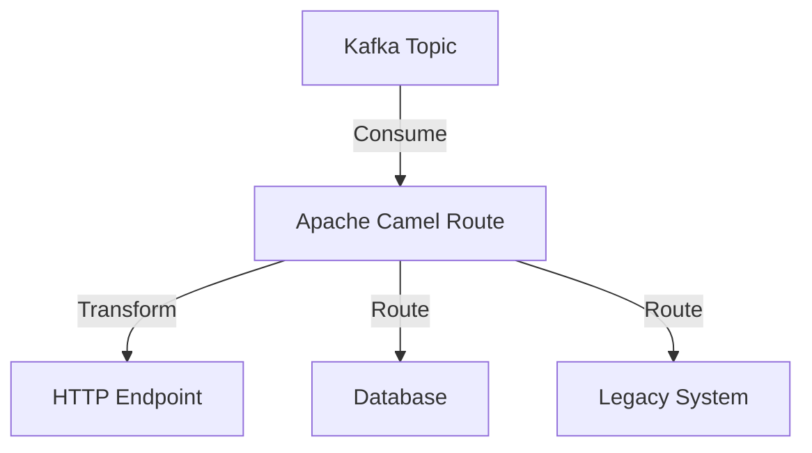

## 7.3.3 Integration with Apache Camel

Apache Camel is a powerful open-source integration framework that provides a versatile and flexible platform for integrating various systems using a wide range of protocols and data formats. It is particularly well-suited for enterprise integration patterns, making it an ideal companion for Apache Kafka in building robust, scalable, and real-time data processing solutions.

### Introduction to Apache Camel

Apache Camel is designed to simplify the integration of different systems by providing a standardized approach to routing and transforming data. It leverages Enterprise Integration Patterns (EIPs) to facilitate the development of integration solutions. Camel's core is based on the concept of routes, which define the flow of messages between endpoints.

#### Key Features of Apache Camel

- **Wide Protocol Support**: Camel supports numerous protocols, including HTTP, FTP, JMS, and more, allowing seamless integration with diverse systems.
- **Data Transformation**: Camel provides powerful data transformation capabilities, enabling the conversion of data between different formats.
- **Enterprise Integration Patterns**: Camel implements a wide range of EIPs, making it easier to design complex integration solutions.
- **Extensibility**: Camel's architecture is highly extensible, allowing developers to create custom components and processors.
- **Community and Documentation**: Camel has a vibrant community and extensive documentation, making it accessible to developers.

For more information, visit the [Apache Camel](https://camel.apache.org/) official website.

### Configuring Camel Routes for Kafka Endpoints

Integrating Apache Camel with Kafka involves configuring Camel routes to interact with Kafka endpoints. Camel provides a Kafka component that allows you to produce and consume messages from Kafka topics. This section will guide you through the configuration process.

#### Setting Up Camel Kafka Component

To use the Kafka component in Camel, you need to include the Camel Kafka library in your project. Here's how you can configure a basic Camel route to consume messages from a Kafka topic:

- **Java Example**:

    ```java
    import org.apache.camel.CamelContext;
    import org.apache.camel.builder.RouteBuilder;
    import org.apache.camel.impl.DefaultCamelContext;

    public class KafkaConsumerRoute {
        public static void main(String[] args) throws Exception {
            CamelContext camelContext = new DefaultCamelContext();
            camelContext.addRoutes(new RouteBuilder() {
                @Override
                public void configure() {
                    from("kafka:my-topic?brokers=localhost:9092")
                        .to("log:received-message");
                }
            });
            camelContext.start();
            Thread.sleep(5000);
            camelContext.stop();
        }
    }
    ```

- **Scala Example**:

    ```scala
    import org.apache.camel.CamelContext
    import org.apache.camel.builder.RouteBuilder
    import org.apache.camel.impl.DefaultCamelContext

    object KafkaConsumerRoute extends App {
        val camelContext: CamelContext = new DefaultCamelContext()
        camelContext.addRoutes(new RouteBuilder() {
            override def configure(): Unit = {
                from("kafka:my-topic?brokers=localhost:9092")
                  .to("log:received-message")
            }
        })
        camelContext.start()
        Thread.sleep(5000)
        camelContext.stop()
    }
    ```

- **Kotlin Example**:

    ```kotlin
    import org.apache.camel.CamelContext
    import org.apache.camel.builder.RouteBuilder
    import org.apache.camel.impl.DefaultCamelContext

    fun main() {
        val camelContext: CamelContext = DefaultCamelContext()
        camelContext.addRoutes(object : RouteBuilder() {
            override fun configure() {
                from("kafka:my-topic?brokers=localhost:9092")
                    .to("log:received-message")
            }
        })
        camelContext.start()
        Thread.sleep(5000)
        camelContext.stop()
    }
    ```

- **Clojure Example**:

    ```clojure
    (ns kafka-consumer-route
      (:import [org.apache.camel CamelContext]
               [org.apache.camel.builder RouteBuilder]
               [org.apache.camel.impl DefaultCamelContext]))

    (defn -main []
      (let [camel-context (DefaultCamelContext.)]
        (.addRoutes camel-context
          (proxy [RouteBuilder] []
            (configure []
              (.from this "kafka:my-topic?brokers=localhost:9092")
              (.to this "log:received-message"))))
        (.start camel-context)
        (Thread/sleep 5000)
        (.stop camel-context)))
    ```

### Message Routing and Transformation

Apache Camel excels in message routing and transformation, allowing you to define complex workflows and data transformations. This section demonstrates how to use Camel to route and transform messages between Kafka and other systems.

#### Routing Messages

Camel routes are defined using a fluent API, making it easy to specify the flow of messages. Here's an example of routing messages from a Kafka topic to an HTTP endpoint:

- **Java Example**:

    ```java
    from("kafka:my-topic?brokers=localhost:9092")
        .to("http4://example.com/api");
    ```

#### Transforming Messages

Camel provides various processors and components for transforming messages. You can use the `transform` method to modify message content. Here's an example of transforming a message before sending it to another endpoint:

- **Java Example**:

    ```java
    from("kafka:my-topic?brokers=localhost:9092")
        .transform().simple("Transformed message: ${body}")
        .to("log:transformed-message");
    ```

### Use Cases Involving Multiple Protocols and Systems

Apache Camel's ability to integrate with multiple protocols makes it ideal for complex integration scenarios. Here are some use cases where Camel and Kafka can be used together:

#### Use Case 1: Integrating Legacy Systems

Many enterprises have legacy systems that need to be integrated with modern applications. Camel can bridge the gap by routing messages between Kafka and legacy systems using protocols like FTP or JMS.

#### Use Case 2: Real-Time Data Processing

Camel can be used to process real-time data streams from Kafka, transform the data, and route it to various destinations such as databases, message queues, or cloud services.

#### Use Case 3: Multi-Protocol Data Aggregation

In scenarios where data needs to be aggregated from multiple sources, Camel can consume messages from different protocols, transform and aggregate the data, and publish it to a Kafka topic for further processing.

### Visualizing Camel-Kafka Integration

To better understand the integration between Apache Camel and Kafka, consider the following diagram that illustrates a typical integration scenario:



**Diagram Description**: This diagram shows a Camel route consuming messages from a Kafka topic and routing them to various endpoints, including an HTTP endpoint, a database, and a legacy system.

### Conclusion

Integrating Apache Camel with Kafka provides a powerful solution for implementing enterprise integration patterns. Camel's support for multiple protocols and data formats, combined with Kafka's scalability and reliability, enables the development of robust and flexible integration solutions.

### Knowledge Check

To reinforce your understanding of integrating Apache Camel with Kafka, consider the following questions and exercises.

## Test Your Knowledge: Apache Camel and Kafka Integration Quiz



### What is the primary purpose of Apache Camel?

- [x] To provide a framework for integrating different systems using various protocols.
- [ ] To serve as a message broker.
- [ ] To store large volumes of data.
- [ ] To provide a user interface for managing Kafka clusters.

> **Explanation:** Apache Camel is designed to facilitate the integration of different systems using a wide range of protocols and data formats.

### Which component in Camel is used to interact with Kafka?

- [x] Kafka Component
- [ ] HTTP Component
- [ ] FTP Component
- [ ] JMS Component

> **Explanation:** The Kafka component in Camel is specifically designed to interact with Kafka topics, allowing for message production and consumption.

### How can you transform a message in a Camel route?

- [x] Using the `transform` method.
- [ ] Using the `route` method.
- [ ] Using the `consume` method.
- [ ] Using the `send` method.

> **Explanation:** The `transform` method in Camel is used to modify the content of a message before routing it to the next endpoint.

### What is a common use case for integrating Camel with Kafka?

- [x] Real-time data processing and routing.
- [ ] Static data storage.
- [ ] User authentication.
- [ ] Web page rendering.

> **Explanation:** Camel is often used with Kafka for real-time data processing and routing, leveraging its ability to handle multiple protocols and data formats.

### Which of the following is NOT a feature of Apache Camel?

- [ ] Wide Protocol Support
- [ ] Data Transformation
- [x] Data Storage
- [ ] Enterprise Integration Patterns

> **Explanation:** Apache Camel is not designed for data storage; it focuses on routing and transforming data between systems.

### What is the role of Enterprise Integration Patterns in Camel?

- [x] They provide a standardized approach to designing integration solutions.
- [ ] They define the user interface for Camel applications.
- [ ] They store configuration data for Camel routes.
- [ ] They manage the lifecycle of Camel components.

> **Explanation:** Enterprise Integration Patterns (EIPs) in Camel provide a standardized way to design and implement integration solutions.

### Which method is used to define a Camel route in Java?

- [x] `configure()`
- [ ] `start()`
- [ ] `stop()`
- [ ] `initialize()`

> **Explanation:** The `configure()` method in Camel is used to define the routes and the flow of messages between endpoints.

### What is the benefit of using Camel with Kafka for legacy system integration?

- [x] It allows seamless communication between modern and legacy systems using various protocols.
- [ ] It provides a graphical interface for managing legacy systems.
- [ ] It automatically upgrades legacy systems to modern standards.
- [ ] It eliminates the need for legacy systems.

> **Explanation:** Camel can bridge the gap between modern and legacy systems by supporting a wide range of protocols, enabling seamless integration.

### True or False: Camel can only be used with Kafka for HTTP-based integrations.

- [ ] True
- [x] False

> **Explanation:** Camel supports a wide range of protocols, not just HTTP, making it versatile for various integration scenarios.

### What is a key advantage of using Apache Camel in data processing frameworks?

- [x] Its ability to handle complex routing and transformation logic across multiple protocols.
- [ ] Its built-in data storage capabilities.
- [ ] Its focus on user interface design.
- [ ] Its exclusive support for HTTP protocols.

> **Explanation:** Apache Camel's strength lies in its ability to handle complex routing and transformation logic across multiple protocols, making it ideal for data processing frameworks.


