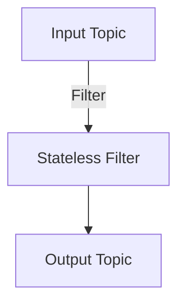

## 8.1.1 Understanding Stateless Processing

Stateless processing is a fundamental concept in stream processing that involves handling each message independently, without relying on any stored state from previous messages. This approach is characterized by its simplicity and efficiency, making it a popular choice for many real-time data processing tasks.

### Definition of Stateless Processing

Stateless processing refers to operations where each incoming data element is processed in isolation. Unlike stateful processing, which maintains information across multiple messages, stateless processing treats each message as a standalone unit. This independence from past data allows for straightforward implementation and scaling.

#### Key Characteristics

- **Independence**: Each message is processed without any dependency on previous messages.
- **Simplicity**: The lack of state management simplifies the logic and reduces the complexity of the processing pipeline.
- **Scalability**: Stateless operations can be easily distributed across multiple nodes, enhancing scalability.
- **Fault Tolerance**: Since there is no state to recover, stateless processing is inherently fault-tolerant.

### Common Stateless Operations

Stateless processing is often used for operations such as filtering, mapping, and projections. These operations transform or filter data without maintaining any state.

#### Filtering

Filtering involves selecting messages that meet certain criteria. For example, you might filter out messages that do not meet a specific threshold.

- **Java Example**:

    ```java
    import org.apache.kafka.streams.KafkaStreams;
    import org.apache.kafka.streams.StreamsBuilder;
    import org.apache.kafka.streams.kstream.KStream;

    public class StatelessFilterExample {
        public static void main(String[] args) {
            StreamsBuilder builder = new StreamsBuilder();
            KStream<String, String> sourceStream = builder.stream("input-topic");

            KStream<String, String> filteredStream = sourceStream.filter(
                (key, value) -> Integer.parseInt(value) > 10
            );

            filteredStream.to("output-topic");

            KafkaStreams streams = new KafkaStreams(builder.build(), new Properties());
            streams.start();
        }
    }
    ```

- **Scala Example**:

    ```scala
    import org.apache.kafka.streams.scala._
    import org.apache.kafka.streams.scala.kstream._

    object StatelessFilterExample extends App {
        val builder = new StreamsBuilder()
        val sourceStream: KStream[String, String] = builder.stream[String, String]("input-topic")

        val filteredStream = sourceStream.filter((key, value) => value.toInt > 10)

        filteredStream.to("output-topic")

        val streams = new KafkaStreams(builder.build(), new Properties())
        streams.start()
    }
    ```

- **Kotlin Example**:

    ```kotlin
    import org.apache.kafka.streams.KafkaStreams
    import org.apache.kafka.streams.StreamsBuilder
    import org.apache.kafka.streams.kstream.KStream

    fun main() {
        val builder = StreamsBuilder()
        val sourceStream: KStream<String, String> = builder.stream("input-topic")

        val filteredStream = sourceStream.filter { _, value -> value.toInt() > 10 }

        filteredStream.to("output-topic")

        val streams = KafkaStreams(builder.build(), Properties())
        streams.start()
    }
    ```

- **Clojure Example**:

    ```clojure
    (ns stateless-filter-example
      (:require [clojure.java.io :as io])
      (:import (org.apache.kafka.streams KafkaStreams StreamsBuilder)
               (org.apache.kafka.streams.kstream KStream)))

    (defn -main []
      (let [builder (StreamsBuilder.)
            source-stream (.stream builder "input-topic")]
        (-> source-stream
            (.filter (reify org.apache.kafka.streams.kstream.Predicate
                       (test [_ key value]
                         (> (Integer/parseInt value) 10))))
            (.to "output-topic"))

        (let [streams (KafkaStreams. (.build builder) (Properties.))]
          (.start streams))))
    ```

#### Mapping

Mapping transforms each message into a new form. For instance, you might convert all text to uppercase.

- **Java Example**:

    ```java
    KStream<String, String> mappedStream = sourceStream.mapValues(value -> value.toUpperCase());
    ```

- **Scala Example**:

    ```scala
    val mappedStream = sourceStream.mapValues(_.toUpperCase)
    ```

- **Kotlin Example**:

    ```kotlin
    val mappedStream = sourceStream.mapValues { it.toUpperCase() }
    ```

- **Clojure Example**:

    ```clojure
    (-> source-stream
        (.mapValues #(.toUpperCase %)))
    ```

### Benefits of Stateless Processing

Stateless processing offers several advantages, particularly in scenarios where simplicity and performance are paramount.

#### Ease of Scaling

Stateless operations can be easily parallelized across multiple nodes, allowing the system to handle increased loads without significant changes to the processing logic. This is particularly beneficial in distributed systems where scalability is a key concern.

#### Fault Tolerance

Since there is no state to maintain, stateless processing is inherently fault-tolerant. In the event of a failure, the system can simply restart the processing of messages without needing to recover any state.

#### Simplicity

The absence of state management simplifies the implementation of processing logic. Developers can focus on the transformation or filtering of data without worrying about maintaining consistency across messages.

### Scenarios Where Stateless Processing is Sufficient

Stateless processing is ideal for scenarios where each message can be processed independently. This includes:

- **Data Transformation**: Converting data formats or applying simple transformations.
- **Filtering**: Removing unwanted data based on specific criteria.
- **Enrichment**: Adding additional information to messages without relying on previous messages.

### Visualizing Stateless Processing

To better understand stateless processing, consider the following diagram illustrating a simple Kafka Streams topology for a stateless filter operation:



**Caption**: This diagram shows a Kafka Streams topology where messages from an input topic are filtered based on a condition and then sent to an output topic.

### Practical Applications and Real-World Scenarios

Stateless processing is widely used in various industries for tasks such as:

- **Log Processing**: Filtering and transforming log data for monitoring and analysis.
- **Data Cleaning**: Removing invalid or irrelevant data from streams.
- **Real-Time Analytics**: Applying transformations to data for immediate insights.

### Conclusion

Stateless processing is a powerful tool in the stream processing toolkit, offering simplicity, scalability, and fault tolerance. By focusing on operations that do not require state, developers can build efficient and robust data processing pipelines.

### Knowledge Check

To reinforce your understanding of stateless processing, consider the following questions and challenges:

1. What are the key characteristics of stateless processing?
2. How does stateless processing enhance scalability and fault tolerance?
3. Provide an example of a real-world application where stateless processing is used.
4. Modify the provided code examples to implement a different stateless operation, such as mapping values to their lengths.


## Test Your Knowledge: Stateless Processing in Stream Processing Design Patterns



### What is a primary characteristic of stateless processing?

- [x] Each message is processed independently.
- [ ] Messages rely on previous state.
- [ ] It requires complex state management.
- [ ] It is not suitable for real-time processing.

> **Explanation:** Stateless processing involves handling each message independently without relying on any stored state from previous messages.

### Which operation is typically stateless?

- [x] Filtering
- [ ] Aggregation
- [ ] Joining
- [ ] Windowing

> **Explanation:** Filtering is a stateless operation as it processes each message independently based on a condition.

### What is a benefit of stateless processing?

- [x] Ease of scaling
- [ ] Complex state management
- [ ] High memory usage
- [ ] Dependency on previous messages

> **Explanation:** Stateless processing can be easily scaled across multiple nodes due to its independence from previous messages.

### In which scenario is stateless processing sufficient?

- [x] Data transformation
- [ ] Stateful aggregation
- [ ] Complex event processing
- [ ] Session management

> **Explanation:** Stateless processing is sufficient for data transformation tasks where each message is processed independently.

### Which language is not shown in the code examples?

- [ ] Java
- [ ] Scala
- [ ] Kotlin
- [x] Python

> **Explanation:** The code examples provided are in Java, Scala, Kotlin, and Clojure, but not Python.

### What is a common use case for stateless processing?

- [x] Log processing
- [ ] Stateful session management
- [ ] Complex joins
- [ ] Stateful windowing

> **Explanation:** Stateless processing is commonly used in log processing to filter and transform log data.

### How does stateless processing contribute to fault tolerance?

- [x] No state to recover
- [ ] Requires complex recovery mechanisms
- [ ] Depends on previous state
- [ ] Increases system complexity

> **Explanation:** Stateless processing is inherently fault-tolerant as there is no state to recover in case of failures.

### What is a typical stateless operation in stream processing?

- [x] Mapping
- [ ] Aggregating
- [ ] Joining streams
- [ ] Stateful transformations

> **Explanation:** Mapping is a stateless operation that transforms each message independently.

### Which of the following is not a benefit of stateless processing?

- [ ] Simplicity
- [ ] Scalability
- [ ] Fault tolerance
- [x] Complex state management

> **Explanation:** Stateless processing does not involve complex state management, which is one of its benefits.

### Stateless processing is ideal for scenarios where each message can be processed independently.

- [x] True
- [ ] False

> **Explanation:** Stateless processing is designed for scenarios where each message is processed independently without relying on previous messages.



By understanding and applying stateless processing, you can build efficient and scalable stream processing applications that handle real-time data with ease.
