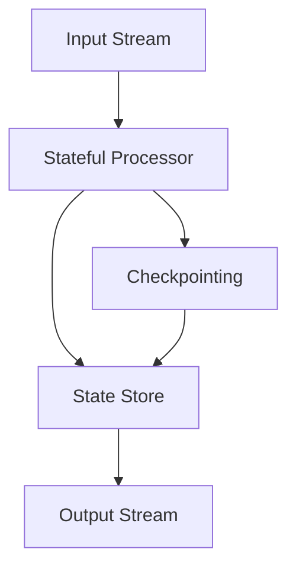

## 8.1.2 Understanding Stateful Processing

Stateful processing in stream processing systems like Apache Kafka involves operations that depend on the state accumulated from previous messages. This capability is crucial for enabling advanced analytics, aggregations, and complex event processing. Unlike stateless processing, where each message is processed independently, stateful processing maintains a context or state across messages, allowing for more sophisticated computations.

### Defining Stateful Processing

Stateful processing refers to the ability of a stream processing application to maintain and update state information across multiple events. This state can be used to perform operations such as counting, summing, joining streams, and more. The state is typically stored in a state store, which can be queried and updated as new messages arrive.

#### Necessity of Stateful Processing

Stateful processing is essential for scenarios where the outcome of processing depends on historical data or the accumulation of information over time. Examples include:

- **Counting**: Keeping track of the number of occurrences of an event.
- **Summing**: Aggregating values over a window of time.
- **Joining Streams**: Combining data from multiple streams based on a common key.
- **Pattern Detection**: Identifying sequences of events that match a specific pattern.

### Examples of Stateful Processing

#### Counting Events

Counting the number of occurrences of a specific event is a common use case for stateful processing. For example, counting the number of times a user visits a website within a given time frame.

#### Summing Values

Summing values over a window of time is another typical use case. For instance, calculating the total sales amount for a product over the past hour.

#### Joining Streams

Joining streams involves combining data from two or more streams based on a common key. This is useful for enriching data with additional context or correlating events from different sources.

### Challenges in Stateful Processing

Stateful processing introduces several challenges, including state management, fault tolerance, and scalability.

#### State Management

Managing state efficiently is crucial for performance and reliability. The state must be stored in a way that allows for fast access and updates. Kafka Streams provides state stores for this purpose, which can be backed by in-memory or persistent storage.

#### Fault Tolerance

Ensuring fault tolerance in stateful processing is challenging because the state must be preserved in the event of failures. Kafka Streams achieves this through checkpointing and changelogs, which allow the state to be reconstructed after a failure.

#### Scalability

Scaling stateful processing applications can be complex because the state must be partitioned and distributed across multiple nodes. Kafka Streams handles this by partitioning the state store and distributing it across the cluster.

### Code Examples of Stateful Operations

Let's explore stateful processing with code examples in Java, Scala, Kotlin, and Clojure.

#### Java Example: Counting Events

```java
import org.apache.kafka.streams.KafkaStreams;
import org.apache.kafka.streams.StreamsBuilder;
import org.apache.kafka.streams.kstream.KStream;
import org.apache.kafka.streams.kstream.KTable;
import org.apache.kafka.streams.kstream.Materialized;
import org.apache.kafka.streams.kstream.Produced;
import org.apache.kafka.streams.state.Stores;

public class EventCounter {
    public static void main(String[] args) {
        StreamsBuilder builder = new StreamsBuilder();
        KStream<String, String> events = builder.stream("events-topic");

        KTable<String, Long> eventCounts = events
            .groupBy((key, value) -> value)
            .count(Materialized.<String, Long>as(Stores.persistentKeyValueStore("event-counts-store")));

        eventCounts.toStream().to("event-counts-output", Produced.with(Serdes.String(), Serdes.Long()));

        KafkaStreams streams = new KafkaStreams(builder.build(), new Properties());
        streams.start();
    }
}
```

#### Scala Example: Summing Values

```scala
import org.apache.kafka.streams.scala._
import org.apache.kafka.streams.scala.kstream._
import org.apache.kafka.streams.scala.ImplicitConversions._
import org.apache.kafka.streams.scala.Serdes._

object SalesSummation extends App {
  val builder = new StreamsBuilder()
  val sales: KStream[String, Double] = builder.stream[String, Double]("sales-topic")

  val totalSales: KTable[String, Double] = sales
    .groupBy((key, value) => key)
    .reduce(_ + _)(Materialized.as[String, Double]("total-sales-store"))

  totalSales.toStream.to("total-sales-output")

  val streams = new KafkaStreams(builder.build(), new Properties())
  streams.start()
}
```

#### Kotlin Example: Joining Streams

```kotlin
import org.apache.kafka.streams.KafkaStreams
import org.apache.kafka.streams.StreamsBuilder
import org.apache.kafka.streams.kstream.JoinWindows
import org.apache.kafka.streams.kstream.KStream
import org.apache.kafka.streams.kstream.KTable
import org.apache.kafka.streams.kstream.Materialized
import org.apache.kafka.streams.kstream.Produced
import org.apache.kafka.streams.state.Stores
import java.time.Duration

fun main() {
    val builder = StreamsBuilder()
    val orders: KStream<String, String> = builder.stream("orders-topic")
    val customers: KTable<String, String> = builder.table("customers-topic")

    val enrichedOrders = orders.join(customers,
        { order, customer -> "$order enriched with $customer" },
        JoinWindows.of(Duration.ofMinutes(5)),
        Materialized.`as`("enriched-orders-store")
    )

    enrichedOrders.to("enriched-orders-output", Produced.with(Serdes.String(), Serdes.String()))

    val streams = KafkaStreams(builder.build(), Properties())
    streams.start()
}
```

#### Clojure Example: Pattern Detection

```clojure
(ns kafka-streams.pattern-detection
  (:import [org.apache.kafka.streams KafkaStreams StreamsBuilder]
           [org.apache.kafka.streams.kstream KStream KTable Materialized Produced]
           [org.apache.kafka.streams.state Stores]))

(defn pattern-detection []
  (let [builder (StreamsBuilder.)
        events (.stream builder "events-topic")]

    (-> events
        (.groupBy (fn [key value] value))
        (.count (Materialized/as (Stores/persistentKeyValueStore "pattern-store")))
        (.toStream)
        (.to "pattern-output" (Produced/with (Serdes/String) (Serdes/Long))))

    (let [streams (KafkaStreams. (.build builder) (Properties.))]
      (.start streams))))
```

### Importance of State Stores and Checkpointing

State stores are a critical component of stateful processing in Kafka Streams. They provide a mechanism for storing and retrieving state information efficiently. State stores can be in-memory or persistent, depending on the application's requirements.

Checkpointing is another essential feature that ensures fault tolerance in stateful processing. By periodically saving the state to a durable storage, Kafka Streams can recover the state in case of failures, minimizing data loss and downtime.

### Visualizing Stateful Processing

To better understand stateful processing, let's visualize the architecture and data flow using a Mermaid.js diagram.



**Diagram Explanation**: The diagram illustrates the flow of data in a stateful processing application. The input stream is processed by a stateful processor, which updates the state store. The state store is periodically checkpointed to ensure fault tolerance. The processed data is then sent to the output stream.

### Practical Applications and Real-World Scenarios

Stateful processing is widely used in various industries for real-time analytics, monitoring, and decision-making. Some practical applications include:

- **Fraud Detection**: Monitoring transactions for suspicious patterns and anomalies.
- **Real-Time Analytics**: Aggregating and analyzing data in real-time for insights and decision-making.
- **IoT Data Processing**: Collecting and processing sensor data for real-time monitoring and control.

### References and Links

- [Apache Kafka Documentation](https://kafka.apache.org/documentation/)
- [Confluent Documentation](https://docs.confluent.io/)
- [Kafka Streams API](https://kafka.apache.org/documentation/streams/)

## Test Your Knowledge: Advanced Stateful Processing in Kafka Quiz



### What is the primary benefit of stateful processing in stream processing systems?

- [x] It allows operations to depend on accumulated state from previous messages.
- [ ] It processes each message independently.
- [ ] It reduces the complexity of stream processing applications.
- [ ] It eliminates the need for state management.

> **Explanation:** Stateful processing enables operations to depend on accumulated state, allowing for advanced analytics and aggregation.

### Which of the following is a common use case for stateful processing?

- [x] Counting events
- [x] Summing values
- [ ] Filtering messages
- [ ] Transforming message formats

> **Explanation:** Counting events and summing values are typical use cases for stateful processing, as they require maintaining state across messages.

### What is a key challenge in stateful processing?

- [x] State management
- [ ] Message filtering
- [ ] Data serialization
- [ ] Schema evolution

> **Explanation:** State management is a key challenge in stateful processing, as it requires efficient storage and retrieval of state information.

### How does Kafka Streams ensure fault tolerance in stateful processing?

- [x] Through checkpointing and changelogs
- [ ] By using in-memory storage only
- [ ] By eliminating state stores
- [ ] By processing messages statelessly

> **Explanation:** Kafka Streams uses checkpointing and changelogs to ensure fault tolerance by allowing state recovery after failures.

### Which programming language is NOT shown in the code examples for stateful processing?

- [ ] Java
- [ ] Scala
- [ ] Kotlin
- [x] Python

> **Explanation:** The code examples provided are in Java, Scala, Kotlin, and Clojure, but not Python.

### What is the role of a state store in stateful processing?

- [x] To store and retrieve state information efficiently
- [ ] To filter incoming messages
- [ ] To serialize data for transmission
- [ ] To manage schema evolution

> **Explanation:** A state store is used to store and retrieve state information efficiently, which is crucial for stateful processing.

### What is the purpose of checkpointing in Kafka Streams?

- [x] To ensure fault tolerance by saving state periodically
- [ ] To filter messages based on content
- [ ] To transform message formats
- [ ] To manage schema evolution

> **Explanation:** Checkpointing ensures fault tolerance by periodically saving the state, allowing for recovery in case of failures.

### Which of the following is a practical application of stateful processing?

- [x] Fraud detection
- [x] Real-time analytics
- [ ] Message filtering
- [ ] Data serialization

> **Explanation:** Fraud detection and real-time analytics are practical applications of stateful processing, as they require maintaining and analyzing state over time.

### True or False: Stateful processing can be achieved without state stores.

- [ ] True
- [x] False

> **Explanation:** Stateful processing relies on state stores to maintain and manage state information, making them essential for this type of processing.

### What is a common challenge when scaling stateful processing applications?

- [x] Partitioning and distributing state across nodes
- [ ] Filtering messages efficiently
- [ ] Managing schema evolution
- [ ] Serializing data for transmission

> **Explanation:** Scaling stateful processing applications involves partitioning and distributing state across nodes, which can be complex.



By understanding and implementing stateful processing in Apache Kafka, developers can unlock the full potential of real-time data processing, enabling advanced analytics and decision-making capabilities.
