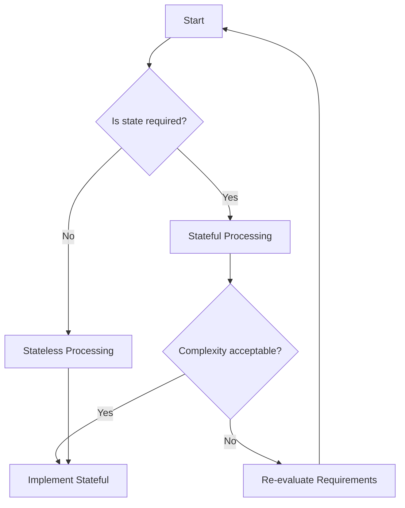

## 8.1.3 Choosing Between Stateless and Stateful Processing

In the realm of stream processing with Apache Kafka, one of the pivotal decisions developers and architects face is choosing between stateless and stateful processing. This decision impacts the architecture, performance, and scalability of your streaming applications. This section provides a comprehensive guide to understanding the differences, trade-offs, and decision-making criteria for selecting the appropriate processing type for your needs.

### Understanding Stateless and Stateful Processing

#### Stateless Processing

**Stateless processing** refers to operations where each event is processed independently of any other events. The processor does not maintain any state between events, making it inherently simpler and more scalable. Examples of stateless operations include filtering, mapping, and simple transformations.

- **Example Use Case**: Filtering out invalid transactions from a stream of financial data.

#### Stateful Processing

**Stateful processing**, on the other hand, involves operations that require maintaining state across multiple events. This state can be used to perform aggregations, joins, or complex event processing. Stateful processing is more complex and resource-intensive but is essential for applications that require context or historical data.

- **Example Use Case**: Calculating the running average of stock prices over a sliding window.

### Criteria for Selecting Processing Type

When deciding between stateless and stateful processing, consider the following criteria:

#### 1. **Nature of the Task**

- **Stateless**: Choose stateless processing for tasks that can be completed using information from a single event. Examples include data cleansing, format conversion, and simple event transformations.
- **Stateful**: Opt for stateful processing when tasks require context or historical data, such as aggregations, joins, or pattern detection.

#### 2. **Complexity and Maintenance**

- **Stateless**: Easier to implement and maintain due to the lack of state management. Suitable for applications where simplicity and speed are prioritized.
- **Stateful**: More complex due to the need for state management, fault tolerance, and recovery mechanisms. Requires careful design to ensure consistency and reliability.

#### 3. **Performance and Resource Usage**

- **Stateless**: Generally faster and less resource-intensive as there is no overhead of managing state. Ideal for high-throughput, low-latency applications.
- **Stateful**: Requires more resources for state storage and management. Performance can be impacted by the size and complexity of the state.

#### 4. **Scalability**

- **Stateless**: Highly scalable as each event is processed independently. Scaling out is straightforward by adding more processing nodes.
- **Stateful**: Scaling can be challenging due to the need to partition and distribute state across nodes. Requires careful planning to avoid bottlenecks.

#### 5. **Fault Tolerance and Recovery**

- **Stateless**: Easier to achieve fault tolerance as there is no state to recover. Simple restart mechanisms are often sufficient.
- **Stateful**: Requires sophisticated mechanisms to ensure state consistency and recovery in case of failures. This includes checkpointing and state replication.

### Trade-offs in Complexity, Performance, and Resource Usage

#### Complexity

- **Stateless Processing**: Simplicity is a major advantage. Stateless applications are easier to develop, test, and deploy. They require less code and fewer dependencies, reducing the potential for bugs and errors.
- **Stateful Processing**: Complexity arises from the need to manage state, handle failures, and ensure data consistency. This often involves using additional tools and frameworks, such as Kafka Streams or state stores, which can increase the learning curve and development time.

#### Performance

- **Stateless Processing**: Offers superior performance due to the absence of state management overhead. Stateless applications can process events at high speeds, making them suitable for real-time analytics and monitoring.
- **Stateful Processing**: Performance can be a concern, especially as the state grows. The need to read and write state data can introduce latency, and the system must be carefully tuned to handle large volumes of stateful operations efficiently.

#### Resource Usage

- **Stateless Processing**: Consumes fewer resources as there is no need for state storage. This can lead to cost savings in cloud environments where resources are billed based on usage.
- **Stateful Processing**: Requires additional resources for state storage and management. This includes memory, disk space, and CPU, which can increase operational costs.

### Decision-Making Framework

To aid in the decision-making process, consider using the following framework:

1. **Define Requirements**: Clearly outline the requirements of your application. Identify whether state is necessary for your processing tasks.
2. **Evaluate Complexity**: Assess the complexity of implementing stateful processing. Consider the team's expertise and the available tools.
3. **Analyze Performance Needs**: Determine the performance requirements of your application. Consider latency, throughput, and resource constraints.
4. **Consider Scalability**: Evaluate the scalability needs of your application. Plan for future growth and the ability to handle increased data volumes.
5. **Assess Fault Tolerance**: Consider the fault tolerance requirements. Determine the acceptable level of data loss and recovery time.

### Hybrid Applications: Combining Stateless and Stateful Processing

In many real-world scenarios, applications may require a combination of stateless and stateful processing. Hybrid applications leverage the strengths of both approaches to meet complex requirements.

#### Example: Real-Time Fraud Detection System

- **Stateless Components**: Use stateless processing to filter and preprocess incoming transaction data. This includes removing noise and normalizing data formats.
- **Stateful Components**: Implement stateful processing to detect patterns indicative of fraud. This involves maintaining a state of recent transactions and applying complex event processing rules.

### Code Examples

Below are code examples illustrating both stateless and stateful processing in Java, Scala, Kotlin, and Clojure using Kafka Streams.

#### Java Example: Stateless Processing

```java
import org.apache.kafka.streams.KafkaStreams;
import org.apache.kafka.streams.StreamsBuilder;
import org.apache.kafka.streams.kstream.KStream;

public class StatelessExample {
    public static void main(String[] args) {
        StreamsBuilder builder = new StreamsBuilder();
        KStream<String, String> source = builder.stream("input-topic");
        
        // Stateless processing: filter out messages with null values
        KStream<String, String> filtered = source.filter((key, value) -> value != null);
        
        filtered.to("output-topic");
        
        KafkaStreams streams = new KafkaStreams(builder.build(), new Properties());
        streams.start();
    }
}
```

#### Scala Example: Stateful Processing

```scala
import org.apache.kafka.streams.scala.StreamsBuilder
import org.apache.kafka.streams.scala.kstream.KStream

object StatefulExample extends App {
  val builder = new StreamsBuilder
  val source: KStream[String, String] = builder.stream[String, String]("input-topic")
  
  // Stateful processing: count occurrences of each key
  val counts = source.groupByKey.count
  
  counts.toStream.to("output-topic")
  
  val streams = new KafkaStreams(builder.build(), new Properties())
  streams.start()
}
```

#### Kotlin Example: Hybrid Processing

```kotlin
import org.apache.kafka.streams.KafkaStreams
import org.apache.kafka.streams.StreamsBuilder
import org.apache.kafka.streams.kstream.KStream

fun main() {
    val builder = StreamsBuilder()
    val source: KStream<String, String> = builder.stream("input-topic")
    
    // Stateless processing: map values to uppercase
    val mapped = source.mapValues { value -> value.toUpperCase() }
    
    // Stateful processing: aggregate values by key
    val aggregated = mapped.groupByKey().aggregate(
        { "" },
        { _, newValue, aggValue -> aggValue + newValue }
    )
    
    aggregated.toStream().to("output-topic")
    
    val streams = KafkaStreams(builder.build(), Properties())
    streams.start()
}
```

#### Clojure Example: Stateless Processing

```clojure
(ns stateless-example
  (:require [org.apache.kafka.streams StreamsBuilder]
            [org.apache.kafka.streams.kstream KStream]))

(defn -main []
  (let [builder (StreamsBuilder.)
        source (.stream builder "input-topic")]
    
    ;; Stateless processing: filter messages with non-empty values
    (-> source
        (.filter (fn [key value] (not (empty? value))))
        (.to "output-topic"))
    
    (let [streams (KafkaStreams. (.build builder) (Properties.))]
      (.start streams))))
```

### Visualizing the Decision-Making Process

To further aid in understanding, consider the following decision-making flowchart:



**Caption**: Decision-making flowchart for choosing between stateless and stateful processing.

### Conclusion

Choosing between stateless and stateful processing in Apache Kafka is a critical decision that affects the architecture and performance of your streaming applications. By understanding the criteria, trade-offs, and decision-making frameworks, you can make informed choices that align with your application's requirements and constraints. Hybrid applications that combine both processing types can offer the best of both worlds, providing flexibility and power to handle complex streaming scenarios.

### Knowledge Check

To reinforce your understanding, consider the following questions and challenges:

1. What are the key differences between stateless and stateful processing?
2. How does stateful processing impact resource usage and performance?
3. What are some real-world scenarios where hybrid processing is beneficial?
4. Experiment with the provided code examples by modifying the processing logic to suit different use cases.

### Further Reading

For more information on Apache Kafka and stream processing, consider exploring the following resources:

- [Apache Kafka Documentation](https://kafka.apache.org/documentation/)
- [Confluent Documentation](https://docs.confluent.io/)
- [Kafka Streams API Guide](https://kafka.apache.org/documentation/streams/)

---

## Test Your Knowledge: Choosing Between Stateless and Stateful Processing Quiz



### What is a primary advantage of stateless processing in Kafka?

- [x] Simplicity and ease of scaling
- [ ] Ability to maintain historical context
- [ ] Requires less memory
- [ ] Provides exactly-once semantics

> **Explanation:** Stateless processing is simpler and easier to scale because it does not maintain any state between events.

### Which processing type is more suitable for aggregating data over time?

- [ ] Stateless
- [x] Stateful
- [ ] Both
- [ ] Neither

> **Explanation:** Stateful processing is necessary for aggregating data over time as it requires maintaining state across events.

### What is a key consideration when implementing stateful processing?

- [ ] Ensuring data is encrypted
- [x] Managing state consistency and recovery
- [ ] Minimizing network latency
- [ ] Using the latest Kafka version

> **Explanation:** Managing state consistency and recovery is crucial in stateful processing to ensure data integrity and fault tolerance.

### In what scenario would you choose stateless processing?

- [x] When processing each event independently
- [ ] When joining multiple streams
- [ ] When calculating running totals
- [ ] When detecting patterns over time

> **Explanation:** Stateless processing is ideal when each event can be processed independently without requiring context or state.

### Which of the following is a trade-off of stateful processing?

- [x] Increased complexity
- [ ] Reduced latency
- [ ] Simpler implementation
- [ ] Lower resource usage

> **Explanation:** Stateful processing involves increased complexity due to the need for state management and fault tolerance mechanisms.

### How does stateful processing affect scalability?

- [ ] It makes scaling easier
- [x] It requires careful planning for state distribution
- [ ] It has no impact on scalability
- [ ] It automatically scales with Kafka

> **Explanation:** Stateful processing requires careful planning for distributing state across nodes to avoid bottlenecks and ensure scalability.

### What is a benefit of combining stateless and stateful processing in a hybrid application?

- [x] Flexibility to handle diverse processing needs
- [ ] Simplified architecture
- [ ] Reduced resource consumption
- [ ] Guaranteed low latency

> **Explanation:** Hybrid applications can leverage the strengths of both stateless and stateful processing to address diverse processing requirements.

### Which Kafka Streams feature supports stateful processing?

- [ ] KTable
- [x] State Store
- [ ] KStream
- [ ] Kafka Connect

> **Explanation:** State Stores in Kafka Streams support stateful processing by maintaining state across events.

### What is a common challenge in stateful processing?

- [ ] Filtering events
- [ ] Mapping values
- [x] Ensuring fault tolerance
- [ ] Converting data formats

> **Explanation:** Ensuring fault tolerance is a common challenge in stateful processing due to the need to recover and maintain state consistency.

### True or False: Stateless processing can be used for complex event processing.

- [ ] True
- [x] False

> **Explanation:** Stateless processing is not suitable for complex event processing, which requires maintaining state across events.


