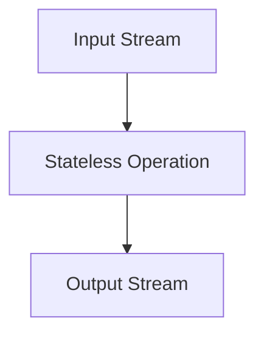
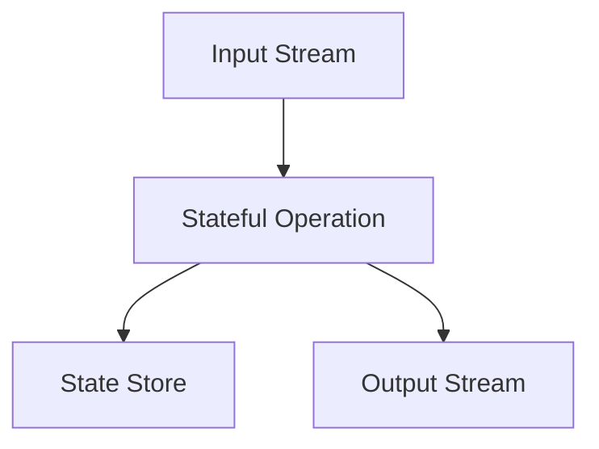

## 8.1 Stateless vs. Stateful Stream Processing

Stream processing is a powerful paradigm for handling continuous data flows and is integral to modern data architectures. Within this paradigm, two primary approaches exist: stateless and stateful stream processing. Understanding the differences between these approaches is crucial for designing efficient and scalable data processing systems.

### Defining Stateless and Stateful Stream Processing

#### Stateless Stream Processing

Stateless stream processing refers to operations where each event is processed independently of any other events. These operations do not rely on any stored state from previous events. As a result, stateless processing is inherently simpler and more scalable, as it does not require maintaining or managing any state across events.

**Examples of Stateless Operations:**
- **Filtering**: Removing events that do not meet certain criteria.
- **Mapping**: Transforming each event independently, such as converting data formats or enriching events with additional information.
- **Projection**: Selecting specific fields from an event.

#### Stateful Stream Processing

Stateful stream processing involves operations that depend on the state accumulated from previous events. This state can be used to perform complex computations, such as aggregations, joins, and windowed operations. Stateful processing requires careful management of state, including its storage, retrieval, and fault tolerance.

**Examples of Stateful Operations:**
- **Aggregations**: Summing, counting, or averaging values over a set of events.
- **Joins**: Combining events from multiple streams based on a common key.
- **Windowing**: Grouping events into windows based on time or event count for processing.

### Differences in Complexity, Resource Requirements, and Scalability

#### Complexity

- **Stateless Processing**: Generally simpler to implement and reason about, as each event is processed in isolation.
- **Stateful Processing**: More complex due to the need to manage state, handle state persistence, and ensure consistency across distributed systems.

#### Resource Requirements

- **Stateless Processing**: Requires fewer resources since there is no need to store or manage state.
- **Stateful Processing**: Demands more resources for state storage, retrieval, and fault tolerance mechanisms, such as checkpointing and state replication.

#### Scalability

- **Stateless Processing**: Easily scalable, as operations can be distributed across multiple nodes without concern for state consistency.
- **Stateful Processing**: More challenging to scale due to the need to maintain consistent state across distributed nodes, often requiring sophisticated partitioning and replication strategies.

### Practical Examples and Code Implementations

#### Stateless Stream Processing Example

Consider a scenario where you need to filter out all events from a stream that do not meet a specific condition. This is a classic example of stateless processing.

**Java Example:**

```java
import org.apache.kafka.streams.KafkaStreams;
import org.apache.kafka.streams.StreamsBuilder;
import org.apache.kafka.streams.kstream.KStream;

public class StatelessExample {
    public static void main(String[] args) {
        StreamsBuilder builder = new StreamsBuilder();
        KStream<String, String> sourceStream = builder.stream("input-topic");

        // Stateless filtering operation
        KStream<String, String> filteredStream = sourceStream.filter((key, value) -> value.contains("important"));

        filteredStream.to("output-topic");

        KafkaStreams streams = new KafkaStreams(builder.build(), new Properties());
        streams.start();
    }
}
```

**Scala Example:**

```scala
import org.apache.kafka.streams.scala._
import org.apache.kafka.streams.scala.kstream._

object StatelessExample extends App {
  val builder = new StreamsBuilder()
  val sourceStream: KStream[String, String] = builder.stream[String, String]("input-topic")

  // Stateless filtering operation
  val filteredStream: KStream[String, String] = sourceStream.filter((key, value) => value.contains("important"))

  filteredStream.to("output-topic")

  val streams = new KafkaStreams(builder.build(), new Properties())
  streams.start()
}
```

**Kotlin Example:**

```kotlin
import org.apache.kafka.streams.KafkaStreams
import org.apache.kafka.streams.StreamsBuilder
import org.apache.kafka.streams.kstream.KStream

fun main() {
    val builder = StreamsBuilder()
    val sourceStream: KStream<String, String> = builder.stream("input-topic")

    // Stateless filtering operation
    val filteredStream = sourceStream.filter { _, value -> value.contains("important") }

    filteredStream.to("output-topic")

    val streams = KafkaStreams(builder.build(), Properties())
    streams.start()
}
```

**Clojure Example:**

```clojure
(ns stateless-example
  (:require [org.apache.kafka.streams StreamsBuilder KafkaStreams]
            [org.apache.kafka.streams.kstream KStream]))

(defn -main []
  (let [builder (StreamsBuilder.)
        source-stream (.stream builder "input-topic")]

    ;; Stateless filtering operation
    (let [filtered-stream (.filter source-stream (fn [key value] (.contains value "important")))]
      (.to filtered-stream "output-topic"))

    (let [streams (KafkaStreams. (.build builder) (Properties.))]
      (.start streams))))
```

#### Stateful Stream Processing Example

Now, consider a scenario where you need to count the number of events for each key over a time window. This requires maintaining state across events.

**Java Example:**

```java
import org.apache.kafka.streams.KafkaStreams;
import org.apache.kafka.streams.StreamsBuilder;
import org.apache.kafka.streams.kstream.KStream;
import org.apache.kafka.streams.kstream.KTable;
import org.apache.kafka.streams.kstream.TimeWindows;
import org.apache.kafka.streams.kstream.Materialized;

import java.time.Duration;
import java.util.Properties;

public class StatefulExample {
    public static void main(String[] args) {
        StreamsBuilder builder = new StreamsBuilder();
        KStream<String, String> sourceStream = builder.stream("input-topic");

        // Stateful aggregation operation
        KTable<String, Long> countTable = sourceStream
            .groupByKey()
            .windowedBy(TimeWindows.of(Duration.ofMinutes(5)))
            .count(Materialized.as("count-store"));

        countTable.toStream().to("output-topic");

        KafkaStreams streams = new KafkaStreams(builder.build(), new Properties());
        streams.start();
    }
}
```

**Scala Example:**

```scala
import org.apache.kafka.streams.scala._
import org.apache.kafka.streams.scala.kstream._
import org.apache.kafka.streams.scala.ImplicitConversions._
import org.apache.kafka.streams.scala.Serdes._

object StatefulExample extends App {
  val builder = new StreamsBuilder()
  val sourceStream: KStream[String, String] = builder.stream[String, String]("input-topic")

  // Stateful aggregation operation
  val countTable: KTable[Windowed[String], Long] = sourceStream
    .groupByKey
    .windowedBy(TimeWindows.of(java.time.Duration.ofMinutes(5)))
    .count()

  countTable.toStream.to("output-topic")

  val streams = new KafkaStreams(builder.build(), new Properties())
  streams.start()
}
```

**Kotlin Example:**

```kotlin
import org.apache.kafka.streams.KafkaStreams
import org.apache.kafka.streams.StreamsBuilder
import org.apache.kafka.streams.kstream.KStream
import org.apache.kafka.streams.kstream.KTable
import org.apache.kafka.streams.kstream.TimeWindows
import org.apache.kafka.streams.kstream.Materialized
import java.time.Duration
import java.util.Properties

fun main() {
    val builder = StreamsBuilder()
    val sourceStream: KStream<String, String> = builder.stream("input-topic")

    // Stateful aggregation operation
    val countTable: KTable<Windowed<String>, Long> = sourceStream
        .groupByKey()
        .windowedBy(TimeWindows.of(Duration.ofMinutes(5)))
        .count(Materialized.as("count-store"))

    countTable.toStream().to("output-topic")

    val streams = KafkaStreams(builder.build(), Properties())
    streams.start()
}
```

**Clojure Example:**

```clojure
(ns stateful-example
  (:require [org.apache.kafka.streams StreamsBuilder KafkaStreams]
            [org.apache.kafka.streams.kstream KStream KTable TimeWindows Materialized]))

(defn -main []
  (let [builder (StreamsBuilder.)
        source-stream (.stream builder "input-topic")]

    ;; Stateful aggregation operation
    (let [count-table (.count (.windowedBy (.groupByKey source-stream) (TimeWindows/of (java.time.Duration/ofMinutes 5)))
                              (Materialized/as "count-store"))]
      (.to (.toStream count-table) "output-topic"))

    (let [streams (KafkaStreams. (.build builder) (Properties.))]
      (.start streams))))
```

### Considerations for Choosing Between Stateless and Stateful Approaches

When deciding between stateless and stateful stream processing, consider the following factors:

- **Complexity**: If the processing logic is simple and does not require state, opt for stateless processing to reduce complexity.
- **Resource Availability**: Stateful processing requires more resources. Ensure that your infrastructure can handle the additional load.
- **Scalability Needs**: Stateless processing is easier to scale horizontally. If scalability is a priority, consider stateless operations where possible.
- **Fault Tolerance**: Stateful processing requires robust fault tolerance mechanisms to ensure state consistency and recovery.
- **Latency Requirements**: Stateless processing typically offers lower latency, as there is no overhead of state management.

### Best Practices for Implementing Stateless and Stateful Stream Processing

#### Stateless Processing Best Practices

- **Keep Operations Simple**: Focus on operations that can be performed independently on each event.
- **Optimize for Throughput**: Stateless operations can be optimized for high throughput by parallelizing processing across multiple nodes.
- **Use Efficient Serialization**: Ensure that data serialization and deserialization are efficient to minimize processing overhead.

#### Stateful Processing Best Practices

- **Manage State Efficiently**: Use appropriate state stores and ensure they are configured for optimal performance.
- **Implement Checkpointing**: Regularly checkpoint state to enable recovery in case of failures.
- **Monitor State Size**: Keep an eye on the size of the state to prevent resource exhaustion.
- **Use Windowing**: Leverage windowing to limit the amount of state that needs to be maintained at any given time.

### Visualizing Stateless and Stateful Stream Processing

#### Stateless Processing Diagram



**Caption**: Stateless processing involves operations that do not depend on any state, allowing each event to be processed independently.

#### Stateful Processing Diagram



**Caption**: Stateful processing requires maintaining state across events, which is stored in a state store and used for complex operations like aggregations and joins.

### Conclusion

Understanding the differences between stateless and stateful stream processing is crucial for designing efficient and scalable data processing systems. By carefully considering the complexity, resource requirements, and scalability needs of your application, you can choose the appropriate approach and implement best practices to ensure optimal performance.

## Test Your Knowledge: Stateless vs. Stateful Stream Processing Quiz



### What is a key characteristic of stateless stream processing?

- [x] Each event is processed independently.
- [ ] Events depend on previous events.
- [ ] State is maintained across events.
- [ ] Requires complex state management.

> **Explanation:** Stateless stream processing involves operations where each event is processed independently, without relying on any stored state from previous events.

### Which of the following is an example of a stateful operation?

- [ ] Filtering
- [x] Aggregation
- [ ] Mapping
- [ ] Projection

> **Explanation:** Aggregation is a stateful operation because it requires maintaining state across multiple events to compute a result.

### What is a primary advantage of stateless processing?

- [x] Simplicity and scalability
- [ ] Requires more resources
- [ ] Complex state management
- [ ] Higher latency

> **Explanation:** Stateless processing is simpler and more scalable because it does not require managing state across events.

### Why is stateful processing more complex than stateless processing?

- [x] It requires managing state across events.
- [ ] It processes each event independently.
- [ ] It does not require state management.
- [ ] It is inherently less scalable.

> **Explanation:** Stateful processing is more complex because it involves managing state across events, which requires additional resources and fault tolerance mechanisms.

### Which of the following is a best practice for stateful processing?

- [x] Implement checkpointing
- [ ] Avoid using state stores
- [ ] Process each event independently
- [ ] Minimize resource usage

> **Explanation:** Implementing checkpointing is a best practice for stateful processing to enable recovery in case of failures.

### What is a common use case for stateless processing?

- [x] Filtering events
- [ ] Aggregating data
- [ ] Joining streams
- [ ] Windowing operations

> **Explanation:** Filtering events is a common use case for stateless processing, as it involves processing each event independently.

### What is a key consideration when choosing between stateless and stateful processing?

- [x] Complexity and resource requirements
- [ ] The number of events
- [ ] The programming language used
- [ ] The size of the input stream

> **Explanation:** When choosing between stateless and stateful processing, consider the complexity and resource requirements of the operations.

### How does stateful processing handle fault tolerance?

- [x] By implementing checkpointing and state replication
- [ ] By processing each event independently
- [ ] By avoiding state management
- [ ] By minimizing resource usage

> **Explanation:** Stateful processing handles fault tolerance by implementing checkpointing and state replication to ensure state consistency and recovery.

### Which of the following is a benefit of using windowing in stateful processing?

- [x] Limits the amount of state maintained
- [ ] Increases complexity
- [ ] Reduces scalability
- [ ] Requires more resources

> **Explanation:** Windowing in stateful processing limits the amount of state that needs to be maintained at any given time, reducing resource usage.

### True or False: Stateless processing typically offers lower latency than stateful processing.

- [x] True
- [ ] False

> **Explanation:** Stateless processing typically offers lower latency because there is no overhead of state management.



By mastering the concepts of stateless and stateful stream processing, you can design robust and efficient data processing systems that meet the demands of modern real-time applications.
