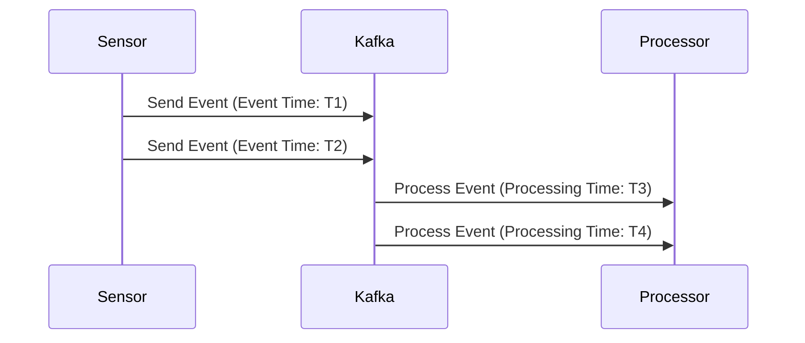

## 8.2.1 Event Time vs. Processing Time

In the realm of stream processing, understanding the distinction between event time and processing time is pivotal for designing systems that deliver accurate and reliable results. This section delves into these two concepts, illustrating their significance in Apache Kafka and stream processing applications. We will explore scenarios where event time is crucial, discuss the implications of using processing time, and provide examples to demonstrate the differences in outcomes.

### Defining Event Time and Processing Time

#### Event Time

**Event Time** refers to the timestamp when an event actually occurred in the real world. This is the time embedded within the event itself, often generated by the source system or device that produced the event. Event time is crucial for applications that require precise temporal ordering of events, such as financial transactions, sensor data analysis, and user activity tracking.

#### Processing Time

**Processing Time** is the time at which an event is processed by the stream processing system. This timestamp is determined by the system's clock at the moment the event is handled. Processing time is often used when the exact order of events is less critical, or when the system's performance and throughput are prioritized over temporal accuracy.

### Scenarios Where Event Time is Crucial

Event time is indispensable in scenarios where the temporal sequence of events impacts the analysis or decision-making process. Here are some examples:

1. **Time-Based Analytics**: In financial markets, the order and timing of trades are critical for accurate analysis and reporting. Event time ensures that trades are processed in the exact sequence they occurred, allowing for precise calculations of metrics like moving averages and volatility.

2. **Sensor Data Processing**: In IoT applications, sensor data often needs to be analyzed in the context of when it was captured. Event time allows for accurate aggregation and correlation of data from multiple sensors, even if the data arrives out of order.

3. **User Activity Tracking**: For applications that track user interactions, such as clickstreams or social media activity, event time ensures that user actions are analyzed in the correct sequence, providing insights into user behavior and engagement.

### Implications of Using Processing Time

While processing time can be simpler to implement, it comes with certain trade-offs:

- **Order and Accuracy**: Relying on processing time can lead to inaccuracies in the temporal ordering of events, especially in distributed systems where network latency and processing delays can cause events to arrive out of order.

- **Latency Sensitivity**: Systems using processing time may be more sensitive to variations in processing latency, which can affect the consistency and reliability of results.

- **Simplified Implementation**: On the positive side, using processing time can simplify system design and reduce the complexity of handling out-of-order events, making it suitable for applications where temporal accuracy is less critical.

### Examples Demonstrating Differences in Outcome

To illustrate the differences between event time and processing time, let's consider a simple example of a stream processing application that calculates the average temperature from a set of IoT sensors.

#### Example 1: Using Event Time

In this example, we use event time to ensure that temperature readings are processed in the order they were captured by the sensors.

```java
// Java code example using Kafka Streams with event time
StreamsBuilder builder = new StreamsBuilder();
KStream<String, SensorData> sensorStream = builder.stream("sensor-data", Consumed.with(Serdes.String(), sensorDataSerde));

// Use event time for windowing
TimeWindows timeWindows = TimeWindows.of(Duration.ofMinutes(5)).grace(Duration.ofMinutes(1));
KTable<Windowed<String>, Double> avgTemperature = sensorStream
    .groupByKey()
    .windowedBy(timeWindows)
    .aggregate(
        () -> 0.0,
        (key, value, aggregate) -> (aggregate + value.getTemperature()) / 2,
        Materialized.with(Serdes.String(), Serdes.Double())
    );

avgTemperature.toStream().to("average-temperature", Produced.with(WindowedSerdes.timeWindowedSerdeFrom(String.class), Serdes.Double()));
```

In this code, we use Kafka Streams to process sensor data, grouping by sensor ID and calculating the average temperature over a 5-minute window based on event time. This ensures that the average is calculated accurately, even if some readings arrive late.

#### Example 2: Using Processing Time

Now, let's consider the same application using processing time.

```java
// Java code example using Kafka Streams with processing time
StreamsBuilder builder = new StreamsBuilder();
KStream<String, SensorData> sensorStream = builder.stream("sensor-data", Consumed.with(Serdes.String(), sensorDataSerde));

// Use processing time for windowing
TimeWindows timeWindows = TimeWindows.of(Duration.ofMinutes(5));
KTable<Windowed<String>, Double> avgTemperature = sensorStream
    .groupByKey()
    .windowedBy(timeWindows)
    .aggregate(
        () -> 0.0,
        (key, value, aggregate) -> (aggregate + value.getTemperature()) / 2,
        Materialized.with(Serdes.String(), Serdes.Double())
    );

avgTemperature.toStream().to("average-temperature", Produced.with(WindowedSerdes.timeWindowedSerdeFrom(String.class), Serdes.Double()));
```

In this version, we use processing time for windowing. While this simplifies the implementation, it may lead to inaccuracies if sensor readings arrive out of order or with varying delays.

### Visualizing Event Time vs. Processing Time

To better understand the differences between event time and processing time, consider the following diagram:



**Diagram Explanation**: This sequence diagram illustrates how events are sent from a sensor to Kafka and then processed. The event time (T1, T2) represents when the events were generated, while the processing time (T3, T4) indicates when they were processed by the system. Note that processing time can differ from event time due to network delays or processing latency.

### Practical Applications and Real-World Scenarios

Understanding the distinction between event time and processing time is crucial for designing robust stream processing applications. Here are some practical applications and real-world scenarios:

- **Financial Services**: In trading systems, using event time ensures that trades are processed in the correct order, which is essential for compliance and accurate risk assessment.

- **Healthcare**: In medical monitoring systems, event time allows for precise correlation of patient data, enabling timely interventions and accurate diagnosis.

- **Retail and E-commerce**: For analyzing customer behavior and sales trends, event time provides a more accurate picture of customer interactions and purchase patterns.

### Best Practices for Choosing Between Event Time and Processing Time

When deciding whether to use event time or processing time, consider the following best practices:

- **Assess Temporal Accuracy Requirements**: Determine whether the accuracy of event ordering is critical for your application. If so, event time is likely the better choice.

- **Evaluate System Complexity**: Consider the complexity of implementing event time, including the need to handle out-of-order events and manage watermarks.

- **Balance Performance and Accuracy**: Weigh the trade-offs between system performance and temporal accuracy. Processing time may be suitable for applications where throughput is prioritized over precise ordering.

- **Leverage Kafka's Capabilities**: Utilize Kafka's built-in support for event time processing, including features like watermarks and windowing, to simplify implementation and ensure accuracy.

### Conclusion

In conclusion, the choice between event time and processing time has significant implications for the design and performance of stream processing applications. By understanding the differences and carefully evaluating the requirements of your application, you can make informed decisions that optimize both accuracy and efficiency.

### References and Further Reading

- [Apache Kafka Documentation](https://kafka.apache.org/documentation/)
- [Confluent Documentation](https://docs.confluent.io/)
- [Kafka Streams API](https://kafka.apache.org/documentation/streams/)

## Test Your Knowledge: Event Time vs. Processing Time in Kafka



### What is the primary difference between event time and processing time?

- [x] Event time is when the event occurred; processing time is when it is processed.
- [ ] Event time is always later than processing time.
- [ ] Processing time is more accurate than event time.
- [ ] Event time is determined by the processing system.

> **Explanation:** Event time refers to the actual time an event occurred, while processing time is the time at which the event is processed by the system.

### In which scenario is event time crucial?

- [x] Financial transactions
- [ ] Logging system events
- [ ] Batch processing
- [ ] System monitoring

> **Explanation:** Event time is crucial in scenarios like financial transactions where the order and timing of events are critical for analysis and reporting.

### What is a potential drawback of using processing time?

- [x] Inaccurate temporal ordering
- [ ] Increased system complexity
- [ ] Higher latency
- [ ] Reduced throughput

> **Explanation:** Using processing time can lead to inaccurate temporal ordering of events, especially in distributed systems with network delays.

### Which Kafka feature helps manage out-of-order events?

- [x] Watermarks
- [ ] Partitions
- [ ] Brokers
- [ ] Consumers

> **Explanation:** Watermarks in Kafka help manage out-of-order events by indicating the progress of event time in the stream.

### What is a benefit of using processing time?

- [x] Simplified implementation
- [ ] Accurate event ordering
- [ ] Lower latency
- [ ] Higher accuracy

> **Explanation:** Processing time can simplify implementation by reducing the complexity of handling out-of-order events.

### Which time concept is more suitable for IoT sensor data analysis?

- [x] Event time
- [ ] Processing time
- [ ] System time
- [ ] Network time

> **Explanation:** Event time is more suitable for IoT sensor data analysis as it ensures data is processed in the order it was captured.

### How does processing time affect system performance?

- [x] It can improve throughput.
- [ ] It always increases latency.
- [ ] It reduces accuracy.
- [ ] It complicates implementation.

> **Explanation:** Processing time can improve system throughput by simplifying the handling of events.

### What is a key consideration when using event time?

- [x] Handling out-of-order events
- [ ] Reducing system complexity
- [ ] Increasing latency
- [ ] Simplifying implementation

> **Explanation:** When using event time, handling out-of-order events is a key consideration to ensure accurate processing.

### Which time concept is typically used in real-time analytics?

- [x] Event time
- [ ] Processing time
- [ ] System time
- [ ] Network time

> **Explanation:** Event time is typically used in real-time analytics to ensure accurate temporal ordering of events.

### True or False: Processing time is always more accurate than event time.

- [ ] True
- [x] False

> **Explanation:** False. Event time is often more accurate than processing time for applications requiring precise temporal ordering of events.


