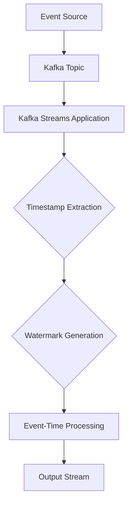

## 8.2.2 Timestamps and Watermarks

In the realm of stream processing, particularly with Apache Kafka, managing event-time processing is crucial for handling out-of-order data and ensuring accurate computations. This section delves into the concepts of timestamps and watermarks, which are pivotal in achieving reliable event-time processing. We will explore how timestamps are extracted and assigned to events, define watermarks and their role in tracking event progress, and discuss various watermark strategies. Additionally, we will provide practical examples of configuring timestamps and watermarks in Kafka Streams.

### Understanding Timestamps in Stream Processing

Timestamps are a fundamental aspect of event-time processing. They represent the time at which an event actually occurred, as opposed to the time it was processed by the system. This distinction is critical in scenarios where events arrive out of order or are delayed due to network latency or other factors.

#### Extracting and Assigning Timestamps

In Kafka Streams, timestamps can be extracted from the event data itself or assigned based on the system clock at the time of ingestion. The choice between these methods depends on the nature of the data and the requirements of the application.

- **Event-Based Timestamps**: Extract timestamps directly from the event payload. This approach is suitable when the event data contains a reliable timestamp field.
  
- **Ingestion-Time Timestamps**: Assign timestamps based on the system clock when the event is ingested. This method is used when event data lacks a timestamp or when the timestamp is unreliable.

##### Example: Extracting Timestamps in Kafka Streams

Let's consider a Java example where timestamps are extracted from a JSON field in the event data:

```java
import org.apache.kafka.streams.processor.TimestampExtractor;
import org.apache.kafka.clients.consumer.ConsumerRecord;

public class EventTimestampExtractor implements TimestampExtractor {
    @Override
    public long extract(ConsumerRecord<Object, Object> record, long previousTimestamp) {
        // Assuming the event is a JSON object with a "timestamp" field
        String json = (String) record.value();
        long timestamp = extractTimestampFromJson(json);
        return timestamp;
    }

    private long extractTimestampFromJson(String json) {
        // Implement JSON parsing logic to extract the timestamp
        return ...;
    }
}
```

In Scala, the implementation would look similar:

```scala
import org.apache.kafka.streams.processor.TimestampExtractor
import org.apache.kafka.clients.consumer.ConsumerRecord

class EventTimestampExtractor extends TimestampExtractor {
  override def extract(record: ConsumerRecord[Object, Object], previousTimestamp: Long): Long = {
    val json = record.value().asInstanceOf[String]
    val timestamp = extractTimestampFromJson(json)
    timestamp
  }

  private def extractTimestampFromJson(json: String): Long = {
    // Implement JSON parsing logic to extract the timestamp
    ...
  }
}
```

### Defining Watermarks

Watermarks are a mechanism used to track the progress of event-time processing. They indicate a point in time up to which the system has processed all events, allowing for the handling of out-of-order data. Watermarks help in determining when to trigger computations and emit results.

#### Role of Watermarks

Watermarks serve as a threshold that informs the system about the lateness of events. They help in managing the trade-off between latency and completeness. By setting an appropriate watermark, you can control how long the system waits for late-arriving events before processing the available data.

### Types of Watermark Strategies

There are several strategies for generating watermarks, each with its own advantages and trade-offs. The choice of strategy depends on the specific requirements of the application and the characteristics of the data stream.

#### Periodic Watermarks

Periodic watermarks are generated at regular intervals, regardless of the events being processed. This strategy is simple to implement and is suitable for scenarios where events arrive in a relatively predictable pattern.

#### Punctuated Watermarks

Punctuated watermarks are generated based on specific events within the stream. This strategy is more dynamic and can adapt to varying event arrival patterns. It is useful when the data stream contains natural markers that indicate progress.

##### Example: Configuring Watermarks in Kafka Streams

In Kafka Streams, watermarks can be configured using the `TimestampExtractor` and `StreamTimeExtractor` interfaces. Here is an example in Kotlin:

```kotlin
import org.apache.kafka.streams.processor.TimestampExtractor
import org.apache.kafka.clients.consumer.ConsumerRecord

class EventTimestampExtractor : TimestampExtractor {
    override fun extract(record: ConsumerRecord<Any, Any>, previousTimestamp: Long): Long {
        val json = record.value() as String
        val timestamp = extractTimestampFromJson(json)
        return timestamp
    }

    private fun extractTimestampFromJson(json: String): Long {
        // Implement JSON parsing logic to extract the timestamp
        return ...
    }
}
```

In Clojure, the implementation would be as follows:

```clojure
(ns kafka-streams.timestamp-extractor
  (:import [org.apache.kafka.streams.processor TimestampExtractor]
           [org.apache.kafka.clients.consumer ConsumerRecord]))

(defn extract-timestamp-from-json [json]
  ;; Implement JSON parsing logic to extract the timestamp
  ...)

(defrecord EventTimestampExtractor []
  TimestampExtractor
  (extract [_ record previous-timestamp]
    (let [json (.value record)]
      (extract-timestamp-from-json json))))
```

### Practical Applications and Real-World Scenarios

Timestamps and watermarks are essential in various real-world applications, such as:

- **Financial Services**: Accurate event-time processing is crucial for real-time fraud detection and transaction monitoring.
- **IoT Applications**: Handling sensor data with varying arrival times requires robust watermark strategies to ensure timely processing.
- **E-commerce**: Real-time analytics for user behavior and inventory management rely on precise event-time processing.

### Visualizing Timestamps and Watermarks

To better understand the flow of timestamps and watermarks in a Kafka Streams application, consider the following diagram:



**Caption**: This diagram illustrates the flow of events from the source through Kafka Streams, where timestamps are extracted, and watermarks are generated to facilitate event-time processing.

### Best Practices for Configuring Timestamps and Watermarks

- **Choose the Right Timestamp Source**: Ensure that the timestamp source is reliable and accurately reflects the event time.
- **Select an Appropriate Watermark Strategy**: Consider the characteristics of your data stream and the trade-offs between latency and completeness when choosing a watermark strategy.
- **Monitor and Adjust**: Continuously monitor the performance of your stream processing application and adjust the timestamp and watermark configurations as needed.

### Knowledge Check

To reinforce your understanding of timestamps and watermarks in Kafka Streams, consider the following questions and exercises:

1. **What are the key differences between event-based and ingestion-time timestamps?**
2. **How do periodic and punctuated watermarks differ in their implementation and use cases?**
3. **Implement a custom timestamp extractor for a data stream with a unique timestamp format.**
4. **Experiment with different watermark strategies and observe their impact on event-time processing latency and completeness.**

### Conclusion

Timestamps and watermarks are integral components of event-time processing in Apache Kafka. By understanding and effectively configuring these elements, you can build robust stream processing applications that handle out-of-order data and deliver accurate, timely results. As you continue to explore Kafka Streams, consider how these concepts can be applied to your specific use cases and data streams.

## Test Your Knowledge: Advanced Timestamps and Watermarks in Kafka Quiz



### What is the primary purpose of timestamps in stream processing?

- [x] To represent the actual time an event occurred.
- [ ] To indicate when an event was processed by the system.
- [ ] To determine the order of events in a stream.
- [ ] To calculate the latency of event processing.

> **Explanation:** Timestamps are used to represent the actual time an event occurred, which is crucial for event-time processing.

### How do watermarks help in event-time processing?

- [x] They track the progress of event processing.
- [ ] They assign timestamps to events.
- [ ] They determine the order of events.
- [ ] They calculate processing latency.

> **Explanation:** Watermarks track the progress of event processing, allowing the system to handle out-of-order data effectively.

### What is a key difference between periodic and punctuated watermarks?

- [x] Periodic watermarks are generated at regular intervals, while punctuated watermarks are based on specific events.
- [ ] Periodic watermarks are more dynamic than punctuated watermarks.
- [ ] Punctuated watermarks are generated at regular intervals.
- [ ] Periodic watermarks are based on specific events.

> **Explanation:** Periodic watermarks are generated at regular intervals, whereas punctuated watermarks are based on specific events in the stream.

### In Kafka Streams, what interface is used to extract timestamps from events?

- [x] TimestampExtractor
- [ ] StreamTimeExtractor
- [ ] EventTimeExtractor
- [ ] TimeExtractor

> **Explanation:** The `TimestampExtractor` interface is used in Kafka Streams to extract timestamps from events.

### Which of the following is a benefit of using event-based timestamps?

- [x] They provide a more accurate representation of when an event occurred.
- [ ] They reduce processing latency.
- [ ] They simplify the implementation of stream processing applications.
- [ ] They eliminate the need for watermarks.

> **Explanation:** Event-based timestamps provide a more accurate representation of when an event occurred, which is essential for event-time processing.

### What is the role of watermarks in managing late-arriving events?

- [x] They determine how long the system waits for late-arriving events before processing available data.
- [ ] They assign timestamps to late-arriving events.
- [ ] They reorder late-arriving events.
- [ ] They discard late-arriving events.

> **Explanation:** Watermarks determine how long the system waits for late-arriving events before processing the available data, balancing latency and completeness.

### Which strategy is more suitable for streams with unpredictable event arrival patterns?

- [x] Punctuated watermarks
- [ ] Periodic watermarks
- [ ] Ingestion-time timestamps
- [ ] Event-based timestamps

> **Explanation:** Punctuated watermarks are more suitable for streams with unpredictable event arrival patterns, as they adapt to varying conditions.

### What is a potential drawback of using ingestion-time timestamps?

- [x] They may not accurately reflect the actual event time.
- [ ] They increase processing latency.
- [ ] They complicate the implementation of stream processing applications.
- [ ] They require complex configuration.

> **Explanation:** Ingestion-time timestamps may not accurately reflect the actual event time, which can affect the accuracy of event-time processing.

### How can you monitor the effectiveness of your watermark strategy?

- [x] By observing the latency and completeness of event-time processing.
- [ ] By measuring the throughput of the stream processing application.
- [ ] By analyzing the order of events in the output stream.
- [ ] By calculating the processing time of each event.

> **Explanation:** Monitoring the latency and completeness of event-time processing helps assess the effectiveness of your watermark strategy.

### True or False: Watermarks are only necessary for streams with out-of-order data.

- [x] True
- [ ] False

> **Explanation:** Watermarks are particularly important for streams with out-of-order data, as they help manage the processing of such events.


