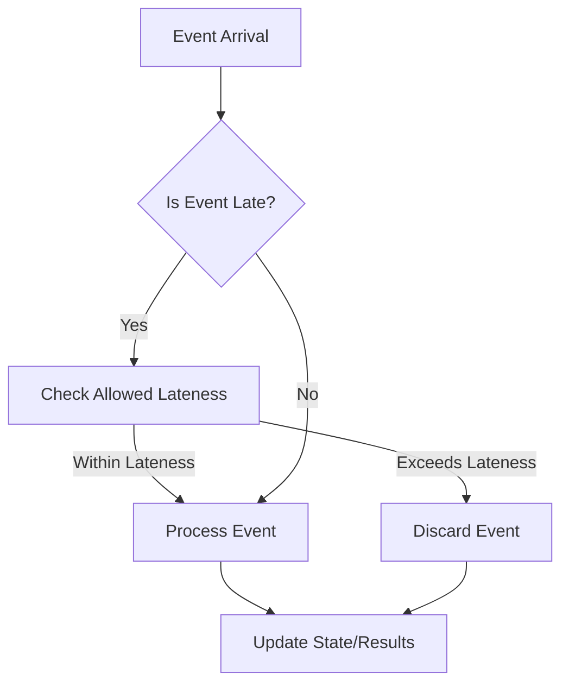

## 8.2.3 Dealing with Late-Arriving Events

In the realm of real-time data processing, handling late-arriving events is a critical challenge that can significantly impact the accuracy and reliability of your system's output. Late-arriving events are those that reach the processing system after the expected time window has closed. This can occur due to various reasons such as network delays, system latencies, or clock skews. Understanding how to manage these events effectively is essential for maintaining the integrity of your data processing pipelines.

### Why Late Events Occur

Late events are a common occurrence in distributed systems, especially those dealing with real-time data streams. Here are some reasons why events might arrive late:

- **Network Delays**: Variability in network latency can cause events to be delayed as they traverse different network paths.
- **System Latency**: Processing delays within upstream systems can result in events being emitted later than expected.
- **Clock Skew**: Differences in system clocks across distributed components can lead to discrepancies in event timestamps.
- **Batch Processing**: Some systems may batch events for efficiency, causing delays in individual event processing.

### Concept of Allowed Lateness and Window Retention

To handle late-arriving events, stream processing frameworks like Apache Kafka Streams provide mechanisms such as allowed lateness and window retention. These concepts help manage the trade-off between result timeliness and completeness.

#### Allowed Lateness

Allowed lateness is a configuration that specifies how long after the window's end time late events should still be considered for processing. By setting an allowed lateness period, you can ensure that late events are included in the computation, thus improving the completeness of your results.

#### Window Retention

Window retention defines how long the state of a window is kept after the window has closed. This retention period allows late events to be processed and included in the final results. However, retaining state for too long can lead to increased resource consumption.

### Methods for Reprocessing or Updating Results with Late Data

Handling late-arriving events involves strategies for reprocessing or updating results to include these events. Here are some common methods:

1. **Reprocessing Windows**: Reopen closed windows to incorporate late events and recompute results.
2. **Compensating Transactions**: Use compensating transactions to adjust the state or output based on late-arriving data.
3. **Stateful Processing**: Maintain stateful processing logic to update results dynamically as late events arrive.

### Code Examples: Handling Late Events

Let's explore how to handle late-arriving events using Apache Kafka Streams with code examples in Java, Scala, Kotlin, and Clojure.

#### Java Example

```java
import org.apache.kafka.streams.KafkaStreams;
import org.apache.kafka.streams.StreamsBuilder;
import org.apache.kafka.streams.kstream.KStream;
import org.apache.kafka.streams.kstream.TimeWindows;
import org.apache.kafka.streams.kstream.Windowed;
import org.apache.kafka.streams.kstream.Materialized;
import org.apache.kafka.streams.kstream.Produced;
import org.apache.kafka.streams.kstream.KGroupedStream;

import java.time.Duration;

public class LateEventHandlingExample {
    public static void main(String[] args) {
        StreamsBuilder builder = new StreamsBuilder();
        KStream<String, String> inputStream = builder.stream("input-topic");

        KGroupedStream<String, String> groupedStream = inputStream
            .groupByKey();

        groupedStream
            .windowedBy(TimeWindows.of(Duration.ofMinutes(5)).grace(Duration.ofMinutes(1)))
            .count(Materialized.as("windowed-counts"))
            .toStream()
            .to("output-topic", Produced.with(WindowedSerdes.timeWindowedSerdeFrom(String.class), Serdes.Long()));

        KafkaStreams streams = new KafkaStreams(builder.build(), new Properties());
        streams.start();
    }
}
```

In this Java example, we define a window with a grace period of 1 minute, allowing late events to be processed within this timeframe.

#### Scala Example

```scala
import org.apache.kafka.streams.scala._
import org.apache.kafka.streams.scala.kstream._
import org.apache.kafka.streams.scala.ImplicitConversions._
import org.apache.kafka.streams.scala.Serdes._
import org.apache.kafka.streams.KafkaStreams
import java.time.Duration

object LateEventHandlingExample extends App {
  val builder = new StreamsBuilder()
  val inputStream: KStream[String, String] = builder.stream[String, String]("input-topic")

  inputStream
    .groupByKey
    .windowedBy(TimeWindows.of(Duration.ofMinutes(5)).grace(Duration.ofMinutes(1)))
    .count()
    .toStream
    .to("output-topic")

  val streams = new KafkaStreams(builder.build(), new java.util.Properties())
  streams.start()
}
```

The Scala example mirrors the Java implementation, utilizing the grace period to handle late events.

#### Kotlin Example

```kotlin
import org.apache.kafka.streams.KafkaStreams
import org.apache.kafka.streams.StreamsBuilder
import org.apache.kafka.streams.kstream.TimeWindows
import org.apache.kafka.streams.kstream.Materialized
import org.apache.kafka.streams.kstream.Produced
import java.time.Duration

fun main() {
    val builder = StreamsBuilder()
    val inputStream = builder.stream<String, String>("input-topic")

    inputStream
        .groupByKey()
        .windowedBy(TimeWindows.of(Duration.ofMinutes(5)).grace(Duration.ofMinutes(1)))
        .count(Materialized.as("windowed-counts"))
        .toStream()
        .to("output-topic", Produced.with(WindowedSerdes.timeWindowedSerdeFrom(String::class.java), Serdes.Long()))

    val streams = KafkaStreams(builder.build(), Properties())
    streams.start()
}
```

Kotlin's concise syntax is used to achieve the same functionality as Java and Scala.

#### Clojure Example

```clojure
(ns late-event-handling-example
  (:require [org.apache.kafka.streams StreamsBuilder KafkaStreams]
            [org.apache.kafka.streams.kstream TimeWindows Materialized Produced]
            [java.time Duration]))

(defn -main [& args]
  (let [builder (StreamsBuilder.)
        input-stream (.stream builder "input-topic")]

    (-> input-stream
        (.groupByKey)
        (.windowedBy (TimeWindows/of (Duration/ofMinutes 5))
                     (.grace (Duration/ofMinutes 1)))
        (.count (Materialized/as "windowed-counts"))
        (.toStream)
        (.to "output-topic" (Produced/with (WindowedSerdes/timeWindowedSerdeFrom String) (Serdes/Long))))

    (let [streams (KafkaStreams. (.build builder) (Properties.))]
      (.start streams))))
```

Clojure's functional approach is demonstrated in handling late-arriving events with Kafka Streams.

### Trade-off Between Result Timeliness and Completeness

When dealing with late-arriving events, there is a trade-off between the timeliness of results and their completeness. Allowing for late events can improve the accuracy and completeness of your data, but it may also delay the availability of results. Consider the following:

- **Timeliness**: Prioritize timeliness if immediate results are critical, even if it means some late events are excluded.
- **Completeness**: Opt for completeness if accuracy is paramount, allowing for a grace period to include late events.

### Visualizing Late-Arriving Event Handling

To better understand the handling of late-arriving events, consider the following diagram illustrating the process:



**Diagram Description**: This flowchart depicts the decision-making process for handling late-arriving events. Events are checked for lateness, and based on the allowed lateness configuration, they are either processed or discarded.

### Practical Applications and Real-World Scenarios

Handling late-arriving events is crucial in various real-world scenarios, such as:

- **Financial Services**: Ensuring accurate transaction processing despite network delays.
- **IoT Systems**: Managing sensor data that may arrive late due to connectivity issues.
- **E-commerce**: Processing customer orders and updates in real-time while accounting for potential delays.

### References and Links

- [Apache Kafka Documentation](https://kafka.apache.org/documentation/)
- [Confluent Documentation](https://docs.confluent.io/)
- [1.4.4 Big Data Integration]( "Big Data Integration")

### Knowledge Check

To reinforce your understanding of handling late-arriving events, consider the following questions and challenges:

- How does allowed lateness impact the completeness of your data processing results?
- What are the trade-offs between timeliness and completeness when configuring window retention?
- Experiment with the provided code examples by adjusting the grace period and observing the impact on late event processing.

### Conclusion

Effectively managing late-arriving events is a vital aspect of building robust real-time data processing systems with Apache Kafka. By understanding the causes of late events and employing strategies such as allowed lateness and window retention, you can ensure that your system delivers accurate and timely results. Balancing the trade-offs between timeliness and completeness will enable you to tailor your approach to the specific needs of your application.

## Test Your Knowledge: Handling Late-Arriving Events in Kafka



### What is the primary reason for late-arriving events in distributed systems?

- [x] Network delays
- [ ] High processing power
- [ ] Low memory usage
- [ ] Fast data transmission

> **Explanation:** Network delays are a common cause of late-arriving events in distributed systems due to variability in latency.

### What is the purpose of allowed lateness in stream processing?

- [x] To include late events in computations
- [ ] To discard late events
- [ ] To speed up processing
- [ ] To reduce memory usage

> **Explanation:** Allowed lateness allows late events to be included in computations, improving data completeness.

### How does window retention help in handling late-arriving events?

- [x] By retaining state for late event processing
- [ ] By discarding old events
- [ ] By increasing processing speed
- [ ] By reducing network latency

> **Explanation:** Window retention keeps the state of a window open for late events, allowing them to be processed and included in results.

### Which of the following is a method for reprocessing late-arriving events?

- [x] Reopening closed windows
- [ ] Ignoring late events
- [ ] Increasing network bandwidth
- [ ] Reducing processing power

> **Explanation:** Reopening closed windows allows late events to be incorporated into the computation.

### What is the trade-off when allowing for late-arriving events?

- [x] Timeliness vs. Completeness
- [ ] Speed vs. Accuracy
- [ ] Cost vs. Performance
- [ ] Memory vs. Storage

> **Explanation:** Allowing for late-arriving events involves a trade-off between the timeliness of results and their completeness.

### In the provided Java code example, what is the purpose of the grace period?

- [x] To allow late events to be processed
- [ ] To speed up event processing
- [ ] To discard late events
- [ ] To reduce memory usage

> **Explanation:** The grace period allows late events to be processed within the specified timeframe.

### How can late-arriving events impact financial services applications?

- [x] By ensuring accurate transaction processing
- [ ] By reducing transaction speed
- [ ] By increasing transaction costs
- [ ] By simplifying transaction logic

> **Explanation:** Late-arriving events can ensure accurate transaction processing by including all relevant data.

### What is a potential drawback of retaining state for too long in window retention?

- [x] Increased resource consumption
- [ ] Faster processing speed
- [ ] Reduced data accuracy
- [ ] Lower network latency

> **Explanation:** Retaining state for too long can lead to increased resource consumption, impacting system performance.

### Which programming language is not used in the provided code examples?

- [x] Python
- [ ] Java
- [ ] Scala
- [ ] Kotlin

> **Explanation:** Python is not included in the provided code examples, which focus on Java, Scala, Kotlin, and Clojure.

### True or False: Late-arriving events should always be discarded to maintain system performance.

- [ ] True
- [x] False

> **Explanation:** Late-arriving events should not always be discarded; they can be crucial for ensuring data completeness and accuracy.


