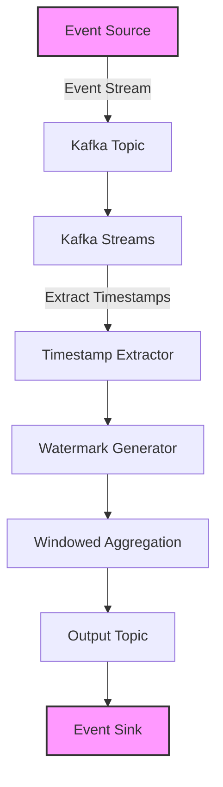

## 8.2 Event-Time Processing and Handling Out-of-Order Data

### Introduction

In the realm of stream processing, understanding the distinction between event time and processing time is crucial for building systems that accurately reflect real-world scenarios. Event-time processing refers to handling data based on the time an event actually occurred, whereas processing time is the time at which the event is processed by the system. This section delves into the complexities of event-time processing, particularly focusing on handling out-of-order data and late-arriving events. We will explore key concepts such as timestamps, watermarks, and allowed lateness, and provide strategies for implementing correct event-time processing in Kafka Streams.

### Understanding Event Time vs. Processing Time

#### Event Time

Event time is the timestamp attached to an event, indicating when the event actually occurred in the real world. This is crucial for applications where the timing of events is significant, such as financial transactions or sensor data from IoT devices. Event-time processing ensures that the analysis reflects the true sequence of events.

#### Processing Time

Processing time is the time at which an event is processed by the system. It is influenced by factors such as network latency, system load, and processing delays. While processing time is easier to manage, it does not always provide an accurate representation of the event sequence, especially in distributed systems where events can arrive out of order.

### Challenges of Out-of-Order and Late-Arriving Events

Out-of-order and late-arriving events pose significant challenges in stream processing. These issues can lead to inaccurate results if not handled properly. For instance, in a real-time analytics system, a late-arriving event might be ignored or processed incorrectly, skewing the results.

#### Causes of Out-of-Order Events

- **Network Latency**: Variations in network speed can cause events to arrive out of order.
- **Distributed Systems**: In a distributed architecture, events may be processed by different nodes, leading to out-of-order arrival.
- **Batch Processing**: Systems that batch process events may release them in a different order than they were received.

#### Impact of Late-Arriving Events

Late-arriving events can affect the accuracy of time-based aggregations and analytics. For example, if an event arrives after the window it belongs to has closed, it may be excluded from the analysis, leading to incomplete or incorrect results.

### Key Concepts for Event-Time Processing

#### Timestamps

Timestamps are essential for event-time processing. They are used to determine the order of events and are typically extracted from the event data itself. In Kafka Streams, you can specify a timestamp extractor to determine the event time for each record.

#### Watermarks

Watermarks are a mechanism to handle out-of-order events by indicating a point in time up to which the system has processed all events. They help in managing late-arriving events by allowing the system to wait for a certain period before finalizing results.

#### Allowed Lateness

Allowed lateness is a concept that specifies how long the system should wait for late-arriving events before considering the results final. It provides a balance between waiting for late events and producing timely results.

### Strategies for Event-Time Processing in Kafka Streams

#### Implementing Timestamps

In Kafka Streams, you can implement custom timestamp extractors to ensure that each event is processed based on its event time. This is crucial for maintaining the correct order of events.

```java
// Java example of a custom timestamp extractor
import org.apache.kafka.clients.consumer.ConsumerRecord;
import org.apache.kafka.streams.processor.TimestampExtractor;

public class CustomTimestampExtractor implements TimestampExtractor {
    @Override
    public long extract(ConsumerRecord<Object, Object> record, long previousTimestamp) {
        // Extract timestamp from the record's value
        return ((YourEventType) record.value()).getEventTime();
    }
}
```

```scala
// Scala example of a custom timestamp extractor
import org.apache.kafka.clients.consumer.ConsumerRecord
import org.apache.kafka.streams.processor.TimestampExtractor

class CustomTimestampExtractor extends TimestampExtractor {
  override def extract(record: ConsumerRecord[Object, Object], previousTimestamp: Long): Long = {
    // Extract timestamp from the record's value
    record.value().asInstanceOf[YourEventType].getEventTime
  }
}
```

```kotlin
// Kotlin example of a custom timestamp extractor
import org.apache.kafka.clients.consumer.ConsumerRecord
import org.apache.kafka.streams.processor.TimestampExtractor

class CustomTimestampExtractor : TimestampExtractor {
    override fun extract(record: ConsumerRecord<Any, Any>, previousTimestamp: Long): Long {
        // Extract timestamp from the record's value
        return (record.value() as YourEventType).eventTime
    }
}
```

```clojure
;; Clojure example of a custom timestamp extractor
(ns your-namespace
  (:import [org.apache.kafka.clients.consumer ConsumerRecord]
           [org.apache.kafka.streams.processor TimestampExtractor]))

(defn custom-timestamp-extractor []
  (reify TimestampExtractor
    (extract [_ ^ConsumerRecord record ^long previous-timestamp]
      ;; Extract timestamp from the record's value
      (.getEventTime ^YourEventType (.value record)))))
```

#### Using Watermarks

Watermarks can be implemented in Kafka Streams to manage out-of-order events. They help in determining when to close a window and finalize results.

```java
// Java example of using watermarks
KStream<String, YourEventType> stream = builder.stream("input-topic");
stream
    .groupByKey()
    .windowedBy(TimeWindows.of(Duration.ofMinutes(5)).grace(Duration.ofMinutes(1)))
    .aggregate(
        YourAggregator::new,
        Materialized.with(Serdes.String(), yourSerde)
    )
    .toStream()
    .to("output-topic");
```

#### Handling Allowed Lateness

Allowed lateness can be configured to specify how long the system should wait for late-arriving events. This is particularly useful in scenarios where some delay is acceptable to ensure accuracy.

```java
// Java example of handling allowed lateness
KStream<String, YourEventType> stream = builder.stream("input-topic");
stream
    .groupByKey()
    .windowedBy(TimeWindows.of(Duration.ofMinutes(5)).grace(Duration.ofMinutes(2)))
    .aggregate(
        YourAggregator::new,
        Materialized.with(Serdes.String(), yourSerde)
    )
    .toStream()
    .to("output-topic");
```

### Practical Applications and Real-World Scenarios

Event-time processing is critical in various real-world applications, such as:

- **Financial Services**: Accurate processing of transactions based on event time is crucial for compliance and fraud detection.
- **IoT Applications**: Sensor data must be processed in the order it was generated to ensure accurate monitoring and control.
- **Real-Time Analytics**: Event-time processing enables precise analysis of user behavior and trends.

### Visualizing Event-Time Processing

To better understand event-time processing, consider the following diagram illustrating the flow of events, timestamps, and watermarks in a Kafka Streams application:



**Caption**: This diagram illustrates the flow of events through a Kafka Streams application, highlighting the role of timestamps and watermarks in managing event-time processing.

### Best Practices for Event-Time Processing

- **Use Accurate Timestamps**: Ensure that timestamps are extracted accurately from the event data to maintain the correct order of events.
- **Configure Watermarks Appropriately**: Set watermarks to balance between processing latency and accuracy.
- **Handle Late Events Gracefully**: Use allowed lateness to accommodate late-arriving events without compromising the timeliness of results.
- **Monitor and Adjust**: Continuously monitor the system and adjust configurations as needed to optimize performance and accuracy.

### Knowledge Check

To reinforce your understanding of event-time processing and handling out-of-order data, consider the following questions and exercises:

- **What is the difference between event time and processing time?**
- **How do watermarks help in managing out-of-order events?**
- **Implement a custom timestamp extractor in your preferred language and test it with a sample Kafka Streams application.**
- **Configure a Kafka Streams application to handle late-arriving events and observe the impact on the results.**

### Conclusion

Event-time processing is a powerful technique for ensuring accurate stream processing in real-world applications. By understanding and implementing concepts such as timestamps, watermarks, and allowed lateness, you can build robust systems that handle out-of-order and late-arriving events effectively. As you continue to explore Kafka Streams, consider how these techniques can be applied to your specific use cases to enhance the accuracy and reliability of your data processing pipelines.

## Test Your Knowledge: Event-Time Processing and Out-of-Order Data Quiz



### What is the primary purpose of event-time processing in stream processing?

- [x] To process data based on the actual time events occurred.
- [ ] To process data as quickly as possible.
- [ ] To reduce network latency.
- [ ] To improve system load balancing.

> **Explanation:** Event-time processing focuses on handling data based on the actual time events occurred, ensuring accurate representation of event sequences.

### Which of the following is a common cause of out-of-order events in distributed systems?

- [x] Network latency
- [ ] High processing power
- [ ] Low memory usage
- [ ] Efficient data storage

> **Explanation:** Network latency can cause events to arrive out of order, especially in distributed systems where events are processed by different nodes.

### What role do watermarks play in event-time processing?

- [x] They indicate a point in time up to which the system has processed all events.
- [ ] They reduce the size of data streams.
- [ ] They increase the speed of data processing.
- [ ] They improve data encryption.

> **Explanation:** Watermarks help manage out-of-order events by indicating a point in time up to which the system has processed all events, allowing for handling of late-arriving events.

### How does allowed lateness affect event-time processing?

- [x] It specifies how long the system should wait for late-arriving events.
- [ ] It increases the speed of processing.
- [ ] It reduces the number of events processed.
- [ ] It improves data encryption.

> **Explanation:** Allowed lateness specifies how long the system should wait for late-arriving events before considering the results final, balancing between accuracy and timeliness.

### Which of the following is a strategy for handling late-arriving events in Kafka Streams?

- [x] Using allowed lateness
- [ ] Increasing network bandwidth
- [ ] Reducing processing time
- [ ] Improving data storage

> **Explanation:** Using allowed lateness is a strategy for handling late-arriving events, allowing the system to wait for a specified period before finalizing results.

### What is the impact of late-arriving events on time-based aggregations?

- [x] They can lead to inaccurate results if not handled properly.
- [ ] They improve the accuracy of results.
- [ ] They reduce the processing time.
- [ ] They increase the size of data streams.

> **Explanation:** Late-arriving events can lead to inaccurate results in time-based aggregations if not handled properly, as they may be excluded from the analysis.

### In Kafka Streams, how can you implement custom timestamp extractors?

- [x] By creating a class that implements the TimestampExtractor interface.
- [ ] By increasing network bandwidth.
- [ ] By reducing processing time.
- [ ] By improving data storage.

> **Explanation:** In Kafka Streams, you can implement custom timestamp extractors by creating a class that implements the TimestampExtractor interface, ensuring accurate event-time processing.

### What is the benefit of using watermarks in stream processing?

- [x] They help manage out-of-order events by indicating a point in time up to which the system has processed all events.
- [ ] They reduce the size of data streams.
- [ ] They increase the speed of data processing.
- [ ] They improve data encryption.

> **Explanation:** Watermarks help manage out-of-order events by indicating a point in time up to which the system has processed all events, allowing for handling of late-arriving events.

### How does event-time processing benefit IoT applications?

- [x] It ensures accurate processing of sensor data based on the order it was generated.
- [ ] It reduces the size of data streams.
- [ ] It increases the speed of data processing.
- [ ] It improves data encryption.

> **Explanation:** Event-time processing ensures accurate processing of sensor data in IoT applications based on the order it was generated, providing reliable monitoring and control.

### True or False: Processing time is always the best choice for real-time analytics.

- [ ] True
- [x] False

> **Explanation:** False. While processing time is easier to manage, it does not always provide an accurate representation of event sequences, especially in distributed systems where events can arrive out of order.



By mastering event-time processing and handling out-of-order data, you can significantly enhance the accuracy and reliability of your Kafka Streams applications, ensuring they meet the demands of real-world scenarios.
