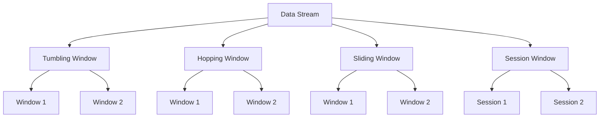

## 8.3.1 Overview of Windowing in Stream Processing

Stream processing is a powerful paradigm that allows for the real-time analysis and processing of continuous data flows. In this context, windowing is a fundamental concept that enables the aggregation and analysis of data over specific time intervals. This section delves into the intricacies of windowing, explaining its purpose, the concept of window boundaries, and its impact on state management and memory.

### Understanding Windowing

**Windowing** is the process of dividing a continuous data stream into finite chunks, or "windows," to perform computations over these subsets of data. This is essential in stream processing because it allows for the aggregation of data over time, enabling operations such as counting, summing, or averaging events that occur within a given time frame.

#### Purpose of Windowing

The primary purpose of windowing is to make sense of infinite data streams by breaking them down into manageable segments. This segmentation allows for:

- **Temporal Aggregation**: Calculating metrics over time intervals, such as the average temperature every minute.
- **Event Correlation**: Identifying patterns or anomalies within specific time frames.
- **Stateful Processing**: Maintaining state information over a defined period, crucial for applications like fraud detection or monitoring.

### Window Boundaries

Window boundaries define the start and end of a window. They are crucial for determining which events are included in a window and can be based on various criteria:

- **Time-Based Windows**: Defined by time intervals, such as every minute or hour.
- **Count-Based Windows**: Defined by the number of events, such as every 100 events.
- **Session Windows**: Defined by periods of inactivity, useful for user session tracking.

#### Types of Windows

1. **Tumbling Windows**: Non-overlapping, fixed-size windows. Each event belongs to exactly one window.
2. **Hopping Windows**: Overlapping windows with a fixed size and a specified hop interval.
3. **Sliding Windows**: Overlapping windows that slide over the data stream, capturing events as they occur.
4. **Session Windows**: Dynamic windows that group events based on periods of activity followed by inactivity.

### Windowing and State Management

Windowing significantly impacts state management in stream processing. Each window maintains its own state, which can lead to increased memory usage, especially with large numbers of windows or high event rates. Efficient state management strategies are essential to handle this complexity:

- **State Stores**: Used to persist window state, allowing for recovery and fault tolerance.
- **Compaction**: Reducing state size by aggregating or summarizing data.
- **Retention Policies**: Defining how long state information is kept, balancing memory usage and data availability.

### Visualizing Windowing Concepts

To better understand windowing, consider the following visual representations:



**Caption**: This diagram illustrates the different types of windows applied to a continuous data stream, each with its unique characteristics and use cases.

### Practical Applications of Windowing

Windowing is widely used in various real-world scenarios, including:

- **Financial Services**: Monitoring transactions for fraud detection within specific time windows.
- **IoT Applications**: Aggregating sensor data to detect anomalies or trends.
- **Social Media Analytics**: Analyzing user interactions over time to identify trends or sentiment changes.

### Code Examples

To illustrate windowing in practice, let's explore code examples in Java, Scala, Kotlin, and Clojure using Kafka Streams.

#### Java Example

```java
import org.apache.kafka.streams.KafkaStreams;
import org.apache.kafka.streams.StreamsBuilder;
import org.apache.kafka.streams.kstream.KStream;
import org.apache.kafka.streams.kstream.TimeWindows;
import org.apache.kafka.streams.kstream.Windowed;

import java.time.Duration;

public class WindowingExample {
    public static void main(String[] args) {
        StreamsBuilder builder = new StreamsBuilder();
        KStream<String, String> stream = builder.stream("input-topic");

        stream.groupByKey()
              .windowedBy(TimeWindows.of(Duration.ofMinutes(1)))
              .count()
              .toStream()
              .foreach((Windowed<String> key, Long count) -> 
                  System.out.println("Window: " + key + " Count: " + count));

        KafkaStreams streams = new KafkaStreams(builder.build(), new Properties());
        streams.start();
    }
}
```

**Explanation**: This Java example demonstrates a simple tumbling window that counts events every minute.

#### Scala Example

```scala
import org.apache.kafka.streams.scala._
import org.apache.kafka.streams.scala.kstream._
import org.apache.kafka.streams.{KafkaStreams, StreamsConfig}
import java.util.Properties
import java.time.Duration

object WindowingExample extends App {
  val builder = new StreamsBuilder()
  val stream: KStream[String, String] = builder.stream("input-topic")

  stream.groupByKey
    .windowedBy(TimeWindows.of(Duration.ofMinutes(1)))
    .count()
    .toStream
    .foreach((key, count) => println(s"Window: $key Count: $count"))

  val streams = new KafkaStreams(builder.build(), new Properties())
  streams.start()
}
```

**Explanation**: The Scala example mirrors the Java example, showcasing a tumbling window for counting events.

#### Kotlin Example

```kotlin
import org.apache.kafka.streams.KafkaStreams
import org.apache.kafka.streams.StreamsBuilder
import org.apache.kafka.streams.kstream.TimeWindows
import java.time.Duration
import java.util.Properties

fun main() {
    val builder = StreamsBuilder()
    val stream = builder.stream<String, String>("input-topic")

    stream.groupByKey()
        .windowedBy(TimeWindows.of(Duration.ofMinutes(1)))
        .count()
        .toStream()
        .foreach { key, count -> println("Window: $key Count: $count") }

    val streams = KafkaStreams(builder.build(), Properties())
    streams.start()
}
```

**Explanation**: The Kotlin example provides a similar implementation, highlighting Kotlin's concise syntax.

#### Clojure Example

```clojure
(ns windowing-example
  (:require [org.apache.kafka.streams StreamsBuilder KafkaStreams]
            [org.apache.kafka.streams.kstream TimeWindows]))

(defn -main []
  (let [builder (StreamsBuilder.)
        stream (.stream builder "input-topic")]

    (-> stream
        (.groupByKey)
        (.windowedBy (TimeWindows/of (java.time.Duration/ofMinutes 1)))
        (.count)
        (.toStream)
        (.foreach (fn [key count] (println "Window:" key "Count:" count))))

    (let [streams (KafkaStreams. (.build builder) (java.util.Properties.))]
      (.start streams)))
```

**Explanation**: The Clojure example demonstrates windowing using a functional programming approach.

### Challenges and Considerations

When implementing windowing, consider the following challenges:

- **Late Arriving Data**: Handling events that arrive after the window has closed.
- **State Size**: Managing the memory footprint of window state.
- **Complexity**: Balancing the complexity of windowing logic with performance requirements.

### Conclusion

Windowing is a powerful technique in stream processing that enables the aggregation and analysis of continuous data streams. By understanding the different types of windows and their applications, you can design efficient and effective stream processing solutions. Experiment with the provided code examples to deepen your understanding and explore the possibilities of windowing in your projects.

### References and Further Reading

- [Apache Kafka Documentation](https://kafka.apache.org/documentation/)
- [Confluent Documentation](https://docs.confluent.io/)
- [Kafka Streams API](https://kafka.apache.org/documentation/streams/)

## Test Your Knowledge: Stream Processing Windowing Quiz



### What is the primary purpose of windowing in stream processing?

- [x] To aggregate and analyze data over specific time intervals.
- [ ] To increase the speed of data processing.
- [ ] To reduce the size of data streams.
- [ ] To improve data security.

> **Explanation:** Windowing allows for the aggregation and analysis of data over specific time intervals, making sense of continuous data streams.

### Which type of window is defined by periods of inactivity?

- [ ] Tumbling Window
- [ ] Hopping Window
- [ ] Sliding Window
- [x] Session Window

> **Explanation:** Session windows are dynamic and group events based on periods of activity followed by inactivity.

### What is a key challenge when implementing windowing in stream processing?

- [x] Managing the memory footprint of window state.
- [ ] Increasing the speed of data processing.
- [ ] Improving data security.
- [ ] Reducing the size of data streams.

> **Explanation:** Managing the memory footprint of window state is a key challenge due to the potential for large numbers of windows or high event rates.

### Which window type uses a fixed size and a specified hop interval?

- [ ] Tumbling Window
- [x] Hopping Window
- [ ] Sliding Window
- [ ] Session Window

> **Explanation:** Hopping windows have a fixed size and a specified hop interval, allowing for overlapping windows.

### In the provided Java code example, what is the duration of the time window?

- [ ] 30 seconds
- [x] 1 minute
- [ ] 5 minutes
- [ ] 10 minutes

> **Explanation:** The Java code example uses a time window of 1 minute, as specified by `Duration.ofMinutes(1)`.

### Which language example demonstrates windowing using a functional programming approach?

- [ ] Java
- [ ] Scala
- [ ] Kotlin
- [x] Clojure

> **Explanation:** The Clojure example demonstrates windowing using a functional programming approach.

### What is the main advantage of using session windows?

- [ ] They are easier to implement.
- [ ] They require less memory.
- [x] They dynamically group events based on activity.
- [ ] They are faster to process.

> **Explanation:** Session windows dynamically group events based on periods of activity followed by inactivity, making them ideal for tracking user sessions.

### What is a common use case for windowing in financial services?

- [x] Monitoring transactions for fraud detection.
- [ ] Increasing transaction speed.
- [ ] Reducing transaction costs.
- [ ] Improving transaction security.

> **Explanation:** Windowing is commonly used in financial services to monitor transactions for fraud detection within specific time windows.

### Which window type captures events as they occur, allowing for real-time processing?

- [ ] Tumbling Window
- [ ] Hopping Window
- [x] Sliding Window
- [ ] Session Window

> **Explanation:** Sliding windows capture events as they occur, allowing for real-time processing and analysis.

### True or False: Windowing can be used to perform stateful processing in stream processing.

- [x] True
- [ ] False

> **Explanation:** True. Windowing can be used to perform stateful processing by maintaining state information over defined time intervals.


