## 8.3.2 Tumbling Windows

### Introduction to Tumbling Windows

Tumbling windows are a fundamental concept in stream processing, particularly within the context of Apache Kafka Streams. They are fixed-size, non-overlapping windows that partition a continuous stream of data into discrete chunks. Each chunk, or window, processes events that fall within its time boundaries, ensuring that every event is included in exactly one window. This characteristic makes tumbling windows ideal for scenarios where periodic aggregation or analysis is required, such as calculating hourly metrics or daily summaries.

### Characteristics of Tumbling Windows

- **Fixed Size**: Tumbling windows have a predetermined duration, such as one minute, one hour, or one day. This duration defines the window's boundaries and determines how often a new window is created.
- **Non-Overlapping**: Unlike sliding windows, tumbling windows do not overlap. Each event belongs to one and only one window, simplifying the aggregation logic.
- **Deterministic**: The start and end times of tumbling windows are predictable, making them suitable for use cases where consistency and repeatability are crucial.

### Use Cases for Tumbling Windows

Tumbling windows are widely used in various real-world applications, including:

- **Hourly Metrics Calculation**: Aggregating data to compute metrics such as average temperature, total sales, or number of transactions per hour.
- **Daily Summaries**: Generating daily reports or dashboards that summarize key performance indicators (KPIs).
- **Batch Processing Simulation**: Emulating batch processing in a streaming context by collecting and processing data in fixed intervals.

### Implementing Tumbling Windows in Kafka Streams

Kafka Streams provides a robust API for implementing tumbling windows. Below, we explore how to create tumbling windows using Kafka Streams in different programming languages, including Java, Scala, Kotlin, and Clojure.

#### Java Example

```java
import org.apache.kafka.common.serialization.Serdes;
import org.apache.kafka.streams.KafkaStreams;
import org.apache.kafka.streams.StreamsBuilder;
import org.apache.kafka.streams.kstream.KStream;
import org.apache.kafka.streams.kstream.KTable;
import org.apache.kafka.streams.kstream.Materialized;
import org.apache.kafka.streams.kstream.TimeWindows;
import org.apache.kafka.streams.kstream.Windowed;
import org.apache.kafka.streams.kstream.Consumed;
import org.apache.kafka.streams.kstream.Produced;

import java.time.Duration;

public class TumblingWindowExample {
    public static void main(String[] args) {
        StreamsBuilder builder = new StreamsBuilder();
        KStream<String, Long> inputStream = builder.stream("input-topic", Consumed.with(Serdes.String(), Serdes.Long()));

        KTable<Windowed<String>, Long> aggregatedStream = inputStream
            .groupByKey()
            .windowedBy(TimeWindows.of(Duration.ofHours(1)))
            .reduce(Long::sum, Materialized.with(Serdes.String(), Serdes.Long()));

        aggregatedStream.toStream().to("output-topic", Produced.with(WindowedSerdes.timeWindowedSerdeFrom(String.class), Serdes.Long()));

        KafkaStreams streams = new KafkaStreams(builder.build(), new StreamsConfig(getProperties()));
        streams.start();
    }

    private static Properties getProperties() {
        Properties props = new Properties();
        props.put(StreamsConfig.APPLICATION_ID_CONFIG, "tumbling-window-example");
        props.put(StreamsConfig.BOOTSTRAP_SERVERS_CONFIG, "localhost:9092");
        props.put(StreamsConfig.DEFAULT_KEY_SERDE_CLASS_CONFIG, Serdes.String().getClass());
        props.put(StreamsConfig.DEFAULT_VALUE_SERDE_CLASS_CONFIG, Serdes.Long().getClass());
        return props;
    }
}
```

**Explanation**: This Java example demonstrates how to create a tumbling window of one hour. The `TimeWindows.of(Duration.ofHours(1))` method specifies the window size. The `reduce` function aggregates the values within each window, and the results are written to an output topic.

#### Scala Example

```scala
import org.apache.kafka.common.serialization.Serdes
import org.apache.kafka.streams.scala._
import org.apache.kafka.streams.scala.kstream._
import org.apache.kafka.streams.{KafkaStreams, StreamsConfig}
import java.time.Duration
import java.util.Properties

object TumblingWindowExample extends App {
  val builder: StreamsBuilder = new StreamsBuilder()
  val inputStream: KStream[String, Long] = builder.stream[String, Long]("input-topic")

  val aggregatedStream: KTable[Windowed[String], Long] = inputStream
    .groupByKey
    .windowedBy(TimeWindows.of(Duration.ofHours(1)))
    .reduce(_ + _)

  aggregatedStream.toStream.to("output-topic")(Produced.`with`(WindowedSerdes.timeWindowedSerdeFrom(classOf[String]), Serdes.Long))

  val streams: KafkaStreams = new KafkaStreams(builder.build(), getProperties)
  streams.start()

  def getProperties: Properties = {
    val props = new Properties()
    props.put(StreamsConfig.APPLICATION_ID_CONFIG, "tumbling-window-example")
    props.put(StreamsConfig.BOOTSTRAP_SERVERS_CONFIG, "localhost:9092")
    props.put(StreamsConfig.DEFAULT_KEY_SERDE_CLASS_CONFIG, Serdes.String.getClass)
    props.put(StreamsConfig.DEFAULT_VALUE_SERDE_CLASS_CONFIG, Serdes.Long.getClass)
    props
  }
}
```

**Explanation**: The Scala example mirrors the Java implementation, using Scala's concise syntax. The `reduce` function aggregates values within each window, and the results are sent to an output topic.

#### Kotlin Example

```kotlin
import org.apache.kafka.common.serialization.Serdes
import org.apache.kafka.streams.KafkaStreams
import org.apache.kafka.streams.StreamsBuilder
import org.apache.kafka.streams.StreamsConfig
import org.apache.kafka.streams.kstream.Materialized
import org.apache.kafka.streams.kstream.TimeWindows
import org.apache.kafka.streams.kstream.Windowed
import java.time.Duration
import java.util.Properties

fun main() {
    val builder = StreamsBuilder()
    val inputStream = builder.stream<String, Long>("input-topic")

    val aggregatedStream = inputStream
        .groupByKey()
        .windowedBy(TimeWindows.of(Duration.ofHours(1)))
        .reduce({ value1, value2 -> value1 + value2 }, Materialized.with(Serdes.String(), Serdes.Long()))

    aggregatedStream.toStream().to("output-topic")

    val streams = KafkaStreams(builder.build(), getProperties())
    streams.start()
}

fun getProperties(): Properties {
    return Properties().apply {
        put(StreamsConfig.APPLICATION_ID_CONFIG, "tumbling-window-example")
        put(StreamsConfig.BOOTSTRAP_SERVERS_CONFIG, "localhost:9092")
        put(StreamsConfig.DEFAULT_KEY_SERDE_CLASS_CONFIG, Serdes.String()::class.java)
        put(StreamsConfig.DEFAULT_VALUE_SERDE_CLASS_CONFIG, Serdes.Long()::class.java)
    }
}
```

**Explanation**: The Kotlin example showcases the use of Kotlin's functional programming features. The `reduce` function is used to aggregate values within each window, and the results are written to an output topic.

#### Clojure Example

```clojure
(ns tumbling-window-example
  (:require [org.apache.kafka.streams StreamsBuilder KafkaStreams]
            [org.apache.kafka.streams.kstream KStream KTable TimeWindows Materialized]
            [org.apache.kafka.common.serialization Serdes]
            [java.time Duration]
            [java.util Properties]))

(defn -main []
  (let [builder (StreamsBuilder.)
        input-stream (.stream builder "input-topic" (Consumed/with (Serdes/String) (Serdes/Long)))
        aggregated-stream (.reduce
                           (.windowedBy
                            (.groupByKey input-stream)
                            (TimeWindows/of (Duration/ofHours 1)))
                           (fn [v1 v2] (+ v1 v2))
                           (Materialized/with (Serdes/String) (Serdes/Long)))]

    (.to (.toStream aggregated-stream) "output-topic" (Produced/with (WindowedSerdes/timeWindowedSerdeFrom String) (Serdes/Long)))

    (let [streams (KafkaStreams. (.build builder) (get-properties))]
      (.start streams))))

(defn get-properties []
  (doto (Properties.)
    (.put StreamsConfig/APPLICATION_ID_CONFIG "tumbling-window-example")
    (.put StreamsConfig/BOOTSTRAP_SERVERS_CONFIG "localhost:9092")
    (.put StreamsConfig/DEFAULT_KEY_SERDE_CLASS_CONFIG (Serdes/String))
    (.put StreamsConfig/DEFAULT_VALUE_SERDE_CLASS_CONFIG (Serdes/Long))))
```

**Explanation**: The Clojure example demonstrates the use of Kafka Streams in a functional programming language. The `reduce` function aggregates values within each window, and the results are sent to an output topic.

### Considerations for Window Size Selection

Selecting the appropriate window size is crucial for the effectiveness of tumbling windows. Consider the following factors:

- **Data Volume**: Larger windows can handle higher data volumes but may introduce latency. Smaller windows provide more granular insights but may require more computational resources.
- **Business Requirements**: Align the window size with business needs. For example, if hourly metrics are required, a one-hour window is appropriate.
- **Event Time Characteristics**: Consider the distribution and frequency of events. Ensure the window size captures meaningful data without excessive overlap or gaps.

### Visualizing Tumbling Windows

To better understand the concept of tumbling windows, consider the following diagram:

```mermaid
gantt
    dateFormat  HH:mm
    axisFormat  %H:%M
    section Tumbling Windows
    Window1 :active, 2024-11-25 00:00, 1h
    Window2 :active, 2024-11-25 01:00, 1h
    Window3 :active, 2024-11-25 02:00, 1h
```



**Caption**: This diagram illustrates three consecutive tumbling windows, each one hour in duration. Events are processed within their respective windows, with no overlap between windows.

### Practical Applications and Real-World Scenarios

Tumbling windows are widely used in various industries for real-time analytics and monitoring. For instance, in the financial sector, tumbling windows can be used to calculate hourly trading volumes or detect anomalies in transaction patterns. In manufacturing, they can monitor production metrics and identify trends or deviations in real-time.

### Key Takeaways

- Tumbling windows are fixed-size, non-overlapping windows that partition a stream into discrete chunks.
- They are ideal for scenarios requiring periodic aggregation or analysis, such as hourly metrics or daily summaries.
- Implementing tumbling windows in Kafka Streams is straightforward, with support for multiple programming languages.
- Selecting the appropriate window size is crucial and should consider data volume, business requirements, and event time characteristics.

### Knowledge Check

To reinforce your understanding of tumbling windows, consider the following questions and exercises.

## Test Your Knowledge: Tumbling Windows in Stream Processing



### What is a key characteristic of tumbling windows?

- [x] They are non-overlapping.
- [ ] They are variable in size.
- [ ] They allow events to belong to multiple windows.
- [ ] They are always one minute in duration.

> **Explanation:** Tumbling windows are non-overlapping, meaning each event belongs to exactly one window.

### Which use case is best suited for tumbling windows?

- [x] Hourly metrics calculation
- [ ] Real-time anomaly detection
- [ ] Sliding window aggregation
- [ ] Event correlation across multiple streams

> **Explanation:** Tumbling windows are ideal for periodic aggregation, such as hourly metrics calculation.

### How are tumbling windows implemented in Kafka Streams?

- [x] Using the `TimeWindows.of` method
- [ ] Using the `SlidingWindows.of` method
- [ ] Using the `SessionWindows.with` method
- [ ] Using the `GlobalKTable` API

> **Explanation:** The `TimeWindows.of` method is used to define tumbling windows in Kafka Streams.

### What is a potential drawback of using large tumbling windows?

- [x] Increased latency
- [ ] Reduced data granularity
- [ ] Overlapping events
- [ ] Increased computational complexity

> **Explanation:** Larger windows can introduce latency as they aggregate more data before processing.

### Which factor should be considered when selecting a window size?

- [x] Data volume
- [x] Business requirements
- [ ] Network bandwidth
- [ ] Number of Kafka brokers

> **Explanation:** Data volume and business requirements are crucial factors in determining the appropriate window size.

### In which programming language can tumbling windows be implemented using Kafka Streams?

- [x] Java
- [x] Scala
- [x] Kotlin
- [x] Clojure

> **Explanation:** Kafka Streams supports multiple languages, including Java, Scala, Kotlin, and Clojure.

### What is the primary benefit of using tumbling windows?

- [x] Simplified aggregation logic
- [ ] Reduced data redundancy
- [ ] Increased data throughput
- [ ] Enhanced fault tolerance

> **Explanation:** Tumbling windows simplify aggregation logic by ensuring each event belongs to exactly one window.

### How do tumbling windows differ from sliding windows?

- [x] Tumbling windows do not overlap.
- [ ] Tumbling windows are variable in size.
- [ ] Tumbling windows require session management.
- [ ] Tumbling windows are used for anomaly detection.

> **Explanation:** Tumbling windows are non-overlapping, while sliding windows can overlap.

### What is a common application of tumbling windows in the financial sector?

- [x] Calculating hourly trading volumes
- [ ] Detecting fraud in real-time
- [ ] Analyzing customer sentiment
- [ ] Predicting stock prices

> **Explanation:** Tumbling windows are often used to calculate periodic metrics, such as hourly trading volumes.

### True or False: Tumbling windows can be used to simulate batch processing in a streaming context.

- [x] True
- [ ] False

> **Explanation:** Tumbling windows can emulate batch processing by collecting and processing data in fixed intervals.



By mastering tumbling windows, you can effectively partition and process streams of data, enabling powerful real-time analytics and insights. Explore the possibilities of tumbling windows in your projects and consider how they can enhance your data processing capabilities.
