## 8.3.3 Hopping Windows

### Introduction

In the realm of stream processing, windowing is a crucial concept that allows for the aggregation and analysis of data over specific time intervals. Among the various windowing strategies, hopping windows stand out due to their ability to overlap, enabling events to be included in multiple windows. This section delves into the intricacies of hopping windows, contrasting them with other window types, and demonstrating their practical applications through code examples in multiple programming languages.

### Understanding Hopping Windows

#### Definition and Characteristics

Hopping windows are a type of windowing pattern used in stream processing where each window has a fixed duration and a fixed interval at which new windows start. Unlike tumbling windows, which are non-overlapping, hopping windows can overlap, allowing the same event to be part of multiple windows. This overlapping nature makes hopping windows particularly useful for scenarios where continuous monitoring and analysis of data streams are required.

#### Key Parameters

- **Window Size**: The duration of each window. It determines how long each window will collect events.
- **Hop Size**: The interval at which new windows start. It dictates the frequency of window creation and can be less than the window size, resulting in overlapping windows.

#### Comparison with Tumbling Windows

Tumbling windows are a special case of hopping windows where the hop size is equal to the window size, resulting in non-overlapping windows. In contrast, hopping windows allow for more granular analysis by overlapping, which can be advantageous for applications requiring frequent updates or continuous monitoring.

### Practical Applications of Hopping Windows

Hopping windows are particularly useful in scenarios where real-time data analysis is crucial. Some common applications include:

- **Sliding Averages**: Calculating moving averages over time, such as the average temperature over the last hour, updated every minute.
- **Anomaly Detection**: Continuously monitoring data streams for unusual patterns or outliers.
- **Real-Time Analytics**: Providing up-to-date analytics for dashboards and monitoring systems.

### Implementing Hopping Windows in Kafka Streams

Kafka Streams, a powerful library for building stream processing applications, provides robust support for windowing operations, including hopping windows. Below, we explore how to implement hopping windows using Kafka Streams in various programming languages.

#### Java Example

```java
import org.apache.kafka.streams.KafkaStreams;
import org.apache.kafka.streams.StreamsBuilder;
import org.apache.kafka.streams.kstream.KStream;
import org.apache.kafka.streams.kstream.TimeWindows;
import org.apache.kafka.streams.kstream.Windowed;
import org.apache.kafka.streams.kstream.Materialized;
import org.apache.kafka.streams.kstream.Produced;
import org.apache.kafka.streams.kstream.KGroupedStream;
import org.apache.kafka.streams.kstream.KTable;
import org.apache.kafka.streams.kstream.Aggregator;

import java.time.Duration;
import java.util.Properties;

public class HoppingWindowExample {
    public static void main(String[] args) {
        Properties props = new Properties();
        props.put("application.id", "hopping-window-example");
        props.put("bootstrap.servers", "localhost:9092");

        StreamsBuilder builder = new StreamsBuilder();
        KStream<String, Long> inputStream = builder.stream("input-topic");

        KGroupedStream<String, Long> groupedStream = inputStream.groupByKey();

        KTable<Windowed<String>, Long> aggregatedStream = groupedStream
            .windowedBy(TimeWindows.of(Duration.ofMinutes(5)).advanceBy(Duration.ofMinutes(1)))
            .aggregate(
                () -> 0L,
                (key, value, aggregate) -> aggregate + value,
                Materialized.with(Serdes.String(), Serdes.Long())
            );

        aggregatedStream.toStream().to("output-topic", Produced.with(WindowedSerdes.timeWindowedSerdeFrom(String.class), Serdes.Long()));

        KafkaStreams streams = new KafkaStreams(builder.build(), props);
        streams.start();
    }
}
```

**Explanation**: This Java example demonstrates the creation of a hopping window with a window size of 5 minutes and a hop size of 1 minute. The `aggregate` function is used to sum the values within each window, and the results are written to an output topic.

#### Scala Example

```scala
import org.apache.kafka.streams.scala._
import org.apache.kafka.streams.scala.kstream._
import org.apache.kafka.streams.scala.ImplicitConversions._
import org.apache.kafka.streams.scala.Serdes._
import org.apache.kafka.streams.{KafkaStreams, StreamsConfig}
import java.util.Properties
import java.time.Duration

object HoppingWindowExample {
  def main(args: Array[String]): Unit = {
    val props: Properties = new Properties()
    props.put(StreamsConfig.APPLICATION_ID_CONFIG, "hopping-window-example")
    props.put(StreamsConfig.BOOTSTRAP_SERVERS_CONFIG, "localhost:9092")

    val builder: StreamsBuilder = new StreamsBuilder()
    val inputStream: KStream[String, Long] = builder.stream[String, Long]("input-topic")

    val aggregatedStream: KTable[Windowed[String], Long] = inputStream
      .groupByKey
      .windowedBy(TimeWindows.of(Duration.ofMinutes(5)).advanceBy(Duration.ofMinutes(1)))
      .aggregate(0L)(_ + _)

    aggregatedStream.toStream.to("output-topic")

    val streams: KafkaStreams = new KafkaStreams(builder.build(), props)
    streams.start()
  }
}
```

**Explanation**: The Scala example mirrors the Java implementation, utilizing the Scala API for Kafka Streams. It sets up a hopping window with similar parameters and aggregates the data.

#### Kotlin Example

```kotlin
import org.apache.kafka.streams.KafkaStreams
import org.apache.kafka.streams.StreamsBuilder
import org.apache.kafka.streams.kstream.KStream
import org.apache.kafka.streams.kstream.TimeWindows
import org.apache.kafka.streams.kstream.Windowed
import org.apache.kafka.streams.kstream.Materialized
import org.apache.kafka.streams.kstream.Produced
import org.apache.kafka.streams.kstream.KGroupedStream
import org.apache.kafka.streams.kstream.KTable
import org.apache.kafka.streams.kstream.Aggregator
import org.apache.kafka.streams.StreamsConfig
import java.time.Duration
import java.util.Properties

fun main() {
    val props = Properties()
    props[StreamsConfig.APPLICATION_ID_CONFIG] = "hopping-window-example"
    props[StreamsConfig.BOOTSTRAP_SERVERS_CONFIG] = "localhost:9092"

    val builder = StreamsBuilder()
    val inputStream: KStream<String, Long> = builder.stream("input-topic")

    val aggregatedStream: KTable<Windowed<String>, Long> = inputStream
        .groupByKey()
        .windowedBy(TimeWindows.of(Duration.ofMinutes(5)).advanceBy(Duration.ofMinutes(1)))
        .aggregate(
            { 0L },
            { _, value, aggregate -> aggregate + value },
            Materialized.with(Serdes.String(), Serdes.Long())
        )

    aggregatedStream.toStream().to("output-topic", Produced.with(WindowedSerdes.timeWindowedSerdeFrom(String::class.java), Serdes.Long()))

    val streams = KafkaStreams(builder.build(), props)
    streams.start()
}
```

**Explanation**: The Kotlin example follows a similar structure to the Java and Scala examples, showcasing Kotlin's concise syntax while implementing hopping windows.

#### Clojure Example

```clojure
(ns hopping-window-example
  (:require [clojure.java.io :as io])
  (:import [org.apache.kafka.streams KafkaStreams StreamsBuilder]
           [org.apache.kafka.streams.kstream KStream TimeWindows Materialized Produced]
           [org.apache.kafka.streams.kstream Windowed]
           [org.apache.kafka.streams StreamsConfig]
           [java.time Duration]
           [java.util Properties]))

(defn -main [& args]
  (let [props (doto (Properties.)
                (.put StreamsConfig/APPLICATION_ID_CONFIG "hopping-window-example")
                (.put StreamsConfig/BOOTSTRAP_SERVERS_CONFIG "localhost:9092"))
        builder (StreamsBuilder.)
        input-stream (.stream builder "input-topic")]

    (-> input-stream
        (.groupByKey)
        (.windowedBy (TimeWindows/of (Duration/ofMinutes 5))
                     (.advanceBy (Duration/ofMinutes 1)))
        (.aggregate (fn [] 0)
                    (fn [key value aggregate] (+ aggregate value))
                    (Materialized/with (Serdes/String) (Serdes/Long)))
        (.toStream)
        (.to "output-topic" (Produced/with (WindowedSerdes/timeWindowedSerdeFrom String) (Serdes/Long))))

    (let [streams (KafkaStreams. (.build builder) props)]
      (.start streams))))
```

**Explanation**: The Clojure example demonstrates the use of Kafka Streams in a functional programming style, implementing hopping windows with similar parameters as the previous examples.

### Visualizing Hopping Windows

To better understand the concept of hopping windows, consider the following diagram:

```mermaid
gantt
    dateFormat  HH:mm
    axisFormat  %H:%M
    section Hopping Windows
    Window1 :active, 2024-11-25 00:00, 5m
    Window2 :active, 2024-11-25 01:00, 5m
    Window3 :active, 2024-11-25 02:00, 5m
    Window4 :active, 2024-11-25 03:00, 5m
    Window5 :active, 2024-11-25 04:00, 5m
```



**Caption**: This diagram illustrates the overlapping nature of hopping windows, with each window having a duration of 5 minutes and starting every 1 minute.

### Best Practices for Using Hopping Windows

- **Choose Appropriate Window and Hop Sizes**: The choice of window and hop sizes should align with the application's requirements for data granularity and update frequency.
- **Optimize Resource Utilization**: Overlapping windows can increase resource usage; ensure that the system is adequately provisioned to handle the load.
- **Consider Event Time**: When dealing with out-of-order events, use event time rather than processing time to ensure accurate windowing.

### Challenges and Considerations

- **Increased Complexity**: The overlapping nature of hopping windows can introduce complexity in managing state and ensuring accurate results.
- **Resource Consumption**: Overlapping windows may lead to higher memory and CPU usage, necessitating careful resource management.

### Conclusion

Hopping windows are a powerful tool in the stream processing arsenal, enabling detailed and continuous analysis of data streams. By understanding their characteristics and implementing them effectively, developers can harness their full potential for real-time analytics and monitoring.

## Test Your Knowledge: Hopping Windows in Apache Kafka



### What is the primary characteristic of hopping windows?

- [x] They overlap, allowing events to be included in multiple windows.
- [ ] They are non-overlapping and fixed in size.
- [ ] They only include the latest events.
- [ ] They are used for batch processing.

> **Explanation:** Hopping windows are defined by their overlapping nature, which allows events to be part of multiple windows.

### How do hopping windows differ from tumbling windows?

- [x] Hopping windows can overlap, while tumbling windows do not.
- [ ] Tumbling windows can overlap, while hopping windows do not.
- [ ] Both are non-overlapping.
- [ ] Both are used for batch processing.

> **Explanation:** Hopping windows overlap, whereas tumbling windows are non-overlapping.

### What parameters define a hopping window?

- [x] Window size and hop size.
- [ ] Window size and batch size.
- [ ] Hop size and batch size.
- [ ] Batch size and time interval.

> **Explanation:** Hopping windows are defined by their window size and hop size.

### In a hopping window with a window size of 5 minutes and a hop size of 1 minute, how many windows will an event be part of?

- [x] 5
- [ ] 1
- [ ] 2
- [ ] 10

> **Explanation:** With a window size of 5 minutes and a hop size of 1 minute, an event will be part of 5 overlapping windows.

### Which of the following is a practical application of hopping windows?

- [x] Sliding averages
- [ ] Batch processing
- [ ] Static data analysis
- [ ] Data archiving

> **Explanation:** Hopping windows are ideal for calculating sliding averages due to their overlapping nature.

### What is a potential challenge when using hopping windows?

- [x] Increased resource consumption
- [ ] Lack of data granularity
- [ ] Inability to handle real-time data
- [ ] Difficulty in batch processing

> **Explanation:** The overlapping nature of hopping windows can lead to increased resource consumption.

### Which Kafka Streams function is used to define hopping windows?

- [x] `windowedBy(TimeWindows.of(...).advanceBy(...))`
- [ ] `groupByKey()`
- [ ] `aggregate()`
- [ ] `toStream()`

> **Explanation:** The `windowedBy` function with `TimeWindows.of(...).advanceBy(...)` is used to define hopping windows.

### What is the effect of setting the hop size equal to the window size in hopping windows?

- [x] The windows become non-overlapping, similar to tumbling windows.
- [ ] The windows overlap more frequently.
- [ ] The windows become smaller.
- [ ] The windows become larger.

> **Explanation:** When the hop size equals the window size, hopping windows become non-overlapping, like tumbling windows.

### Which language is NOT shown in the code examples for implementing hopping windows?

- [x] Python
- [ ] Java
- [ ] Scala
- [ ] Kotlin

> **Explanation:** The code examples provided are in Java, Scala, Kotlin, and Clojure, but not Python.

### True or False: Hopping windows are suitable for batch processing.

- [ ] True
- [x] False

> **Explanation:** Hopping windows are designed for real-time stream processing, not batch processing.



By mastering hopping windows, developers can enhance their stream processing capabilities, enabling more sophisticated and responsive data-driven applications.
