## 8.3.4 Sliding Windows

### Introduction to Sliding Windows

Sliding windows are a fundamental concept in stream processing, allowing for the continuous evaluation of data over a specified time range. Unlike tumbling windows, which are fixed and non-overlapping, sliding windows overlap and provide a more granular view of data streams. This capability is crucial for applications that require real-time insights and fine-grained analysis, such as trend detection, anomaly detection, and monitoring.

### Understanding Sliding Windows

#### Definition and Functionality

A sliding window is defined by a window size and a sliding interval. The window size determines the duration of the window, while the sliding interval specifies how often the window moves forward. For example, a sliding window with a size of 10 minutes and a sliding interval of 1 minute will produce overlapping windows that each cover 10 minutes of data, moving forward by 1 minute at a time.

#### Key Characteristics

- **Overlapping Windows**: Sliding windows overlap, meaning that each event can belong to multiple windows. This overlap allows for more continuous and detailed analysis.
- **Continuous Evaluation**: As new events arrive, the window slides forward, continuously evaluating the data stream.
- **Fine-Grained Analysis**: The overlapping nature of sliding windows enables the detection of subtle trends and anomalies that might be missed with non-overlapping windows.

### Use Cases for Sliding Windows

Sliding windows are particularly useful in scenarios where real-time, continuous analysis is required. Here are some common use cases:

#### Trend Detection

In financial markets, sliding windows can be used to detect trends in stock prices or trading volumes. By continuously evaluating the data, traders can identify emerging trends and make informed decisions.

#### Anomaly Detection

In network security, sliding windows can help detect anomalies in traffic patterns. By analyzing overlapping windows, security systems can identify unusual activity that may indicate a security threat.

#### Monitoring and Alerting

In IoT applications, sliding windows can be used to monitor sensor data and trigger alerts when certain conditions are met. For example, a sliding window can continuously evaluate temperature readings and alert operators if the temperature exceeds a threshold.

### Implementing Sliding Windows in Kafka Streams

Apache Kafka Streams provides robust support for windowing operations, including sliding windows. Implementing sliding windows in Kafka Streams involves defining the window size and sliding interval, and applying the window to a stream of data.

#### Step-by-Step Implementation

1. **Define the Sliding Window**: Use the `TimeWindows` class to define the window size and sliding interval.

2. **Apply the Window to a Stream**: Use the `windowedBy` method to apply the sliding window to a stream.

3. **Aggregate the Data**: Use aggregation functions such as `count`, `reduce`, or `aggregate` to process the data within each window.

4. **Handle Windowed Data**: Use the `Windowed` class to handle the results of the windowed aggregation.

#### Java Example

```java
import org.apache.kafka.streams.KafkaStreams;
import org.apache.kafka.streams.StreamsBuilder;
import org.apache.kafka.streams.kstream.KStream;
import org.apache.kafka.streams.kstream.TimeWindows;
import org.apache.kafka.streams.kstream.Windowed;
import org.apache.kafka.streams.kstream.Materialized;
import org.apache.kafka.streams.kstream.KTable;

import java.time.Duration;

public class SlidingWindowExample {
    public static void main(String[] args) {
        StreamsBuilder builder = new StreamsBuilder();
        KStream<String, String> stream = builder.stream("input-topic");

        KTable<Windowed<String>, Long> windowedCounts = stream
            .groupByKey()
            .windowedBy(TimeWindows.of(Duration.ofMinutes(10)).advanceBy(Duration.ofMinutes(1)))
            .count(Materialized.as("windowed-counts"));

        windowedCounts.toStream().foreach((windowedKey, count) -> {
            System.out.println("Window: " + windowedKey.window().startTime() + " - " + windowedKey.window().endTime() +
                               " Key: " + windowedKey.key() + " Count: " + count);
        });

        KafkaStreams streams = new KafkaStreams(builder.build(), new Properties());
        streams.start();
    }
}
```

#### Scala Example

```scala
import org.apache.kafka.streams.scala._
import org.apache.kafka.streams.scala.kstream._
import org.apache.kafka.streams.scala.ImplicitConversions._
import org.apache.kafka.streams.scala.Serdes._
import java.time.Duration

object SlidingWindowExample extends App {
  val builder = new StreamsBuilder()
  val stream: KStream[String, String] = builder.stream[String, String]("input-topic")

  val windowedCounts: KTable[Windowed[String], Long] = stream
    .groupByKey
    .windowedBy(TimeWindows.of(Duration.ofMinutes(10)).advanceBy(Duration.ofMinutes(1)))
    .count()(Materialized.as("windowed-counts"))

  windowedCounts.toStream.foreach((windowedKey, count) =>
    println(s"Window: ${windowedKey.window.startTime} - ${windowedKey.window.endTime} Key: ${windowedKey.key} Count: $count")
  )

  val streams = new KafkaStreams(builder.build(), new Properties())
  streams.start()
}
```

#### Kotlin Example

```kotlin
import org.apache.kafka.streams.KafkaStreams
import org.apache.kafka.streams.StreamsBuilder
import org.apache.kafka.streams.kstream.KStream
import org.apache.kafka.streams.kstream.TimeWindows
import org.apache.kafka.streams.kstream.Windowed
import org.apache.kafka.streams.kstream.Materialized
import java.time.Duration
import java.util.Properties

fun main() {
    val builder = StreamsBuilder()
    val stream: KStream<String, String> = builder.stream("input-topic")

    val windowedCounts = stream
        .groupByKey()
        .windowedBy(TimeWindows.of(Duration.ofMinutes(10)).advanceBy(Duration.ofMinutes(1)))
        .count(Materialized.`as`("windowed-counts"))

    windowedCounts.toStream().foreach { windowedKey, count ->
        println("Window: ${windowedKey.window().startTime()} - ${windowedKey.window().endTime()} Key: ${windowedKey.key()} Count: $count")
    }

    val streams = KafkaStreams(builder.build(), Properties())
    streams.start()
}
```

#### Clojure Example

```clojure
(ns sliding-window-example
  (:import [org.apache.kafka.streams KafkaStreams StreamsBuilder]
           [org.apache.kafka.streams.kstream KStream TimeWindows Windowed Materialized]
           [java.time Duration]
           [java.util Properties]))

(defn -main [& args]
  (let [builder (StreamsBuilder.)
        stream (.stream builder "input-topic")
        windowed-counts (.count (.windowedBy (.groupByKey stream)
                                             (TimeWindows/of (Duration/ofMinutes 10))
                                             (TimeWindows/advanceBy (Duration/ofMinutes 1)))
                                (Materialized/as "windowed-counts"))]
    (.foreach (.toStream windowed-counts)
              (fn [windowed-key count]
                (println (str "Window: " (.startTime (.window windowed-key))
                              " - " (.endTime (.window windowed-key))
                              " Key: " (.key windowed-key)
                              " Count: " count))))
    (let [streams (KafkaStreams. (.build builder) (Properties.))]
      (.start streams))))
```

### Considerations for Computational Overhead

Implementing sliding windows in Kafka Streams can introduce computational overhead due to the overlapping nature of the windows. Here are some considerations to manage this overhead:

- **Window Size and Sliding Interval**: Choose appropriate values for the window size and sliding interval to balance the granularity of analysis with the computational resources available.
- **State Store Management**: Sliding windows require maintaining state for each window. Ensure that state stores are properly configured and optimized for performance.
- **Resource Allocation**: Allocate sufficient resources, such as memory and CPU, to handle the increased processing load.
- **Monitoring and Tuning**: Continuously monitor the performance of the Kafka Streams application and tune the configuration as needed to optimize performance.

### Visualizing Sliding Windows

To better understand the concept of sliding windows, consider the following diagram:

```mermaid
gantt
    title Sliding Windows Example
    dateFormat  HH:mm
    axisFormat  %H:%M
    section Sliding Window
    Window1 :active, 2024-11-25 00:00, 10min
    Window2 :active, 2024-11-25 00:01, 10min
    Window3 :active, 2024-11-25 00:02, 10min
    Window4 :active, 2024-11-25 00:03, 10min
```



**Caption**: This diagram illustrates how sliding windows overlap in time, with each window covering a 10-minute period and sliding forward by 1 minute.

### Conclusion

Sliding windows are a powerful tool for real-time data analysis in Apache Kafka Streams. By providing continuous, overlapping evaluation of data streams, sliding windows enable fine-grained analysis and the detection of trends and anomalies. Implementing sliding windows requires careful consideration of computational overhead and resource allocation, but with proper tuning and monitoring, they can provide valuable insights into real-time data.

## Test Your Knowledge: Advanced Sliding Windows in Kafka Quiz



### What is the primary advantage of using sliding windows in stream processing?

- [x] They provide continuous, overlapping evaluation of data streams.
- [ ] They reduce computational overhead.
- [ ] They eliminate the need for state management.
- [ ] They simplify data processing logic.

> **Explanation:** Sliding windows provide continuous, overlapping evaluation of data streams, allowing for fine-grained analysis and detection of trends and anomalies.

### How do sliding windows differ from tumbling windows?

- [x] Sliding windows overlap, while tumbling windows do not.
- [ ] Tumbling windows overlap, while sliding windows do not.
- [ ] Sliding windows are fixed, while tumbling windows are dynamic.
- [ ] Tumbling windows are continuous, while sliding windows are discrete.

> **Explanation:** Sliding windows overlap, allowing each event to belong to multiple windows, whereas tumbling windows are fixed and non-overlapping.

### Which of the following is a common use case for sliding windows?

- [x] Anomaly detection in network traffic.
- [ ] Batch processing of historical data.
- [ ] Static data analysis.
- [ ] Data archiving.

> **Explanation:** Sliding windows are commonly used for anomaly detection in network traffic, as they provide continuous, real-time analysis.

### What is the role of the `TimeWindows` class in Kafka Streams?

- [x] It defines the window size and sliding interval for sliding windows.
- [ ] It manages the state store for windowed data.
- [ ] It aggregates data within each window.
- [ ] It handles the serialization of windowed data.

> **Explanation:** The `TimeWindows` class is used to define the window size and sliding interval for sliding windows in Kafka Streams.

### In the provided Java example, what does the `windowedBy` method do?

- [x] It applies the sliding window to the stream.
- [ ] It aggregates data within each window.
- [ ] It serializes the windowed data.
- [ ] It manages the state store for windowed data.

> **Explanation:** The `windowedBy` method is used to apply the sliding window to a stream in Kafka Streams.

### What is a key consideration when implementing sliding windows in Kafka Streams?

- [x] Managing computational overhead due to overlapping windows.
- [ ] Eliminating state management.
- [ ] Reducing the window size to zero.
- [ ] Avoiding the use of aggregation functions.

> **Explanation:** Managing computational overhead is a key consideration when implementing sliding windows, as the overlapping nature of the windows can increase processing load.

### How can you optimize the performance of sliding windows in Kafka Streams?

- [x] Allocate sufficient resources and tune the configuration.
- [ ] Reduce the window size to zero.
- [ ] Avoid using state stores.
- [ ] Use batch processing instead of stream processing.

> **Explanation:** Allocating sufficient resources and tuning the configuration can help optimize the performance of sliding windows in Kafka Streams.

### What is the purpose of the `Windowed` class in Kafka Streams?

- [x] It handles the results of the windowed aggregation.
- [ ] It defines the window size and sliding interval.
- [ ] It aggregates data within each window.
- [ ] It manages the state store for windowed data.

> **Explanation:** The `Windowed` class is used to handle the results of the windowed aggregation in Kafka Streams.

### Which programming languages were used to provide code examples for implementing sliding windows?

- [x] Java, Scala, Kotlin, and Clojure
- [ ] Python, Ruby, PHP, and JavaScript
- [ ] C++, C#, Swift, and Objective-C
- [ ] Perl, R, MATLAB, and Julia

> **Explanation:** Code examples for implementing sliding windows were provided in Java, Scala, Kotlin, and Clojure.

### True or False: Sliding windows in Kafka Streams can be used for batch processing of historical data.

- [ ] True
- [x] False

> **Explanation:** Sliding windows in Kafka Streams are designed for real-time stream processing, not for batch processing of historical data.


