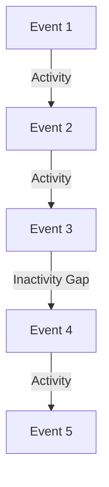

## 8.3.5 Session Windows

### Introduction to Session Windows

Session windows are a powerful concept in stream processing, particularly useful for aggregating data based on periods of activity separated by inactivity, known as gaps. Unlike fixed or sliding windows, session windows are dynamic and can vary in size depending on the data flow. This flexibility makes them ideal for scenarios where the data is bursty or irregular, such as user interaction tracking, where periods of activity are followed by inactivity.

#### Purpose of Session Windows

The primary purpose of session windows is to capture and aggregate events that are logically related within a session. A session is defined as a period of continuous activity followed by a gap of inactivity. This pattern is particularly useful in applications like user behavior analysis, where you want to group events that occur within a user's session on a website or application.

### Key Parameters of Session Windows

#### Session Inactivity Gap

The session inactivity gap is a critical parameter that defines the maximum allowed period of inactivity between events for them to be considered part of the same session. If the gap between two events exceeds this threshold, a new session window is started. This parameter allows for flexibility in defining what constitutes a session based on the specific use case.

### Practical Applications of Session Windows

Session windows are widely used in various real-world scenarios, including:

- **User Interaction Tracking**: Aggregating user actions on a website or application to understand user behavior and engagement.
- **IoT Data Processing**: Grouping sensor data that occurs within a specific timeframe to analyze device activity.
- **Fraud Detection**: Identifying suspicious activity by analyzing transaction patterns within a session.

### Implementing Session Windows in Kafka Streams

To implement session windows in Kafka Streams, you can use the `SessionWindows` class, which provides a straightforward API for defining session windows with a specified inactivity gap. Below, we provide code examples in Java, Scala, Kotlin, and Clojure to demonstrate how to implement session windows for user interaction tracking.

#### Java Example

```java
import org.apache.kafka.streams.KafkaStreams;
import org.apache.kafka.streams.StreamsBuilder;
import org.apache.kafka.streams.kstream.KStream;
import org.apache.kafka.streams.kstream.SessionWindows;
import org.apache.kafka.streams.kstream.TimeWindows;
import org.apache.kafka.streams.kstream.Windowed;

import java.time.Duration;

public class SessionWindowExample {
    public static void main(String[] args) {
        StreamsBuilder builder = new StreamsBuilder();
        KStream<String, String> userActions = builder.stream("user-actions");

        userActions
            .groupByKey()
            .windowedBy(SessionWindows.with(Duration.ofMinutes(5)))
            .count()
            .toStream()
            .foreach((Windowed<String> windowedKey, Long count) -> {
                System.out.printf("User: %s, Session Start: %d, Session End: %d, Count: %d%n",
                        windowedKey.key(), windowedKey.window().start(), windowedKey.window().end(), count);
            });

        KafkaStreams streams = new KafkaStreams(builder.build(), new Properties());
        streams.start();
    }
}
```

**Explanation**: This Java example demonstrates how to use session windows to count user actions within a session. The session inactivity gap is set to 5 minutes, meaning that if there is no activity for 5 minutes, the session is considered ended.

#### Scala Example

```scala
import org.apache.kafka.streams.scala._
import org.apache.kafka.streams.scala.kstream._
import org.apache.kafka.streams.scala.ImplicitConversions._
import org.apache.kafka.streams.scala.Serdes._
import java.time.Duration

object SessionWindowExample extends App {
  val builder = new StreamsBuilder()
  val userActions: KStream[String, String] = builder.stream[String, String]("user-actions")

  userActions
    .groupByKey
    .windowedBy(SessionWindows.with(Duration.ofMinutes(5)))
    .count()
    .toStream
    .foreach { (windowedKey, count) =>
      println(s"User: ${windowedKey.key}, Session Start: ${windowedKey.window.start}, Session End: ${windowedKey.window.end}, Count: $count")
    }

  val streams = new KafkaStreams(builder.build(), new Properties())
  streams.start()
}
```

**Explanation**: The Scala example mirrors the Java implementation, utilizing the Scala API for Kafka Streams. It sets up a session window with a 5-minute inactivity gap and counts user actions within each session.

#### Kotlin Example

```kotlin
import org.apache.kafka.streams.KafkaStreams
import org.apache.kafka.streams.StreamsBuilder
import org.apache.kafka.streams.kstream.SessionWindows
import org.apache.kafka.streams.kstream.TimeWindows
import org.apache.kafka.streams.kstream.Windowed
import java.time.Duration
import java.util.Properties

fun main() {
    val builder = StreamsBuilder()
    val userActions = builder.stream<String, String>("user-actions")

    userActions
        .groupByKey()
        .windowedBy(SessionWindows.with(Duration.ofMinutes(5)))
        .count()
        .toStream()
        .foreach { windowedKey, count ->
            println("User: ${windowedKey.key()}, Session Start: ${windowedKey.window().start()}, Session End: ${windowedKey.window().end()}, Count: $count")
        }

    val streams = KafkaStreams(builder.build(), Properties())
    streams.start()
}
```

**Explanation**: The Kotlin example uses a similar approach to Java and Scala, leveraging Kotlin's concise syntax to implement session windows with a 5-minute inactivity gap.

#### Clojure Example

```clojure
(ns session-window-example
  (:import [org.apache.kafka.streams KafkaStreams StreamsBuilder]
           [org.apache.kafka.streams.kstream SessionWindows]
           [java.time Duration]
           [java.util Properties]))

(defn -main []
  (let [builder (StreamsBuilder.)
        user-actions (.stream builder "user-actions")]

    (-> user-actions
        (.groupByKey)
        (.windowedBy (SessionWindows/with (Duration/ofMinutes 5)))
        (.count)
        (.toStream)
        (.foreach (fn [windowed-key count]
                    (println (format "User: %s, Session Start: %d, Session End: %d, Count: %d"
                                     (.key windowed-key)
                                     (.start (.window windowed-key))
                                     (.end (.window windowed-key))
                                     count)))))

    (let [streams (KafkaStreams. (.build builder) (Properties.))]
      (.start streams)))
```

**Explanation**: The Clojure example demonstrates the use of session windows in a functional programming style, setting a 5-minute inactivity gap for user action tracking.

### Visualizing Session Windows

To better understand session windows, consider the following diagram illustrating how events are grouped into sessions based on the inactivity gap:



**Caption**: This diagram shows how events are grouped into sessions. Events 1, 2, and 3 are part of the same session due to continuous activity, while Event 4 starts a new session after an inactivity gap.

### Best Practices for Using Session Windows

- **Choose an Appropriate Inactivity Gap**: The inactivity gap should reflect the expected behavior of the data. For example, a shorter gap may be suitable for high-frequency data, while a longer gap may be needed for sporadic events.
- **Monitor and Adjust**: Continuously monitor the performance and accuracy of session windows and adjust the inactivity gap as necessary to better capture meaningful sessions.
- **Combine with Other Windowing Patterns**: Consider combining session windows with other windowing patterns like tumbling or hopping windows to gain different insights from the data.

### Challenges and Considerations

- **Complexity**: Session windows can introduce complexity in stream processing applications, especially when dealing with large volumes of data.
- **Resource Consumption**: Managing dynamic windows can be resource-intensive, requiring careful tuning of Kafka Streams configurations.
- **Data Skew**: Uneven distribution of data can lead to skewed session windows, impacting the accuracy of aggregations.

### Sample Use Cases

- **E-commerce**: Track user sessions to analyze shopping behavior and optimize the user experience.
- **Social Media**: Aggregate user interactions to understand engagement patterns and improve content delivery.
- **Healthcare**: Monitor patient data to identify periods of activity and inactivity for better health insights.

### Related Patterns

- **[8.3.1 Overview of Windowing in Stream Processing]( "Overview of Windowing in Stream Processing")**: Provides a broader context for understanding different windowing patterns.
- **[8.3.2 Tumbling Windows]( "Tumbling Windows")**: Explores fixed-size windows for aggregating data.
- **[8.3.3 Hopping Windows]( "Hopping Windows")**: Discusses overlapping windows for continuous data analysis.

### Conclusion

Session windows offer a flexible and powerful way to aggregate events based on periods of activity, making them invaluable for applications that require dynamic windowing. By understanding and implementing session windows effectively, you can gain deeper insights into user behavior and other time-sensitive data.

## Test Your Knowledge: Advanced Session Windows in Apache Kafka Quiz



### What is the primary purpose of session windows in stream processing?

- [x] To aggregate data based on periods of activity separated by inactivity.
- [ ] To provide fixed-size windows for data aggregation.
- [ ] To overlap windows for continuous data analysis.
- [ ] To partition data based on key values.

> **Explanation:** Session windows are designed to group events that occur within a session of activity, separated by periods of inactivity.

### Which parameter is crucial for defining a session window?

- [x] Session inactivity gap
- [ ] Window size
- [ ] Overlap duration
- [ ] Partition key

> **Explanation:** The session inactivity gap determines the maximum allowed period of inactivity between events for them to be considered part of the same session.

### In which scenario are session windows particularly useful?

- [x] User interaction tracking
- [ ] Fixed interval data aggregation
- [ ] Continuous data streaming
- [ ] Key-based partitioning

> **Explanation:** Session windows are ideal for tracking user interactions, where periods of activity are followed by inactivity.

### How do session windows differ from tumbling windows?

- [x] Session windows are dynamic and vary in size, while tumbling windows are fixed-size.
- [ ] Session windows are fixed-size, while tumbling windows are dynamic.
- [ ] Both are fixed-size windows.
- [ ] Both are dynamic windows.

> **Explanation:** Session windows are dynamic and adjust based on activity, unlike tumbling windows which have a fixed size.

### What is a common challenge when using session windows?

- [x] Managing dynamic windows can be resource-intensive.
- [ ] Fixed window size limits flexibility.
- [ ] Overlapping windows cause data duplication.
- [ ] Partitioning data is complex.

> **Explanation:** The dynamic nature of session windows can lead to increased resource consumption and complexity in stream processing.

### Which language is NOT shown in the session window code examples?

- [ ] Java
- [ ] Scala
- [ ] Kotlin
- [x] Python

> **Explanation:** The code examples provided are in Java, Scala, Kotlin, and Clojure, but not Python.

### What is the role of the `SessionWindows` class in Kafka Streams?

- [x] To define session windows with a specified inactivity gap.
- [ ] To create fixed-size windows for data aggregation.
- [ ] To manage overlapping windows for continuous analysis.
- [ ] To partition data based on key values.

> **Explanation:** The `SessionWindows` class is used to define session windows with a specific inactivity gap in Kafka Streams.

### How can session windows be visualized effectively?

- [x] By using diagrams to show event grouping based on inactivity gaps.
- [ ] By plotting fixed-size intervals on a timeline.
- [ ] By displaying overlapping windows on a graph.
- [ ] By listing events in chronological order.

> **Explanation:** Diagrams can effectively illustrate how events are grouped into sessions based on inactivity gaps.

### What is a best practice when using session windows?

- [x] Continuously monitor and adjust the inactivity gap as necessary.
- [ ] Use a fixed inactivity gap for all scenarios.
- [ ] Avoid combining with other windowing patterns.
- [ ] Set the inactivity gap to zero for maximum precision.

> **Explanation:** Monitoring and adjusting the inactivity gap ensures that session windows accurately capture meaningful sessions.

### True or False: Session windows are suitable for high-frequency data with no inactivity.

- [ ] True
- [x] False

> **Explanation:** Session windows are designed for scenarios with periods of inactivity, making them less suitable for high-frequency data with no gaps.


