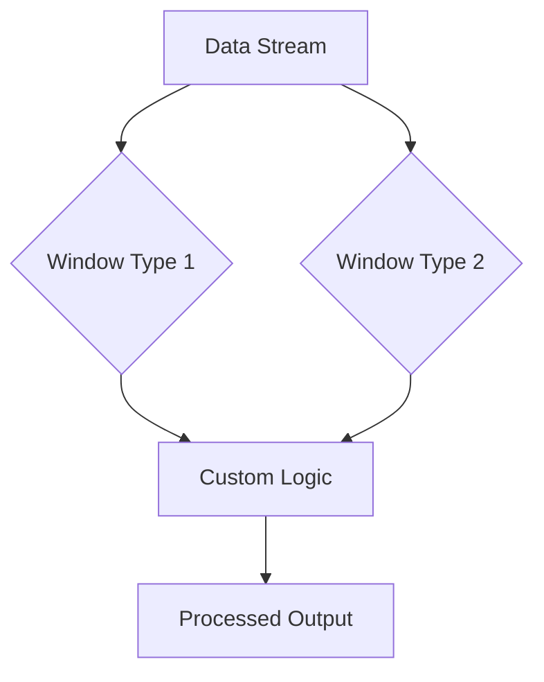

## 8.3.6 Advanced Windowing Concepts

### Introduction

In the realm of stream processing, windowing is a fundamental concept that allows the aggregation of data over specified time intervals. While basic windowing techniques such as tumbling, hopping, and sliding windows are effective for many use cases, advanced scenarios often require more sophisticated windowing strategies. This section delves into complex windowing scenarios, including combining window types, implementing custom windowing logic, and addressing specific processing requirements. We will explore practical applications, performance considerations, and best practices for advanced windowing implementations in Apache Kafka.

### Combining Windows with Custom Logic

Combining different window types or applying custom logic to windowing can address unique data processing needs. For example, you might need to handle irregular data patterns or apply per-key windowing to accommodate varying data characteristics.

#### Irregular Windows

Irregular windows are useful when dealing with data streams that do not conform to regular time intervals. These windows can be defined based on specific events or conditions rather than fixed time periods.

- **Example Use Case**: Consider a scenario where you need to process financial transactions that occur at irregular intervals. Instead of using fixed time windows, you can define windows based on transaction events, such as the start and end of trading sessions.

#### Per-Key Windowing

Per-key windowing allows you to apply different windowing strategies to different keys within the same data stream. This approach is beneficial when different data segments have distinct characteristics or processing requirements.

- **Example Use Case**: In an IoT application, you might have sensors with varying reporting frequencies. Per-key windowing enables you to apply different window sizes to each sensor's data, optimizing processing efficiency.

### Implementing Custom Windowing Logic

Custom windowing logic involves creating windows that do not fit into standard categories. This can include dynamic window sizes, event-driven windows, or windows based on complex conditions.

#### Dynamic Window Sizes

Dynamic window sizes adjust based on the data characteristics or external factors. This approach can optimize resource usage and improve processing accuracy.

- **Example Use Case**: In a real-time analytics application, you might adjust window sizes based on the volume of incoming data. During peak times, smaller windows can provide more granular insights, while larger windows can be used during off-peak periods to conserve resources.

#### Event-Driven Windows

Event-driven windows are triggered by specific events rather than time intervals. This approach is useful for applications where events dictate the processing logic.

- **Example Use Case**: In a logistics application, you might define windows based on shipment events, such as loading and unloading, to track the movement of goods in real-time.

### Processing Considerations and Performance Impacts

Advanced windowing techniques can introduce additional complexity and performance challenges. It is crucial to consider the following factors when implementing these strategies:

#### Resource Utilization

Custom windowing logic can increase resource consumption, particularly in terms of memory and CPU usage. It is essential to monitor and optimize resource allocation to ensure efficient processing.

#### Latency and Throughput

Advanced windowing can impact latency and throughput, especially if the logic involves complex calculations or frequent window updates. Balancing these factors is critical to maintaining real-time processing capabilities.

#### Fault Tolerance

Ensuring fault tolerance in advanced windowing scenarios requires careful consideration of state management and recovery mechanisms. Implementing robust checkpointing and state recovery strategies can mitigate the risk of data loss or processing errors.

### Best Practices for Advanced Windowing Implementations

To effectively implement advanced windowing concepts, consider the following best practices:

- **Optimize Resource Allocation**: Monitor resource usage and adjust configurations to balance performance and efficiency. Consider using dynamic scaling to accommodate varying workloads.

- **Leverage Kafka Streams API**: Utilize the Kafka Streams API to implement custom windowing logic, taking advantage of its built-in support for stateful processing and fault tolerance.

- **Test and Validate**: Thoroughly test windowing logic under different scenarios to ensure accuracy and reliability. Use simulation tools to validate performance and identify potential bottlenecks.

- **Monitor and Adjust**: Continuously monitor processing metrics and adjust windowing strategies as needed to optimize performance and meet evolving requirements.

### Code Examples

To illustrate advanced windowing concepts, let's explore code examples in Java, Scala, Kotlin, and Clojure. These examples demonstrate how to implement custom windowing logic using the Kafka Streams API.

#### Java Example

```java
import org.apache.kafka.streams.KafkaStreams;
import org.apache.kafka.streams.StreamsBuilder;
import org.apache.kafka.streams.kstream.KStream;
import org.apache.kafka.streams.kstream.TimeWindows;
import org.apache.kafka.streams.kstream.Windowed;

import java.time.Duration;

public class AdvancedWindowingExample {
    public static void main(String[] args) {
        StreamsBuilder builder = new StreamsBuilder();
        KStream<String, String> stream = builder.stream("input-topic");

        // Define a custom window with dynamic size
        stream.groupByKey()
              .windowedBy(TimeWindows.of(Duration.ofMinutes(5)).advanceBy(Duration.ofMinutes(1)))
              .count()
              .toStream()
              .foreach((Windowed<String> key, Long count) -> {
                  System.out.println("Window: " + key.window().startTime() + " Count: " + count);
              });

        KafkaStreams streams = new KafkaStreams(builder.build(), new Properties());
        streams.start();
    }
}
```

#### Scala Example

```scala
import org.apache.kafka.streams.scala._
import org.apache.kafka.streams.scala.kstream._
import org.apache.kafka.streams.KafkaStreams
import java.time.Duration

object AdvancedWindowingExample extends App {
  val builder = new StreamsBuilder()
  val stream: KStream[String, String] = builder.stream[String, String]("input-topic")

  // Define a custom window with dynamic size
  stream.groupByKey
    .windowedBy(TimeWindows.of(Duration.ofMinutes(5)).advanceBy(Duration.ofMinutes(1)))
    .count()
    .toStream
    .foreach((key, count) => println(s"Window: ${key.window.startTime} Count: $count"))

  val streams = new KafkaStreams(builder.build(), new Properties())
  streams.start()
}
```

#### Kotlin Example

```kotlin
import org.apache.kafka.streams.KafkaStreams
import org.apache.kafka.streams.StreamsBuilder
import org.apache.kafka.streams.kstream.TimeWindows
import java.time.Duration

fun main() {
    val builder = StreamsBuilder()
    val stream = builder.stream<String, String>("input-topic")

    // Define a custom window with dynamic size
    stream.groupByKey()
        .windowedBy(TimeWindows.of(Duration.ofMinutes(5)).advanceBy(Duration.ofMinutes(1)))
        .count()
        .toStream()
        .foreach { key, count -> println("Window: ${key.window().startTime()} Count: $count") }

    val streams = KafkaStreams(builder.build(), Properties())
    streams.start()
}
```

#### Clojure Example

```clojure
(ns advanced-windowing-example
  (:require [clojure.java-time :as time])
  (:import [org.apache.kafka.streams KafkaStreams StreamsBuilder]
           [org.apache.kafka.streams.kstream TimeWindows]))

(defn -main [& args]
  (let [builder (StreamsBuilder.)
        stream (.stream builder "input-topic")]

    ;; Define a custom window with dynamic size
    (-> stream
        (.groupByKey)
        (.windowedBy (TimeWindows/of (time/duration 5 :minutes)
                                     (time/duration 1 :minute)))
        (.count)
        (.toStream)
        (.foreach (fn [key count]
                    (println (str "Window: " (.startTime (.window key)) " Count: " count)))))

    (let [streams (KafkaStreams. (.build builder) (Properties.))]
      (.start streams))))
```

### Visualizing Advanced Windowing Concepts

To better understand advanced windowing concepts, let's visualize a scenario where different window types are combined to process data streams.



**Diagram Description**: This diagram illustrates the flow of data through multiple window types, which are then processed using custom logic to produce the final output.

### References and Links

- [Apache Kafka Documentation](https://kafka.apache.org/documentation/)
- [Confluent Documentation](https://docs.confluent.io/)
- [Kafka Streams API Guide](https://kafka.apache.org/documentation/streams/)

### Knowledge Check

To reinforce your understanding of advanced windowing concepts, consider the following questions and exercises:

1. **What are the benefits of using irregular windows in stream processing?**
2. **How can per-key windowing optimize processing efficiency in IoT applications?**
3. **Describe a scenario where event-driven windows would be advantageous.**
4. **What are the key considerations for ensuring fault tolerance in advanced windowing implementations?**
5. **Experiment with the provided code examples by modifying window sizes and observing the impact on processing output.**

### Conclusion

Advanced windowing concepts in Apache Kafka enable the implementation of sophisticated stream processing logic tailored to specific data characteristics and application requirements. By combining window types, applying custom logic, and considering performance impacts, you can optimize real-time data processing and achieve greater insights from your data streams. Embrace these advanced techniques to enhance your stream processing capabilities and address complex data challenges.

## Test Your Knowledge: Advanced Windowing Concepts in Kafka



### What is the primary advantage of using irregular windows in stream processing?

- [x] They allow processing based on specific events or conditions.
- [ ] They reduce memory usage.
- [ ] They simplify implementation.
- [ ] They increase data throughput.

> **Explanation:** Irregular windows are defined based on specific events or conditions, making them suitable for scenarios where data does not conform to regular time intervals.

### How does per-key windowing benefit IoT applications?

- [x] It allows different window sizes for each sensor's data.
- [ ] It reduces the need for data aggregation.
- [ ] It simplifies data serialization.
- [ ] It increases network bandwidth.

> **Explanation:** Per-key windowing enables the application of different window sizes to each sensor's data, optimizing processing efficiency based on varying reporting frequencies.

### In what scenario would event-driven windows be most beneficial?

- [x] When processing logic is dictated by specific events.
- [ ] When data arrives at regular intervals.
- [ ] When minimizing latency is the primary concern.
- [ ] When data volume is low.

> **Explanation:** Event-driven windows are triggered by specific events, making them ideal for applications where events dictate the processing logic.

### What is a key consideration for ensuring fault tolerance in advanced windowing implementations?

- [x] Robust checkpointing and state recovery strategies.
- [ ] Minimizing window size.
- [ ] Increasing data throughput.
- [ ] Simplifying window logic.

> **Explanation:** Ensuring fault tolerance requires robust checkpointing and state recovery strategies to mitigate the risk of data loss or processing errors.

### Which of the following is a best practice for advanced windowing implementations?

- [x] Optimize resource allocation.
- [ ] Use fixed window sizes.
- [ ] Avoid testing under different scenarios.
- [ ] Minimize monitoring efforts.

> **Explanation:** Optimizing resource allocation is crucial for balancing performance and efficiency in advanced windowing implementations.

### What impact can advanced windowing have on latency and throughput?

- [x] It can increase latency and reduce throughput.
- [ ] It always reduces latency.
- [ ] It always increases throughput.
- [ ] It has no impact on latency or throughput.

> **Explanation:** Advanced windowing can impact latency and throughput, especially if the logic involves complex calculations or frequent window updates.

### How can dynamic window sizes optimize resource usage?

- [x] By adjusting based on data characteristics or external factors.
- [ ] By using fixed intervals.
- [ ] By reducing data volume.
- [ ] By simplifying processing logic.

> **Explanation:** Dynamic window sizes adjust based on data characteristics or external factors, optimizing resource usage and improving processing accuracy.

### What is a potential drawback of custom windowing logic?

- [x] Increased resource consumption.
- [ ] Simplified implementation.
- [ ] Reduced data accuracy.
- [ ] Decreased processing flexibility.

> **Explanation:** Custom windowing logic can increase resource consumption, particularly in terms of memory and CPU usage.

### What is the role of the Kafka Streams API in advanced windowing implementations?

- [x] It provides built-in support for stateful processing and fault tolerance.
- [ ] It simplifies data serialization.
- [ ] It reduces network bandwidth.
- [ ] It increases data throughput.

> **Explanation:** The Kafka Streams API provides built-in support for stateful processing and fault tolerance, facilitating advanced windowing implementations.

### True or False: Advanced windowing techniques are only applicable to real-time data processing.

- [x] True
- [ ] False

> **Explanation:** Advanced windowing techniques are primarily applicable to real-time data processing, where they enable sophisticated stream processing logic tailored to specific data characteristics and application requirements.



---
