## 8.3 Windowing Patterns

### Introduction to Windowing in Stream Processing

Windowing is a fundamental concept in stream processing that allows you to group data into finite sets, or "windows," based on time or other criteria. This enables operations like aggregations, joins, and pattern detection over these subsets of data. In the context of Apache Kafka, windowing is crucial for stateful computations, where the system needs to maintain and update state over time as new data arrives.

Windowing is essential for scenarios where you need to analyze data over specific periods, such as calculating the average temperature over the last hour or detecting trends in real-time stock prices. By dividing the continuous stream of data into manageable chunks, windowing allows for more efficient processing and meaningful insights.

### Importance of Windowing for Stateful Computations

Stateful computations in stream processing involve maintaining and updating state information as new data arrives. Windowing plays a critical role in these computations by defining the scope and boundaries of the state. Without windowing, the state would grow indefinitely, leading to performance degradation and resource exhaustion.

Windowing allows you to:

- **Control State Size**: By limiting the data considered for computation to a specific window, you can manage the size of the state and ensure efficient processing.
- **Enable Time-Based Analysis**: Windows can be defined based on time, allowing you to perform time-based analyses such as moving averages, trend detection, and anomaly detection.
- **Facilitate Event-Time Processing**: Windowing supports event-time processing, where events are processed based on their timestamps rather than arrival time, ensuring accurate results even in the presence of out-of-order data.

### Types of Windows and Their Use Cases

There are several types of windows used in stream processing, each with its own characteristics and use cases. The most common window types are tumbling, hopping, sliding, and session windows.

#### Tumbling Windows

**Description**: Tumbling windows are fixed-size, non-overlapping windows that partition the data stream into distinct segments. Each event belongs to exactly one window.

**Use Cases**: Tumbling windows are ideal for scenarios where you need to perform periodic computations, such as generating hourly reports or calculating daily sales totals.

**Example**: Calculate the total number of transactions every minute.

```java
// Java example for Tumbling Window
KStream<String, Long> transactionStream = builder.stream("transactions");
KTable<Windowed<String>, Long> transactionCounts = transactionStream
    .groupByKey()
    .windowedBy(TimeWindows.of(Duration.ofMinutes(1)))
    .count();
```

```scala
// Scala example for Tumbling Window
val transactionStream: KStream[String, Long] = builder.stream("transactions")
val transactionCounts: KTable[Windowed[String], Long] = transactionStream
  .groupByKey
  .windowedBy(TimeWindows.of(Duration.ofMinutes(1)))
  .count()
```

```kotlin
// Kotlin example for Tumbling Window
val transactionStream: KStream<String, Long> = builder.stream("transactions")
val transactionCounts: KTable<Windowed<String>, Long> = transactionStream
    .groupByKey()
    .windowedBy(TimeWindows.of(Duration.ofMinutes(1)))
    .count()
```

```clojure
;; Clojure example for Tumbling Window
(def transaction-stream (.stream builder "transactions"))
(def transaction-counts
  (-> transaction-stream
      (.groupByKey)
      (.windowedBy (TimeWindows/of (Duration/ofMinutes 1)))
      (.count)))
```

#### Hopping Windows

**Description**: Hopping windows are fixed-size, overlapping windows that slide over the data stream at regular intervals. An event can belong to multiple windows.

**Use Cases**: Hopping windows are useful for scenarios where you need to perform continuous monitoring with overlapping time frames, such as detecting spikes in network traffic.

**Example**: Calculate the average CPU usage every minute with a window size of 5 minutes.

```java
// Java example for Hopping Window
KStream<String, Double> cpuUsageStream = builder.stream("cpu-usage");
KTable<Windowed<String>, Double> averageCpuUsage = cpuUsageStream
    .groupByKey()
    .windowedBy(TimeWindows.of(Duration.ofMinutes(5)).advanceBy(Duration.ofMinutes(1)))
    .aggregate(
        () -> 0.0,
        (aggKey, newValue, aggValue) -> (aggValue + newValue) / 2,
        Materialized.with(Serdes.String(), Serdes.Double())
    );
```

```scala
// Scala example for Hopping Window
val cpuUsageStream: KStream[String, Double] = builder.stream("cpu-usage")
val averageCpuUsage: KTable[Windowed[String], Double] = cpuUsageStream
  .groupByKey
  .windowedBy(TimeWindows.of(Duration.ofMinutes(5)).advanceBy(Duration.ofMinutes(1)))
  .aggregate(
    () => 0.0,
    (aggKey, newValue, aggValue) => (aggValue + newValue) / 2,
    Materialized.with(Serdes.String(), Serdes.Double())
  )
```

```kotlin
// Kotlin example for Hopping Window
val cpuUsageStream: KStream<String, Double> = builder.stream("cpu-usage")
val averageCpuUsage: KTable<Windowed<String>, Double> = cpuUsageStream
    .groupByKey()
    .windowedBy(TimeWindows.of(Duration.ofMinutes(5)).advanceBy(Duration.ofMinutes(1)))
    .aggregate(
        { 0.0 },
        { _, newValue, aggValue -> (aggValue + newValue) / 2 },
        Materialized.with(Serdes.String(), Serdes.Double())
    )
```

```clojure
;; Clojure example for Hopping Window
(def cpu-usage-stream (.stream builder "cpu-usage"))
(def average-cpu-usage
  (-> cpu-usage-stream
      (.groupByKey)
      (.windowedBy (TimeWindows/of (Duration/ofMinutes 5))
                   (.advanceBy (Duration/ofMinutes 1)))
      (.aggregate (fn [] 0.0)
                  (fn [aggKey newValue aggValue] (/ (+ aggValue newValue) 2))
                  (Materialized/with (Serdes/String) (Serdes/Double)))))
```

#### Sliding Windows

**Description**: Sliding windows are variable-size, overlapping windows that are triggered by events. They allow for fine-grained analysis by capturing events that occur within a specific time range relative to each event.

**Use Cases**: Sliding windows are suitable for scenarios where you need to detect patterns or anomalies in real-time, such as fraud detection or user behavior analysis.

**Example**: Detect anomalies in transaction amounts over a sliding window of 10 minutes.

```java
// Java example for Sliding Window
KStream<String, Double> transactionStream = builder.stream("transactions");
KTable<Windowed<String>, Double> anomalyDetection = transactionStream
    .groupByKey()
    .windowedBy(SlidingWindows.withTimeDifferenceAndGrace(Duration.ofMinutes(10), Duration.ofMinutes(1)))
    .aggregate(
        () -> 0.0,
        (aggKey, newValue, aggValue) -> detectAnomaly(aggValue, newValue),
        Materialized.with(Serdes.String(), Serdes.Double())
    );
```

```scala
// Scala example for Sliding Window
val transactionStream: KStream[String, Double] = builder.stream("transactions")
val anomalyDetection: KTable[Windowed[String], Double] = transactionStream
  .groupByKey
  .windowedBy(SlidingWindows.withTimeDifferenceAndGrace(Duration.ofMinutes(10), Duration.ofMinutes(1)))
  .aggregate(
    () => 0.0,
    (aggKey, newValue, aggValue) => detectAnomaly(aggValue, newValue),
    Materialized.with(Serdes.String(), Serdes.Double())
  )
```

```kotlin
// Kotlin example for Sliding Window
val transactionStream: KStream<String, Double> = builder.stream("transactions")
val anomalyDetection: KTable<Windowed<String>, Double> = transactionStream
    .groupByKey()
    .windowedBy(SlidingWindows.withTimeDifferenceAndGrace(Duration.ofMinutes(10), Duration.ofMinutes(1)))
    .aggregate(
        { 0.0 },
        { _, newValue, aggValue -> detectAnomaly(aggValue, newValue) },
        Materialized.with(Serdes.String(), Serdes.Double())
    )
```

```clojure
;; Clojure example for Sliding Window
(def transaction-stream (.stream builder "transactions"))
(def anomaly-detection
  (-> transaction-stream
      (.groupByKey)
      (.windowedBy (SlidingWindows/withTimeDifferenceAndGrace (Duration/ofMinutes 10) (Duration/ofMinutes 1)))
      (.aggregate (fn [] 0.0)
                  (fn [aggKey newValue aggValue] (detect-anomaly aggValue newValue))
                  (Materialized/with (Serdes/String) (Serdes/Double)))))
```

#### Session Windows

**Description**: Session windows are dynamic, gap-based windows that group events based on periods of inactivity. A new window is created when a gap in event activity exceeds a specified duration.

**Use Cases**: Session windows are ideal for tracking user sessions, where the session ends after a period of inactivity, such as analyzing user interactions on a website.

**Example**: Track user sessions with a gap of 5 minutes.

```java
// Java example for Session Window
KStream<String, String> userActivityStream = builder.stream("user-activity");
KTable<Windowed<String>, Long> userSessions = userActivityStream
    .groupByKey()
    .windowedBy(SessionWindows.with(Duration.ofMinutes(5)))
    .count();
```

```scala
// Scala example for Session Window
val userActivityStream: KStream[String, String] = builder.stream("user-activity")
val userSessions: KTable[Windowed[String], Long] = userActivityStream
  .groupByKey
  .windowedBy(SessionWindows.with(Duration.ofMinutes(5)))
  .count()
```

```kotlin
// Kotlin example for Session Window
val userActivityStream: KStream<String, String> = builder.stream("user-activity")
val userSessions: KTable<Windowed<String>, Long> = userActivityStream
    .groupByKey()
    .windowedBy(SessionWindows.with(Duration.ofMinutes(5)))
    .count()
```

```clojure
;; Clojure example for Session Window
(def user-activity-stream (.stream builder "user-activity"))
(def user-sessions
  (-> user-activity-stream
      (.groupByKey)
      (.windowedBy (SessionWindows/with (Duration/ofMinutes 5)))
      (.count)))
```

### Challenges in Windowing

Windowing in stream processing presents several challenges that need to be addressed for effective implementation:

- **Window Size Selection**: Choosing the right window size is crucial for balancing between granularity and performance. A smaller window size provides more detailed insights but may increase computational overhead, while a larger window size reduces overhead but may miss important details.

- **Overlapping Windows**: Managing overlapping windows, such as hopping and sliding windows, requires careful consideration of state management and resource allocation to ensure efficient processing.

- **Late Arriving Data**: Handling late-arriving data is a common challenge in windowing. Techniques such as watermarking and grace periods can be used to manage late data and ensure accurate results.

- **State Management**: Efficient state management is critical for windowing operations, especially for stateful computations. Techniques such as state stores and changelog topics can be used to manage state effectively.

### Practical Applications and Real-World Scenarios

Windowing patterns are widely used in various real-world scenarios, including:

- **Real-Time Analytics**: Windowing is used to perform real-time analytics on streaming data, such as calculating moving averages, detecting trends, and identifying anomalies.

- **Fraud Detection**: Sliding windows are used to detect fraudulent activities by analyzing transaction patterns over time.

- **User Behavior Analysis**: Session windows are used to track user sessions and analyze user behavior on websites and applications.

- **Network Monitoring**: Hopping windows are used to monitor network traffic and detect spikes or anomalies in real-time.

### Visualizing Windowing Patterns

To better understand windowing patterns, let's visualize the different types of windows using Mermaid.js diagrams.

#### Tumbling Windows Diagram

```mermaid
gantt
    dateFormat  HH:mm
    axisFormat  %H:%M
    section Tumbling Windows
    Window 1    :active, 2024-11-25 00:00, 30m
    Window 2    :active, 2024-11-25 00:30, 30m
    Window 3    :active, 2024-11-25 01:00, 30m
```



**Caption**: Tumbling windows are non-overlapping and partition the data stream into distinct segments.

#### Hopping Windows Diagram

```mermaid
gantt
    dateFormat  HH:mm
    axisFormat  %H:%M
    section Hopping Windows
    Window 1    :active, 2024-11-25 00:00, 1h
    Window 2    :active, 2024-11-25 00:30, 1h
    Window 3    :active, 2024-11-25 01:00, 1h
```



**Caption**: Hopping windows overlap and slide over the data stream at regular intervals.

#### Sliding Windows Diagram

```mermaid
gantt
    dateFormat  HH:mm
    axisFormat  %H:%M
    section Sliding Windows
    Event 1     :active, 2024-11-25 00:10, 10m
    Event 2     :active, 2024-11-25 00:20, 10m
    Event 3     :active, 2024-11-25 00:30, 10m
```



**Caption**: Sliding windows are triggered by events and allow for fine-grained analysis.

#### Session Windows Diagram

```mermaid
gantt
    dateFormat  HH:mm
    axisFormat  %H:%M
    section Session Windows
    Session 1   :active, 2024-11-25 00:00, 20m
    Session 2   :active, 2024-11-25 00:30, 15m
    Session 3   :active, 2024-11-25 01:00, 25m
```



**Caption**: Session windows are dynamic and based on periods of inactivity.

### Conclusion

Windowing patterns are a powerful tool in stream processing that enable efficient and meaningful analysis of streaming data. By understanding the different types of windows and their use cases, you can design robust and scalable stream processing applications that deliver real-time insights and drive business value.

For further reading on stream processing and windowing patterns, refer to the [Apache Kafka Documentation](https://kafka.apache.org/documentation/) and the [Confluent Documentation](https://docs.confluent.io/).

## Test Your Knowledge: Advanced Kafka Windowing Patterns Quiz



### What is the primary purpose of windowing in stream processing?

- [x] To group data into finite sets for stateful computations
- [ ] To increase the speed of data processing
- [ ] To reduce the size of the data stream
- [ ] To eliminate duplicate data

> **Explanation:** Windowing groups data into finite sets, enabling stateful computations and time-based analysis.

### Which window type is best suited for detecting spikes in network traffic?

- [ ] Tumbling Windows
- [x] Hopping Windows
- [ ] Sliding Windows
- [ ] Session Windows

> **Explanation:** Hopping windows are ideal for continuous monitoring with overlapping time frames.

### How do sliding windows differ from tumbling windows?

- [x] Sliding windows overlap and are triggered by events
- [ ] Sliding windows are non-overlapping and fixed-size
- [ ] Sliding windows are based on periods of inactivity
- [ ] Sliding windows are used for batch processing

> **Explanation:** Sliding windows overlap and are triggered by events, allowing for fine-grained analysis.

### What is a common challenge when using windowing in stream processing?

- [x] Selecting the appropriate window size
- [ ] Ensuring data privacy
- [ ] Increasing data throughput
- [ ] Reducing data latency

> **Explanation:** Choosing the right window size is crucial for balancing granularity and performance.

### Which window type is used to track user sessions?

- [ ] Tumbling Windows
- [ ] Hopping Windows
- [ ] Sliding Windows
- [x] Session Windows

> **Explanation:** Session windows group events based on periods of inactivity, making them ideal for tracking user sessions.

### What technique can be used to handle late-arriving data in windowing?

- [ ] Data compression
- [ ] Data encryption
- [x] Watermarking
- [ ] Data sharding

> **Explanation:** Watermarking is used to manage late-arriving data and ensure accurate results.

### Which window type is characterized by fixed-size, non-overlapping segments?

- [x] Tumbling Windows
- [ ] Hopping Windows
- [ ] Sliding Windows
- [ ] Session Windows

> **Explanation:** Tumbling windows are fixed-size and non-overlapping, partitioning the data stream into distinct segments.

### What is the main advantage of using session windows?

- [ ] They are easy to implement
- [x] They dynamically adjust based on periods of inactivity
- [ ] They require less computational resources
- [ ] They eliminate the need for state management

> **Explanation:** Session windows dynamically adjust based on periods of inactivity, making them ideal for tracking user sessions.

### How can state management be efficiently handled in windowing operations?

- [ ] By using data compression
- [x] By using state stores and changelog topics
- [ ] By using data encryption
- [ ] By using data sharding

> **Explanation:** State stores and changelog topics are used to manage state effectively in windowing operations.

### True or False: Tumbling windows can overlap.

- [ ] True
- [x] False

> **Explanation:** Tumbling windows are non-overlapping and partition the data stream into distinct segments.



---
