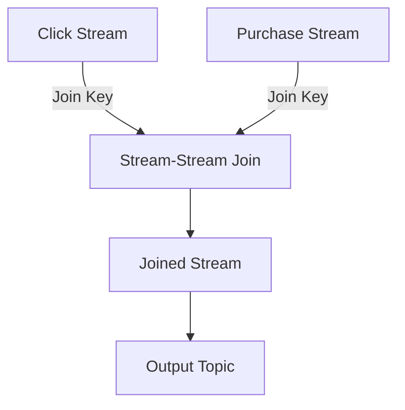

## 8.4.1 Stream-Stream Joins

### Introduction

Stream-stream joins in Apache Kafka are a powerful mechanism for correlating events from different sources in real-time. This technique allows you to enrich data streams by combining them based on common keys and time windows, enabling complex event processing and real-time analytics. In this section, we will delve into the mechanics of stream-stream joins, discuss the importance of windowing, provide practical examples, and address common challenges such as window alignment and data skew.

### Mechanics of Stream-Stream Joins

Stream-stream joins in Kafka Streams involve joining two continuous data streams based on a common key. The join operation is performed over a specified time window, which defines the temporal context within which the events from both streams are correlated. This is crucial for scenarios where data from different streams arrive at different times but need to be processed together.

#### Key Concepts

- **Join Key**: The attribute used to match records from both streams. It must be present in both streams for the join to occur.
- **Windowing**: Defines the time frame within which the join operation is valid. It ensures that only events within the same window are considered for joining.
- **State Stores**: Used to maintain the state of the streams during the join operation. They store the records temporarily until they can be joined with records from the other stream.

### Windowing Requirements

Windowing is a critical aspect of stream-stream joins. It determines how long the system should wait for matching records from both streams. Kafka Streams provides several windowing options:

- **Tumbling Windows**: Fixed-size, non-overlapping windows. Each event belongs to exactly one window.
- **Hopping Windows**: Fixed-size windows that can overlap. An event can belong to multiple windows.
- **Sliding Windows**: Windows that slide over time, capturing events that fall within a specified duration.
- **Session Windows**: Dynamic windows based on periods of activity followed by inactivity.

Choosing the right window type depends on the specific use case and the nature of the data streams.

### Practical Examples

Let's explore a practical example of stream-stream joins using Kafka Streams. Consider a scenario where you have two streams: one containing user click events and another containing user purchase events. You want to join these streams to analyze the correlation between user clicks and purchases.

#### Java Example

```java
import org.apache.kafka.streams.KafkaStreams;
import org.apache.kafka.streams.StreamsBuilder;
import org.apache.kafka.streams.kstream.KStream;
import org.apache.kafka.streams.kstream.JoinWindows;
import org.apache.kafka.streams.kstream.Joined;
import org.apache.kafka.streams.kstream.Materialized;
import org.apache.kafka.streams.kstream.Produced;
import org.apache.kafka.streams.kstream.TimeWindows;

import java.time.Duration;

public class StreamStreamJoinExample {
    public static void main(String[] args) {
        StreamsBuilder builder = new StreamsBuilder();

        // Define the click events stream
        KStream<String, String> clickStream = builder.stream("click-events");

        // Define the purchase events stream
        KStream<String, String> purchaseStream = builder.stream("purchase-events");

        // Perform the stream-stream join
        KStream<String, String> joinedStream = clickStream.join(
            purchaseStream,
            (clickValue, purchaseValue) -> "Click: " + clickValue + ", Purchase: " + purchaseValue,
            JoinWindows.of(Duration.ofMinutes(5)),
            Joined.with(Serdes.String(), Serdes.String(), Serdes.String())
        );

        // Output the joined stream to a new topic
        joinedStream.to("joined-events", Produced.with(Serdes.String(), Serdes.String()));

        KafkaStreams streams = new KafkaStreams(builder.build(), new StreamsConfig(getProperties()));
        streams.start();
    }

    private static Properties getProperties() {
        Properties props = new Properties();
        props.put(StreamsConfig.APPLICATION_ID_CONFIG, "stream-stream-join-example");
        props.put(StreamsConfig.BOOTSTRAP_SERVERS_CONFIG, "localhost:9092");
        props.put(StreamsConfig.DEFAULT_KEY_SERDE_CLASS_CONFIG, Serdes.String().getClass().getName());
        props.put(StreamsConfig.DEFAULT_VALUE_SERDE_CLASS_CONFIG, Serdes.String().getClass().getName());
        return props;
    }
}
```

In this example, we join the `clickStream` and `purchaseStream` using a 5-minute window. The joined records are then written to a new Kafka topic, `joined-events`.

#### Scala Example

```scala
import org.apache.kafka.streams.scala._
import org.apache.kafka.streams.scala.kstream._
import org.apache.kafka.streams.{KafkaStreams, StreamsConfig}
import org.apache.kafka.streams.kstream.JoinWindows

import java.util.Properties
import scala.concurrent.duration._

object StreamStreamJoinExample {
  def main(args: Array[String]): Unit = {
    val builder = new StreamsBuilder()

    // Define the click events stream
    val clickStream: KStream[String, String] = builder.stream[String, String]("click-events")

    // Define the purchase events stream
    val purchaseStream: KStream[String, String] = builder.stream[String, String]("purchase-events")

    // Perform the stream-stream join
    val joinedStream: KStream[String, String] = clickStream.join(
      purchaseStream,
      (clickValue, purchaseValue) => s"Click: $clickValue, Purchase: $purchaseValue",
      JoinWindows.of(5.minutes)
    )

    // Output the joined stream to a new topic
    joinedStream.to("joined-events")

    val streams = new KafkaStreams(builder.build(), getProperties)
    streams.start()
  }

  def getProperties: Properties = {
    val props = new Properties()
    props.put(StreamsConfig.APPLICATION_ID_CONFIG, "stream-stream-join-example")
    props.put(StreamsConfig.BOOTSTRAP_SERVERS_CONFIG, "localhost:9092")
    props.put(StreamsConfig.DEFAULT_KEY_SERDE_CLASS_CONFIG, Serdes.String.getClass.getName)
    props.put(StreamsConfig.DEFAULT_VALUE_SERDE_CLASS_CONFIG, Serdes.String.getClass.getName)
    props
  }
}
```

#### Kotlin Example

```kotlin
import org.apache.kafka.streams.KafkaStreams
import org.apache.kafka.streams.StreamsBuilder
import org.apache.kafka.streams.kstream.JoinWindows
import org.apache.kafka.streams.kstream.KStream
import org.apache.kafka.streams.kstream.Joined
import org.apache.kafka.streams.kstream.Produced
import org.apache.kafka.streams.StreamsConfig
import org.apache.kafka.common.serialization.Serdes
import java.time.Duration
import java.util.Properties

fun main() {
    val builder = StreamsBuilder()

    // Define the click events stream
    val clickStream: KStream<String, String> = builder.stream("click-events")

    // Define the purchase events stream
    val purchaseStream: KStream<String, String> = builder.stream("purchase-events")

    // Perform the stream-stream join
    val joinedStream: KStream<String, String> = clickStream.join(
        purchaseStream,
        { clickValue, purchaseValue -> "Click: $clickValue, Purchase: $purchaseValue" },
        JoinWindows.of(Duration.ofMinutes(5)),
        Joined.with(Serdes.String(), Serdes.String(), Serdes.String())
    )

    // Output the joined stream to a new topic
    joinedStream.to("joined-events", Produced.with(Serdes.String(), Serdes.String()))

    val streams = KafkaStreams(builder.build(), getProperties())
    streams.start()
}

fun getProperties(): Properties {
    val props = Properties()
    props[StreamsConfig.APPLICATION_ID_CONFIG] = "stream-stream-join-example"
    props[StreamsConfig.BOOTSTRAP_SERVERS_CONFIG] = "localhost:9092"
    props[StreamsConfig.DEFAULT_KEY_SERDE_CLASS_CONFIG] = Serdes.String().javaClass.name
    props[StreamsConfig.DEFAULT_VALUE_SERDE_CLASS_CONFIG] = Serdes.String().javaClass.name
    return props
}
```

#### Clojure Example

```clojure
(ns stream-stream-join-example
  (:require [clojure.java.io :as io])
  (:import [org.apache.kafka.streams KafkaStreams StreamsBuilder StreamsConfig]
           [org.apache.kafka.streams.kstream JoinWindows KStream]
           [org.apache.kafka.common.serialization Serdes]
           [java.util Properties]
           [java.time Duration]))

(defn -main [& args]
  (let [builder (StreamsBuilder.)]

    ;; Define the click events stream
    (def click-stream (.stream builder "click-events"))

    ;; Define the purchase events stream
    (def purchase-stream (.stream builder "purchase-events"))

    ;; Perform the stream-stream join
    (def joined-stream (.join click-stream
                              purchase-stream
                              (reify org.apache.kafka.streams.kstream.ValueJoiner
                                (apply [_ click-value purchase-value]
                                  (str "Click: " click-value ", Purchase: " purchase-value)))
                              (JoinWindows/of (Duration/ofMinutes 5))
                              (Joined/with (Serdes/String) (Serdes/String) (Serdes/String))))

    ;; Output the joined stream to a new topic
    (.to joined-stream "joined-events" (Produced/with (Serdes/String) (Serdes/String)))

    (let [streams (KafkaStreams. (.build builder) (get-properties))]
      (.start streams))))

(defn get-properties []
  (let [props (Properties.)]
    (.put props StreamsConfig/APPLICATION_ID_CONFIG "stream-stream-join-example")
    (.put props StreamsConfig/BOOTSTRAP_SERVERS_CONFIG "localhost:9092")
    (.put props StreamsConfig/DEFAULT_KEY_SERDE_CLASS_CONFIG (.getName (Serdes/String)))
    (.put props StreamsConfig/DEFAULT_VALUE_SERDE_CLASS_CONFIG (.getName (Serdes/String)))
    props))
```

### Challenges in Stream-Stream Joins

While stream-stream joins are powerful, they come with challenges that need to be addressed for efficient processing:

#### Window Alignment

Ensuring that windows are aligned across streams is crucial. Misaligned windows can lead to incomplete joins or missed correlations. It's important to configure window sizes and grace periods appropriately to accommodate variations in event arrival times.

#### Data Skew

Data skew occurs when the distribution of keys is uneven, leading to hotspots in processing. This can cause performance bottlenecks and increased latency. To mitigate data skew, consider partitioning strategies that distribute load evenly across partitions.

#### State Store Management

Managing state stores efficiently is critical for performance. State stores must be configured to handle the volume of data being processed, and their retention policies should be aligned with the windowing requirements.

### Visualizing Stream-Stream Joins

To better understand the flow of data in stream-stream joins, consider the following diagram:



**Diagram Description**: This diagram illustrates the process of joining two streams based on a common key. The click stream and purchase stream are joined, resulting in a joined stream that is then written to an output topic.

### Best Practices

- **Choose the Right Window Type**: Select a window type that aligns with your use case and data characteristics.
- **Optimize State Stores**: Configure state stores to handle the expected data volume and retention requirements.
- **Monitor Performance**: Use monitoring tools to track the performance of your stream-stream joins and identify bottlenecks.
- **Handle Late Arrivals**: Configure grace periods to handle late-arriving events and ensure they are included in the join.

### Sample Use Cases

- **Real-Time Fraud Detection**: Join transaction streams with user behavior streams to detect fraudulent activities in real-time.
- **IoT Data Correlation**: Combine sensor data streams from different sources to analyze environmental conditions.
- **Social Media Analytics**: Correlate user interactions across different platforms to gain insights into user behavior.

### Related Patterns

- **[8.4.2 Stream-Table Joins]( "Stream-Table Joins")**: Explore how to join streams with tables for enriching stream data with static reference data.
- **[8.5 Pattern Detection and Complex Event Processing (CEP)]( "Pattern Detection and Complex Event Processing (CEP)")**: Learn about detecting patterns and complex events in streams.

### Conclusion

Stream-stream joins in Apache Kafka are a powerful tool for real-time data processing and analytics. By understanding the mechanics of joins, windowing requirements, and best practices, you can effectively leverage this capability to build robust, scalable applications. Addressing challenges such as window alignment and data skew will ensure optimal performance and accuracy in your stream processing workflows.

---

## Test Your Knowledge: Mastering Stream-Stream Joins in Apache Kafka



### What is the primary purpose of stream-stream joins in Kafka Streams?

- [x] To correlate events from different sources based on keys and time windows.
- [ ] To store data in Kafka topics.
- [ ] To transform data into different formats.
- [ ] To filter out unwanted data.

> **Explanation:** Stream-stream joins are used to correlate events from different sources based on common keys and time windows, enabling complex event processing and real-time analytics.

### Which window type in Kafka Streams is fixed-size and non-overlapping?

- [x] Tumbling Windows
- [ ] Hopping Windows
- [ ] Sliding Windows
- [ ] Session Windows

> **Explanation:** Tumbling windows are fixed-size and non-overlapping, meaning each event belongs to exactly one window.

### What challenge does data skew present in stream-stream joins?

- [x] It can cause performance bottlenecks and increased latency.
- [ ] It simplifies the join process.
- [ ] It eliminates the need for windowing.
- [ ] It ensures even distribution of data.

> **Explanation:** Data skew occurs when the distribution of keys is uneven, leading to hotspots in processing, which can cause performance bottlenecks and increased latency.

### What is the role of state stores in stream-stream joins?

- [x] To maintain the state of the streams during the join operation.
- [ ] To store the final output of the join.
- [ ] To filter out unwanted events.
- [ ] To transform data formats.

> **Explanation:** State stores are used to maintain the state of the streams during the join operation, storing records temporarily until they can be joined with records from the other stream.

### Which of the following is a best practice for handling late-arriving events in stream-stream joins?

- [x] Configure grace periods.
- [ ] Use larger window sizes.
- [ ] Ignore late-arriving events.
- [ ] Increase the number of partitions.

> **Explanation:** Configuring grace periods allows late-arriving events to be included in the join, ensuring accurate processing.

### In the provided Java example, what is the purpose of the `JoinWindows.of(Duration.ofMinutes(5))` method?

- [x] To specify a 5-minute window for the join operation.
- [ ] To set the retention period for the state store.
- [ ] To define the output topic for the joined stream.
- [ ] To configure the serialization format.

> **Explanation:** The `JoinWindows.of(Duration.ofMinutes(5))` method specifies a 5-minute window for the join operation, defining the temporal context for correlating events.

### How can you mitigate data skew in stream-stream joins?

- [x] Use partitioning strategies that distribute load evenly.
- [ ] Increase the window size.
- [ ] Reduce the number of partitions.
- [ ] Ignore skewed data.

> **Explanation:** To mitigate data skew, consider partitioning strategies that distribute load evenly across partitions, preventing hotspots and ensuring balanced processing.

### What is the benefit of using session windows in stream-stream joins?

- [x] They are dynamic and based on periods of activity followed by inactivity.
- [ ] They are fixed-size and non-overlapping.
- [ ] They slide over time, capturing events within a specified duration.
- [ ] They are fixed-size and can overlap.

> **Explanation:** Session windows are dynamic and based on periods of activity followed by inactivity, making them suitable for scenarios with variable event rates.

### What is a common use case for stream-stream joins in IoT applications?

- [x] Combining sensor data streams from different sources to analyze environmental conditions.
- [ ] Storing sensor data in a database.
- [ ] Filtering out noise from sensor data.
- [ ] Transforming sensor data into different formats.

> **Explanation:** In IoT applications, stream-stream joins can be used to combine sensor data streams from different sources, enabling analysis of environmental conditions and correlations.

### True or False: Stream-stream joins in Kafka Streams can be performed without specifying a window.

- [ ] True
- [x] False

> **Explanation:** Stream-stream joins in Kafka Streams require specifying a window to define the temporal context within which events from both streams are correlated.



---
