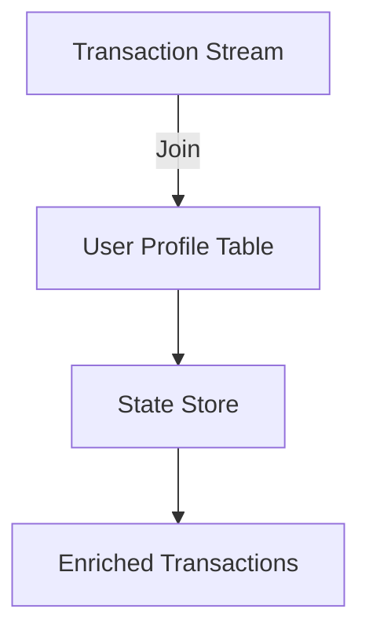

## 8.4.2 Stream-Table Joins

Stream-table joins are a powerful feature in Apache Kafka Streams that allow you to enrich streaming data with additional context or reference data stored in tables. This capability is essential for building complex stream processing applications where real-time data needs to be augmented with static or slowly changing datasets. In this section, we will delve into the concept of stream-table joins, explore their advantages, discuss the materialization of tables in Kafka Streams, and provide practical examples and code snippets in multiple programming languages.

### Understanding Stream-Table Joins

#### Definition and Advantages

A stream-table join is an operation where a continuous stream of data (KStream) is joined with a table (KTable) to enhance the stream with additional information. This operation is akin to a lookup operation in a database, where each event in the stream is enriched with data from the table based on a common key.

**Advantages of Stream-Table Joins:**

- **Data Enrichment**: Stream-table joins allow you to add context to streaming events, making them more informative and actionable. For example, enriching transaction data with user profiles or product details.
- **Real-Time Processing**: By joining streams with tables, you can perform real-time data processing and analytics, enabling timely decision-making.
- **Scalability**: Kafka Streams is designed to handle large volumes of data, making stream-table joins suitable for high-throughput applications.
- **Flexibility**: Stream-table joins support various use cases, from simple lookups to complex event processing scenarios.

### Materialization of Tables in Kafka Streams

In Kafka Streams, a KTable represents a changelog stream that is materialized into a state store. This materialization is crucial for enabling efficient stream-table joins, as it allows the table to be queried in real-time.

#### How Materialization Works

1. **Changelog Stream**: A KTable is derived from a changelog stream, which captures all updates to the table.
2. **State Store**: The changelog stream is materialized into a state store, which is a local database that holds the current state of the table.
3. **Real-Time Updates**: The state store is continuously updated as new records arrive in the changelog stream, ensuring that the table reflects the latest data.

#### Benefits of Materialization

- **Low Latency**: Materialization enables low-latency lookups during stream-table joins, as the data is readily available in the state store.
- **Fault Tolerance**: Kafka Streams ensures fault tolerance by replicating state stores across multiple nodes, allowing for recovery in case of failures.
- **Consistency**: The materialized state store maintains consistency with the underlying changelog stream, ensuring accurate joins.

### Practical Examples of Stream-Table Joins

To illustrate the power of stream-table joins, let's consider a scenario where we have a stream of transactions and a table of user profiles. Our goal is to enrich each transaction with the corresponding user's profile information.

#### Example: Enriching Transactions with User Profiles

**Scenario**: You have a stream of transaction events, each containing a user ID, and a table of user profiles, each containing user details such as name and email. You want to join the transaction stream with the user profile table to include user details in each transaction event.

**Java Code Example**:

```java
import org.apache.kafka.common.serialization.Serdes;
import org.apache.kafka.streams.KafkaStreams;
import org.apache.kafka.streams.StreamsBuilder;
import org.apache.kafka.streams.kstream.KStream;
import org.apache.kafka.streams.kstream.KTable;
import org.apache.kafka.streams.kstream.Materialized;
import org.apache.kafka.streams.kstream.Produced;
import org.apache.kafka.streams.kstream.Serialized;

public class StreamTableJoinExample {
    public static void main(String[] args) {
        StreamsBuilder builder = new StreamsBuilder();

        // Define the transaction stream
        KStream<String, Transaction> transactions = builder.stream("transactions");

        // Define the user profile table
        KTable<String, UserProfile> userProfiles = builder.table("user_profiles");

        // Perform the stream-table join
        KStream<String, EnrichedTransaction> enrichedTransactions = transactions.join(
            userProfiles,
            (transaction, userProfile) -> new EnrichedTransaction(transaction, userProfile)
        );

        // Output the enriched transactions to a new topic
        enrichedTransactions.to("enriched_transactions", Produced.with(Serdes.String(), new EnrichedTransactionSerde()));

        KafkaStreams streams = new KafkaStreams(builder.build(), getStreamsConfig());
        streams.start();
    }

    private static Properties getStreamsConfig() {
        Properties props = new Properties();
        props.put(StreamsConfig.APPLICATION_ID_CONFIG, "stream-table-join-example");
        props.put(StreamsConfig.BOOTSTRAP_SERVERS_CONFIG, "localhost:9092");
        props.put(StreamsConfig.DEFAULT_KEY_SERDE_CLASS_CONFIG, Serdes.String().getClass().getName());
        props.put(StreamsConfig.DEFAULT_VALUE_SERDE_CLASS_CONFIG, Serdes.serdeFrom(Transaction.class).getClass().getName());
        return props;
    }
}
```

**Scala Code Example**:

```scala
import org.apache.kafka.streams.scala._
import org.apache.kafka.streams.scala.kstream._
import org.apache.kafka.streams.scala.Serdes._
import org.apache.kafka.streams.{KafkaStreams, StreamsConfig}

object StreamTableJoinExample extends App {
  val builder = new StreamsBuilder()

  // Define the transaction stream
  val transactions: KStream[String, Transaction] = builder.stream[String, Transaction]("transactions")

  // Define the user profile table
  val userProfiles: KTable[String, UserProfile] = builder.table[String, UserProfile]("user_profiles")

  // Perform the stream-table join
  val enrichedTransactions: KStream[String, EnrichedTransaction] = transactions.join(userProfiles) {
    (transaction, userProfile) => EnrichedTransaction(transaction, userProfile)
  }

  // Output the enriched transactions to a new topic
  enrichedTransactions.to("enriched_transactions")

  val streams = new KafkaStreams(builder.build(), getStreamsConfig)
  streams.start()

  def getStreamsConfig: Properties = {
    val props = new Properties()
    props.put(StreamsConfig.APPLICATION_ID_CONFIG, "stream-table-join-example")
    props.put(StreamsConfig.BOOTSTRAP_SERVERS_CONFIG, "localhost:9092")
    props
  }
}
```

**Kotlin Code Example**:

```kotlin
import org.apache.kafka.streams.KafkaStreams
import org.apache.kafka.streams.StreamsBuilder
import org.apache.kafka.streams.kstream.KStream
import org.apache.kafka.streams.kstream.KTable
import org.apache.kafka.streams.kstream.Produced
import org.apache.kafka.streams.kstream.Materialized
import org.apache.kafka.streams.kstream.Serialized
import java.util.Properties

fun main() {
    val builder = StreamsBuilder()

    // Define the transaction stream
    val transactions: KStream<String, Transaction> = builder.stream("transactions")

    // Define the user profile table
    val userProfiles: KTable<String, UserProfile> = builder.table("user_profiles")

    // Perform the stream-table join
    val enrichedTransactions: KStream<String, EnrichedTransaction> = transactions.join(
        userProfiles
    ) { transaction, userProfile -> EnrichedTransaction(transaction, userProfile) }

    // Output the enriched transactions to a new topic
    enrichedTransactions.to("enriched_transactions", Produced.with(Serdes.String(), EnrichedTransactionSerde()))

    val streams = KafkaStreams(builder.build(), getStreamsConfig())
    streams.start()
}

fun getStreamsConfig(): Properties {
    val props = Properties()
    props[StreamsConfig.APPLICATION_ID_CONFIG] = "stream-table-join-example"
    props[StreamsConfig.BOOTSTRAP_SERVERS_CONFIG] = "localhost:9092"
    props[StreamsConfig.DEFAULT_KEY_SERDE_CLASS_CONFIG] = Serdes.String().javaClass.name
    props[StreamsConfig.DEFAULT_VALUE_SERDE_CLASS_CONFIG] = Serdes.serdeFrom(Transaction::class.java).javaClass.name
    return props
}
```

**Clojure Code Example**:

```clojure
(ns stream-table-join-example
  (:require [org.apache.kafka.streams StreamsBuilder KafkaStreams]
            [org.apache.kafka.streams.kstream KStream KTable]
            [org.apache.kafka.streams.kstream Materialized Produced]
            [org.apache.kafka.streams.kstream Serialized]
            [org.apache.kafka.streams StreamsConfig]
            [org.apache.kafka.common.serialization Serdes]))

(defn get-streams-config []
  (doto (java.util.Properties.)
    (.put StreamsConfig/APPLICATION_ID_CONFIG "stream-table-join-example")
    (.put StreamsConfig/BOOTSTRAP_SERVERS_CONFIG "localhost:9092")
    (.put StreamsConfig/DEFAULT_KEY_SERDE_CLASS_CONFIG (Serdes/String))
    (.put StreamsConfig/DEFAULT_VALUE_SERDE_CLASS_CONFIG (Serdes/serdeFrom Transaction))))

(defn -main []
  (let [builder (StreamsBuilder.)]

    ;; Define the transaction stream
    (def transactions (.stream builder "transactions"))

    ;; Define the user profile table
    (def user-profiles (.table builder "user_profiles"))

    ;; Perform the stream-table join
    (def enriched-transactions (.join transactions user-profiles
                                      (fn [transaction user-profile]
                                        (EnrichedTransaction. transaction user-profile))))

    ;; Output the enriched transactions to a new topic
    (.to enriched-transactions "enriched_transactions" (Produced/with (Serdes/String) (EnrichedTransactionSerde.)))

    (let [streams (KafkaStreams. (.build builder) (get-streams-config))]
      (.start streams))))
```

### Consistency and Update Considerations

When performing stream-table joins, it's important to consider the consistency and update semantics of the data involved. Here are some key points to keep in mind:

- **Eventual Consistency**: Stream-table joins in Kafka Streams are eventually consistent. This means that there may be a delay between when a change is made to the table and when it is reflected in the join results.
- **Handling Updates**: If the table data is updated frequently, ensure that your application logic can handle these updates gracefully. Consider using techniques such as caching or throttling to manage update frequency.
- **State Store Management**: Properly manage state stores to ensure they are not overloaded with data. Use retention policies and compaction to keep state stores efficient.

### Visualizing Stream-Table Joins

To better understand the flow of data in a stream-table join, consider the following diagram:



**Diagram Description**: This diagram illustrates the process of joining a transaction stream with a user profile table. The transaction stream is joined with the user profile table, which is materialized in a state store. The result is a stream of enriched transactions.

### Sample Use Cases

Stream-table joins are widely used in various industries to enhance streaming data with contextual information. Here are some real-world scenarios:

- **E-commerce**: Enriching order streams with product details and user profiles to provide personalized recommendations.
- **Finance**: Augmenting transaction streams with account information for fraud detection and risk assessment.
- **Telecommunications**: Enhancing call detail records with customer data for billing and analytics.

### Related Patterns

Stream-table joins are closely related to other stream processing patterns, such as:

- **[8.4.1 Stream-Stream Joins]( "Stream-Stream Joins")**: Joining two streams to correlate events.
- **[8.5 Pattern Detection and Complex Event Processing (CEP)]( "Pattern Detection and Complex Event Processing (CEP)")**: Detecting patterns and complex events in streams.

### Conclusion

Stream-table joins in Apache Kafka Streams provide a robust mechanism for enriching streaming data with additional context. By understanding the materialization of tables, leveraging practical examples, and considering consistency and update semantics, you can effectively implement stream-table joins in your applications. This capability is essential for building advanced stream processing solutions that require real-time data enrichment.

---

## Test Your Knowledge: Mastering Stream-Table Joins in Apache Kafka



### What is the primary advantage of stream-table joins in Kafka Streams?

- [x] Data enrichment by adding context to streaming events.
- [ ] Reducing data volume in streams.
- [ ] Increasing processing speed.
- [ ] Simplifying data serialization.

> **Explanation:** Stream-table joins allow you to enrich streaming data with additional context, making it more informative and actionable.

### How is a KTable materialized in Kafka Streams?

- [x] As a state store that holds the current state of the table.
- [ ] As a separate Kafka topic.
- [ ] As a database table.
- [ ] As a file on disk.

> **Explanation:** A KTable is materialized into a state store, which is a local database that holds the current state of the table, enabling efficient lookups.

### What is the consistency model of stream-table joins in Kafka Streams?

- [x] Eventually consistent.
- [ ] Strongly consistent.
- [ ] Weakly consistent.
- [ ] Consistently inconsistent.

> **Explanation:** Stream-table joins in Kafka Streams are eventually consistent, meaning there may be a delay between updates to the table and their reflection in join results.

### In which scenario would you use a stream-table join?

- [x] Enriching transaction data with user profiles.
- [ ] Aggregating sales data over time.
- [ ] Filtering out unwanted events.
- [ ] Compressing data for storage.

> **Explanation:** Stream-table joins are used to enrich streaming data with additional context, such as adding user profile information to transaction data.

### What is a key consideration when handling updates in stream-table joins?

- [x] Ensuring application logic can handle frequent updates gracefully.
- [ ] Reducing the number of Kafka topics.
- [ ] Increasing the number of partitions.
- [ ] Simplifying the data schema.

> **Explanation:** When handling updates in stream-table joins, it's important to ensure that your application logic can handle frequent updates gracefully, possibly using caching or throttling.

### How does Kafka Streams ensure fault tolerance in stream-table joins?

- [x] By replicating state stores across multiple nodes.
- [ ] By using a single node for processing.
- [ ] By storing data in external databases.
- [ ] By compressing data in memory.

> **Explanation:** Kafka Streams ensures fault tolerance by replicating state stores across multiple nodes, allowing for recovery in case of failures.

### What is the role of a state store in stream-table joins?

- [x] To hold the current state of the table for efficient lookups.
- [ ] To store raw streaming data.
- [ ] To manage Kafka topic configurations.
- [ ] To compress data for storage.

> **Explanation:** The state store holds the current state of the table, enabling efficient lookups during stream-table joins.

### Which of the following is a real-world use case for stream-table joins?

- [x] Enriching e-commerce order streams with product details.
- [ ] Compressing video streams for storage.
- [ ] Filtering spam emails in real-time.
- [ ] Aggregating weather data over time.

> **Explanation:** Stream-table joins are used in e-commerce to enrich order streams with product details and user profiles for personalized recommendations.

### What is a common challenge when implementing stream-table joins?

- [x] Managing consistency and update semantics.
- [ ] Reducing the number of Kafka brokers.
- [ ] Simplifying the data schema.
- [ ] Increasing the number of partitions.

> **Explanation:** A common challenge in stream-table joins is managing consistency and update semantics, ensuring that the application logic can handle updates gracefully.

### True or False: Stream-table joins can be used to filter out unwanted events from a stream.

- [ ] True
- [x] False

> **Explanation:** Stream-table joins are not used for filtering events; they are used for enriching streaming data with additional context.


