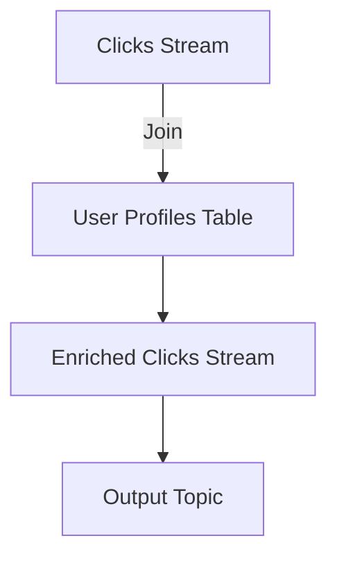

## 8.4 Joining Streams and Tables

### Introduction to Stream and Table Joins

In the realm of stream processing, joining streams and tables is a powerful technique that allows for the enrichment of data and the evaluation of complex events. Apache Kafka Streams provides robust support for performing joins, enabling developers to combine data from different sources in real-time. This section delves into the various types of joins available in Kafka Streams, their use cases, and how to implement them effectively.

### Understanding Joins in Stream Processing

Joins in stream processing are operations that combine records from two or more streams or between a stream and a table based on a related key. This operation is akin to SQL joins but is performed in a continuous, real-time manner. Joins can be categorized into several types, each serving different purposes and use cases.

#### Types of Joins

1. **Inner Join**: Combines records from two streams or a stream and a table where the keys match in both datasets. If a key does not exist in both, it is excluded from the result.

2. **Left Join**: Includes all records from the left stream or table and the matching records from the right. If no match is found, the result will include the left record with nulls for the right side.

3. **Right Join**: The opposite of a left join, it includes all records from the right stream or table and the matching records from the left. Non-matching records from the right will have nulls for the left side.

4. **Outer Join**: Combines all records from both streams or tables, filling in nulls where there are no matches. This join type is useful for ensuring that no data is lost during the join process.

### Use Cases for Each Join Type

- **Inner Join**: Ideal for scenarios where only complete records are needed, such as merging user activity logs with user profiles to generate comprehensive user behavior reports.

- **Left Join**: Useful when the primary dataset is the left stream or table, such as enriching a stream of transactions with optional customer data.

- **Right Join**: Applied when the primary dataset is the right stream or table, such as appending optional metadata to a stream of sensor readings.

- **Outer Join**: Suitable for data reconciliation tasks where all possible combinations are required, such as merging multiple data sources to create a unified view.

### Implementing Joins in Kafka Streams

Kafka Streams provides a straightforward API for implementing joins between streams and tables. Below are examples demonstrating how to perform these joins in Java, Scala, Kotlin, and Clojure.

#### Java Example

```java
import org.apache.kafka.streams.KafkaStreams;
import org.apache.kafka.streams.StreamsBuilder;
import org.apache.kafka.streams.kstream.KStream;
import org.apache.kafka.streams.kstream.KTable;
import org.apache.kafka.streams.kstream.Joined;
import org.apache.kafka.streams.kstream.Materialized;
import org.apache.kafka.streams.kstream.StreamJoined;

public class StreamTableJoinExample {
    public static void main(String[] args) {
        StreamsBuilder builder = new StreamsBuilder();

        // Stream of user clicks
        KStream<String, String> clicksStream = builder.stream("clicks");

        // Table of user profiles
        KTable<String, String> profilesTable = builder.table("user-profiles");

        // Inner join between stream and table
        KStream<String, String> enrichedClicks = clicksStream.join(
            profilesTable,
            (click, profile) -> click + ", " + profile,
            Joined.with(Serdes.String(), Serdes.String(), Serdes.String())
        );

        enrichedClicks.to("enriched-clicks");

        KafkaStreams streams = new KafkaStreams(builder.build(), new Properties());
        streams.start();
    }
}
```

#### Scala Example

```scala
import org.apache.kafka.streams.scala._
import org.apache.kafka.streams.scala.kstream._
import org.apache.kafka.streams.scala.Serdes._

object StreamTableJoinExample extends App {
  val builder = new StreamsBuilder()

  // Stream of user clicks
  val clicksStream: KStream[String, String] = builder.stream[String, String]("clicks")

  // Table of user profiles
  val profilesTable: KTable[String, String] = builder.table[String, String]("user-profiles")

  // Inner join between stream and table
  val enrichedClicks: KStream[String, String] = clicksStream.join(profilesTable)((click, profile) => s"$click, $profile")

  enrichedClicks.to("enriched-clicks")

  val streams = new KafkaStreams(builder.build(), new Properties())
  streams.start()
}
```

#### Kotlin Example

```kotlin
import org.apache.kafka.streams.KafkaStreams
import org.apache.kafka.streams.StreamsBuilder
import org.apache.kafka.streams.kstream.KStream
import org.apache.kafka.streams.kstream.KTable
import org.apache.kafka.streams.kstream.Joined
import org.apache.kafka.streams.kstream.Materialized

fun main() {
    val builder = StreamsBuilder()

    // Stream of user clicks
    val clicksStream: KStream<String, String> = builder.stream("clicks")

    // Table of user profiles
    val profilesTable: KTable<String, String> = builder.table("user-profiles")

    // Inner join between stream and table
    val enrichedClicks: KStream<String, String> = clicksStream.join(
        profilesTable,
        { click, profile -> "$click, $profile" },
        Joined.with(Serdes.String(), Serdes.String(), Serdes.String())
    )

    enrichedClicks.to("enriched-clicks")

    val streams = KafkaStreams(builder.build(), Properties())
    streams.start()
}
```

#### Clojure Example

```clojure
(require '[org.apache.kafka.streams StreamsBuilder KafkaStreams]
         '[org.apache.kafka.streams.kstream KStream KTable Joined])

(defn stream-table-join-example []
  (let [builder (StreamsBuilder.)]

    ;; Stream of user clicks
    (def clicks-stream (.stream builder "clicks"))

    ;; Table of user profiles
    (def profiles-table (.table builder "user-profiles"))

    ;; Inner join between stream and table
    (def enriched-clicks (.join clicks-stream profiles-table
                                (fn [click profile] (str click ", " profile))
                                (Joined/with (Serdes/String) (Serdes/String) (Serdes/String))))

    (.to enriched-clicks "enriched-clicks")

    (let [streams (KafkaStreams. (.build builder) (Properties.))]
      (.start streams))))
```

### Considerations for State Management and Performance

When implementing joins in Kafka Streams, it is crucial to consider state management and performance implications:

- **State Management**: Joins, especially those involving tables, require maintaining state. Kafka Streams uses state stores to manage this state, which can be backed by RocksDB or in-memory stores. Proper configuration of state stores is essential for efficient join operations.

- **Performance**: Joins can be resource-intensive, particularly outer joins that require maintaining large state stores. Optimize performance by tuning Kafka Streams configurations, such as buffer sizes and commit intervals, and by ensuring that state stores are appropriately sized and managed.

- **Windowing**: For stream-stream joins, consider using windowing to limit the scope of the join operation, reducing state size and improving performance.

- **Fault Tolerance**: Ensure that your Kafka Streams application is configured for fault tolerance, with proper replication of state stores and handling of rebalancing events.

### Visualizing Stream and Table Joins

To better understand the flow of data in stream and table joins, consider the following diagram:



**Caption**: This diagram illustrates the process of joining a clicks stream with a user profiles table to produce an enriched clicks stream, which is then written to an output topic.

### Real-World Scenarios

- **E-commerce**: Enriching transaction streams with customer data to provide personalized recommendations.
- **IoT**: Merging sensor data streams with metadata tables to enhance monitoring and alerting systems.
- **Finance**: Combining market data streams with historical data tables for real-time analytics and decision-making.

### Related Patterns

- **[8.1 Stateless vs. Stateful Stream Processing]( "Stateless vs. Stateful Stream Processing")**: Understanding the role of state in stream processing is crucial for implementing joins effectively.
- **[8.5 Pattern Detection and Complex Event Processing (CEP)]( "Pattern Detection and Complex Event Processing (CEP)")**: Joins are often used in CEP scenarios to detect complex patterns across multiple data streams.

### Conclusion

Joining streams and tables in Kafka Streams is a powerful technique for enriching data and enabling complex event processing. By understanding the different types of joins and their use cases, and by implementing them with careful consideration of state management and performance, developers can build robust, real-time data processing applications.

---

## Test Your Knowledge: Advanced Kafka Stream Joins Quiz



### What is the primary purpose of joining streams and tables in Kafka Streams?

- [x] To enrich data and evaluate complex events in real-time.
- [ ] To reduce data redundancy.
- [ ] To increase data throughput.
- [ ] To simplify data serialization.

> **Explanation:** Joining streams and tables allows for the enrichment of data and the evaluation of complex events in real-time, providing more comprehensive insights.

### Which type of join includes all records from the left stream and matching records from the right?

- [x] Left Join
- [ ] Right Join
- [ ] Inner Join
- [ ] Outer Join

> **Explanation:** A Left Join includes all records from the left stream or table and the matching records from the right, filling in nulls where there are no matches.

### What is a key consideration when implementing joins in Kafka Streams?

- [x] State management and performance optimization.
- [ ] Data compression techniques.
- [ ] Network latency reduction.
- [ ] Schema evolution.

> **Explanation:** Joins require maintaining state, which can impact performance. Proper state management and performance optimization are crucial.

### In which scenario would an Outer Join be most useful?

- [x] Data reconciliation tasks where all possible combinations are required.
- [ ] Merging user activity logs with user profiles.
- [ ] Enriching a stream of transactions with optional customer data.
- [ ] Appending optional metadata to a stream of sensor readings.

> **Explanation:** An Outer Join is suitable for data reconciliation tasks where all possible combinations are required, ensuring no data is lost.

### Which language is NOT shown in the code examples for implementing joins?

- [ ] Java
- [ ] Scala
- [ ] Kotlin
- [x] Python

> **Explanation:** The code examples provided are in Java, Scala, Kotlin, and Clojure, but not Python.

### What is the role of state stores in Kafka Streams joins?

- [x] To manage the state required for join operations.
- [ ] To compress data for efficient storage.
- [ ] To handle network communication.
- [ ] To serialize and deserialize data.

> **Explanation:** State stores manage the state required for join operations, ensuring that the necessary data is available for processing.

### What is a common use case for an Inner Join in stream processing?

- [x] Merging user activity logs with user profiles.
- [ ] Enriching a stream of transactions with optional customer data.
- [ ] Appending optional metadata to a stream of sensor readings.
- [ ] Data reconciliation tasks.

> **Explanation:** An Inner Join is ideal for scenarios where only complete records are needed, such as merging user activity logs with user profiles.

### How can performance be optimized when implementing joins in Kafka Streams?

- [x] By tuning Kafka Streams configurations and managing state stores efficiently.
- [ ] By increasing network bandwidth.
- [ ] By using more complex serialization formats.
- [ ] By reducing the number of partitions.

> **Explanation:** Performance can be optimized by tuning Kafka Streams configurations, such as buffer sizes and commit intervals, and by managing state stores efficiently.

### What is the benefit of using windowing in stream-stream joins?

- [x] It limits the scope of the join operation, reducing state size and improving performance.
- [ ] It increases the data throughput.
- [ ] It simplifies the join logic.
- [ ] It enhances data security.

> **Explanation:** Windowing limits the scope of the join operation, reducing the state size and improving performance by focusing on a specific time window.

### True or False: An Outer Join in Kafka Streams will exclude any records that do not have a matching key in both datasets.

- [ ] True
- [x] False

> **Explanation:** False. An Outer Join includes all records from both datasets, filling in nulls where there are no matches.


