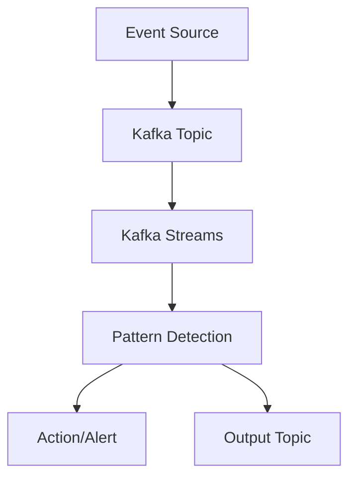

## 8.5.1 Introduction to CEP

### Understanding Complex Event Processing (CEP)

Complex Event Processing (CEP) is a sophisticated method of tracking and analyzing streams of information (or events) to identify meaningful patterns and derive actionable insights in real-time. As data flows through systems in the form of events, CEP enables the detection of complex patterns that can trigger automated responses or inform decision-making processes. This capability is crucial in environments where timely insights can lead to significant competitive advantages, such as in finance, IoT, and security.

### Defining CEP and Its Applications

**Complex Event Processing (CEP)** is a technology that allows for the real-time analysis of event data to identify patterns, correlations, and trends. It is particularly useful in scenarios where the volume, velocity, and variety of data are high, and where immediate action is required based on the insights derived from the data.

#### Key Applications of CEP

1. **Finance**: In the financial sector, CEP is used for real-time fraud detection, algorithmic trading, and risk management. By analyzing transaction streams, CEP can identify suspicious activities and trigger alerts or automated actions to mitigate risks.

2. **Internet of Things (IoT)**: CEP plays a critical role in IoT applications by processing data from sensors and devices to monitor conditions, detect anomalies, and optimize operations. For example, in smart cities, CEP can analyze traffic patterns to manage congestion and improve public safety.

3. **Security**: In cybersecurity, CEP is employed to detect threats and intrusions by analyzing logs and network traffic in real-time. It helps in identifying patterns indicative of security breaches and enables rapid response to mitigate potential damage.

4. **Healthcare**: CEP is used in healthcare for patient monitoring and alerting systems. By analyzing data from medical devices and electronic health records, CEP can detect critical conditions and alert healthcare providers for timely intervention.

### Types of Patterns Detected by CEP

CEP is capable of detecting various types of patterns, including:

- **Temporal Patterns**: These involve the timing and sequence of events. For example, detecting a series of failed login attempts within a short time frame could indicate a potential security breach.

- **Spatial Patterns**: These involve the location or distribution of events. For instance, detecting a cluster of temperature sensors reporting high readings in a specific area could indicate a fire hazard.

- **Causal Patterns**: These involve cause-and-effect relationships between events. For example, a sudden drop in stock prices followed by a surge in trading volume might suggest market manipulation.

- **Aggregation Patterns**: These involve summarizing data over a period, such as calculating the average temperature from multiple sensors to detect climate trends.

### Benefits of CEP in Real-Time Analytics

The primary benefit of CEP is its ability to provide real-time insights and enable proactive decision-making. By processing and analyzing data as it arrives, CEP allows organizations to:

- **Enhance Operational Efficiency**: By automating responses to detected patterns, CEP reduces the need for manual intervention and speeds up processes.

- **Improve Decision-Making**: Real-time insights enable better-informed decisions, allowing organizations to respond swiftly to changing conditions.

- **Increase Agility**: CEP allows organizations to adapt quickly to new opportunities and threats, providing a competitive edge in dynamic environments.

- **Reduce Costs**: By automating processes and reducing the need for manual monitoring, CEP can lead to significant cost savings.

### Real-World Examples of CEP

#### Finance

In the financial industry, CEP is used to monitor trading activities and detect patterns indicative of market manipulation or insider trading. For example, a CEP system might analyze trading volumes and price movements to identify unusual patterns that warrant further investigation.

#### IoT

In IoT applications, CEP can be used to monitor and control smart home devices. For instance, a CEP system might analyze data from motion sensors, temperature sensors, and security cameras to detect unusual activity and trigger alerts or automate responses, such as locking doors or adjusting thermostats.

#### Security

In cybersecurity, CEP is used to analyze network traffic and detect patterns indicative of cyber threats. For example, a CEP system might monitor login attempts, data transfers, and access logs to identify potential security breaches and trigger alerts for further investigation.

### Implementing CEP with Apache Kafka

Apache Kafka, with its robust stream processing capabilities, is an ideal platform for implementing CEP. Kafka's distributed architecture and scalability make it well-suited for handling the high volume and velocity of data required for CEP applications.

#### Kafka Streams API

The [Kafka Streams API]( "Kafka Streams API") provides a powerful framework for building real-time stream processing applications. It allows developers to define complex event patterns and process data in real-time, making it an excellent choice for implementing CEP.

#### Integration with Other Tools

Kafka can be integrated with other tools and frameworks to enhance CEP capabilities. For example, integrating Kafka with Apache Flink or Apache Spark can provide additional processing power and flexibility for complex event processing tasks.

### Code Examples

Below are examples of how to implement CEP using Apache Kafka in different programming languages.

#### Java Example

```java
import org.apache.kafka.streams.KafkaStreams;
import org.apache.kafka.streams.StreamsBuilder;
import org.apache.kafka.streams.kstream.KStream;

public class CEPExample {
    public static void main(String[] args) {
        StreamsBuilder builder = new StreamsBuilder();
        KStream<String, String> sourceStream = builder.stream("input-topic");

        // Define a pattern to detect
        KStream<String, String> patternStream = sourceStream.filter((key, value) -> value.contains("pattern"));

        patternStream.to("output-topic");

        KafkaStreams streams = new KafkaStreams(builder.build(), new Properties());
        streams.start();
    }
}
```

#### Scala Example

```scala
import org.apache.kafka.streams.scala._
import org.apache.kafka.streams.scala.kstream._

object CEPExample extends App {
  val builder = new StreamsBuilder()
  val sourceStream: KStream[String, String] = builder.stream[String, String]("input-topic")

  // Define a pattern to detect
  val patternStream: KStream[String, String] = sourceStream.filter((key, value) => value.contains("pattern"))

  patternStream.to("output-topic")

  val streams = new KafkaStreams(builder.build(), new Properties())
  streams.start()
}
```

#### Kotlin Example

```kotlin
import org.apache.kafka.streams.KafkaStreams
import org.apache.kafka.streams.StreamsBuilder
import org.apache.kafka.streams.kstream.KStream

fun main() {
    val builder = StreamsBuilder()
    val sourceStream: KStream<String, String> = builder.stream("input-topic")

    // Define a pattern to detect
    val patternStream = sourceStream.filter { _, value -> value.contains("pattern") }

    patternStream.to("output-topic")

    val streams = KafkaStreams(builder.build(), Properties())
    streams.start()
}
```

#### Clojure Example

```clojure
(ns cep-example
  (:require [org.apache.kafka.streams StreamsBuilder KafkaStreams]
            [org.apache.kafka.streams.kstream KStream]))

(defn -main []
  (let [builder (StreamsBuilder.)
        source-stream (.stream builder "input-topic")]

    ;; Define a pattern to detect
    (let [pattern-stream (.filter source-stream (fn [key value] (.contains value "pattern")))]
      (.to pattern-stream "output-topic"))

    (let [streams (KafkaStreams. (.build builder) (Properties.))]
      (.start streams))))
```

### Visualizing CEP with Kafka

To better understand how CEP works with Kafka, consider the following diagram illustrating a simple CEP architecture using Kafka Streams:



**Caption**: This diagram shows how events flow from the source to Kafka, where Kafka Streams processes them to detect patterns and trigger actions or alerts.

### Conclusion

Complex Event Processing is a powerful tool for real-time analytics, enabling organizations to detect patterns and derive insights from streams of events. By leveraging Apache Kafka and its ecosystem, developers can build scalable and efficient CEP solutions that drive operational efficiency and improve decision-making across various domains.

## Test Your Knowledge: Complex Event Processing in Apache Kafka



### What is the primary purpose of Complex Event Processing (CEP)?

- [x] To identify meaningful patterns within streams of events in real-time.
- [ ] To store large volumes of data for batch processing.
- [ ] To replace traditional databases.
- [ ] To provide a user interface for data visualization.

> **Explanation:** CEP is designed to analyze streams of events to detect patterns and derive insights in real-time, enabling timely decision-making.

### Which of the following is a common application of CEP in the financial sector?

- [x] Real-time fraud detection
- [ ] Batch data processing
- [ ] Static report generation
- [ ] Long-term data storage

> **Explanation:** CEP is used in finance for real-time fraud detection by analyzing transaction streams to identify suspicious activities.

### What type of pattern involves the timing and sequence of events?

- [x] Temporal Patterns
- [ ] Spatial Patterns
- [ ] Causal Patterns
- [ ] Aggregation Patterns

> **Explanation:** Temporal patterns involve the timing and sequence of events, such as detecting a series of failed login attempts within a short time frame.

### How does CEP benefit IoT applications?

- [x] By processing data from sensors to monitor conditions and detect anomalies in real-time.
- [ ] By storing sensor data for future analysis.
- [ ] By providing a user interface for device management.
- [ ] By replacing traditional IoT protocols.

> **Explanation:** CEP processes data from IoT sensors in real-time to monitor conditions, detect anomalies, and optimize operations.

### Which tool is commonly used with Kafka for building real-time stream processing applications?

- [x] Kafka Streams API
- [ ] Apache Hadoop
- [ ] Apache Cassandra
- [ ] MySQL

> **Explanation:** The Kafka Streams API is a powerful framework for building real-time stream processing applications with Kafka.

### What is a key benefit of using CEP in real-time analytics?

- [x] Enhancing operational efficiency by automating responses to detected patterns.
- [ ] Increasing data storage capacity.
- [ ] Simplifying data visualization.
- [ ] Reducing the need for data backups.

> **Explanation:** CEP enhances operational efficiency by automating responses to detected patterns, reducing the need for manual intervention.

### Which programming language is NOT shown in the code examples for implementing CEP with Kafka?

- [x] Python
- [ ] Java
- [ ] Scala
- [ ] Kotlin

> **Explanation:** The code examples provided are in Java, Scala, Kotlin, and Clojure, but not Python.

### What is the role of Kafka in implementing CEP?

- [x] Kafka provides a distributed platform for handling high-volume, high-velocity data streams required for CEP applications.
- [ ] Kafka is used for batch processing of historical data.
- [ ] Kafka replaces traditional databases in CEP applications.
- [ ] Kafka provides a graphical user interface for CEP.

> **Explanation:** Kafka's distributed architecture and scalability make it ideal for handling the high volume and velocity of data required for CEP applications.

### Which of the following is a type of pattern detected by CEP?

- [x] Causal Patterns
- [ ] Graphical Patterns
- [ ] Static Patterns
- [ ] Visual Patterns

> **Explanation:** Causal patterns involve cause-and-effect relationships between events, which CEP can detect.

### True or False: CEP can only be used in financial applications.

- [x] False
- [ ] True

> **Explanation:** CEP is versatile and can be used in various domains, including finance, IoT, security, and healthcare, among others.


