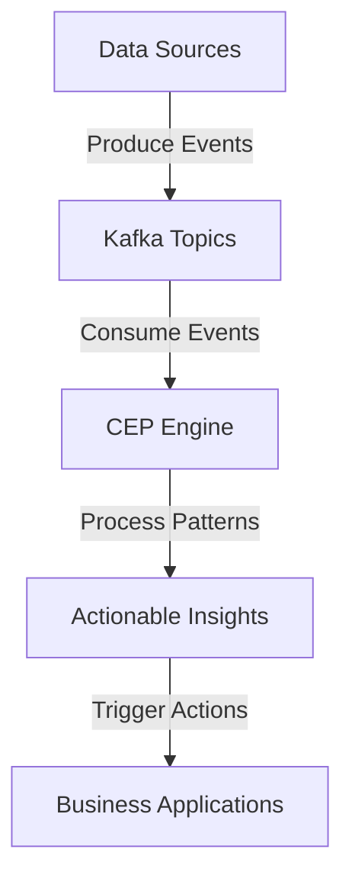

## 8.5.4 Real-World Applications of Complex Event Processing (CEP) with Kafka

Complex Event Processing (CEP) is a powerful paradigm for analyzing and acting on real-time data streams. By leveraging Apache Kafka, organizations can implement CEP to detect patterns, anomalies, and trends in data as they occur. This section explores real-world applications of CEP across various industries, highlighting the transformative impact on business outcomes and providing insights into lessons learned and success factors.

### Introduction to Complex Event Processing (CEP)

Complex Event Processing involves the continuous and incremental processing of event streams to identify meaningful patterns and derive actionable insights. CEP systems are designed to handle high-throughput data streams, making them ideal for applications that require real-time decision-making.

#### Key Concepts in CEP

- **Event Streams**: Continuous flow of data generated by various sources.
- **Patterns**: Specific sequences or combinations of events that are of interest.
- **Rules**: Logic applied to detect patterns and trigger actions.
- **Actions**: Responses or operations executed when patterns are detected.

### Real-World Applications of CEP

#### 1. Banking and Financial Services

In the banking and financial services industry, CEP is used to enhance fraud detection, improve customer experience, and optimize trading strategies.

##### Fraud Detection

**Case Study**: A leading bank implemented CEP to detect fraudulent transactions in real-time. By analyzing transaction patterns and comparing them against known fraud signatures, the bank was able to identify suspicious activities and prevent fraud before it occurred.

- **Impact**: Reduced fraud losses by 30% and improved customer trust.
- **Lessons Learned**: Integrating CEP with existing fraud detection systems requires careful planning and coordination. Real-time data enrichment and contextual information are critical for accurate fraud detection.

##### Customer Experience Enhancement

**Example**: Banks use CEP to monitor customer interactions across multiple channels (e.g., online banking, mobile apps, ATMs) and provide personalized offers and services.

- **Impact**: Increased customer engagement and satisfaction.
- **Success Factors**: Real-time data integration and the ability to process large volumes of data from diverse sources are essential for delivering timely and relevant customer experiences.

##### Algorithmic Trading

**Scenario**: Financial institutions leverage CEP to implement algorithmic trading strategies that react to market conditions in real-time.

- **Impact**: Improved trading performance and reduced latency in executing trades.
- **Key Considerations**: Low-latency data processing and the ability to handle high-frequency data streams are crucial for successful algorithmic trading.

#### 2. Telecommunications

In the telecommunications industry, CEP is used to monitor network performance, optimize resource allocation, and enhance customer service.

##### Network Performance Monitoring

**Case Study**: A major telecom operator deployed CEP to monitor network traffic and detect anomalies that could indicate potential service disruptions.

- **Impact**: Improved network reliability and reduced downtime.
- **Lessons Learned**: Effective anomaly detection requires a combination of historical data analysis and real-time monitoring. Machine learning models can enhance the accuracy of anomaly detection.

##### Resource Optimization

**Example**: Telecom companies use CEP to dynamically allocate network resources based on real-time demand and usage patterns.

- **Impact**: Enhanced network efficiency and reduced operational costs.
- **Success Factors**: Real-time data processing and predictive analytics are key to optimizing resource allocation and ensuring service quality.

##### Customer Service Enhancement

**Scenario**: CEP is used to analyze customer interactions and network usage to proactively address service issues and improve customer satisfaction.

- **Impact**: Increased customer retention and reduced churn.
- **Key Considerations**: Integrating CEP with customer relationship management (CRM) systems enables a holistic view of customer interactions and facilitates proactive service management.

#### 3. Energy and Utilities

In the energy and utilities sector, CEP is applied to monitor grid performance, optimize energy consumption, and support renewable energy integration.

##### Grid Performance Monitoring

**Case Study**: An energy provider implemented CEP to monitor the electrical grid and detect faults or inefficiencies in real-time.

- **Impact**: Enhanced grid reliability and reduced maintenance costs.
- **Lessons Learned**: Real-time data collection from smart meters and sensors is essential for accurate grid monitoring. Collaboration with grid operators and stakeholders is crucial for effective fault detection and resolution.

##### Energy Consumption Optimization

**Example**: Utilities use CEP to analyze energy consumption patterns and provide customers with insights and recommendations for reducing energy usage.

- **Impact**: Lower energy costs for consumers and improved energy efficiency.
- **Success Factors**: Real-time data processing and integration with smart home devices enable personalized energy-saving recommendations.

##### Renewable Energy Integration

**Scenario**: CEP is used to manage the integration of renewable energy sources into the grid by balancing supply and demand in real-time.

- **Impact**: Increased use of renewable energy and reduced reliance on fossil fuels.
- **Key Considerations**: Real-time data processing and predictive analytics are essential for managing the variability of renewable energy sources and ensuring grid stability.

### Implementing CEP with Apache Kafka

Apache Kafka serves as a robust platform for implementing CEP due to its ability to handle high-throughput data streams and provide real-time data processing capabilities. By integrating Kafka with CEP engines, organizations can build scalable and fault-tolerant systems that deliver actionable insights in real-time.

#### Kafka's Role in CEP

- **Data Ingestion**: Kafka efficiently ingests data from various sources, providing a unified platform for processing event streams.
- **Scalability**: Kafka's distributed architecture allows for horizontal scaling, enabling the processing of large volumes of data.
- **Fault Tolerance**: Kafka's replication and partitioning mechanisms ensure data availability and reliability.

#### Integrating Kafka with CEP Engines

To implement CEP with Kafka, organizations can integrate Kafka with CEP engines such as Apache Flink, Apache Storm, or Esper. These engines provide the necessary tools for defining and executing complex event processing rules.

##### Example Integration with Apache Flink

Apache Flink is a popular choice for CEP due to its support for event-time processing and stateful computations. By integrating Flink with Kafka, organizations can build powerful CEP applications that process data in real-time.

**Java Example**:

```java
import org.apache.flink.streaming.api.environment.StreamExecutionEnvironment;
import org.apache.flink.streaming.connectors.kafka.FlinkKafkaConsumer;
import org.apache.flink.streaming.api.datastream.DataStream;
import org.apache.flink.streaming.api.windowing.time.Time;
import org.apache.flink.streaming.api.windowing.assigners.TumblingEventTimeWindows;
import org.apache.flink.streaming.api.functions.windowing.ProcessWindowFunction;
import org.apache.flink.util.Collector;

public class CEPExample {
    public static void main(String[] args) throws Exception {
        StreamExecutionEnvironment env = StreamExecutionEnvironment.getExecutionEnvironment();

        FlinkKafkaConsumer<String> kafkaConsumer = new FlinkKafkaConsumer<>(
                "input-topic",
                new SimpleStringSchema(),
                properties);

        DataStream<String> stream = env.addSource(kafkaConsumer);

        stream
            .keyBy(value -> value)
            .window(TumblingEventTimeWindows.of(Time.seconds(10)))
            .process(new ProcessWindowFunction<String, String, String, TimeWindow>() {
                @Override
                public void process(String key, Context context, Iterable<String> elements, Collector<String> out) {
                    // Implement CEP logic here
                    out.collect("Processed event for key: " + key);
                }
            });

        env.execute("CEP Example");
    }
}
```

**Scala Example**:

```scala
import org.apache.flink.streaming.api.scala._
import org.apache.flink.streaming.connectors.kafka.FlinkKafkaConsumer
import org.apache.flink.streaming.api.windowing.time.Time
import org.apache.flink.streaming.api.windowing.assigners.TumblingEventTimeWindows

object CEPExample {
  def main(args: Array[String]): Unit = {
    val env = StreamExecutionEnvironment.getExecutionEnvironment

    val kafkaConsumer = new FlinkKafkaConsumer[String](
      "input-topic",
      new SimpleStringSchema(),
      properties)

    val stream = env.addSource(kafkaConsumer)

    stream
      .keyBy(value => value)
      .window(TumblingEventTimeWindows.of(Time.seconds(10)))
      .process(new ProcessWindowFunction[String, String, String, TimeWindow] {
        override def process(key: String, context: Context, elements: Iterable[String], out: Collector[String]): Unit = {
          // Implement CEP logic here
          out.collect(s"Processed event for key: $key")
        }
      })

    env.execute("CEP Example")
  }
}
```

**Kotlin Example**:

```kotlin
import org.apache.flink.streaming.api.environment.StreamExecutionEnvironment
import org.apache.flink.streaming.connectors.kafka.FlinkKafkaConsumer
import org.apache.flink.streaming.api.windowing.time.Time
import org.apache.flink.streaming.api.windowing.assigners.TumblingEventTimeWindows

fun main() {
    val env = StreamExecutionEnvironment.getExecutionEnvironment()

    val kafkaConsumer = FlinkKafkaConsumer<String>(
        "input-topic",
        SimpleStringSchema(),
        properties
    )

    val stream = env.addSource(kafkaConsumer)

    stream
        .keyBy { it }
        .window(TumblingEventTimeWindows.of(Time.seconds(10)))
        .process(object : ProcessWindowFunction<String, String, String, TimeWindow>() {
            override fun process(key: String, context: Context, elements: Iterable<String>, out: Collector<String>) {
                // Implement CEP logic here
                out.collect("Processed event for key: $key")
            }
        })

    env.execute("CEP Example")
}
```

**Clojure Example**:

```clojure
(ns cep-example
  (:import [org.apache.flink.streaming.api.environment StreamExecutionEnvironment]
           [org.apache.flink.streaming.connectors.kafka FlinkKafkaConsumer]
           [org.apache.flink.streaming.api.windowing.time Time]
           [org.apache.flink.streaming.api.windowing.assigners TumblingEventTimeWindows]))

(defn -main [& args]
  (let [env (StreamExecutionEnvironment/getExecutionEnvironment)
        kafka-consumer (FlinkKafkaConsumer. "input-topic" (SimpleStringSchema.) properties)
        stream (.addSource env kafka-consumer)]

    (-> stream
        (.keyBy identity)
        (.window (TumblingEventTimeWindows/of (Time/seconds 10)))
        (.process (reify ProcessWindowFunction
                    (process [this key context elements out]
                      ;; Implement CEP logic here
                      (.collect out (str "Processed event for key: " key))))))

    (.execute env "CEP Example")))
```

### Visualizing CEP with Kafka

To better understand the integration of CEP with Kafka, consider the following diagram illustrating the data flow in a typical CEP application.



**Caption**: The diagram illustrates the flow of data from sources to Kafka topics, where events are consumed by the CEP engine. The engine processes patterns and generates actionable insights, which trigger actions in business applications.

### Lessons Learned and Success Factors

Implementing CEP with Kafka requires careful consideration of various factors to ensure success. Here are some key lessons learned and success factors:

- **Data Quality**: Ensure high-quality data input to improve the accuracy of pattern detection and decision-making.
- **Scalability**: Design the system to handle increasing data volumes and processing demands.
- **Integration**: Seamlessly integrate CEP with existing systems and data sources to maximize value.
- **Monitoring and Alerting**: Implement robust monitoring and alerting mechanisms to detect and respond to issues promptly.
- **Collaboration**: Foster collaboration between technical teams and business stakeholders to align CEP initiatives with organizational goals.

### Conclusion

Complex Event Processing with Apache Kafka offers significant benefits across various industries by enabling real-time data analysis and decision-making. By understanding the real-world applications and success factors, organizations can effectively implement CEP to drive business outcomes and gain a competitive edge.

## Test Your Knowledge: Real-World Applications of CEP Quiz



### What is a primary benefit of using CEP in banking for fraud detection?

- [x] Real-time detection of suspicious activities
- [ ] Reduced data storage costs
- [ ] Increased transaction speed
- [ ] Improved user interface design

> **Explanation:** CEP allows for real-time analysis of transaction patterns, enabling the detection of suspicious activities as they occur, which is crucial for preventing fraud.

### How does CEP enhance customer experience in the telecommunications industry?

- [x] By analyzing customer interactions and providing personalized services
- [ ] By reducing the number of customer service representatives
- [ ] By increasing the number of available channels
- [ ] By improving the design of mobile apps

> **Explanation:** CEP analyzes customer interactions across multiple channels, allowing telecom companies to provide personalized services and improve customer satisfaction.

### In the energy sector, what role does CEP play in renewable energy integration?

- [x] Balancing supply and demand in real-time
- [ ] Increasing fossil fuel consumption
- [ ] Reducing the number of power plants
- [ ] Enhancing the aesthetics of solar panels

> **Explanation:** CEP helps manage the integration of renewable energy sources by balancing supply and demand in real-time, ensuring grid stability.

### What is a key consideration when implementing CEP for algorithmic trading?

- [x] Low-latency data processing
- [ ] High data storage capacity
- [ ] Complex user interfaces
- [ ] Increased number of trading terminals

> **Explanation:** Low-latency data processing is crucial for algorithmic trading to react to market conditions in real-time and execute trades efficiently.

### Which of the following is a success factor for implementing CEP with Kafka?

- [x] Seamless integration with existing systems
- [ ] Increased number of data sources
- [ ] Reduced data processing speed
- [ ] Complex data visualization tools

> **Explanation:** Seamless integration with existing systems ensures that CEP initiatives are aligned with organizational goals and maximize value.

### What is a common lesson learned from deploying CEP in telecommunications?

- [x] Effective anomaly detection requires a combination of historical data analysis and real-time monitoring
- [ ] Anomaly detection is not necessary for network performance
- [ ] Historical data analysis is sufficient for anomaly detection
- [ ] Real-time monitoring is not needed for anomaly detection

> **Explanation:** Effective anomaly detection requires both historical data analysis and real-time monitoring to accurately identify potential service disruptions.

### How does CEP contribute to energy consumption optimization?

- [x] By analyzing consumption patterns and providing recommendations
- [ ] By increasing energy prices
- [ ] By reducing the number of smart meters
- [ ] By enhancing the design of power lines

> **Explanation:** CEP analyzes energy consumption patterns and provides customers with insights and recommendations for reducing energy usage, leading to lower costs and improved efficiency.

### What is a critical factor for successful fraud detection using CEP in banking?

- [x] Real-time data enrichment and contextual information
- [ ] Increased number of bank branches
- [ ] Complex transaction interfaces
- [ ] Reduced number of customer accounts

> **Explanation:** Real-time data enrichment and contextual information are critical for accurate fraud detection, allowing banks to identify suspicious activities effectively.

### Which CEP engine is commonly integrated with Kafka for real-time data processing?

- [x] Apache Flink
- [ ] Apache Hadoop
- [ ] Apache Cassandra
- [ ] Apache HBase

> **Explanation:** Apache Flink is commonly integrated with Kafka for real-time data processing due to its support for event-time processing and stateful computations.

### True or False: CEP with Kafka can only be applied in the banking industry.

- [ ] True
- [x] False

> **Explanation:** CEP with Kafka is applicable across various industries, including banking, telecommunications, energy, and more, providing real-time data analysis and decision-making capabilities.


