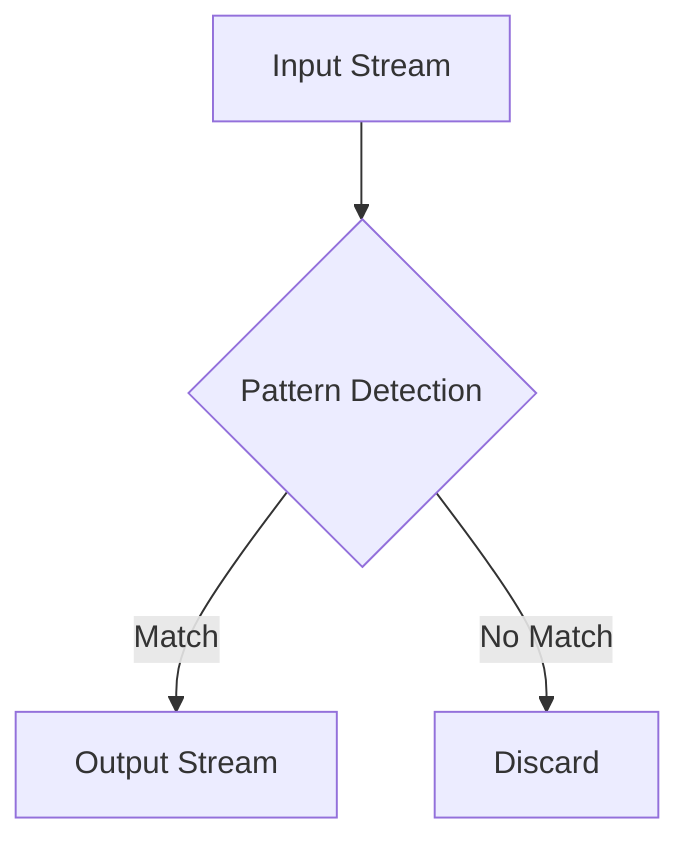

## 8.5.5 Challenges and Best Practices in Complex Event Processing (CEP)

Complex Event Processing (CEP) is a powerful paradigm for analyzing and acting on real-time data streams. It enables the detection of patterns and relationships in data, allowing systems to respond to events as they occur. However, implementing CEP effectively presents several challenges, including managing high throughput, handling complex patterns, and optimizing resource utilization. This section explores these challenges and provides best practices to overcome them, ensuring efficient and scalable CEP applications.

### Understanding the Challenges in CEP

#### High Throughput

One of the primary challenges in CEP is handling high throughput. As data volumes increase, the system must process events quickly to maintain real-time responsiveness. This requires efficient data ingestion, processing, and output mechanisms.

- **Challenge**: Ensuring the system can handle large volumes of data without latency.
- **Solution**: Optimize data ingestion pipelines and use efficient data structures for processing.

#### Complex Patterns

CEP involves detecting complex patterns in data streams, which can be computationally intensive. Patterns may involve temporal relationships, aggregations, and correlations across multiple data streams.

- **Challenge**: Designing pattern detection algorithms that are both accurate and efficient.
- **Solution**: Use stateful processing and windowing techniques to manage complexity.

#### Resource Utilization

Efficient resource utilization is critical for CEP systems, which must balance processing power, memory, and storage to achieve optimal performance.

- **Challenge**: Managing resources effectively to prevent bottlenecks and ensure scalability.
- **Solution**: Implement dynamic resource allocation and load balancing strategies.

### Best Practices for Efficient Pattern Matching

#### Use of Stateful Processing

Stateful processing allows CEP systems to maintain context across events, enabling more sophisticated pattern detection.

- **Best Practice**: Leverage state stores to manage state efficiently and ensure fault tolerance.
- **Example**: Use Kafka Streams' stateful transformations to maintain state across windows.

#### Windowing Techniques

Windowing is essential for managing temporal patterns in data streams. It allows systems to group events based on time or event count.

- **Best Practice**: Choose the appropriate windowing strategy (tumbling, sliding, session) based on the pattern requirements.
- **Example**: Implement tumbling windows for fixed-interval aggregations and sliding windows for continuous monitoring.

#### Efficient Data Structures

Selecting the right data structures can significantly impact the performance of pattern matching algorithms.

- **Best Practice**: Use data structures that support fast lookups and updates, such as hash maps and trees.
- **Example**: Implement a trie data structure for efficient pattern matching in text streams.

### Monitoring and Debugging CEP Applications

#### Real-Time Monitoring

Monitoring is crucial for maintaining the health and performance of CEP applications. It involves tracking key metrics and identifying anomalies.

- **Best Practice**: Use monitoring tools like Prometheus and Grafana to visualize metrics and set up alerts.
- **Example**: Monitor event processing latency and throughput to detect performance issues.

#### Debugging Techniques

Debugging CEP applications can be challenging due to the complexity of event flows and state management.

- **Best Practice**: Use logging and tracing tools to capture detailed information about event processing.
- **Example**: Implement distributed tracing with tools like Jaeger to trace event flows across components.

### Recommendations for Scalability and Maintainability

#### Scalability Strategies

Scalability is essential for CEP systems to handle growing data volumes and user demands.

- **Best Practice**: Use horizontal scaling to add more processing nodes as needed.
- **Example**: Deploy Kafka Streams applications in a Kubernetes cluster to leverage auto-scaling capabilities.

#### Maintainability Practices

Maintaining CEP applications involves managing code complexity and ensuring ease of updates.

- **Best Practice**: Use modular design patterns and code organization techniques to simplify maintenance.
- **Example**: Implement microservices architecture to isolate components and facilitate independent updates.

### Code Examples

To illustrate these concepts, let's explore code examples in Java, Scala, Kotlin, and Clojure for implementing a simple CEP application using Kafka Streams.

#### Java Example

```java
import org.apache.kafka.streams.KafkaStreams;
import org.apache.kafka.streams.StreamsBuilder;
import org.apache.kafka.streams.kstream.KStream;
import org.apache.kafka.streams.kstream.Predicate;

public class CepExample {
    public static void main(String[] args) {
        StreamsBuilder builder = new StreamsBuilder();
        KStream<String, String> sourceStream = builder.stream("input-topic");

        Predicate<String, String> patternPredicate = (key, value) -> value.contains("pattern");

        KStream<String, String> filteredStream = sourceStream.filter(patternPredicate);
        filteredStream.to("output-topic");

        KafkaStreams streams = new KafkaStreams(builder.build(), getKafkaProperties());
        streams.start();
    }

    private static Properties getKafkaProperties() {
        Properties props = new Properties();
        props.put("application.id", "cep-example");
        props.put("bootstrap.servers", "localhost:9092");
        return props;
    }
}
```

#### Scala Example

```scala
import org.apache.kafka.streams.scala._
import org.apache.kafka.streams.scala.kstream._
import org.apache.kafka.streams.{KafkaStreams, StreamsConfig}

object CepExample extends App {
  val builder = new StreamsBuilder()
  val sourceStream: KStream[String, String] = builder.stream[String, String]("input-topic")

  val patternPredicate: (String, String) => Boolean = (key, value) => value.contains("pattern")

  val filteredStream: KStream[String, String] = sourceStream.filter(patternPredicate)
  filteredStream.to("output-topic")

  val streams = new KafkaStreams(builder.build(), getKafkaProperties)
  streams.start()

  def getKafkaProperties: java.util.Properties = {
    val props = new java.util.Properties()
    props.put(StreamsConfig.APPLICATION_ID_CONFIG, "cep-example")
    props.put(StreamsConfig.BOOTSTRAP_SERVERS_CONFIG, "localhost:9092")
    props
  }
}
```

#### Kotlin Example

```kotlin
import org.apache.kafka.streams.KafkaStreams
import org.apache.kafka.streams.StreamsBuilder
import org.apache.kafka.streams.kstream.KStream

fun main() {
    val builder = StreamsBuilder()
    val sourceStream: KStream<String, String> = builder.stream("input-topic")

    val patternPredicate = { _: String, value: String -> value.contains("pattern") }

    val filteredStream = sourceStream.filter(patternPredicate)
    filteredStream.to("output-topic")

    val streams = KafkaStreams(builder.build(), getKafkaProperties())
    streams.start()
}

fun getKafkaProperties(): Properties {
    val props = Properties()
    props["application.id"] = "cep-example"
    props["bootstrap.servers"] = "localhost:9092"
    return props
}
```

#### Clojure Example

```clojure
(ns cep-example
  (:import [org.apache.kafka.streams KafkaStreams StreamsBuilder]
           [org.apache.kafka.streams.kstream KStream]))

(defn -main []
  (let [builder (StreamsBuilder.)
        source-stream (.stream builder "input-topic")
        pattern-predicate (reify Predicate
                            (test [_ key value]
                              (.contains value "pattern")))]
    (-> source-stream
        (.filter pattern-predicate)
        (.to "output-topic"))

    (let [streams (KafkaStreams. (.build builder) (get-kafka-properties))]
      (.start streams))))

(defn get-kafka-properties []
  (doto (java.util.Properties.)
    (.put "application.id" "cep-example")
    (.put "bootstrap.servers" "localhost:9092")))
```

### Visualizing CEP Patterns

To better understand the flow of events in a CEP application, consider the following diagram illustrating a simple pattern detection process:



**Caption**: This diagram represents a basic CEP pattern detection process where events from an input stream are evaluated against a pattern. Matching events are sent to an output stream, while non-matching events are discarded.

### Key Takeaways

- **High Throughput**: Optimize data ingestion and processing to handle large volumes of data efficiently.
- **Complex Patterns**: Use stateful processing and windowing techniques to manage pattern complexity.
- **Resource Utilization**: Implement dynamic resource allocation and load balancing to optimize resource use.
- **Monitoring and Debugging**: Employ real-time monitoring and distributed tracing to maintain application health and performance.
- **Scalability and Maintainability**: Use horizontal scaling and modular design patterns to ensure scalability and ease of maintenance.

### References and Further Reading

- [Apache Kafka Documentation](https://kafka.apache.org/documentation/)
- [Confluent Documentation](https://docs.confluent.io/)
- [Kafka Streams API](https://kafka.apache.org/documentation/streams/)

## Test Your Knowledge: Challenges and Best Practices in CEP



### What is a primary challenge in implementing CEP?

- [x] Handling high throughput
- [ ] Managing low latency
- [ ] Ensuring data redundancy
- [ ] Simplifying data structures

> **Explanation:** Handling high throughput is a significant challenge in CEP due to the need to process large volumes of data quickly.

### Which technique is essential for managing temporal patterns in CEP?

- [x] Windowing
- [ ] Sharding
- [ ] Caching
- [ ] Indexing

> **Explanation:** Windowing is crucial for managing temporal patterns by grouping events based on time or event count.

### What is a best practice for monitoring CEP applications?

- [x] Use real-time monitoring tools like Prometheus
- [ ] Implement batch processing
- [ ] Use static resource allocation
- [ ] Avoid logging

> **Explanation:** Real-time monitoring tools like Prometheus help track key metrics and identify anomalies in CEP applications.

### What is the benefit of using stateful processing in CEP?

- [x] It allows maintaining context across events
- [ ] It reduces memory usage
- [ ] It simplifies code complexity
- [ ] It eliminates the need for windowing

> **Explanation:** Stateful processing enables maintaining context across events, allowing for more sophisticated pattern detection.

### Which strategy is recommended for scaling CEP applications?

- [x] Horizontal scaling
- [ ] Vertical scaling
- [ ] Static scaling
- [ ] Manual scaling

> **Explanation:** Horizontal scaling involves adding more processing nodes, which is effective for scaling CEP applications.

### What is the role of efficient data structures in CEP?

- [x] They support fast lookups and updates
- [ ] They reduce network latency
- [ ] They simplify debugging
- [ ] They increase data redundancy

> **Explanation:** Efficient data structures support fast lookups and updates, which is crucial for performance in CEP.

### Which tool is recommended for distributed tracing in CEP applications?

- [x] Jaeger
- [ ] Hadoop
- [ ] Cassandra
- [ ] Redis

> **Explanation:** Jaeger is a tool used for distributed tracing, helping trace event flows across components in CEP applications.

### What is a common challenge in debugging CEP applications?

- [x] Complexity of event flows and state management
- [ ] Lack of data redundancy
- [ ] High memory usage
- [ ] Low throughput

> **Explanation:** The complexity of event flows and state management makes debugging CEP applications challenging.

### What is a key takeaway for resource utilization in CEP?

- [x] Implement dynamic resource allocation
- [ ] Use static resource allocation
- [ ] Avoid load balancing
- [ ] Increase data redundancy

> **Explanation:** Dynamic resource allocation helps optimize resource use and prevent bottlenecks in CEP applications.

### True or False: Modular design patterns simplify the maintenance of CEP applications.

- [x] True
- [ ] False

> **Explanation:** Modular design patterns help simplify the maintenance of CEP applications by organizing code into manageable components.


