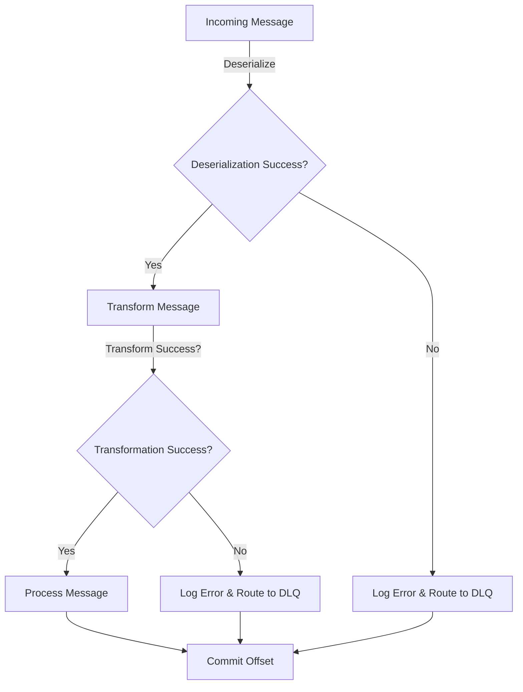

## 8.6.1 Strategies for Handling Processing Failures

In the realm of stream processing with Apache Kafka, handling processing failures is crucial for maintaining the reliability and resilience of your data pipelines. This section delves into advanced strategies for managing processing failures, ensuring minimal disruption to your streaming applications. We will explore retry mechanisms, backoff strategies, and techniques for handling deserialization errors and transformation failures, accompanied by practical code examples in Java, Scala, Kotlin, and Clojure.

### Understanding Processing Failures

Processing failures in Kafka streams can occur due to various reasons, including network issues, data corruption, or application logic errors. These failures can lead to data loss, inconsistent state, or application downtime if not handled properly. Therefore, implementing robust error handling strategies is essential for building resilient stream processing applications.

#### Common Causes of Processing Failures

1. **Network Failures**: Temporary network issues can cause message delivery failures.
2. **Data Corruption**: Malformed data can lead to deserialization errors.
3. **Application Logic Errors**: Bugs in transformation logic can cause processing to fail.
4. **Resource Constraints**: Insufficient memory or CPU can lead to processing bottlenecks.

### Retry Mechanisms and Backoff Strategies

Retry mechanisms are a fundamental approach to handling transient failures. By retrying failed operations, you can often recover from temporary issues without manual intervention. However, indiscriminate retries can exacerbate problems, so it's crucial to implement intelligent backoff strategies.

#### Implementing Retry Mechanisms

Retry mechanisms involve reattempting a failed operation after a certain interval. The key is to balance between retrying too aggressively and waiting too long, which can delay recovery.

- **Fixed Retry Interval**: Retry the operation at a constant interval.
- **Exponential Backoff**: Increase the wait time exponentially after each failure.
- **Jitter**: Add randomness to the backoff interval to prevent thundering herd problems.

##### Java Example: Exponential Backoff

```java
import java.util.concurrent.TimeUnit;

public class RetryHandler {

    private static final int MAX_RETRIES = 5;
    private static final long INITIAL_BACKOFF = 100; // milliseconds

    public void processWithRetry(Runnable task) {
        int attempt = 0;
        while (attempt < MAX_RETRIES) {
            try {
                task.run();
                return; // Success
            } catch (Exception e) {
                attempt++;
                long backoff = INITIAL_BACKOFF * (1L << attempt);
                try {
                    TimeUnit.MILLISECONDS.sleep(backoff);
                } catch (InterruptedException ie) {
                    Thread.currentThread().interrupt();
                }
            }
        }
        throw new RuntimeException("Max retries exceeded");
    }
}
```

##### Scala Example: Exponential Backoff

```scala
import scala.concurrent.duration._
import scala.util.control.NonFatal

object RetryHandler {

  val MaxRetries = 5
  val InitialBackoff = 100.milliseconds

  def processWithRetry(task: () => Unit): Unit = {
    var attempt = 0
    while (attempt < MaxRetries) {
      try {
        task()
        return // Success
      } catch {
        case NonFatal(e) =>
          attempt += 1
          val backoff = InitialBackoff * math.pow(2, attempt).toLong
          Thread.sleep(backoff.toMillis)
      }
    }
    throw new RuntimeException("Max retries exceeded")
  }
}
```

#### When to Skip or Halt Processing

In some cases, it may be more appropriate to skip processing a particular message or halt the entire processing pipeline. This decision depends on the nature of the error and the criticality of the data.

- **Skip Processing**: If a message is malformed or irrelevant, you may choose to skip it and continue processing subsequent messages.
- **Halt Processing**: For critical errors that could lead to data corruption or inconsistent state, halting the pipeline may be necessary until the issue is resolved.

### Handling Deserialization Errors

Deserialization errors occur when the incoming data cannot be converted into the expected format. These errors are common when dealing with heterogeneous data sources or evolving data schemas.

#### Strategies for Handling Deserialization Errors

1. **Schema Validation**: Use schema validation tools to ensure data conforms to expected formats.
2. **Fallback Mechanisms**: Implement fallback logic to handle unexpected data formats gracefully.
3. **Logging and Monitoring**: Log deserialization errors for further analysis and monitoring.

##### Kotlin Example: Handling Deserialization Errors

```kotlin
import org.apache.kafka.common.serialization.Deserializer

class SafeDeserializer<T>(private val delegate: Deserializer<T>) : Deserializer<T> {

    override fun deserialize(topic: String, data: ByteArray?): T? {
        return try {
            delegate.deserialize(topic, data)
        } catch (e: Exception) {
            // Log the error and return null or a default value
            println("Deserialization error: ${e.message}")
            null
        }
    }
}
```

### Transformation Failures

Transformation failures occur when the logic applied to transform the data fails, often due to unexpected data values or logic errors.

#### Strategies for Handling Transformation Failures

1. **Validation**: Validate input data before applying transformations.
2. **Fallback Logic**: Implement fallback logic to handle transformation failures.
3. **Dead Letter Queues**: Route problematic messages to a dead letter queue for later analysis.

##### Clojure Example: Handling Transformation Failures

```clojure
(defn safe-transform [transform-fn data]
  (try
    (transform-fn data)
    (catch Exception e
      (println "Transformation error:" (.getMessage e))
      nil))) ;; Return nil or handle the error appropriately
```

### Dead Letter Queues

Dead letter queues (DLQs) are a powerful mechanism for handling messages that cannot be processed successfully. By routing failed messages to a DLQ, you can ensure that they are not lost and can be analyzed or reprocessed later.

#### Implementing Dead Letter Queues

1. **Configure DLQs**: Set up a dedicated Kafka topic to act as the DLQ.
2. **Route Failed Messages**: Modify your processing logic to route failed messages to the DLQ.
3. **Monitor and Analyze**: Regularly monitor the DLQ and analyze the messages to identify patterns or recurring issues.

### Practical Applications and Real-World Scenarios

Handling processing failures effectively is crucial in various real-world scenarios, such as:

- **Financial Services**: Ensuring accurate transaction processing and fraud detection.
- **IoT Applications**: Processing sensor data reliably in real-time.
- **E-commerce**: Maintaining consistent inventory and order processing.

### Visualizing Error Handling Strategies

To better understand the flow of error handling strategies, consider the following diagram illustrating the process of handling processing failures in a Kafka stream processing application:



**Caption**: This diagram illustrates the flow of handling processing failures, including deserialization and transformation errors, and routing failed messages to a dead letter queue.

### Key Takeaways

- Implement retry mechanisms with intelligent backoff strategies to handle transient failures.
- Decide when to skip or halt processing based on the nature and criticality of the error.
- Use schema validation and fallback mechanisms to handle deserialization errors.
- Implement validation and fallback logic to manage transformation failures.
- Utilize dead letter queues to capture and analyze failed messages for later reprocessing.

## Test Your Knowledge: Advanced Kafka Error Handling Strategies Quiz



### What is the primary purpose of implementing retry mechanisms in Kafka stream processing?

- [x] To recover from transient failures without manual intervention.
- [ ] To permanently fix data corruption issues.
- [ ] To increase processing speed.
- [ ] To reduce network latency.

> **Explanation:** Retry mechanisms help recover from temporary issues, such as network failures, without requiring manual intervention.

### Which strategy involves increasing the wait time exponentially after each failure?

- [x] Exponential Backoff
- [ ] Fixed Retry Interval
- [ ] Jitter
- [ ] Circuit Breaker

> **Explanation:** Exponential backoff increases the wait time exponentially after each failure, helping to reduce the load on the system.

### When should you consider halting processing in a Kafka stream application?

- [x] When critical errors could lead to data corruption.
- [ ] When a single message fails to deserialize.
- [ ] When network latency is high.
- [ ] When processing speed is slow.

> **Explanation:** Halting processing is necessary when critical errors could lead to data corruption or inconsistent state.

### What is a common cause of deserialization errors in Kafka streams?

- [x] Malformed data
- [ ] Network latency
- [ ] High CPU usage
- [ ] Insufficient memory

> **Explanation:** Deserialization errors often occur due to malformed data that cannot be converted into the expected format.

### Which of the following is a strategy for handling transformation failures?

- [x] Validation
- [ ] Increasing CPU resources
- [ ] Reducing network latency
- [ ] Using fixed retry intervals

> **Explanation:** Validation is a strategy for handling transformation failures by ensuring input data is correct before applying transformations.

### What is the purpose of a dead letter queue in Kafka?

- [x] To capture and analyze failed messages for later reprocessing.
- [ ] To increase processing speed.
- [ ] To reduce network latency.
- [ ] To permanently delete failed messages.

> **Explanation:** A dead letter queue captures failed messages, allowing them to be analyzed and reprocessed later.

### How can you handle deserialization errors in Kafka?

- [x] Use schema validation tools.
- [ ] Increase network bandwidth.
- [x] Implement fallback logic.
- [ ] Reduce CPU usage.

> **Explanation:** Schema validation tools and fallback logic help handle deserialization errors by ensuring data conforms to expected formats and handling unexpected data gracefully.

### What is the benefit of adding jitter to backoff intervals?

- [x] To prevent thundering herd problems.
- [ ] To increase processing speed.
- [ ] To reduce data corruption.
- [ ] To improve network latency.

> **Explanation:** Adding jitter to backoff intervals helps prevent thundering herd problems by introducing randomness to the wait time.

### Which language is used in the provided example for handling transformation failures?

- [x] Clojure
- [ ] Java
- [ ] Scala
- [ ] Kotlin

> **Explanation:** The provided example for handling transformation failures is written in Clojure.

### True or False: Dead letter queues are used to permanently delete failed messages.

- [ ] True
- [x] False

> **Explanation:** False. Dead letter queues are used to capture and analyze failed messages, not to permanently delete them.



By mastering these strategies for handling processing failures, you can build robust and resilient Kafka stream processing applications that effectively manage errors and ensure data integrity.
