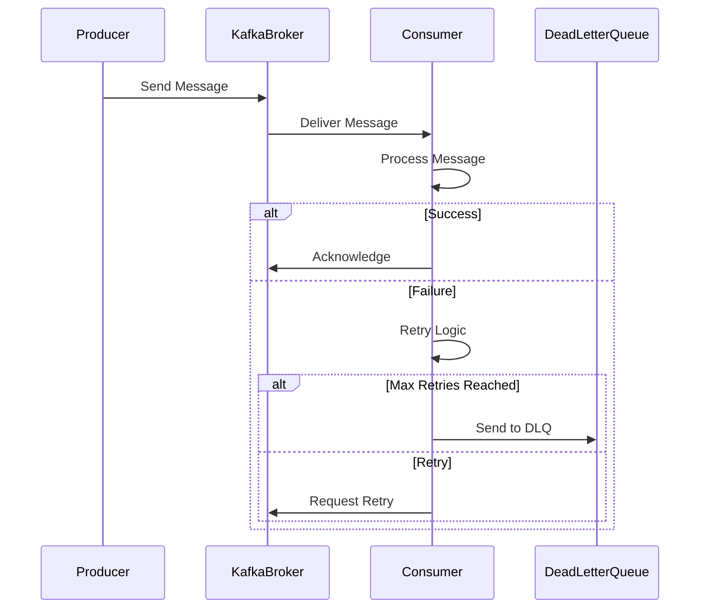

## 8.6.3 Retrying and Skipping Messages

In the realm of stream processing with Apache Kafka, handling errors effectively is crucial to maintaining the reliability and efficiency of your data pipelines. This section delves into the intricacies of retrying and skipping messages, providing expert insights into the trade-offs, strategies, and best practices for implementing these mechanisms in your Kafka-based systems.

### Understanding the Trade-offs: Retries vs. Throughput

Retrying messages in Kafka can significantly impact system throughput. While retries are essential for ensuring message delivery and data integrity, they can also lead to increased latency and resource consumption. Therefore, it's vital to strike a balance between the need for retries and the overall system performance.

#### Key Considerations

- **Latency**: Each retry attempt introduces additional latency, which can affect the timeliness of data processing.
- **Resource Utilization**: Retrying messages consumes CPU, memory, and network resources, potentially impacting other processes.
- **Throughput**: Excessive retries can bottleneck the system, reducing the overall throughput.

### Strategies for Configuring Retry Limits

Configuring retry limits involves setting parameters that define how many times a message should be retried before being considered a failure. This configuration is crucial for maintaining system stability and ensuring that resources are not overwhelmed by perpetual retry attempts.

#### Configuring Retry Limits in Kafka

- **Producer Retries**: Configure the `retries` parameter in the Kafka producer to specify the number of retry attempts for message delivery failures.
- **Consumer Retries**: Implement retry logic in your consumer application, using frameworks like Spring Kafka or custom retry mechanisms.

#### Example: Configuring Producer Retries in Java

```java
Properties props = new Properties();
props.put("bootstrap.servers", "localhost:9092");
props.put("key.serializer", "org.apache.kafka.common.serialization.StringSerializer");
props.put("value.serializer", "org.apache.kafka.common.serialization.StringSerializer");
props.put("retries", 3); // Set the number of retries

KafkaProducer<String, String> producer = new KafkaProducer<>(props);
```

#### Example: Implementing Consumer Retries in Scala

```scala
import org.apache.kafka.clients.consumer.KafkaConsumer
import java.util.Properties

val props = new Properties()
props.put("bootstrap.servers", "localhost:9092")
props.put("group.id", "test")
props.put("key.deserializer", "org.apache.kafka.common.serialization.StringDeserializer")
props.put("value.deserializer", "org.apache.kafka.common.serialization.StringDeserializer")

val consumer = new KafkaConsumer[String, String](props)

def processRecord(record: ConsumerRecord[String, String]): Unit = {
  // Implement retry logic
  var retryCount = 0
  val maxRetries = 3
  var success = false

  while (retryCount < maxRetries && !success) {
    try {
      // Process the record
      println(s"Processing record: ${record.value()}")
      success = true
    } catch {
      case e: Exception =>
        retryCount += 1
        println(s"Retrying... ($retryCount/$maxRetries)")
    }
  }
}
```

### Implications of Skipping Messages on Data Integrity

Skipping messages can be a pragmatic approach to maintaining processing flow, especially when certain messages are deemed non-critical or when retries have been exhausted. However, this approach can have significant implications for data integrity and consistency.

#### Key Implications

- **Data Loss**: Skipping messages may lead to data loss, which can affect downstream analytics and decision-making processes.
- **Inconsistency**: Skipped messages can result in data inconsistencies, particularly in systems that rely on complete data sets for accurate processing.
- **Auditability**: Skipping messages can complicate auditing and compliance efforts, as it may be challenging to trace which messages were processed and which were not.

### Best Practices for Deciding on Retry vs. Skip

Deciding whether to retry or skip a message involves evaluating the criticality of the message, the impact on system performance, and the potential consequences of data loss or inconsistency.

#### Best Practices

1. **Assess Message Criticality**: Determine the importance of each message and its impact on downstream processes. Critical messages should be retried more aggressively than non-critical ones.
2. **Implement Backoff Strategies**: Use exponential backoff strategies to manage retry intervals, reducing the load on the system during high failure rates.
3. **Monitor System Performance**: Continuously monitor system performance and adjust retry configurations as needed to maintain an optimal balance between reliability and throughput.
4. **Use Dead Letter Queues**: Implement dead letter queues to capture and analyze failed messages, allowing for manual intervention or automated reprocessing at a later time.
5. **Leverage Circuit Breakers**: Use circuit breaker patterns to temporarily halt retries when a system component is experiencing high failure rates, preventing cascading failures.

### Implementation Examples

#### Java: Implementing Exponential Backoff

```java
import java.util.concurrent.TimeUnit;

public class RetryWithBackoff {
    private static final int MAX_RETRIES = 5;
    private static final long INITIAL_DELAY = 100; // milliseconds

    public static void main(String[] args) {
        int retryCount = 0;
        boolean success = false;

        while (retryCount < MAX_RETRIES && !success) {
            try {
                // Attempt to process the message
                processMessage();
                success = true;
            } catch (Exception e) {
                retryCount++;
                long delay = INITIAL_DELAY * (long) Math.pow(2, retryCount);
                System.out.println("Retrying in " + delay + " ms");
                try {
                    TimeUnit.MILLISECONDS.sleep(delay);
                } catch (InterruptedException ie) {
                    Thread.currentThread().interrupt();
                }
            }
        }
    }

    private static void processMessage() throws Exception {
        // Simulate message processing
        throw new Exception("Processing failed");
    }
}
```

#### Kotlin: Using Dead Letter Queues

```kotlin
import org.apache.kafka.clients.consumer.ConsumerRecord

fun processRecord(record: ConsumerRecord<String, String>) {
    val maxRetries = 3
    var retryCount = 0
    var success = false

    while (retryCount < maxRetries && !success) {
        try {
            // Process the record
            println("Processing record: ${record.value()}")
            success = true
        } catch (e: Exception) {
            retryCount++
            println("Retrying... ($retryCount/$maxRetries)")
        }
    }

    if (!success) {
        // Send to dead letter queue
        sendToDeadLetterQueue(record)
    }
}

fun sendToDeadLetterQueue(record: ConsumerRecord<String, String>) {
    println("Sending record to dead letter queue: ${record.value()}")
    // Implement logic to send the record to a dead letter queue
}
```

### Visualizing Retry and Skip Mechanisms

To better understand the flow of retry and skip mechanisms in Kafka, consider the following sequence diagram:



**Diagram Caption**: This sequence diagram illustrates the flow of message processing in Kafka, highlighting the retry logic and the use of a dead letter queue for failed messages.

### Real-world Scenarios and Use Cases

1. **Financial Services**: In financial systems, message retries are crucial for ensuring transaction integrity. However, non-critical messages, such as logging or monitoring data, can be skipped to maintain system performance.
2. **E-commerce Platforms**: E-commerce platforms may implement retries for order processing messages, while promotional messages can be skipped if they fail, as they are less critical.
3. **IoT Applications**: In IoT systems, sensor data may be retried to ensure accuracy, but non-essential telemetry data can be skipped to prevent system overload.

### Related Patterns

- **[8.6.1 Strategies for Handling Processing Failures]( "Strategies for Handling Processing Failures")**: Explore additional strategies for managing processing failures in Kafka.
- **[8.6.2 Implementing Dead Letter Queues]( "Implementing Dead Letter Queues")**: Learn more about using dead letter queues to handle failed messages.
- **[13.5 Implementing Circuit Breaker Patterns]( "Implementing Circuit Breaker Patterns")**: Discover how circuit breaker patterns can enhance system resilience.

### Conclusion

Retrying and skipping messages in Apache Kafka are essential techniques for maintaining the reliability and efficiency of stream processing systems. By understanding the trade-offs, configuring retry limits effectively, and implementing best practices, you can ensure that your Kafka-based applications handle errors gracefully while preserving data integrity and system performance.

## Test Your Knowledge: Advanced Kafka Error Handling Quiz



### What is a primary trade-off when implementing message retries in Kafka?

- [x] Increased latency
- [ ] Reduced data integrity
- [ ] Decreased resource utilization
- [ ] Enhanced throughput

> **Explanation:** Implementing message retries can increase latency due to additional processing time required for each retry attempt.

### Which parameter is used to configure the number of retries for a Kafka producer?

- [x] retries
- [ ] max.retries
- [ ] retry.count
- [ ] retry.limit

> **Explanation:** The `retries` parameter in Kafka producer configuration specifies the number of retry attempts for message delivery failures.

### What is a potential consequence of skipping messages in a Kafka stream?

- [x] Data loss
- [ ] Increased throughput
- [ ] Reduced latency
- [ ] Improved data integrity

> **Explanation:** Skipping messages can lead to data loss, affecting downstream analytics and decision-making processes.

### Which strategy can help manage retry intervals and reduce system load during high failure rates?

- [x] Exponential backoff
- [ ] Linear retry
- [ ] Immediate retry
- [ ] Random retry

> **Explanation:** Exponential backoff increases the delay between retries, helping to manage system load during high failure rates.

### What is the purpose of a dead letter queue in Kafka?

- [x] To capture and analyze failed messages
- [ ] To increase message throughput
- [ ] To reduce message latency
- [ ] To enhance data integrity

> **Explanation:** A dead letter queue captures failed messages for analysis and potential reprocessing, allowing for manual intervention.

### In which scenario might it be appropriate to skip a message in Kafka?

- [x] When the message is non-critical
- [ ] When the message is critical
- [ ] When the system is under low load
- [ ] When the message has been successfully processed

> **Explanation:** Skipping non-critical messages can help maintain processing flow without significantly impacting system performance.

### What is a key benefit of using circuit breaker patterns in Kafka?

- [x] Preventing cascading failures
- [ ] Increasing message throughput
- [ ] Reducing message latency
- [ ] Enhancing data integrity

> **Explanation:** Circuit breaker patterns help prevent cascading failures by temporarily halting retries when a system component is experiencing high failure rates.

### Which language feature is used in Kotlin to send a failed message to a dead letter queue?

- [x] Function
- [ ] Class
- [ ] Interface
- [ ] Object

> **Explanation:** In the provided Kotlin example, a function is used to send a failed message to a dead letter queue.

### What is a common practice for handling critical messages in Kafka?

- [x] Retrying more aggressively
- [ ] Skipping immediately
- [ ] Reducing retry attempts
- [ ] Ignoring failures

> **Explanation:** Critical messages should be retried more aggressively to ensure their successful processing and delivery.

### True or False: Skipping messages in Kafka always improves system performance.

- [ ] True
- [x] False

> **Explanation:** While skipping messages can maintain processing flow, it may lead to data loss and inconsistency, which can negatively impact system performance in the long run.


