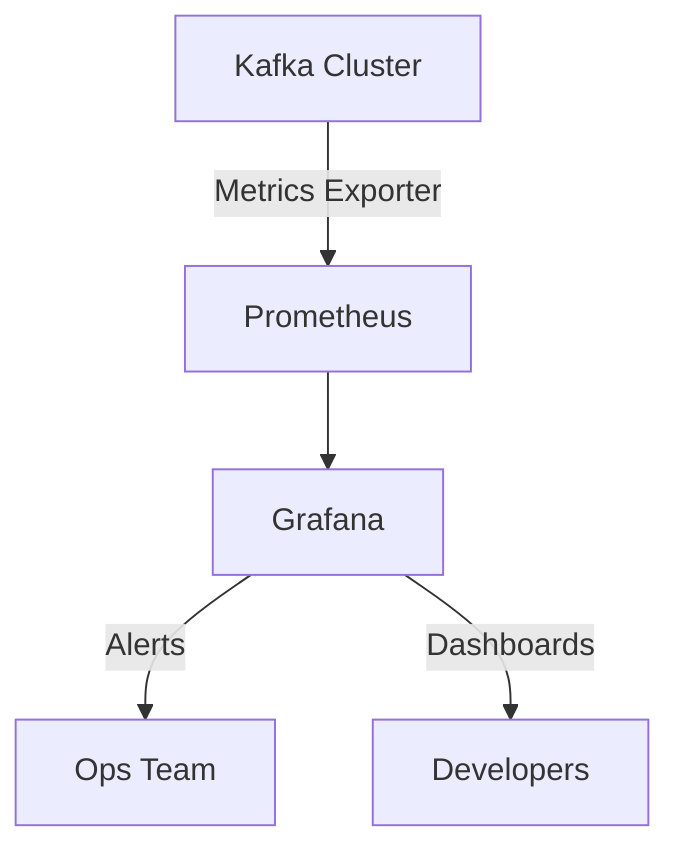

## 8.6.4 Monitoring and Alerting on Errors

In the realm of real-time data processing with Apache Kafka, monitoring and alerting on errors is crucial for maintaining the health and reliability of your systems. As data flows through Kafka, errors can occur at various stages, from data ingestion to processing and output. This section will guide you through the best practices for monitoring errors, setting up alerts, and integrating these practices into your existing infrastructure.

### Importance of Monitoring and Alerting

Monitoring and alerting are essential components of a robust Kafka deployment. They enable you to:

- **Detect anomalies and errors** in real-time, allowing for quick remediation.
- **Ensure data integrity** by identifying and addressing issues that could lead to data loss or corruption.
- **Optimize performance** by monitoring key metrics and identifying bottlenecks.
- **Maintain system reliability** by proactively addressing potential failures before they impact users.

### Key Metrics to Monitor

To effectively monitor errors in Kafka, focus on the following key metrics:

1. **Error Rates**: Track the number of errors occurring in your Kafka streams. This includes deserialization errors, processing exceptions, and any custom error metrics you define.

2. **Processing Latencies**: Monitor the time taken to process messages. High latencies can indicate performance bottlenecks or issues in your processing logic.

3. **Consumer Lag**: Measure the difference between the latest message in a partition and the last message processed by a consumer. High consumer lag can lead to delayed processing and potential data loss.

4. **Throughput**: Track the rate at which messages are produced and consumed. Sudden drops in throughput can signal issues in your Kafka cluster or network.

5. **Resource Utilization**: Monitor CPU, memory, and disk usage on your Kafka brokers and consumer/producer applications to ensure they are operating within optimal thresholds.

### Tools for Monitoring and Alerting

Several tools can help you monitor and alert on errors in Kafka. Prometheus and Grafana are popular choices due to their flexibility and ease of integration.

#### Prometheus

Prometheus is an open-source monitoring and alerting toolkit that collects and stores metrics as time series data. It is well-suited for monitoring Kafka due to its powerful query language and integration capabilities.

- **Setting Up Prometheus**: Install Prometheus and configure it to scrape metrics from your Kafka brokers and applications. Use the Kafka Exporter to expose Kafka metrics in a format that Prometheus can consume.

- **Defining Alerts**: Use Prometheus' alerting rules to define conditions that trigger alerts. For example, you can set up an alert for high error rates or consumer lag.

```yaml
# Example Prometheus alert rule for high error rate
groups:
- name: kafka_alerts
  rules:
  - alert: HighErrorRate
    expr: increase(kafka_server_broker_topic_errors_total[5m]) > 100
    for: 5m
    labels:
      severity: critical
    annotations:
      summary: "High error rate detected in Kafka"
      description: "The error rate has exceeded 100 errors in the last 5 minutes."
```

#### Grafana

Grafana is a visualization tool that integrates with Prometheus to provide real-time dashboards and alerts.

- **Creating Dashboards**: Use Grafana to create dashboards that visualize key Kafka metrics. Include panels for error rates, processing latencies, and consumer lag.

- **Setting Up Alerts**: Configure Grafana to send alerts via email, Slack, or other channels when thresholds are breached.

```json
{
  "dashboard": {
    "panels": [
      {
        "title": "Kafka Error Rate",
        "type": "graph",
        "targets": [
          {
            "expr": "increase(kafka_server_broker_topic_errors_total[5m])",
            "legendFormat": "{{instance}}"
          }
        ]
      }
    ]
  }
}
```

### Integrating Error Monitoring into Dashboards

Integrating error monitoring into your existing dashboards ensures that you have a centralized view of your Kafka ecosystem. This integration allows you to:

- **Correlate errors with other metrics**: By viewing errors alongside other metrics like throughput and latency, you can identify root causes more effectively.

- **Customize views for different stakeholders**: Create tailored dashboards for developers, operations teams, and business users, focusing on the metrics most relevant to each group.

- **Automate reporting**: Use Grafana's reporting features to generate and distribute regular reports on Kafka performance and errors.

### Strategies for Proactive Error Detection and Resolution

Proactive error detection and resolution involve anticipating potential issues and addressing them before they impact your system. Here are some strategies to consider:

1. **Implement Circuit Breakers**: Use circuit breakers to prevent cascading failures in your Kafka streams. This pattern temporarily halts processing when errors exceed a threshold, allowing the system to recover.

2. **Use Dead Letter Queues**: Redirect problematic messages to a dead letter queue for later analysis and reprocessing. This ensures that errors do not block the processing of other messages.

3. **Conduct Regular Audits**: Perform regular audits of your Kafka configuration and processing logic to identify potential sources of errors.

4. **Leverage Machine Learning**: Use machine learning algorithms to predict and detect anomalies in your Kafka streams. This can help you identify issues before they manifest as errors.

5. **Automate Remediation**: Implement automated remediation scripts that trigger when specific alerts are raised. This can include restarting services, scaling resources, or adjusting configurations.

### Code Examples

To illustrate the concepts discussed, let's look at some code examples for setting up monitoring and alerting in different programming languages.

#### Java

```java
import io.prometheus.client.Counter;
import io.prometheus.client.exporter.HTTPServer;

public class KafkaErrorMonitor {
    static final Counter errors = Counter.build()
        .name("kafka_errors_total")
        .help("Total number of errors in Kafka processing.")
        .register();

    public static void main(String[] args) throws Exception {
        HTTPServer server = new HTTPServer(1234);
        // Simulate error occurrence
        errors.inc();
    }
}
```

#### Scala

```scala
import io.prometheus.client.Counter
import io.prometheus.client.exporter.HTTPServer

object KafkaErrorMonitor extends App {
  val errors: Counter = Counter.build()
    .name("kafka_errors_total")
    .help("Total number of errors in Kafka processing.")
    .register()

  val server = new HTTPServer(1234)
  // Simulate error occurrence
  errors.inc()
}
```

#### Kotlin

```kotlin
import io.prometheus.client.Counter
import io.prometheus.client.exporter.HTTPServer

fun main() {
    val errors = Counter.build()
        .name("kafka_errors_total")
        .help("Total number of errors in Kafka processing.")
        .register()

    val server = HTTPServer(1234)
    // Simulate error occurrence
    errors.inc()
}
```

#### Clojure

```clojure
(ns kafka-error-monitor
  (:import [io.prometheus.client Counter]
           [io.prometheus.client.exporter HTTPServer]))

(def errors
  (-> (Counter/build)
      (.name "kafka_errors_total")
      (.help "Total number of errors in Kafka processing.")
      (.register)))

(defn -main []
  (HTTPServer. 1234)
  ;; Simulate error occurrence
  (.inc errors))
```

### Visualizing Kafka Monitoring Architecture

To better understand how monitoring and alerting fit into the Kafka ecosystem, consider the following architecture diagram:



**Diagram Description**: This diagram illustrates a typical Kafka monitoring setup where metrics from the Kafka cluster are exported to Prometheus. Grafana then visualizes these metrics and sends alerts to the operations team while providing dashboards for developers.

### Conclusion

Monitoring and alerting on errors in Apache Kafka is a critical aspect of maintaining a reliable and efficient data processing system. By focusing on key metrics, leveraging powerful tools like Prometheus and Grafana, and implementing proactive strategies, you can ensure that your Kafka deployment remains robust and responsive to issues.

## Test Your Knowledge: Advanced Kafka Monitoring and Alerting Quiz



### What is the primary benefit of monitoring error rates in Kafka?

- [x] Detecting anomalies and addressing them promptly
- [ ] Improving network performance
- [ ] Reducing storage costs
- [ ] Enhancing user interface design

> **Explanation:** Monitoring error rates helps in detecting anomalies and addressing them promptly to maintain system reliability.

### Which tool is commonly used for visualizing Kafka metrics?

- [x] Grafana
- [ ] Jenkins
- [ ] Ansible
- [ ] Terraform

> **Explanation:** Grafana is commonly used for visualizing Kafka metrics due to its powerful dashboard capabilities.

### What is a dead letter queue used for in Kafka?

- [x] Redirecting problematic messages for later analysis
- [ ] Storing backup data
- [ ] Enhancing message throughput
- [ ] Encrypting data at rest

> **Explanation:** A dead letter queue is used to redirect problematic messages for later analysis and reprocessing.

### How can Prometheus be used in Kafka monitoring?

- [x] By collecting and storing metrics as time series data
- [ ] By deploying Kafka brokers
- [ ] By managing Kafka topics
- [ ] By encrypting Kafka messages

> **Explanation:** Prometheus collects and stores metrics as time series data, which is essential for monitoring Kafka.

### What is the purpose of consumer lag monitoring?

- [x] Measuring the difference between the latest message and the last processed message
- [ ] Increasing message throughput
- [ ] Encrypting data in transit
- [ ] Enhancing UI performance

> **Explanation:** Consumer lag monitoring measures the difference between the latest message and the last processed message to ensure timely processing.

### Which strategy helps prevent cascading failures in Kafka streams?

- [x] Implementing circuit breakers
- [ ] Increasing disk space
- [ ] Using JSON serialization
- [ ] Reducing network bandwidth

> **Explanation:** Implementing circuit breakers helps prevent cascading failures by temporarily halting processing when errors exceed a threshold.

### What is the role of Grafana in Kafka monitoring?

- [x] Visualizing metrics and setting up alerts
- [ ] Deploying Kafka clusters
- [ ] Managing Kafka topics
- [ ] Encrypting Kafka data

> **Explanation:** Grafana is used for visualizing metrics and setting up alerts in Kafka monitoring.

### How can machine learning be leveraged in Kafka error detection?

- [x] By predicting and detecting anomalies in Kafka streams
- [ ] By deploying Kafka brokers
- [ ] By managing Kafka topics
- [ ] By encrypting Kafka messages

> **Explanation:** Machine learning can be leveraged to predict and detect anomalies in Kafka streams, aiding in proactive error detection.

### What is the benefit of integrating error monitoring into dashboards?

- [x] Correlating errors with other metrics for root cause analysis
- [ ] Increasing storage capacity
- [ ] Enhancing UI design
- [ ] Reducing network latency

> **Explanation:** Integrating error monitoring into dashboards allows for correlating errors with other metrics, aiding in root cause analysis.

### True or False: Automated remediation scripts can be triggered by specific alerts in Kafka monitoring.

- [x] True
- [ ] False

> **Explanation:** Automated remediation scripts can indeed be triggered by specific alerts, allowing for quick resolution of issues.


