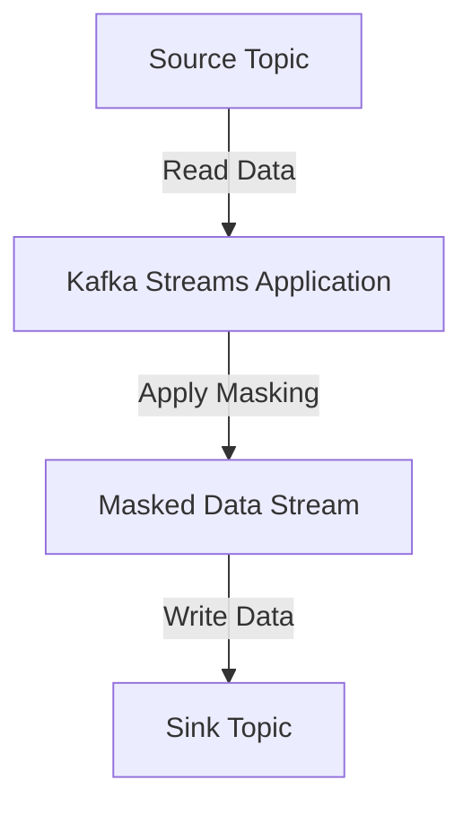

## 8.7.3 Real-Time Data Masking and Anonymization

### Introduction

In today's data-driven world, the importance of protecting sensitive information cannot be overstated. With the rise of stringent privacy regulations such as GDPR and CCPA, organizations are compelled to ensure that personal data is handled with the utmost care. Real-time data masking and anonymization are crucial techniques in stream processing that help organizations comply with these regulations while maintaining the utility of their data streams.

### Importance of Data Masking and Anonymization

Data masking and anonymization are essential for safeguarding sensitive information in real-time data streams. These techniques help prevent unauthorized access to personal data, reducing the risk of data breaches and ensuring compliance with privacy laws. By obfuscating or removing identifiable information, organizations can continue to leverage data for analytics and decision-making without compromising individual privacy.

### Techniques for Real-Time Data Masking

Real-time data masking involves altering sensitive data in a way that preserves its usability while protecting its confidentiality. Here are some common techniques:

#### 1. Hashing

Hashing is a one-way cryptographic function that converts data into a fixed-size string of characters, which is typically a hash code. This technique is useful for verifying data integrity and ensuring that sensitive information, such as passwords, is not stored in its original form.

- **Example**: Hashing an email address before storing it in a Kafka topic.

```java
import java.security.MessageDigest;
import java.security.NoSuchAlgorithmException;

public class HashingExample {
    public static String hashEmail(String email) throws NoSuchAlgorithmException {
        MessageDigest md = MessageDigest.getInstance("SHA-256");
        byte[] hash = md.digest(email.getBytes());
        StringBuilder hexString = new StringBuilder();
        for (byte b : hash) {
            hexString.append(String.format("%02x", b));
        }
        return hexString.toString();
    }

    public static void main(String[] args) throws NoSuchAlgorithmException {
        String email = "user@example.com";
        System.out.println("Hashed Email: " + hashEmail(email));
    }
}
```

#### 2. Tokenization

Tokenization replaces sensitive data with unique identifiers or tokens. Unlike hashing, tokenization is reversible, allowing the original data to be retrieved if necessary. This technique is commonly used in payment processing systems.

- **Example**: Tokenizing credit card numbers in a Kafka stream.

```scala
object TokenizationExample {
  private val tokenMap = scala.collection.mutable.Map[String, String]()
  private var tokenCounter = 0

  def tokenize(data: String): String = {
    tokenMap.getOrElseUpdate(data, {
      tokenCounter += 1
      s"TOKEN_$tokenCounter"
    })
  }

  def main(args: Array[String]): Unit = {
    val creditCard = "1234-5678-9012-3456"
    println(s"Tokenized Credit Card: ${tokenize(creditCard)}")
  }
}
```

#### 3. Data Redaction

Data redaction involves removing or obscuring parts of data to prevent exposure of sensitive information. This technique is often used in documents and reports to hide confidential details.

- **Example**: Redacting social security numbers in a Kafka stream.

```kotlin
fun redactSSN(ssn: String): String {
    return ssn.replace(Regex("\\d{3}-\\d{2}"), "***-**")
}

fun main() {
    val ssn = "123-45-6789"
    println("Redacted SSN: ${redactSSN(ssn)}")
}
```

### Implementing Masking in Stream Processing

Implementing data masking in stream processing involves integrating these techniques into your Kafka Streams applications. Here are some steps to consider:

#### 1. Identify Sensitive Data

Begin by identifying which data fields in your streams contain sensitive information. This could include personally identifiable information (PII) such as names, addresses, and financial details.

#### 2. Choose Appropriate Masking Techniques

Select the most suitable masking techniques based on the type of data and the level of security required. For example, use hashing for data that does not need to be reversible, and tokenization for data that may need to be restored to its original form.

#### 3. Integrate Masking into Kafka Streams

Incorporate the chosen masking techniques into your Kafka Streams processing logic. This can be done by creating custom processors or transformers that apply the masking functions to the relevant data fields.

- **Example**: Using a custom transformer to mask data in a Kafka Streams application.

```java
import org.apache.kafka.streams.KafkaStreams;
import org.apache.kafka.streams.StreamsBuilder;
import org.apache.kafka.streams.kstream.KStream;
import org.apache.kafka.streams.kstream.ValueTransformer;
import org.apache.kafka.streams.kstream.ValueTransformerSupplier;
import org.apache.kafka.streams.processor.ProcessorContext;

public class MaskingTransformer implements ValueTransformer<String, String> {
    @Override
    public void init(ProcessorContext context) {}

    @Override
    public String transform(String value) {
        // Apply masking logic here
        return value.replaceAll("\\d{3}-\\d{2}", "***-**");
    }

    @Override
    public void close() {}

    public static void main(String[] args) {
        StreamsBuilder builder = new StreamsBuilder();
        KStream<String, String> stream = builder.stream("input-topic");
        stream.transformValues(() -> new MaskingTransformer()).to("output-topic");

        KafkaStreams streams = new KafkaStreams(builder.build(), new Properties());
        streams.start();
    }
}
```

### Considerations for Performance and Compliance

When implementing real-time data masking and anonymization, it is crucial to consider both performance and compliance:

#### Performance

- **Latency**: Ensure that masking operations do not introduce significant latency into your stream processing pipeline. Optimize your masking functions for speed and efficiency.
- **Scalability**: Design your masking solutions to scale with the volume of data being processed. Consider using distributed processing frameworks to handle large data streams.

#### Compliance

- **Regulatory Requirements**: Stay informed about the latest privacy regulations and ensure that your masking techniques comply with these standards.
- **Data Retention**: Implement policies for data retention and deletion to ensure that masked data is not stored longer than necessary.

### Visualizing Data Masking in Kafka Streams

To better understand how data masking fits into a Kafka Streams application, consider the following data flow diagram:



**Caption**: This diagram illustrates the flow of data through a Kafka Streams application, where sensitive information is masked before being written to the sink topic.

### Real-World Scenarios

Real-time data masking and anonymization are used in various industries to protect sensitive information:

- **Healthcare**: Masking patient data in real-time to comply with HIPAA regulations.
- **Finance**: Anonymizing transaction data to prevent fraud and ensure PCI DSS compliance.
- **Retail**: Protecting customer information during online transactions.

### Conclusion

Real-time data masking and anonymization are vital components of a robust data security strategy. By implementing these techniques in your Kafka Streams applications, you can protect sensitive information, comply with privacy regulations, and maintain the integrity of your data streams.

## Test Your Knowledge: Real-Time Data Masking and Anonymization Quiz



### What is the primary purpose of real-time data masking?

- [x] To protect sensitive information in data streams.
- [ ] To increase data processing speed.
- [ ] To enhance data visualization.
- [ ] To reduce storage costs.

> **Explanation:** Real-time data masking is primarily used to protect sensitive information in data streams, ensuring privacy and compliance with regulations.

### Which technique is reversible and allows original data retrieval?

- [ ] Hashing
- [x] Tokenization
- [ ] Data Redaction
- [ ] Encryption

> **Explanation:** Tokenization is reversible, allowing the original data to be retrieved if necessary, unlike hashing and data redaction.

### What is a common use case for data redaction?

- [ ] Encrypting data at rest
- [x] Hiding confidential details in documents
- [ ] Compressing data for storage
- [ ] Enhancing data analytics

> **Explanation:** Data redaction is commonly used to hide confidential details in documents and reports, preventing exposure of sensitive information.

### How can you ensure that masking operations do not introduce significant latency?

- [x] Optimize masking functions for speed and efficiency.
- [ ] Use more complex algorithms.
- [ ] Increase data retention periods.
- [ ] Store masked data in multiple locations.

> **Explanation:** Optimizing masking functions for speed and efficiency helps ensure that they do not introduce significant latency into the stream processing pipeline.

### What should be considered when designing masking solutions for scalability?

- [x] The volume of data being processed.
- [ ] The color of the user interface.
- [ ] The number of developers on the team.
- [ ] The brand of hardware used.

> **Explanation:** When designing masking solutions, consider the volume of data being processed to ensure scalability and efficient handling of large data streams.

### Which regulation is relevant for protecting patient data in healthcare?

- [ ] PCI DSS
- [x] HIPAA
- [ ] GDPR
- [ ] CCPA

> **Explanation:** HIPAA (Health Insurance Portability and Accountability Act) is relevant for protecting patient data in the healthcare industry.

### What is a key benefit of using Kafka Streams for data masking?

- [x] Real-time processing capabilities.
- [ ] Increased storage capacity.
- [ ] Enhanced data visualization.
- [ ] Simplified user interfaces.

> **Explanation:** Kafka Streams provides real-time processing capabilities, making it suitable for implementing data masking in stream processing applications.

### Why is it important to stay informed about privacy regulations?

- [x] To ensure compliance with data protection standards.
- [ ] To increase data processing speed.
- [ ] To reduce hardware costs.
- [ ] To improve user interface design.

> **Explanation:** Staying informed about privacy regulations is important to ensure compliance with data protection standards and avoid legal issues.

### What is the role of a custom transformer in Kafka Streams?

- [x] To apply masking logic to data fields.
- [ ] To increase data storage capacity.
- [ ] To enhance data visualization.
- [ ] To simplify user interfaces.

> **Explanation:** A custom transformer in Kafka Streams is used to apply masking logic to data fields, ensuring sensitive information is protected.

### True or False: Data masking can help prevent unauthorized access to personal data.

- [x] True
- [ ] False

> **Explanation:** True. Data masking helps prevent unauthorized access to personal data by obfuscating or removing identifiable information.


