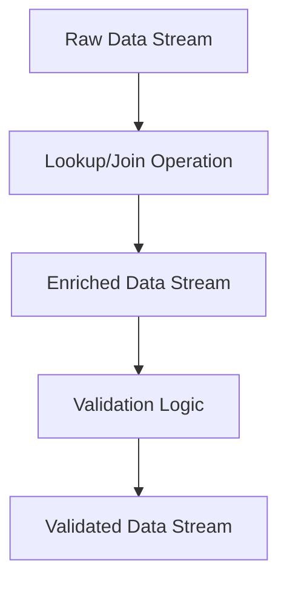

## 8.7 Data Enrichment and Validation

In the realm of real-time data processing, ensuring that data is both enriched with relevant context and validated for quality is paramount. Apache Kafka, with its robust stream processing capabilities, provides a powerful platform for implementing these tasks efficiently. This section delves into the intricacies of data enrichment and validation within Kafka stream processing, offering insights into best practices, implementation strategies, and real-world applications.

### Understanding the Need for Data Enrichment

Data enrichment involves augmenting raw data streams with additional context or information to make them more valuable and actionable. In streaming applications, data enrichment can transform isolated data points into comprehensive insights by integrating external data sources or pre-existing datasets.

#### Motivation for Data Enrichment

- **Enhanced Decision-Making**: Enriched data provides a more complete picture, enabling better decision-making processes.
- **Improved Analytics**: By adding context, data analytics become more accurate and meaningful.
- **Operational Efficiency**: Enrichment can streamline operations by reducing the need for manual data integration.

### Methods for Enriching Data

Data enrichment in Kafka can be achieved through various methods, each suited to different use cases and data architectures.

#### 1. Lookups

Lookups involve querying external data sources to append additional information to a data stream. This can be done using databases, key-value stores, or in-memory caches.

- **Example**: Enriching user activity logs with demographic information from a user profile database.

#### 2. Join Operations

Join operations are a fundamental aspect of data enrichment, allowing streams to be combined with other streams or tables to add context.

- **Stream-Stream Joins**: Combine two streams based on a common key.
- **Stream-Table Joins**: Enrich a stream with data from a static or slowly changing table.

##### Stream-Stream Join Example

```java
// Java example of a stream-stream join
KStream<String, Order> orders = builder.stream("orders");
KStream<String, Payment> payments = builder.stream("payments");

KStream<String, EnrichedOrder> enrichedOrders = orders.join(
    payments,
    (order, payment) -> new EnrichedOrder(order, payment),
    JoinWindows.of(Duration.ofMinutes(5)),
    Joined.with(Serdes.String(), orderSerde, paymentSerde)
);
```

##### Stream-Table Join Example

```scala
// Scala example of a stream-table join
val orders: KStream[String, Order] = builder.stream("orders")
val customerTable: KTable[String, Customer] = builder.table("customers")

val enrichedOrders: KStream[String, EnrichedOrder] = orders.join(
  customerTable,
  (order, customer) => EnrichedOrder(order, customer)
)
```

### Strategies for Validating Data Quality

Data validation ensures that the data flowing through your Kafka streams is accurate, complete, and consistent. Implementing validation logic within your stream processing pipeline is crucial for maintaining data integrity.

#### Real-Time Validation Techniques

1. **Schema Validation**: Use schema registries to enforce data formats and structures.
2. **Field-Level Validation**: Check individual fields for expected values or patterns.
3. **Cross-Field Validation**: Ensure logical consistency between related fields.

##### Schema Validation Example

```kotlin
// Kotlin example of schema validation using Avro
val schemaRegistryUrl = "http://localhost:8081"
val avroSerde = SpecificAvroSerde<YourAvroClass>()
avroSerde.configure(mapOf("schema.registry.url" to schemaRegistryUrl), false)

val validatedStream: KStream<String, YourAvroClass> = builder.stream("input-topic", Consumed.with(Serdes.String(), avroSerde))
```

### Best Practices for Performance and Accuracy

Ensuring that your data enrichment and validation processes are both performant and accurate requires careful consideration of several factors.

#### Performance Optimization

- **Use Caching**: Cache frequently accessed data to reduce latency in lookups.
- **Optimize Joins**: Use appropriate join windows and partitioning strategies to minimize processing overhead.
- **Parallel Processing**: Leverage Kafka's distributed architecture to parallelize processing tasks.

#### Accuracy Considerations

- **Data Consistency**: Ensure that enriched data remains consistent across different streams and processing nodes.
- **Error Handling**: Implement robust error handling and logging to capture and address data quality issues.

### Real-World Applications

Data enrichment and validation are critical in various industries and applications. Here are a few examples:

- **E-commerce**: Enriching transaction data with customer profiles to provide personalized recommendations.
- **Finance**: Validating and enriching financial transactions with market data for real-time risk assessment.
- **Healthcare**: Integrating patient data streams with medical records for comprehensive health monitoring.

### Visualizing Data Enrichment and Validation

To better understand the flow of data enrichment and validation in Kafka, consider the following diagram:



**Caption**: This diagram illustrates the flow of data through enrichment and validation processes in a Kafka stream processing pipeline.

### Conclusion

Mastering data enrichment and validation in Kafka stream processing is essential for building robust, real-time data applications. By leveraging the techniques and best practices discussed in this section, you can ensure that your data streams are both enriched with valuable context and validated for quality, leading to more informed decision-making and operational efficiency.

### Knowledge Check

To reinforce your understanding of data enrichment and validation in Kafka, consider the following questions and exercises.

## Test Your Knowledge: Advanced Data Enrichment and Validation Quiz



### What is the primary purpose of data enrichment in streaming applications?

- [x] To add context and value to raw data streams.
- [ ] To reduce data volume.
- [ ] To improve data security.
- [ ] To increase data redundancy.

> **Explanation:** Data enrichment enhances raw data by adding additional context, making it more valuable and actionable.

### Which of the following is a common method for enriching data in Kafka?

- [x] Join operations
- [ ] Data compression
- [ ] Data encryption
- [ ] Data partitioning

> **Explanation:** Join operations are commonly used to enrich data by combining streams or integrating external datasets.

### What is a key benefit of using schema validation in Kafka?

- [x] Ensures data consistency and structure.
- [ ] Increases data throughput.
- [ ] Reduces data latency.
- [ ] Enhances data encryption.

> **Explanation:** Schema validation ensures that data adheres to a predefined structure, maintaining consistency across the pipeline.

### How can caching improve the performance of data enrichment?

- [x] By reducing latency in data lookups.
- [ ] By increasing data redundancy.
- [ ] By compressing data streams.
- [ ] By encrypting data at rest.

> **Explanation:** Caching frequently accessed data reduces the time needed for lookups, improving overall performance.

### What is the role of field-level validation in data quality assurance?

- [x] Ensures individual fields meet expected criteria.
- [ ] Validates data encryption methods.
- [ ] Increases data redundancy.
- [ ] Reduces data volume.

> **Explanation:** Field-level validation checks that each field in a data record meets specific criteria, ensuring data quality.

### Which of the following is a real-world application of data enrichment?

- [x] Personalized recommendations in e-commerce.
- [ ] Data compression in storage systems.
- [ ] Data encryption in secure communications.
- [ ] Data partitioning in distributed databases.

> **Explanation:** Data enrichment is used in e-commerce to provide personalized recommendations by integrating transaction data with customer profiles.

### What is a potential drawback of not implementing data validation?

- [x] Increased risk of data quality issues.
- [ ] Reduced data volume.
- [ ] Enhanced data security.
- [ ] Improved data redundancy.

> **Explanation:** Without validation, data quality issues may arise, leading to inaccurate or inconsistent data processing.

### How does parallel processing benefit Kafka stream processing?

- [x] By distributing tasks across multiple nodes.
- [ ] By increasing data redundancy.
- [ ] By compressing data streams.
- [ ] By encrypting data at rest.

> **Explanation:** Parallel processing leverages Kafka's distributed architecture to handle tasks concurrently, improving efficiency.

### What is the significance of error handling in data validation?

- [x] Captures and addresses data quality issues.
- [ ] Increases data redundancy.
- [ ] Enhances data encryption.
- [ ] Reduces data volume.

> **Explanation:** Robust error handling ensures that data quality issues are identified and addressed promptly, maintaining data integrity.

### True or False: Stream-table joins are used to combine two streams based on a common key.

- [ ] True
- [x] False

> **Explanation:** Stream-table joins combine a stream with a static or slowly changing table, not two streams.


