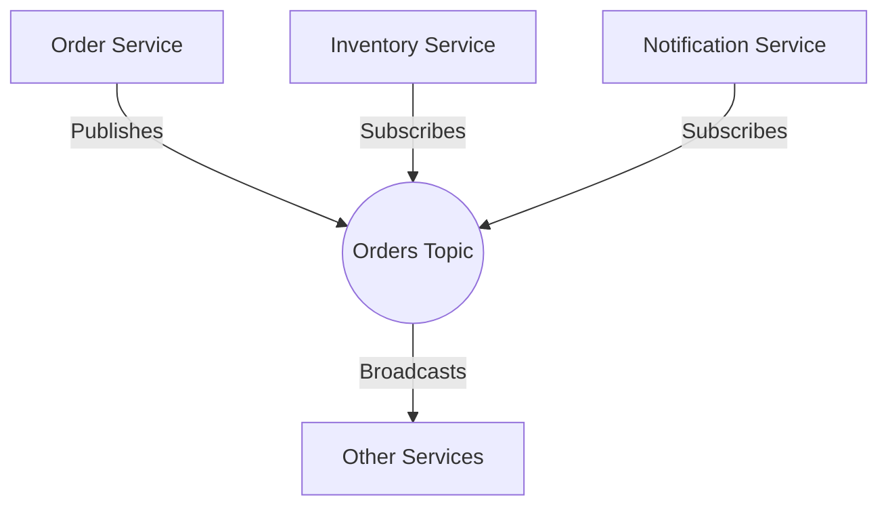

## 9.1.1 Decoupling Services with Kafka

In the realm of microservices architecture, decoupling services is a fundamental principle that enhances scalability, flexibility, and maintainability. Apache Kafka, a distributed event streaming platform, plays a pivotal role in achieving this decoupling by acting as an intermediary that allows services to communicate asynchronously. This section delves into the concept of service decoupling, the role of Kafka topics as interfaces, and the implementation of publish/subscribe patterns in microservices, along with considerations for managing dependencies and contracts.

### Understanding Service Decoupling

**Service decoupling** refers to the architectural practice of designing services in such a way that they can operate independently without being tightly bound to one another. This independence allows services to evolve, scale, and be deployed independently, which is crucial for maintaining agility in modern software development.

#### Benefits of Decoupling

- **Scalability**: Decoupled services can scale independently based on demand, optimizing resource utilization.
- **Flexibility**: Changes in one service do not necessitate changes in others, allowing for rapid iteration and deployment.
- **Resilience**: Failures in one service do not cascade to others, enhancing the overall system's robustness.
- **Maintainability**: Independent services are easier to manage, debug, and update.

### Kafka Topics as Interfaces

In a decoupled architecture, **Kafka topics** serve as the communication channels or interfaces between services. Each service can produce messages to a topic and consume messages from one or more topics, enabling asynchronous communication.

#### How Kafka Topics Facilitate Decoupling

- **Loose Coupling**: Services interact through topics rather than direct calls, reducing dependencies.
- **Asynchronous Communication**: Services can operate at their own pace, consuming messages when ready.
- **Scalability**: Kafka's partitioning and replication mechanisms support high throughput and fault tolerance.
- **Flexibility in Data Flow**: Topics can be dynamically created, allowing for flexible data routing and processing.

### Implementing Publish/Subscribe Patterns

The **publish/subscribe pattern** is a messaging paradigm where producers (publishers) send messages to a topic, and consumers (subscribers) receive messages from that topic. This pattern is central to decoupling services using Kafka.

#### Example: Order Processing System

Consider an e-commerce platform with the following microservices:

- **Order Service**: Publishes order events to a `orders` topic.
- **Inventory Service**: Subscribes to the `orders` topic to update stock levels.
- **Notification Service**: Subscribes to the `orders` topic to send confirmation emails.

```java
// Java example of a producer in the Order Service
Properties props = new Properties();
props.put("bootstrap.servers", "localhost:9092");
props.put("key.serializer", "org.apache.kafka.common.serialization.StringSerializer");
props.put("value.serializer", "org.apache.kafka.common.serialization.StringSerializer");

Producer<String, String> producer = new KafkaProducer<>(props);
String orderEvent = "{ \"orderId\": \"12345\", \"status\": \"created\" }";
producer.send(new ProducerRecord<>("orders", orderEvent));
producer.close();
```

```scala
// Scala example of a consumer in the Inventory Service
val props = new Properties()
props.put("bootstrap.servers", "localhost:9092")
props.put("group.id", "inventory-service")
props.put("key.deserializer", "org.apache.kafka.common.serialization.StringDeserializer")
props.put("value.deserializer", "org.apache.kafka.common.serialization.StringDeserializer")

val consumer = new KafkaConsumer[String, String](props)
consumer.subscribe(Collections.singletonList("orders"))

while (true) {
  val records = consumer.poll(Duration.ofMillis(100))
  for (record <- records.asScala) {
    println(s"Received order event: ${record.value()}")
    // Update inventory logic here
  }
}
```

```kotlin
// Kotlin example of a consumer in the Notification Service
val props = Properties().apply {
    put("bootstrap.servers", "localhost:9092")
    put("group.id", "notification-service")
    put("key.deserializer", "org.apache.kafka.common.serialization.StringDeserializer")
    put("value.deserializer", "org.apache.kafka.common.serialization.StringDeserializer")
}

val consumer = KafkaConsumer<String, String>(props)
consumer.subscribe(listOf("orders"))

while (true) {
    val records = consumer.poll(Duration.ofMillis(100))
    for (record in records) {
        println("Sending notification for order: ${record.value()}")
        // Send email logic here
    }
}
```

```clojure
;; Clojure example of a consumer in the Inventory Service
(def props
  {"bootstrap.servers" "localhost:9092"
   "group.id" "inventory-service"
   "key.deserializer" "org.apache.kafka.common.serialization.StringDeserializer"
   "value.deserializer" "org.apache.kafka.common.serialization.StringDeserializer"})

(def consumer (KafkaConsumer. props))
(.subscribe consumer ["orders"])

(while true
  (let [records (.poll consumer 100)]
    (doseq [record records]
      (println "Received order event:" (.value record))
      ;; Update inventory logic here
      )))
```

### Managing Dependencies and Contracts

While Kafka facilitates decoupling, managing dependencies and contracts between services is crucial to ensure seamless integration.

#### Considerations for Managing Dependencies

- **Schema Evolution**: Use a schema registry to manage changes in message formats ([6.1.1 Importance of Schema Evolution]( "Importance of Schema Evolution")).
- **Backward Compatibility**: Ensure new message formats do not break existing consumers.
- **Versioning**: Implement versioning strategies for topics and messages to handle changes gracefully.

#### Contracts and Service Agreements

- **Consumer Contracts**: Define clear contracts for what each service expects from the messages it consumes.
- **Service Level Agreements (SLAs)**: Establish SLAs for message delivery and processing times to ensure reliability.

### Visualizing Kafka's Role in Decoupling

To better understand how Kafka facilitates service decoupling, consider the following architecture diagram:



**Diagram Description**: This diagram illustrates how the Order Service publishes events to the Orders Topic, which is then consumed by the Inventory and Notification Services, demonstrating the decoupling of services through Kafka.

### Real-World Scenarios

- **Financial Transactions**: Decoupling transaction processing from fraud detection and notification systems.
- **IoT Applications**: Collecting sensor data and distributing it to analytics and monitoring services ([19.4 IoT Data Processing with Kafka]( "IoT Data Processing with Kafka")).
- **Social Media Platforms**: Handling user interactions and distributing them to various services for analytics and engagement.

### Best Practices and Expert Tips

- **Monitor and Optimize**: Regularly monitor Kafka performance and optimize configurations for throughput and latency ([10.5 Best Practices for High Throughput and Low Latency]( "Best Practices for High Throughput and Low Latency")).
- **Use Idempotent Producers**: Ensure producers are idempotent to handle retries without duplicating messages ([4.4.2 Idempotent Producers and Transactions]( "Idempotent Producers and Transactions")).
- **Implement Dead Letter Queues**: Use dead letter queues to handle message processing failures gracefully ([8.6 Error Handling and Dead Letter Queues]( "Error Handling and Dead Letter Queues")).

### Conclusion

Decoupling services with Kafka empowers organizations to build scalable, resilient, and flexible microservices architectures. By leveraging Kafka's publish/subscribe model and robust messaging capabilities, services can communicate asynchronously, evolve independently, and maintain high availability. As you implement these patterns, consider the implications of schema evolution, consumer contracts, and monitoring to ensure a seamless and efficient integration.

## Test Your Knowledge: Decoupling Microservices with Kafka Quiz



### What is the primary benefit of decoupling services in a microservices architecture?

- [x] Scalability and flexibility
- [ ] Increased complexity
- [ ] Reduced performance
- [ ] Tight coupling

> **Explanation:** Decoupling services allows them to scale independently and evolve without affecting others, enhancing scalability and flexibility.

### How do Kafka topics facilitate service decoupling?

- [x] By serving as interfaces for asynchronous communication
- [ ] By directly connecting services
- [ ] By enforcing synchronous communication
- [ ] By reducing message throughput

> **Explanation:** Kafka topics act as intermediaries, enabling services to communicate asynchronously and reducing direct dependencies.

### Which pattern is central to decoupling services using Kafka?

- [x] Publish/Subscribe pattern
- [ ] Singleton pattern
- [ ] Factory pattern
- [ ] Observer pattern

> **Explanation:** The publish/subscribe pattern allows producers to send messages to a topic and consumers to receive them, facilitating decoupling.

### What is a key consideration when managing dependencies between services?

- [x] Schema evolution
- [ ] Hardcoding dependencies
- [ ] Ignoring backward compatibility
- [ ] Avoiding versioning

> **Explanation:** Managing schema evolution ensures that changes in message formats do not break existing consumers, maintaining compatibility.

### What role do consumer contracts play in service decoupling?

- [x] They define expectations for message consumption
- [ ] They enforce tight coupling
- [ ] They eliminate the need for SLAs
- [ ] They increase message latency

> **Explanation:** Consumer contracts specify what each service expects from the messages it consumes, ensuring reliable integration.

### How can dead letter queues be used in a Kafka-based architecture?

- [x] To handle message processing failures
- [ ] To increase message throughput
- [ ] To enforce synchronous communication
- [ ] To reduce message latency

> **Explanation:** Dead letter queues capture messages that fail processing, allowing for retries or manual intervention.

### What is a benefit of using idempotent producers in Kafka?

- [x] They prevent message duplication during retries
- [ ] They increase message latency
- [ ] They enforce synchronous communication
- [ ] They reduce message throughput

> **Explanation:** Idempotent producers ensure that retries do not result in duplicate messages, maintaining data integrity.

### Which service in the example Order Processing System publishes events to the `orders` topic?

- [x] Order Service
- [ ] Inventory Service
- [ ] Notification Service
- [ ] Payment Service

> **Explanation:** The Order Service publishes order events to the `orders` topic, which are then consumed by other services.

### What is a key advantage of using Kafka for decoupling services?

- [x] Asynchronous communication
- [ ] Increased complexity
- [ ] Reduced performance
- [ ] Tight coupling

> **Explanation:** Kafka enables asynchronous communication, allowing services to operate independently and at their own pace.

### True or False: Kafka topics enforce synchronous communication between services.

- [ ] True
- [x] False

> **Explanation:** Kafka topics facilitate asynchronous communication, allowing services to consume messages when they are ready.


