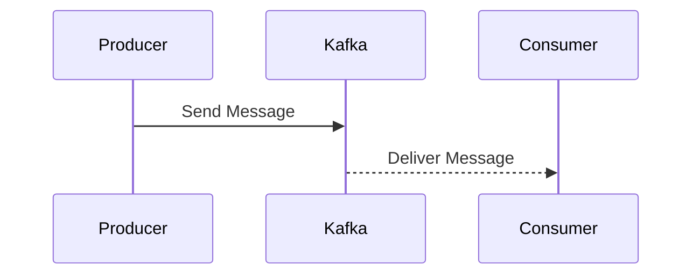
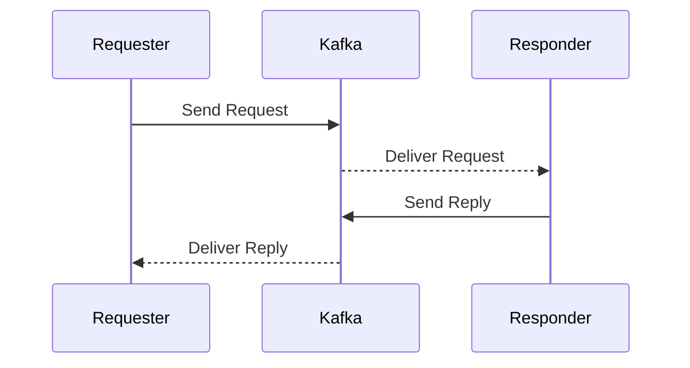
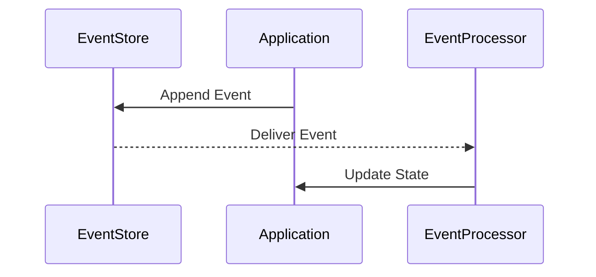

## 9.1.2 Communication Patterns

In the realm of event-driven microservices, communication patterns play a pivotal role in determining the efficiency, scalability, and reliability of the system. Apache Kafka, with its robust messaging capabilities, serves as a backbone for implementing various communication patterns. This section delves into the intricacies of these patterns, providing insights into their use cases, implementation strategies, and the trade-offs involved.

### Asynchronous Messaging

#### Intent

Asynchronous messaging is a communication pattern where messages are sent between services without requiring an immediate response. This decouples the sender and receiver, allowing them to operate independently and improving system resilience.

#### Motivation

In microservices architectures, services often need to communicate without blocking each other. Asynchronous messaging facilitates this by enabling services to send messages to a broker like Kafka, which then delivers them to the appropriate consumers. This pattern is ideal for scenarios where immediate feedback is not necessary, such as logging, notifications, or batch processing.

#### Applicability

- **Decoupled Services**: When services need to operate independently without waiting for each other.
- **High Throughput**: Suitable for systems requiring high message throughput.
- **Fault Tolerance**: Enhances fault tolerance by allowing services to continue operating even if some components fail.

#### Structure



**Caption**: Asynchronous messaging flow where the producer sends a message to Kafka, which is then delivered to the consumer.

#### Participants

- **Producer**: Sends messages to Kafka.
- **Kafka Broker**: Acts as an intermediary, storing and forwarding messages.
- **Consumer**: Receives and processes messages.

#### Collaborations

- **Producer and Kafka**: Producers send messages to Kafka topics.
- **Kafka and Consumer**: Kafka delivers messages to consumers subscribed to the topics.

#### Consequences

- **Benefits**: Decouples services, improves scalability, and enhances fault tolerance.
- **Drawbacks**: Potential for message loss if not configured correctly, increased complexity in ensuring message ordering and delivery guarantees.

#### Implementation

- **Java**:

    ```java
    import org.apache.kafka.clients.producer.KafkaProducer;
    import org.apache.kafka.clients.producer.ProducerRecord;
    import java.util.Properties;

    public class AsyncProducer {
        public static void main(String[] args) {
            Properties props = new Properties();
            props.put("bootstrap.servers", "localhost:9092");
            props.put("key.serializer", "org.apache.kafka.common.serialization.StringSerializer");
            props.put("value.serializer", "org.apache.kafka.common.serialization.StringSerializer");

            KafkaProducer<String, String> producer = new KafkaProducer<>(props);
            ProducerRecord<String, String> record = new ProducerRecord<>("my-topic", "key", "value");

            producer.send(record, (metadata, exception) -> {
                if (exception != null) {
                    exception.printStackTrace();
                } else {
                    System.out.println("Sent message with offset: " + metadata.offset());
                }
            });

            producer.close();
        }
    }
    ```

- **Scala**:

    ```scala
    import org.apache.kafka.clients.producer.{KafkaProducer, ProducerRecord}
    import java.util.Properties

    object AsyncProducer extends App {
      val props = new Properties()
      props.put("bootstrap.servers", "localhost:9092")
      props.put("key.serializer", "org.apache.kafka.common.serialization.StringSerializer")
      props.put("value.serializer", "org.apache.kafka.common.serialization.StringSerializer")

      val producer = new KafkaProducer[String, String](props)
      val record = new ProducerRecord[String, String]("my-topic", "key", "value")

      producer.send(record, (metadata, exception) => {
        if (exception != null) exception.printStackTrace()
        else println(s"Sent message with offset: ${metadata.offset()}")
      })

      producer.close()
    }
    ```

- **Kotlin**:

    ```kotlin
    import org.apache.kafka.clients.producer.KafkaProducer
    import org.apache.kafka.clients.producer.ProducerRecord
    import java.util.Properties

    fun main() {
        val props = Properties().apply {
            put("bootstrap.servers", "localhost:9092")
            put("key.serializer", "org.apache.kafka.common.serialization.StringSerializer")
            put("value.serializer", "org.apache.kafka.common.serialization.StringSerializer")
        }

        val producer = KafkaProducer<String, String>(props)
        val record = ProducerRecord("my-topic", "key", "value")

        producer.send(record) { metadata, exception ->
            if (exception != null) {
                exception.printStackTrace()
            } else {
                println("Sent message with offset: ${metadata.offset()}")
            }
        }

        producer.close()
    }
    ```

- **Clojure**:

    ```clojure
    (ns async-producer
      (:require [clojure.java.io :as io])
      (:import [org.apache.kafka.clients.producer KafkaProducer ProducerRecord]))

    (defn create-producer []
      (let [props (doto (java.util.Properties.)
                    (.put "bootstrap.servers" "localhost:9092")
                    (.put "key.serializer" "org.apache.kafka.common.serialization.StringSerializer")
                    (.put "value.serializer" "org.apache.kafka.common.serialization.StringSerializer"))]
        (KafkaProducer. props)))

    (defn send-message [producer topic key value]
      (let [record (ProducerRecord. topic key value)]
        (.send producer record
               (reify org.apache.kafka.clients.producer.Callback
                 (onCompletion [_ metadata exception]
                   (if exception
                     (.printStackTrace exception)
                     (println "Sent message with offset:" (.offset metadata))))))))

    (defn -main []
      (let [producer (create-producer)]
        (send-message producer "my-topic" "key" "value")
        (.close producer)))
    ```

#### Sample Use Cases

- **Logging Systems**: Asynchronous logging to avoid blocking application processes.
- **Notification Services**: Sending notifications without waiting for user acknowledgment.
- **Batch Processing**: Collecting data for batch processing at a later time.

#### Related Patterns

- **[4.1.1 Queue vs. Publish/Subscribe Models]( "Queue vs. Publish/Subscribe Models")**: Asynchronous messaging is often implemented using publish/subscribe models.

### Request-Reply

#### Intent

The request-reply pattern involves a service sending a request and waiting for a response. This pattern is synchronous and is used when immediate feedback is required.

#### Motivation

While asynchronous messaging is suitable for many scenarios, there are cases where a service needs to wait for a response before proceeding. The request-reply pattern is essential in such situations, providing a mechanism for synchronous communication.

#### Applicability

- **Synchronous Operations**: When operations require immediate feedback.
- **Transactional Workflows**: In workflows where each step depends on the completion of the previous one.
- **Service Queries**: When querying a service for information.

#### Structure



**Caption**: Request-reply communication flow where the requester sends a request to Kafka, which is delivered to the responder, and the reply is sent back through Kafka.

#### Participants

- **Requester**: Sends a request message.
- **Kafka Broker**: Routes messages between requester and responder.
- **Responder**: Processes the request and sends a reply.

#### Collaborations

- **Requester and Kafka**: Requesters send requests to Kafka topics.
- **Kafka and Responder**: Kafka delivers requests to responders and replies back to requesters.

#### Consequences

- **Benefits**: Provides synchronous communication, ensuring that responses are received before proceeding.
- **Drawbacks**: Introduces latency and potential bottlenecks, as services must wait for responses.

#### Implementation

- **Java**:

    ```java
    import org.apache.kafka.clients.consumer.ConsumerRecord;
    import org.apache.kafka.clients.consumer.KafkaConsumer;
    import org.apache.kafka.clients.consumer.ConsumerRecords;
    import org.apache.kafka.clients.producer.KafkaProducer;
    import org.apache.kafka.clients.producer.ProducerRecord;
    import java.util.Collections;
    import java.util.Properties;

    public class RequestReply {
        public static void main(String[] args) {
            Properties producerProps = new Properties();
            producerProps.put("bootstrap.servers", "localhost:9092");
            producerProps.put("key.serializer", "org.apache.kafka.common.serialization.StringSerializer");
            producerProps.put("value.serializer", "org.apache.kafka.common.serialization.StringSerializer");

            KafkaProducer<String, String> producer = new KafkaProducer<>(producerProps);
            ProducerRecord<String, String> request = new ProducerRecord<>("request-topic", "key", "request");

            producer.send(request);

            Properties consumerProps = new Properties();
            consumerProps.put("bootstrap.servers", "localhost:9092");
            consumerProps.put("group.id", "reply-group");
            consumerProps.put("key.deserializer", "org.apache.kafka.common.serialization.StringDeserializer");
            consumerProps.put("value.deserializer", "org.apache.kafka.common.serialization.StringDeserializer");

            KafkaConsumer<String, String> consumer = new KafkaConsumer<>(consumerProps);
            consumer.subscribe(Collections.singletonList("reply-topic"));

            ConsumerRecords<String, String> records = consumer.poll(1000);
            for (ConsumerRecord<String, String> record : records) {
                System.out.println("Received reply: " + record.value());
            }

            producer.close();
            consumer.close();
        }
    }
    ```

- **Scala**:

    ```scala
    import org.apache.kafka.clients.consumer.{ConsumerRecords, KafkaConsumer}
    import org.apache.kafka.clients.producer.{KafkaProducer, ProducerRecord}
    import java.util.{Collections, Properties}

    object RequestReply extends App {
      val producerProps = new Properties()
      producerProps.put("bootstrap.servers", "localhost:9092")
      producerProps.put("key.serializer", "org.apache.kafka.common.serialization.StringSerializer")
      producerProps.put("value.serializer", "org.apache.kafka.common.serialization.StringSerializer")

      val producer = new KafkaProducer[String, String](producerProps)
      val request = new ProducerRecord[String, String]("request-topic", "key", "request")

      producer.send(request)

      val consumerProps = new Properties()
      consumerProps.put("bootstrap.servers", "localhost:9092")
      consumerProps.put("group.id", "reply-group")
      consumerProps.put("key.deserializer", "org.apache.kafka.common.serialization.StringDeserializer")
      consumerProps.put("value.deserializer", "org.apache.kafka.common.serialization.StringDeserializer")

      val consumer = new KafkaConsumer[String, String](consumerProps)
      consumer.subscribe(Collections.singletonList("reply-topic"))

      val records: ConsumerRecords[String, String] = consumer.poll(1000)
      records.forEach(record => println(s"Received reply: ${record.value()}"))

      producer.close()
      consumer.close()
    }
    ```

- **Kotlin**:

    ```kotlin
    import org.apache.kafka.clients.consumer.ConsumerRecords
    import org.apache.kafka.clients.consumer.KafkaConsumer
    import org.apache.kafka.clients.producer.KafkaProducer
    import org.apache.kafka.clients.producer.ProducerRecord
    import java.util.Collections
    import java.util.Properties

    fun main() {
        val producerProps = Properties().apply {
            put("bootstrap.servers", "localhost:9092")
            put("key.serializer", "org.apache.kafka.common.serialization.StringSerializer")
            put("value.serializer", "org.apache.kafka.common.serialization.StringSerializer")
        }

        val producer = KafkaProducer<String, String>(producerProps)
        val request = ProducerRecord("request-topic", "key", "request")

        producer.send(request)

        val consumerProps = Properties().apply {
            put("bootstrap.servers", "localhost:9092")
            put("group.id", "reply-group")
            put("key.deserializer", "org.apache.kafka.common.serialization.StringDeserializer")
            put("value.deserializer", "org.apache.kafka.common.serialization.StringDeserializer")
        }

        val consumer = KafkaConsumer<String, String>(consumerProps)
        consumer.subscribe(Collections.singletonList("reply-topic"))

        val records: ConsumerRecords<String, String> = consumer.poll(1000)
        records.forEach { record -> println("Received reply: ${record.value()}") }

        producer.close()
        consumer.close()
    }
    ```

- **Clojure**:

    ```clojure
    (ns request-reply
      (:require [clojure.java.io :as io])
      (:import [org.apache.kafka.clients.consumer KafkaConsumer ConsumerRecords]
               [org.apache.kafka.clients.producer KafkaProducer ProducerRecord]))

    (defn create-producer []
      (let [props (doto (java.util.Properties.)
                    (.put "bootstrap.servers" "localhost:9092")
                    (.put "key.serializer" "org.apache.kafka.common.serialization.StringSerializer")
                    (.put "value.serializer" "org.apache.kafka.common.serialization.StringSerializer"))]
        (KafkaProducer. props)))

    (defn create-consumer []
      (let [props (doto (java.util.Properties.)
                    (.put "bootstrap.servers" "localhost:9092")
                    (.put "group.id" "reply-group")
                    (.put "key.deserializer" "org.apache.kafka.common.serialization.StringDeserializer")
                    (.put "value.deserializer" "org.apache.kafka.common.serialization.StringDeserializer"))]
        (KafkaConsumer. props)))

    (defn send-request [producer topic key value]
      (let [record (ProducerRecord. topic key value)]
        (.send producer record)))

    (defn receive-reply [consumer topic]
      (.subscribe consumer (java.util.Collections/singletonList topic))
      (let [records (.poll consumer 1000)]
        (doseq [record records]
          (println "Received reply:" (.value record)))))

    (defn -main []
      (let [producer (create-producer)
            consumer (create-consumer)]
        (send-request producer "request-topic" "key" "request")
        (receive-reply consumer "reply-topic")
        (.close producer)
        (.close consumer)))
    ```

#### Sample Use Cases

- **Service Queries**: Querying a service for data and waiting for a response.
- **Transactional Workflows**: Ensuring each step in a workflow is completed before proceeding.
- **Synchronous Operations**: Operations that require immediate feedback.

#### Related Patterns

- **[4.4.1 At-Most-Once, At-Least-Once, and Exactly-Once Semantics]( "At-Most-Once, At-Least-Once, and Exactly-Once Semantics")**: Ensuring message delivery guarantees in request-reply patterns.

### Event Sourcing

#### Intent

Event sourcing is a pattern where state changes are logged as a sequence of events. This allows the system to reconstruct the current state by replaying these events.

#### Motivation

In traditional systems, state changes are often stored directly, leading to potential data loss and lack of auditability. Event sourcing addresses these issues by storing each state change as an event, providing a complete history of changes.

#### Applicability

- **Auditability**: When a complete history of changes is required.
- **Reconstructing State**: When the ability to reconstruct state from events is needed.
- **Temporal Queries**: When querying past states is necessary.

#### Structure



**Caption**: Event sourcing flow where the application appends events to the event store, which are then processed to update the application state.

#### Participants

- **Event Store**: Stores events in sequence.
- **Application**: Generates and appends events.
- **Event Processor**: Processes events to update state.

#### Collaborations

- **Application and Event Store**: Applications append events to the event store.
- **Event Store and Event Processor**: Event processors consume events to update application state.

#### Consequences

- **Benefits**: Provides a complete history of changes, enables state reconstruction, and supports temporal queries.
- **Drawbacks**: Increased storage requirements, complexity in managing event versions and schema evolution.

#### Implementation

- **Java**:

    ```java
    import org.apache.kafka.clients.consumer.ConsumerRecord;
    import org.apache.kafka.clients.consumer.KafkaConsumer;
    import org.apache.kafka.clients.consumer.ConsumerRecords;
    import org.apache.kafka.clients.producer.KafkaProducer;
    import org.apache.kafka.clients.producer.ProducerRecord;
    import java.util.Collections;
    import java.util.Properties;

    public class EventSourcing {
        public static void main(String[] args) {
            Properties producerProps = new Properties();
            producerProps.put("bootstrap.servers", "localhost:9092");
            producerProps.put("key.serializer", "org.apache.kafka.common.serialization.StringSerializer");
            producerProps.put("value.serializer", "org.apache.kafka.common.serialization.StringSerializer");

            KafkaProducer<String, String> producer = new KafkaProducer<>(producerProps);
            ProducerRecord<String, String> event = new ProducerRecord<>("event-topic", "key", "event");

            producer.send(event);

            Properties consumerProps = new Properties();
            consumerProps.put("bootstrap.servers", "localhost:9092");
            consumerProps.put("group.id", "event-group");
            consumerProps.put("key.deserializer", "org.apache.kafka.common.serialization.StringDeserializer");
            consumerProps.put("value.deserializer", "org.apache.kafka.common.serialization.StringDeserializer");

            KafkaConsumer<String, String> consumer = new KafkaConsumer<>(consumerProps);
            consumer.subscribe(Collections.singletonList("event-topic"));

            ConsumerRecords<String, String> records = consumer.poll(1000);
            for (ConsumerRecord<String, String> record : records) {
                System.out.println("Processed event: " + record.value());
            }

            producer.close();
            consumer.close();
        }
    }
    ```

- **Scala**:

    ```scala
    import org.apache.kafka.clients.consumer.{ConsumerRecords, KafkaConsumer}
    import org.apache.kafka.clients.producer.{KafkaProducer, ProducerRecord}
    import java.util.{Collections, Properties}

    object EventSourcing extends App {
      val producerProps = new Properties()
      producerProps.put("bootstrap.servers", "localhost:9092")
      producerProps.put("key.serializer", "org.apache.kafka.common.serialization.StringSerializer")
      producerProps.put("value.serializer", "org.apache.kafka.common.serialization.StringSerializer")

      val producer = new KafkaProducer[String, String](producerProps)
      val event = new ProducerRecord[String, String]("event-topic", "key", "event")

      producer.send(event)

      val consumerProps = new Properties()
      consumerProps.put("bootstrap.servers", "localhost:9092")
      consumerProps.put("group.id", "event-group")
      consumerProps.put("key.deserializer", "org.apache.kafka.common.serialization.StringDeserializer")
      consumerProps.put("value.deserializer", "org.apache.kafka.common.serialization.StringDeserializer")

      val consumer = new KafkaConsumer[String, String](consumerProps)
      consumer.subscribe(Collections.singletonList("event-topic"))

      val records: ConsumerRecords[String, String] = consumer.poll(1000)
      records.forEach(record => println(s"Processed event: ${record.value()}"))

      producer.close()
      consumer.close()
    }
    ```

- **Kotlin**:

    ```kotlin
    import org.apache.kafka.clients.consumer.ConsumerRecords
    import org.apache.kafka.clients.consumer.KafkaConsumer
    import org.apache.kafka.clients.producer.KafkaProducer
    import org.apache.kafka.clients.producer.ProducerRecord
    import java.util.Collections
    import java.util.Properties

    fun main() {
        val producerProps = Properties().apply {
            put("bootstrap.servers", "localhost:9092")
            put("key.serializer", "org.apache.kafka.common.serialization.StringSerializer")
            put("value.serializer", "org.apache.kafka.common.serialization.StringSerializer")
        }

        val producer = KafkaProducer<String, String>(producerProps)
        val event = ProducerRecord("event-topic", "key", "event")

        producer.send(event)

        val consumerProps = Properties().apply {
            put("bootstrap.servers", "localhost:9092")
            put("group.id", "event-group")
            put("key.deserializer", "org.apache.kafka.common.serialization.StringDeserializer")
            put("value.deserializer", "org.apache.kafka.common.serialization.StringDeserializer")
        }

        val consumer = KafkaConsumer<String, String>(consumerProps)
        consumer.subscribe(Collections.singletonList("event-topic"))

        val records: ConsumerRecords<String, String> = consumer.poll(1000)
        records.forEach { record -> println("Processed event: ${record.value()}") }

        producer.close()
        consumer.close()
    }
    ```

- **Clojure**:

    ```clojure
    (ns event-sourcing
      (:require [clojure.java.io :as io])
      (:import [org.apache.kafka.clients.consumer KafkaConsumer ConsumerRecords]
               [org.apache.kafka.clients.producer KafkaProducer ProducerRecord]))

    (defn create-producer []
      (let [props (doto (java.util.Properties.)
                    (.put "bootstrap.servers" "localhost:9092")
                    (.put "key.serializer" "org.apache.kafka.common.serialization.StringSerializer")
                    (.put "value.serializer" "org.apache.kafka.common.serialization.StringSerializer"))]
        (KafkaProducer. props)))

    (defn create-consumer []
      (let [props (doto (java.util.Properties.)
                    (.put "bootstrap.servers" "localhost:9092")
                    (.put "group.id" "event-group")
                    (.put "key.deserializer" "org.apache.kafka.common.serialization.StringDeserializer")
                    (.put "value.deserializer" "org.apache.kafka.common.serialization.StringDeserializer"))]
        (KafkaConsumer. props)))

    (defn append-event [producer topic key value]
      (let [record (ProducerRecord. topic key value)]
        (.send producer record)))

    (defn process-events [consumer topic]
      (.subscribe consumer (java.util.Collections/singletonList topic))
      (let [records (.poll consumer 1000)]
        (doseq [record records]
          (println "Processed event:" (.value record)))))

    (defn -main []
      (let [producer (create-producer)
            consumer (create-consumer)]
        (append-event producer "event-topic" "key" "event")
        (process-events consumer "event-topic")
        (.close producer)
        (.close consumer)))
    ```

#### Sample Use Cases

- **Audit Logs**: Maintaining a complete history of changes for audit purposes.
- **State Reconstruction**: Reconstructing application state by replaying events.
- **Temporal Queries**: Querying past states for analysis or debugging.

#### Related Patterns

- **[4.5.1 Implementing Event Sourcing Patterns]( "Implementing Event Sourcing Patterns")**: Detailed implementation strategies for event sourcing.

### Trade-offs and Best Practices

#### Trade-offs

- **Complexity**: Some patterns, like event sourcing, introduce complexity in managing events and state reconstruction.
- **Performance**: Synchronous patterns like request-reply can introduce latency and bottlenecks.
- **Consistency**: Ensuring consistency across distributed systems can be challenging, especially with asynchronous patterns.

#### Best Practices

- **Pattern Selection**: Choose patterns based on the specific requirements of your system, such as latency tolerance, throughput needs, and consistency requirements.
- **Configuration**: Properly configure Kafka to ensure message delivery guarantees and fault tolerance.
- **Monitoring**: Implement monitoring and alerting to detect and resolve issues promptly.
- **Documentation**: Document your architecture and patterns to facilitate maintenance and onboarding.

### Conclusion

Communication patterns are fundamental to the design of event-driven microservices. By leveraging Apache Kafka, you can implement these patterns effectively, ensuring scalability, resilience, and efficiency in your systems. Understanding the trade-offs and best practices associated with each pattern will enable you to make informed decisions and optimize your architecture for your specific needs.

## Test Your Knowledge: Advanced Kafka Communication Patterns Quiz



### What is the primary benefit of asynchronous messaging in microservices?

- [x] Decouples services, allowing them to operate independently.
- [ ] Provides immediate feedback to the sender.
- [ ] Ensures message delivery in real-time.
- [ ] Reduces storage requirements.

> **Explanation:** Asynchronous messaging decouples services, allowing them to operate independently without waiting for each other, which enhances system resilience and scalability.

### In which scenario is the request-reply pattern most applicable?

- [x] When immediate feedback is required.
- [ ] When high throughput is needed.
- [ ] When services need to operate independently.
- [ ] When storing a complete history of changes.

> **Explanation:** The request-reply pattern is used when immediate feedback is required, as it involves synchronous communication between services.

### What is a key advantage of event sourcing?

- [x] Provides a complete history of changes.
- [ ] Reduces storage requirements.
- [ ] Simplifies state management.
- [ ] Ensures real-time data processing.

> **Explanation:** Event sourcing provides a complete history of changes by storing each state change as an event, allowing for state reconstruction and auditability.

### Which pattern introduces potential latency and bottlenecks due to its synchronous nature?

- [x] Request-reply
- [ ] Asynchronous messaging
- [ ] Event sourcing
- [ ] Publish/subscribe

> **Explanation:** The request-reply pattern introduces potential latency and bottlenecks because it requires services to wait for responses, making it synchronous.

### What is a common use case for asynchronous messaging?

- [x] Logging systems
- [ ] Service queries
- [ ] Transactional workflows
- [ ] Temporal queries

> **Explanation:** Asynchronous messaging is commonly used in logging systems to avoid blocking application processes and ensure high throughput.

### Which pattern is best suited for maintaining audit logs?

- [x] Event sourcing
- [ ] Request-reply
- [ ] Asynchronous messaging
- [ ] Publish/subscribe

> **Explanation:** Event sourcing is best suited for maintaining audit logs as it stores a complete history of changes, providing auditability.

### What is a drawback of event sourcing?

- [x] Increased storage requirements
- [ ] Lack of auditability
- [ ] Inability to reconstruct state
- [ ] Synchronous communication

> **Explanation:** Event sourcing increases storage requirements because it stores each state change as an event, which can lead to large volumes of data.

### Which pattern is ideal for decoupling services in a microservices architecture?

- [x] Asynchronous messaging
- [ ] Request-reply
- [ ] Event sourcing
- [ ] Publish/subscribe

> **Explanation:** Asynchronous messaging is ideal for decoupling services, allowing them to operate independently and improving system resilience.

### What is a key consideration when implementing communication patterns with Kafka?

- [x] Proper configuration to ensure message delivery guarantees
- [ ] Reducing the number of topics
- [ ] Limiting the number of consumers
- [ ] Avoiding the use of schemas

> **Explanation:** Proper configuration of Kafka is crucial to ensure message delivery guarantees, fault tolerance, and optimal performance.

### True or False: Event sourcing simplifies state management by storing only the current state.

- [ ] True
- [x] False

> **Explanation:** False. Event sourcing does not simplify state management by storing only the current state; instead, it stores each state change as an event, allowing for state reconstruction.



---

By understanding and implementing these communication patterns, you can design robust, scalable, and efficient event-driven microservices using Apache Kafka.
