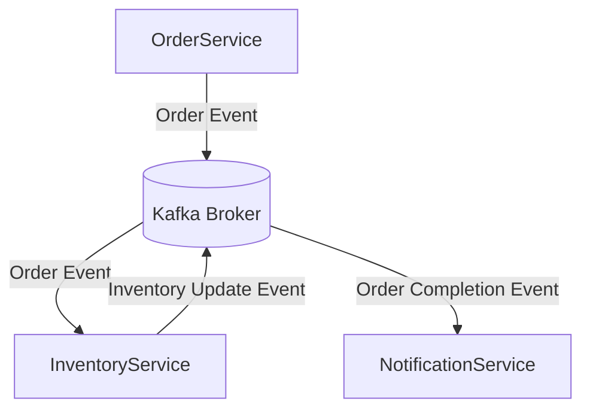

## 9.1 Designing Event-Driven Microservices

### Introduction

Event-driven microservices represent a paradigm shift in software architecture, emphasizing the use of events to trigger and communicate between decoupled services. This approach enhances scalability, resilience, and flexibility, making it ideal for modern distributed systems. Apache Kafka, a distributed event streaming platform, plays a pivotal role in facilitating asynchronous communication between microservices, enabling them to react to events in real-time.

### Defining Event-Driven Microservices

**Event-driven microservices** are architectural patterns where services communicate by producing and consuming events. Unlike traditional request-response models, event-driven architectures rely on asynchronous messaging, allowing services to operate independently and react to changes in the system state.

#### Benefits of Event-Driven Microservices

- **Decoupling**: Services are loosely coupled, reducing dependencies and allowing independent development and deployment.
- **Scalability**: Services can scale independently based on demand, optimizing resource utilization.
- **Resilience**: The system can handle failures gracefully, as services are not tightly bound to each other.
- **Flexibility**: New services can be added or modified without impacting existing ones, facilitating continuous integration and delivery.

### How Kafka Facilitates Asynchronous Communication

Apache Kafka serves as a robust backbone for event-driven microservices by providing a scalable and fault-tolerant platform for event streaming. It enables services to publish and subscribe to event streams, decoupling the producers and consumers of data.

#### Key Features of Kafka in Microservices

- **High Throughput**: Kafka can handle large volumes of data with low latency, making it suitable for real-time applications.
- **Durability**: Events are persisted on disk, ensuring data is not lost even if consumers are temporarily unavailable.
- **Scalability**: Kafka's partitioning and replication mechanisms allow it to scale horizontally, accommodating growing data and service demands.
- **Fault Tolerance**: Kafka's distributed architecture ensures high availability and resilience against node failures.

### Architectural Patterns and Design Considerations

Designing event-driven microservices with Kafka involves several architectural patterns and considerations to ensure efficient communication and processing of events.

#### Event Sourcing

**Event sourcing** is a pattern where state changes are captured as a sequence of events. Instead of storing the current state, the system records every change, allowing it to reconstruct the state by replaying events.

- **Applicability**: Use event sourcing when you need a complete audit trail of changes or when reconstructing state from events is beneficial.
- **Implementation**: Store events in Kafka topics and use consumers to rebuild state in downstream services.

#### Command Query Responsibility Segregation (CQRS)

**CQRS** separates the read and write operations of a system, optimizing each for its specific use case.

- **Applicability**: Ideal for systems with complex read and write requirements, where separating concerns can improve performance and scalability.
- **Implementation**: Use Kafka to handle command events and update read models asynchronously.

#### Choreography vs. Orchestration

- **Choreography**: Services react to events and execute their logic independently. This pattern is suitable for simple workflows where services can operate autonomously.
- **Orchestration**: A central orchestrator manages the workflow, coordinating the execution of services. Use this pattern for complex workflows requiring centralized control.

#### Designing for Scalability and Resilience

- **Partitioning**: Design topics with appropriate partitioning strategies to distribute load and ensure parallel processing.
- **Replication**: Configure replication factors to enhance fault tolerance and data availability.
- **Consumer Groups**: Use consumer groups to balance load across multiple instances of a service, ensuring high availability and scalability.

### Examples of Services Interacting via Kafka

Consider a retail application where various services interact through Kafka to process orders, update inventory, and notify customers.

#### Order Service

The **Order Service** publishes events to a Kafka topic when a new order is placed.

```java
// Java example for publishing an order event
import org.apache.kafka.clients.producer.KafkaProducer;
import org.apache.kafka.clients.producer.ProducerRecord;
import java.util.Properties;

public class OrderService {
    private KafkaProducer<String, String> producer;

    public OrderService() {
        Properties props = new Properties();
        props.put("bootstrap.servers", "localhost:9092");
        props.put("key.serializer", "org.apache.kafka.common.serialization.StringSerializer");
        props.put("value.serializer", "org.apache.kafka.common.serialization.StringSerializer");
        producer = new KafkaProducer<>(props);
    }

    public void placeOrder(String orderId, String orderDetails) {
        ProducerRecord<String, String> record = new ProducerRecord<>("orders", orderId, orderDetails);
        producer.send(record);
    }
}
```

#### Inventory Service

The **Inventory Service** consumes order events to update stock levels.

```scala
// Scala example for consuming order events
import org.apache.kafka.clients.consumer.KafkaConsumer
import java.util.Properties
import scala.collection.JavaConverters._

object InventoryService {
  def main(args: Array[String]): Unit = {
    val props = new Properties()
    props.put("bootstrap.servers", "localhost:9092")
    props.put("group.id", "inventory-service")
    props.put("key.deserializer", "org.apache.kafka.common.serialization.StringDeserializer")
    props.put("value.deserializer", "org.apache.kafka.common.serialization.StringDeserializer")

    val consumer = new KafkaConsumer[String, String](props)
    consumer.subscribe(List("orders").asJava)

    while (true) {
      val records = consumer.poll(100)
      for (record <- records.asScala) {
        println(s"Updating inventory for order: ${record.key()}")
        // Update inventory logic here
      }
    }
  }
}
```

#### Notification Service

The **Notification Service** listens for order completion events to notify customers.

```kotlin
// Kotlin example for consuming order completion events
import org.apache.kafka.clients.consumer.KafkaConsumer
import java.util.Properties

fun main() {
    val props = Properties()
    props["bootstrap.servers"] = "localhost:9092"
    props["group.id"] = "notification-service"
    props["key.deserializer"] = "org.apache.kafka.common.serialization.StringDeserializer"
    props["value.deserializer"] = "org.apache.kafka.common.serialization.StringDeserializer"

    val consumer = KafkaConsumer<String, String>(props)
    consumer.subscribe(listOf("order-completions"))

    while (true) {
        val records = consumer.poll(100)
        for (record in records) {
            println("Notifying customer for order: ${record.key()}")
            // Send notification logic here
        }
    }
}
```

### Best Practices for Service Decoupling and Message Design

#### Service Decoupling

- **Use Topics for Communication**: Ensure services communicate through Kafka topics rather than direct calls, promoting loose coupling.
- **Define Clear Event Contracts**: Establish well-defined schemas for events to ensure compatibility and ease of integration.
- **Leverage Schema Registry**: Use [1.3.3 Schema Registry]( "Schema Registry") to manage and enforce event schemas, facilitating schema evolution.

#### Message Design

- **Design for Idempotency**: Ensure that consuming services can handle duplicate events gracefully, maintaining consistent state.
- **Include Metadata**: Add metadata such as timestamps and event types to messages for better processing and debugging.
- **Optimize Payload Size**: Keep message payloads small to reduce network overhead and improve processing efficiency.

### Visualizing Event-Driven Microservices Architecture

Below is a diagram illustrating the interaction between services in an event-driven architecture using Kafka.



**Diagram Description**: This diagram shows the flow of events between the Order Service, Inventory Service, and Notification Service through Kafka. Each service publishes and consumes events independently, demonstrating decoupled communication.

### Conclusion

Designing event-driven microservices with Apache Kafka enables the creation of scalable, resilient, and flexible systems. By leveraging Kafka's capabilities for asynchronous messaging, services can operate independently, reacting to events in real-time. This architecture not only enhances system performance but also simplifies the integration of new services and features.

## Test Your Knowledge: Event-Driven Microservices with Kafka



### What is a primary benefit of using event-driven microservices?

- [x] Decoupling services for independent development
- [ ] Increasing direct communication between services
- [ ] Reducing the need for data persistence
- [ ] Simplifying synchronous communication

> **Explanation:** Event-driven microservices decouple services, allowing them to be developed and deployed independently.

### How does Kafka facilitate asynchronous communication in microservices?

- [x] By providing a distributed event streaming platform
- [ ] By enabling direct HTTP calls between services
- [ ] By storing data in a centralized database
- [ ] By using a monolithic architecture

> **Explanation:** Kafka provides a distributed platform for event streaming, enabling asynchronous communication between services.

### Which pattern involves capturing state changes as a sequence of events?

- [x] Event Sourcing
- [ ] CQRS
- [ ] Orchestration
- [ ] Choreography

> **Explanation:** Event sourcing captures state changes as events, allowing the system to reconstruct state by replaying them.

### What is the role of consumer groups in Kafka?

- [x] Balancing load across multiple instances of a service
- [ ] Storing events in a database
- [ ] Directly calling other services
- [ ] Managing HTTP requests

> **Explanation:** Consumer groups allow multiple instances of a service to consume messages from a Kafka topic, balancing the load.

### Which of the following is a best practice for message design in Kafka?

- [x] Design for idempotency
- [ ] Use large payloads
- [ ] Avoid metadata
- [ ] Use direct service calls

> **Explanation:** Designing for idempotency ensures that consuming services can handle duplicate events without issues.

### What is a key feature of Kafka that supports high throughput?

- [x] Partitioning
- [ ] Centralized database
- [ ] Direct service calls
- [ ] Monolithic architecture

> **Explanation:** Kafka's partitioning allows it to handle large volumes of data with high throughput.

### Which architectural pattern separates read and write operations?

- [x] CQRS
- [ ] Event Sourcing
- [ ] Choreography
- [ ] Orchestration

> **Explanation:** CQRS separates read and write operations, optimizing each for its specific use case.

### What is a benefit of using the Schema Registry with Kafka?

- [x] Managing and enforcing event schemas
- [ ] Storing events in a database
- [ ] Directly calling other services
- [ ] Simplifying synchronous communication

> **Explanation:** The Schema Registry manages and enforces event schemas, facilitating schema evolution and compatibility.

### Which pattern involves services reacting to events independently?

- [x] Choreography
- [ ] Orchestration
- [ ] CQRS
- [ ] Event Sourcing

> **Explanation:** In choreography, services react to events independently, executing their logic without centralized control.

### True or False: Kafka's durability feature ensures that events are not lost even if consumers are temporarily unavailable.

- [x] True
- [ ] False

> **Explanation:** Kafka's durability ensures that events are persisted on disk, preventing data loss even if consumers are unavailable.



---

By following these guidelines, software engineers and enterprise architects can effectively design and implement event-driven microservices using Apache Kafka, leveraging its powerful features to build robust and scalable systems.
