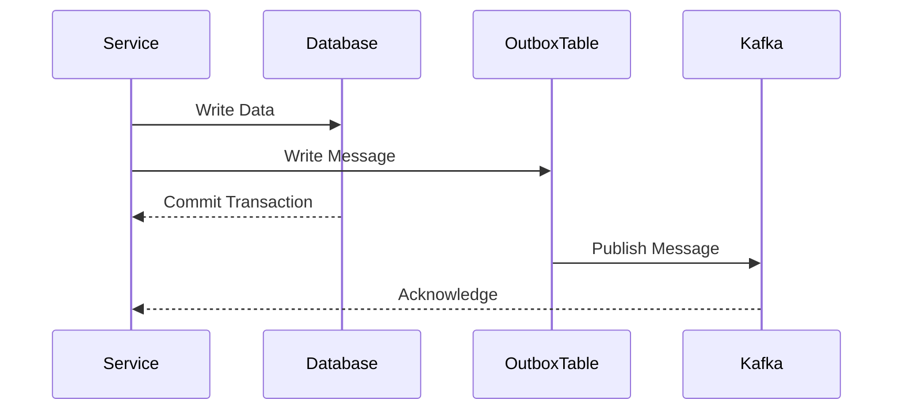

## 9.2.1 Implementing the Outbox Pattern

### Introduction

In the realm of microservices and event-driven architectures, ensuring reliable message delivery is paramount. The Outbox Pattern is a design pattern that addresses the challenge of achieving atomicity between database operations and message publication. This section provides a comprehensive guide on implementing the Outbox Pattern using Apache Kafka, focusing on design, transaction management, scaling, and error handling.

### Intent

The Outbox Pattern aims to ensure that changes in a service's database and the corresponding messages sent to a message broker like Kafka are atomic. This pattern prevents scenarios where a database transaction is committed, but the message fails to be published, or vice versa.

### Motivation

In distributed systems, maintaining consistency between a database and a message broker is challenging. The Outbox Pattern solves this by using a single transaction to write to both the database and an outbox table, which acts as a buffer for messages to be published. This ensures that either both operations succeed or neither does, maintaining consistency.

### Applicability

The Outbox Pattern is applicable in scenarios where:

- **Atomicity** between database updates and message publication is required.
- **Event-driven architectures** are employed, and services need to react to changes in a database.
- **Microservices** need to communicate reliably without losing messages.

### Structure

The structure of the Outbox Pattern involves several key components:

- **Service Database**: Contains the primary data and the outbox table.
- **Outbox Table**: Stores messages to be published to Kafka.
- **Transaction Management**: Ensures atomic writes to both the primary data and the outbox table.
- **Outbox Reader**: Reads messages from the outbox table and publishes them to Kafka.
- **Kafka**: Acts as the message broker for inter-service communication.



*Diagram: The sequence of operations in the Outbox Pattern, ensuring atomicity between database writes and message publication.*

### Participants

- **Service**: The microservice performing the database operation and writing to the outbox table.
- **Database**: The primary data store for the service, including the outbox table.
- **Outbox Table**: A dedicated table for storing messages to be published.
- **Kafka**: The message broker for publishing messages.
- **Outbox Reader**: A component or service responsible for reading from the outbox table and publishing messages to Kafka.

### Collaborations

- The **Service** writes to both the primary data and the outbox table within a single transaction.
- The **Outbox Reader** periodically polls the outbox table, reads new messages, and publishes them to **Kafka**.
- **Kafka** acknowledges the receipt of messages, allowing the **Outbox Reader** to mark them as processed.

### Consequences

- **Benefits**: Ensures atomicity and consistency, reduces the risk of message loss, and decouples message publication from the main service logic.
- **Drawbacks**: Introduces additional complexity in managing the outbox table and requires careful handling of message deduplication and error scenarios.

### Implementation

#### Designing the Outbox Table

The outbox table is a crucial component of the pattern. It should be designed to efficiently store and retrieve messages. A typical outbox table schema might include the following columns:

- **ID**: A unique identifier for each message.
- **Payload**: The message content, often serialized as JSON or another format.
- **Status**: Indicates whether the message is pending, published, or failed.
- **CreatedAt**: Timestamp of when the message was created.
- **UpdatedAt**: Timestamp of the last update to the message status.

```sql
CREATE TABLE outbox (
    id SERIAL PRIMARY KEY,
    payload JSONB NOT NULL,
    status VARCHAR(20) NOT NULL DEFAULT 'PENDING',
    created_at TIMESTAMP DEFAULT CURRENT_TIMESTAMP,
    updated_at TIMESTAMP DEFAULT CURRENT_TIMESTAMP
);
```

#### Transaction Management

To ensure atomicity, both the database operation and the outbox write should occur within the same transaction. This can be achieved using transaction management features provided by the database or ORM (Object-Relational Mapping) frameworks.

**Java Example using Spring Boot and JPA:**

```java
import org.springframework.beans.factory.annotation.Autowired;
import org.springframework.stereotype.Service;
import org.springframework.transaction.annotation.Transactional;

@Service
public class OrderService {

    @Autowired
    private OrderRepository orderRepository;

    @Autowired
    private OutboxRepository outboxRepository;

    @Transactional
    public void createOrder(Order order) {
        orderRepository.save(order);
        OutboxMessage message = new OutboxMessage(order.toJson());
        outboxRepository.save(message);
    }
}
```

**Scala Example using Slick:**

```scala
import slick.jdbc.PostgresProfile.api._
import scala.concurrent.ExecutionContext.Implicits.global

class OrderService(db: Database) {

  def createOrder(order: Order): Future[Unit] = {
    val action = for {
      _ <- orders += order
      _ <- outbox += OutboxMessage(order.toJson)
    } yield ()

    db.run(action.transactionally)
  }
}
```

**Kotlin Example using Exposed:**

```kotlin
import org.jetbrains.exposed.sql.transactions.transaction

class OrderService {

    fun createOrder(order: Order) {
        transaction {
            Orders.insert { it.from(order) }
            Outbox.insert { it.from(order.toJson()) }
        }
    }
}
```

**Clojure Example using next.jdbc:**

```clojure
(require '[next.jdbc :as jdbc])

(defn create-order [db order]
  (jdbc/with-transaction [tx db]
    (jdbc/execute! tx ["INSERT INTO orders ..."])
    (jdbc/execute! tx ["INSERT INTO outbox ..."])))
```

#### Reading from the Outbox and Publishing to Kafka

The outbox reader is responsible for polling the outbox table, reading messages, and publishing them to Kafka. This can be implemented as a separate service or a background task within the existing service.

**Java Example using Kafka Producer:**

```java
import org.apache.kafka.clients.producer.KafkaProducer;
import org.apache.kafka.clients.producer.ProducerRecord;

public class OutboxReader {

    private KafkaProducer<String, String> producer;
    private OutboxRepository outboxRepository;

    public void publishMessages() {
        List<OutboxMessage> messages = outboxRepository.findPendingMessages();
        for (OutboxMessage message : messages) {
            producer.send(new ProducerRecord<>("topic", message.getPayload()), (metadata, exception) -> {
                if (exception == null) {
                    outboxRepository.markAsPublished(message);
                } else {
                    // Handle failure
                }
            });
        }
    }
}
```

**Scala Example using Kafka Producer:**

```scala
import org.apache.kafka.clients.producer.{KafkaProducer, ProducerRecord}

class OutboxReader(producer: KafkaProducer[String, String], outboxRepository: OutboxRepository) {

  def publishMessages(): Unit = {
    val messages = outboxRepository.findPendingMessages()
    messages.foreach { message =>
      producer.send(new ProducerRecord("topic", message.payload), (metadata, exception) => {
        if (exception == null) {
          outboxRepository.markAsPublished(message)
        } else {
          // Handle failure
        }
      })
    }
  }
}
```

**Kotlin Example using Kafka Producer:**

```kotlin
import org.apache.kafka.clients.producer.KafkaProducer
import org.apache.kafka.clients.producer.ProducerRecord

class OutboxReader(private val producer: KafkaProducer<String, String>, private val outboxRepository: OutboxRepository) {

    fun publishMessages() {
        val messages = outboxRepository.findPendingMessages()
        messages.forEach { message ->
            producer.send(ProducerRecord("topic", message.payload)) { metadata, exception ->
                if (exception == null) {
                    outboxRepository.markAsPublished(message)
                } else {
                    // Handle failure
                }
            }
        }
    }
}
```

**Clojure Example using Kafka Producer:**

```clojure
(require '[clj-kafka.producer :as producer])

(defn publish-messages [producer outbox-repo]
  (let [messages (find-pending-messages outbox-repo)]
    (doseq [message messages]
      (producer/send producer (producer/record "topic" (:payload message)))
      (mark-as-published outbox-repo message))))
```

### Considerations for Scaling and Error Handling

#### Scaling

- **Horizontal Scaling**: Deploy multiple instances of the outbox reader to increase throughput. Ensure that each instance processes distinct messages to avoid duplication.
- **Partitioning**: Use Kafka's partitioning feature to distribute messages across multiple partitions, allowing parallel processing by consumers.

#### Error Handling

- **Retries**: Implement retry logic for failed message publications. Consider exponential backoff strategies to manage retry intervals.
- **Dead Letter Queue (DLQ)**: Use a DLQ to handle messages that repeatedly fail to be published. This allows for manual inspection and resolution of problematic messages.
- **Idempotency**: Ensure that message processing is idempotent to handle duplicate messages gracefully.

### Sample Use Cases

- **Order Processing**: In an e-commerce application, use the Outbox Pattern to ensure that order confirmations are reliably sent to customers and inventory systems.
- **User Notifications**: In a social media platform, use the pattern to guarantee that user notifications are delivered even if the primary database operation succeeds but the message publication initially fails.

### Related Patterns

- **Transactional Outbox**: A variation of the Outbox Pattern where the outbox table is part of the same transaction as the primary database operation.
- **Change Data Capture (CDC)**: An alternative approach for capturing database changes and publishing them to Kafka, often used in conjunction with tools like Debezium.

### Conclusion

Implementing the Outbox Pattern with Kafka provides a robust solution for ensuring atomicity between database operations and message publication in microservices. By carefully designing the outbox table, managing transactions, and handling errors, you can build reliable and scalable event-driven systems.

### References and Links

- [Apache Kafka Documentation](https://kafka.apache.org/documentation/)
- [Confluent Documentation](https://docs.confluent.io/)
- [Spring Boot Reference Documentation](https://spring.io/projects/spring-boot)
- [Slick Documentation](https://scala-slick.org/doc/)
- [Exposed Documentation](https://github.com/JetBrains/Exposed)
- [next.jdbc Documentation](https://github.com/seancorfield/next-jdbc)

## Test Your Knowledge: Implementing the Outbox Pattern with Kafka



### What is the primary purpose of the Outbox Pattern?

- [x] To ensure atomicity between database operations and message publication.
- [ ] To improve database performance.
- [ ] To simplify microservice architecture.
- [ ] To enhance security.

> **Explanation:** The Outbox Pattern ensures that changes in a service's database and the corresponding messages sent to a message broker are atomic.

### Which component is responsible for reading messages from the outbox table and publishing them to Kafka?

- [ ] Service
- [ ] Database
- [x] Outbox Reader
- [ ] Kafka

> **Explanation:** The Outbox Reader reads messages from the outbox table and publishes them to Kafka.

### What is a common strategy for handling messages that repeatedly fail to be published?

- [ ] Ignoring them
- [x] Using a Dead Letter Queue (DLQ)
- [ ] Deleting them
- [ ] Retrying indefinitely

> **Explanation:** A Dead Letter Queue (DLQ) is used to handle messages that repeatedly fail to be published, allowing for manual inspection and resolution.

### How can you ensure that message processing is idempotent?

- [x] By designing the processing logic to handle duplicate messages gracefully.
- [ ] By using a single instance of the outbox reader.
- [ ] By increasing the number of Kafka partitions.
- [ ] By using a different message broker.

> **Explanation:** Idempotency ensures that message processing can handle duplicate messages without adverse effects.

### Which of the following is a benefit of using the Outbox Pattern?

- [x] Ensures atomicity and consistency
- [ ] Reduces database size
- [ ] Increases message broker complexity
- [ ] Simplifies transaction management

> **Explanation:** The Outbox Pattern ensures atomicity and consistency between database operations and message publication.

### What is the role of the outbox table in the Outbox Pattern?

- [x] To store messages to be published to Kafka.
- [ ] To store user data.
- [ ] To manage database transactions.
- [ ] To handle authentication.

> **Explanation:** The outbox table stores messages that need to be published to Kafka, acting as a buffer.

### How can you scale the outbox reader for higher throughput?

- [ ] By using a single instance.
- [x] By deploying multiple instances.
- [ ] By reducing the number of Kafka partitions.
- [ ] By increasing the database size.

> **Explanation:** Deploying multiple instances of the outbox reader increases throughput by allowing parallel processing.

### What is a potential drawback of the Outbox Pattern?

- [ ] Simplifies architecture
- [x] Introduces additional complexity
- [ ] Reduces message reliability
- [ ] Increases database performance

> **Explanation:** The Outbox Pattern introduces additional complexity in managing the outbox table and handling message deduplication.

### Which of the following is a related pattern to the Outbox Pattern?

- [ ] Singleton Pattern
- [x] Change Data Capture (CDC)
- [ ] Observer Pattern
- [ ] Factory Pattern

> **Explanation:** Change Data Capture (CDC) is a related pattern that captures database changes and publishes them to Kafka.

### True or False: The Outbox Pattern can be used to ensure atomicity between database operations and message publication.

- [x] True
- [ ] False

> **Explanation:** The Outbox Pattern ensures atomicity between database operations and message publication, preventing inconsistencies.



---
