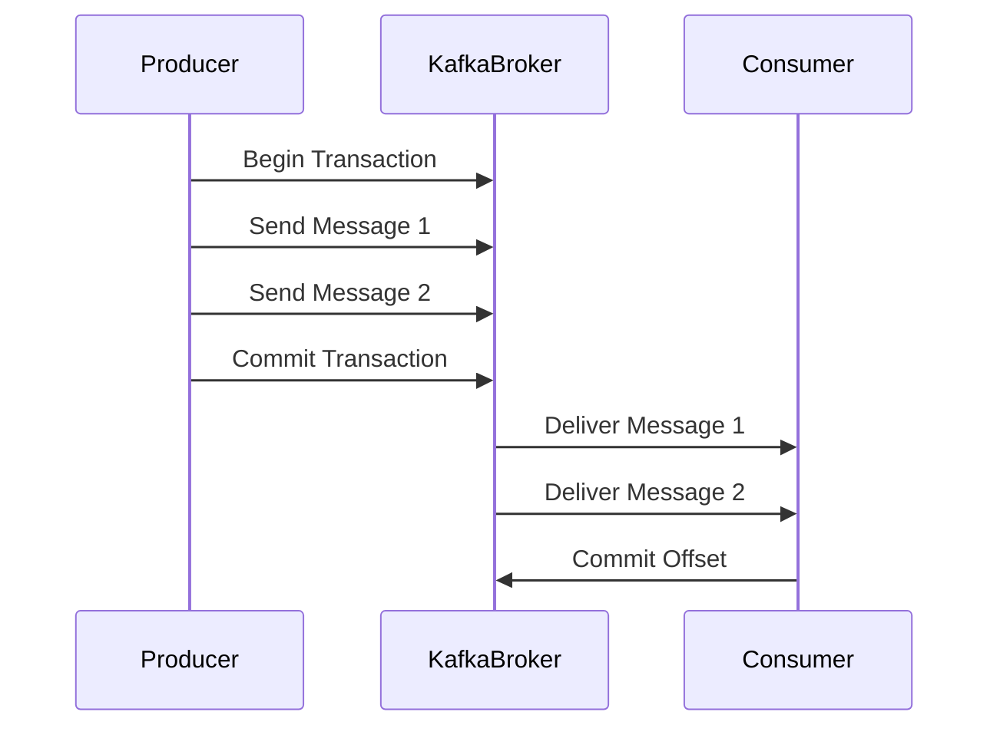

## 9.2.2 Delivering Events Reliably

In the realm of microservices and event-driven architectures, delivering events reliably is paramount to maintaining data consistency and ensuring seamless communication between services. Apache Kafka, a distributed streaming platform, provides robust mechanisms to achieve reliable event delivery, including exactly-once semantics, handling retries and duplicates, consumer idempotency, and leveraging transactions. This section delves into these concepts, offering expert insights and practical strategies for implementing reliable messaging in Kafka.

### Importance of Exactly-Once Delivery Semantics

Exactly-once delivery semantics ensure that each message is processed exactly once, preventing data loss and duplication. This is crucial in scenarios where data integrity is paramount, such as financial transactions, inventory management, and real-time analytics.

#### Understanding Exactly-Once Semantics

Exactly-once semantics in Kafka involve ensuring that messages are neither lost nor duplicated during processing. This is achieved through a combination of producer idempotence, transactional messaging, and consumer offset management.

- **Producer Idempotence**: Ensures that duplicate messages are not produced even if retries occur. Kafka achieves this by assigning a unique sequence number to each message, allowing the broker to detect and discard duplicates.
- **Transactional Messaging**: Allows producers to send messages to multiple topics atomically, ensuring that either all messages are committed or none are.
- **Consumer Offset Management**: Ensures that consumers process each message exactly once by committing offsets only after successful processing.

#### Implementing Exactly-Once Semantics

To implement exactly-once semantics in Kafka, configure the producer and consumer appropriately:

- **Producer Configuration**:
  - Enable idempotence by setting `enable.idempotence=true`.
  - Use transactions by setting `transactional.id` to a unique identifier for the producer.

- **Consumer Configuration**:
  - Manage offsets manually to ensure they are committed only after successful processing.

**Java Example**:

```java
Properties producerProps = new Properties();
producerProps.put(ProducerConfig.BOOTSTRAP_SERVERS_CONFIG, "localhost:9092");
producerProps.put(ProducerConfig.ENABLE_IDEMPOTENCE_CONFIG, "true");
producerProps.put(ProducerConfig.TRANSACTIONAL_ID_CONFIG, "my-transactional-id");

KafkaProducer<String, String> producer = new KafkaProducer<>(producerProps);
producer.initTransactions();

try {
    producer.beginTransaction();
    producer.send(new ProducerRecord<>("my-topic", "key", "value"));
    producer.commitTransaction();
} catch (ProducerFencedException | OutOfOrderSequenceException | AuthorizationException e) {
    // Fatal errors, cannot recover
    producer.close();
} catch (KafkaException e) {
    // Abort the transaction and retry
    producer.abortTransaction();
}
```

**Scala Example**:

```scala
val producerProps = new Properties()
producerProps.put(ProducerConfig.BOOTSTRAP_SERVERS_CONFIG, "localhost:9092")
producerProps.put(ProducerConfig.ENABLE_IDEMPOTENCE_CONFIG, "true")
producerProps.put(ProducerConfig.TRANSACTIONAL_ID_CONFIG, "my-transactional-id")

val producer = new KafkaProducer[String, String](producerProps)
producer.initTransactions()

try {
  producer.beginTransaction()
  producer.send(new ProducerRecord("my-topic", "key", "value"))
  producer.commitTransaction()
} catch {
  case e: ProducerFencedException | e: OutOfOrderSequenceException | e: AuthorizationException =>
    producer.close()
  case e: KafkaException =>
    producer.abortTransaction()
}
```

**Kotlin Example**:

```kotlin
val producerProps = Properties().apply {
    put(ProducerConfig.BOOTSTRAP_SERVERS_CONFIG, "localhost:9092")
    put(ProducerConfig.ENABLE_IDEMPOTENCE_CONFIG, "true")
    put(ProducerConfig.TRANSACTIONAL_ID_CONFIG, "my-transactional-id")
}

val producer = KafkaProducer<String, String>(producerProps)
producer.initTransactions()

try {
    producer.beginTransaction()
    producer.send(ProducerRecord("my-topic", "key", "value"))
    producer.commitTransaction()
} catch (e: ProducerFencedException) {
    producer.close()
} catch (e: KafkaException) {
    producer.abortTransaction()
}
```

**Clojure Example**:

```clojure
(def producer-props
  {"bootstrap.servers" "localhost:9092"
   "enable.idempotence" "true"
   "transactional.id" "my-transactional-id"})

(def producer (KafkaProducer. producer-props))
(.initTransactions producer)

(try
  (.beginTransaction producer)
  (.send producer (ProducerRecord. "my-topic" "key" "value"))
  (.commitTransaction producer)
  (catch ProducerFencedException e
    (.close producer))
  (catch KafkaException e
    (.abortTransaction producer)))
```

### Handling Retries and Duplicates

Retries are inevitable in distributed systems due to network failures, broker unavailability, or other transient issues. However, retries can lead to duplicate message delivery, which must be handled to maintain data integrity.

#### Strategies for Handling Retries

1. **Idempotent Producers**: As discussed, idempotent producers ensure that duplicate messages are not produced even if retries occur.

2. **Consumer Idempotency**: Ensure that consumers can handle duplicate messages gracefully. This often involves designing consumers to be idempotent, meaning that processing the same message multiple times has the same effect as processing it once.

3. **Deduplication Logic**: Implement deduplication logic at the consumer level, using unique message identifiers to detect and discard duplicates.

#### Implementing Consumer Idempotency

Consumer idempotency can be achieved by maintaining a record of processed message IDs and checking against this record before processing a new message.

**Java Example**:

```java
Set<String> processedMessageIds = new HashSet<>();

ConsumerRecords<String, String> records = consumer.poll(Duration.ofMillis(100));
for (ConsumerRecord<String, String> record : records) {
    if (!processedMessageIds.contains(record.key())) {
        // Process the message
        processedMessageIds.add(record.key());
        // Commit the offset after processing
        consumer.commitSync();
    }
}
```

**Scala Example**:

```scala
val processedMessageIds = scala.collection.mutable.Set[String]()

val records = consumer.poll(Duration.ofMillis(100))
records.forEach { record =>
  if (!processedMessageIds.contains(record.key())) {
    // Process the message
    processedMessageIds.add(record.key())
    // Commit the offset after processing
    consumer.commitSync()
  }
}
```

**Kotlin Example**:

```kotlin
val processedMessageIds = mutableSetOf<String>()

val records = consumer.poll(Duration.ofMillis(100))
for (record in records) {
    if (!processedMessageIds.contains(record.key())) {
        // Process the message
        processedMessageIds.add(record.key())
        // Commit the offset after processing
        consumer.commitSync()
    }
}
```

**Clojure Example**:

```clojure
(def processed-message-ids (atom #{}))

(let [records (.poll consumer (Duration/ofMillis 100))]
  (doseq [record records]
    (when-not (contains? @processed-message-ids (.key record))
      ;; Process the message
      (swap! processed-message-ids conj (.key record))
      ;; Commit the offset after processing
      (.commitSync consumer))))
```

### Role of Transactions in Kafka

Transactions in Kafka play a crucial role in ensuring atomicity and consistency across multiple operations. They allow producers to send messages to multiple topics and partitions atomically, ensuring that either all messages are committed or none are.

#### Implementing Transactions

To implement transactions in Kafka, follow these steps:

1. **Initialize Transactions**: Call `initTransactions()` on the producer to initialize transactions.

2. **Begin Transaction**: Start a transaction using `beginTransaction()`.

3. **Send Messages**: Send messages to the desired topics and partitions.

4. **Commit or Abort Transaction**: Commit the transaction using `commitTransaction()` if all operations succeed, or abort using `abortTransaction()` in case of failures.

**Java Example**:

```java
producer.initTransactions();
try {
    producer.beginTransaction();
    producer.send(new ProducerRecord<>("topic1", "key1", "value1"));
    producer.send(new ProducerRecord<>("topic2", "key2", "value2"));
    producer.commitTransaction();
} catch (KafkaException e) {
    producer.abortTransaction();
}
```

**Scala Example**:

```scala
producer.initTransactions()
try {
  producer.beginTransaction()
  producer.send(new ProducerRecord("topic1", "key1", "value1"))
  producer.send(new ProducerRecord("topic2", "key2", "value2"))
  producer.commitTransaction()
} catch {
  case e: KafkaException => producer.abortTransaction()
}
```

**Kotlin Example**:

```kotlin
producer.initTransactions()
try {
    producer.beginTransaction()
    producer.send(ProducerRecord("topic1", "key1", "value1"))
    producer.send(ProducerRecord("topic2", "key2", "value2"))
    producer.commitTransaction()
} catch (e: KafkaException) {
    producer.abortTransaction()
}
```

**Clojure Example**:

```clojure
(.initTransactions producer)
(try
  (.beginTransaction producer)
  (.send producer (ProducerRecord. "topic1" "key1" "value1"))
  (.send producer (ProducerRecord. "topic2" "key2" "value2"))
  (.commitTransaction producer)
  (catch KafkaException e
    (.abortTransaction producer)))
```

### Practical Applications and Real-World Scenarios

Reliable event delivery is critical in various real-world scenarios, such as:

- **Financial Services**: Ensuring that transactions are processed exactly once to prevent double billing or missed payments.
- **E-commerce**: Maintaining accurate inventory levels by ensuring that stock updates are processed reliably.
- **IoT Applications**: Processing sensor data accurately to trigger timely alerts and actions.

### Visualizing Kafka's Reliable Messaging

To better understand Kafka's reliable messaging mechanisms, consider the following diagram illustrating the flow of messages with exactly-once semantics:



**Caption**: This sequence diagram illustrates the flow of messages from a producer to a Kafka broker and then to a consumer, highlighting the use of transactions and offset management to achieve exactly-once semantics.

### Knowledge Check

To reinforce your understanding of delivering events reliably in Kafka, consider the following questions and exercises:

1. **What are the key components of exactly-once semantics in Kafka?**
2. **How can consumer idempotency be achieved in a Kafka application?**
3. **Describe a real-world scenario where reliable event delivery is critical.**
4. **Experiment with the provided code examples by modifying the producer and consumer configurations to test different scenarios.**

### Summary

Delivering events reliably in Apache Kafka is essential for maintaining data consistency and ensuring accurate communication between services. By leveraging exactly-once semantics, handling retries and duplicates, ensuring consumer idempotency, and utilizing transactions, you can build robust and reliable event-driven systems. These techniques are critical in various industries, including finance, e-commerce, and IoT, where data integrity is paramount.

## Test Your Knowledge: Reliable Event Delivery in Apache Kafka



### What is the primary benefit of exactly-once delivery semantics in Kafka?

- [x] Ensures each message is processed exactly once, preventing data loss and duplication.
- [ ] Increases message throughput.
- [ ] Reduces network latency.
- [ ] Simplifies consumer logic.

> **Explanation:** Exactly-once delivery semantics ensure that each message is processed exactly once, which is crucial for maintaining data integrity and preventing data loss or duplication.

### Which Kafka feature allows producers to send messages to multiple topics atomically?

- [x] Transactions
- [ ] Idempotence
- [ ] Consumer Groups
- [ ] Offset Management

> **Explanation:** Transactions in Kafka allow producers to send messages to multiple topics atomically, ensuring that either all messages are committed or none are.

### How can consumer idempotency be achieved in Kafka applications?

- [x] By maintaining a record of processed message IDs and checking against this record before processing new messages.
- [ ] By enabling idempotence on the producer.
- [ ] By using transactions.
- [ ] By increasing the replication factor.

> **Explanation:** Consumer idempotency can be achieved by maintaining a record of processed message IDs and checking against this record before processing new messages, ensuring that duplicate messages are handled gracefully.

### What is the role of producer idempotence in Kafka?

- [x] Ensures that duplicate messages are not produced even if retries occur.
- [ ] Increases message throughput.
- [ ] Simplifies consumer logic.
- [ ] Reduces network latency.

> **Explanation:** Producer idempotence ensures that duplicate messages are not produced even if retries occur, which is crucial for maintaining data integrity.

### Which configuration is necessary to enable producer idempotence in Kafka?

- [x] `enable.idempotence=true`
- [ ] `transactional.id=my-transactional-id`
- [ ] `acks=all`
- [ ] `enable.auto.commit=false`

> **Explanation:** Setting `enable.idempotence=true` enables producer idempotence in Kafka, ensuring that duplicate messages are not produced even if retries occur.

### What is the purpose of consumer offset management in Kafka?

- [x] Ensures that consumers process each message exactly once by committing offsets only after successful processing.
- [ ] Increases message throughput.
- [ ] Reduces network latency.
- [ ] Simplifies producer logic.

> **Explanation:** Consumer offset management ensures that consumers process each message exactly once by committing offsets only after successful processing, which is crucial for maintaining data integrity.

### How can retries lead to duplicate message delivery in Kafka?

- [x] Retries can lead to duplicate message delivery if the producer does not use idempotence.
- [ ] Retries always prevent duplicate message delivery.
- [ ] Retries increase message throughput.
- [ ] Retries reduce network latency.

> **Explanation:** Retries can lead to duplicate message delivery if the producer does not use idempotence, as the same message may be sent multiple times.

### What is the benefit of using transactions in Kafka?

- [x] Ensures atomicity and consistency across multiple operations.
- [ ] Increases message throughput.
- [ ] Reduces network latency.
- [ ] Simplifies consumer logic.

> **Explanation:** Transactions in Kafka ensure atomicity and consistency across multiple operations, allowing producers to send messages to multiple topics atomically.

### Which of the following is a real-world scenario where reliable event delivery is critical?

- [x] Financial transactions
- [ ] Social media updates
- [ ] Video streaming
- [ ] Weather forecasting

> **Explanation:** Reliable event delivery is critical in financial transactions to prevent double billing or missed payments, ensuring data integrity.

### True or False: Exactly-once delivery semantics in Kafka eliminate the need for consumer idempotency.

- [ ] True
- [x] False

> **Explanation:** Exactly-once delivery semantics in Kafka do not eliminate the need for consumer idempotency, as consumers must still be able to handle duplicate messages gracefully.



---

By mastering these techniques, you can ensure reliable event delivery in your Kafka-based systems, enhancing their robustness and reliability. For further reading, explore the [Apache Kafka Documentation](https://kafka.apache.org/documentation/) and [Confluent Documentation](https://docs.confluent.io/).
