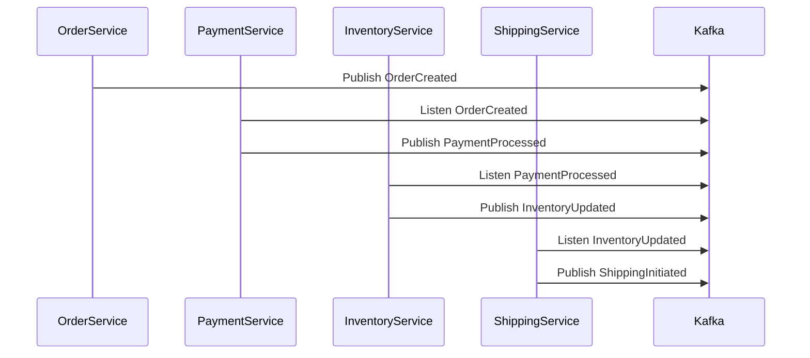
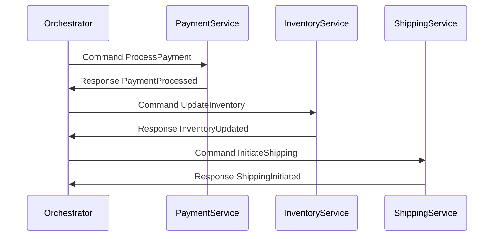

## 9.3.2 Choreography and Orchestration Approaches

In the realm of distributed systems, managing transactions across multiple microservices presents unique challenges. The Saga Pattern emerges as a solution to handle distributed transactions by breaking them into a series of smaller, manageable transactions. Within the Saga Pattern, two primary approaches exist: **Choreography** and **Orchestration**. This section delves into these approaches, exploring their mechanics, message flows, and the trade-offs involved in choosing between them.

### Understanding Choreography and Orchestration

#### Choreography

**Choreography** is an event-driven approach where each service involved in a saga listens for events and reacts accordingly. There is no central controller; instead, services communicate through events, which are often managed by a message broker like Apache Kafka.

- **Mechanics**: In a choreographed saga, each service performs its transaction and publishes an event. Other services listen for these events and perform their respective transactions in response.
- **Message Flow**: The flow of messages is decentralized. Each service is responsible for listening to relevant events and executing its logic based on those events.

#### Orchestration

**Orchestration** involves a central controller, often referred to as an orchestrator, that manages the saga. The orchestrator directs the flow of the saga, invoking services and handling responses.

- **Mechanics**: The orchestrator sends commands to services to perform transactions and waits for their responses. It maintains the state of the saga and decides the next steps based on the responses.
- **Message Flow**: The orchestrator controls the message flow, ensuring that each step of the saga is executed in the correct order.

### Comparing Choreography and Orchestration

#### Choreography

- **Advantages**:
  - **Decentralization**: Reduces the risk of a single point of failure.
  - **Scalability**: Each service can scale independently.
  - **Flexibility**: Easier to add or modify services without affecting the entire system.

- **Disadvantages**:
  - **Complexity**: Managing the flow of events can become complex as the number of services increases.
  - **Debugging**: Tracing the flow of events across services can be challenging.
  - **Consistency**: Ensuring data consistency across services requires careful design.

#### Orchestration

- **Advantages**:
  - **Centralized Control**: Simplifies the management of the saga by having a single point of control.
  - **Easier Debugging**: The orchestrator provides a clear view of the saga's state and flow.
  - **Consistency**: Easier to enforce consistency rules with a central controller.

- **Disadvantages**:
  - **Single Point of Failure**: The orchestrator can become a bottleneck or a point of failure.
  - **Scalability**: The orchestrator may need to handle a large volume of messages, impacting performance.
  - **Flexibility**: Changes to the saga flow require updates to the orchestrator.

### Practical Applications and Real-World Scenarios

#### Choreography Example

Consider an e-commerce application where a customer places an order. The order process involves multiple services: Order Service, Payment Service, Inventory Service, and Shipping Service.

- **Order Service**: Receives the order and publishes an `OrderCreated` event.
- **Payment Service**: Listens for the `OrderCreated` event, processes the payment, and publishes a `PaymentProcessed` event.
- **Inventory Service**: Listens for the `PaymentProcessed` event, updates inventory, and publishes an `InventoryUpdated` event.
- **Shipping Service**: Listens for the `InventoryUpdated` event and initiates shipping.



*Diagram: Choreography flow in an e-commerce application.*

#### Orchestration Example

In the same e-commerce application, an orchestrator manages the order process.

- **Orchestrator**: Receives the order and sends a command to the Payment Service.
- **Payment Service**: Processes the payment and responds to the orchestrator.
- **Orchestrator**: Sends a command to the Inventory Service.
- **Inventory Service**: Updates inventory and responds to the orchestrator.
- **Orchestrator**: Sends a command to the Shipping Service.



*Diagram: Orchestration flow in an e-commerce application.*

### Trade-offs in Complexity, Scalability, and Maintainability

#### Complexity

- **Choreography**: The complexity arises from managing the flow of events and ensuring that each service reacts appropriately. As the number of services grows, the event flow can become difficult to manage.
- **Orchestration**: Complexity is centralized in the orchestrator, which must handle the logic for the entire saga. This can simplify individual services but increase the complexity of the orchestrator.

#### Scalability

- **Choreography**: Each service can scale independently, making it easier to handle increased load. However, the event broker (e.g., Kafka) must be able to handle the increased volume of events.
- **Orchestration**: The orchestrator can become a bottleneck if it cannot handle the volume of messages. Scaling the orchestrator can be challenging, especially if it maintains state.

#### Maintainability

- **Choreography**: Adding or modifying services can be done without affecting the entire system. However, understanding the flow of events can be challenging.
- **Orchestration**: Changes to the saga flow require updates to the orchestrator, which can impact the entire system. However, the centralized control can make it easier to understand and manage the saga.

### Implementation in Code

#### Java Example: Choreography

```java
// Kafka Producer for Order Service
public class OrderService {
    private final KafkaProducer<String, String> producer;

    public OrderService(Properties props) {
        this.producer = new KafkaProducer<>(props);
    }

    public void createOrder(String orderId) {
        ProducerRecord<String, String> record = new ProducerRecord<>("OrderCreated", orderId, "Order details");
        producer.send(record, (metadata, exception) -> {
            if (exception == null) {
                System.out.println("OrderCreated event sent for orderId: " + orderId);
            } else {
                exception.printStackTrace();
            }
        });
    }
}
```

#### Scala Example: Orchestration

```scala
// Orchestrator for managing the saga
class Orchestrator(kafkaProducer: KafkaProducer[String, String]) {
  def processOrder(orderId: String): Unit = {
    sendCommand("ProcessPayment", orderId)
    // Wait for response and continue with the next step
    sendCommand("UpdateInventory", orderId)
    sendCommand("InitiateShipping", orderId)
  }

  private def sendCommand(topic: String, orderId: String): Unit = {
    val record = new ProducerRecord[String, String](topic, orderId, "Command details")
    kafkaProducer.send(record, (metadata, exception) => {
      if (exception == null) {
        println(s"Command sent to $topic for orderId: $orderId")
      } else {
        exception.printStackTrace()
      }
    })
  }
}
```

#### Kotlin Example: Choreography

```kotlin
// Kafka Producer for Payment Service
class PaymentService(private val producer: KafkaProducer<String, String>) {

    fun processPayment(orderId: String) {
        val record = ProducerRecord("PaymentProcessed", orderId, "Payment details")
        producer.send(record) { metadata, exception ->
            if (exception == null) {
                println("PaymentProcessed event sent for orderId: $orderId")
            } else {
                exception.printStackTrace()
            }
        }
    }
}
```

#### Clojure Example: Orchestration

```clojure
;; Orchestrator for managing the saga
(defn orchestrator [kafka-producer order-id]
  (let [send-command (fn [topic order-id]
                       (let [record (ProducerRecord. topic order-id "Command details")]
                         (.send kafka-producer record
                                (reify Callback
                                  (onCompletion [_ metadata exception]
                                    (if (nil? exception)
                                      (println (str "Command sent to " topic " for orderId: " order-id))
                                      (.printStackTrace exception)))))))]
    (send-command "ProcessPayment" order-id)
    ;; Wait for response and continue with the next step
    (send-command "UpdateInventory" order-id)
    (send-command "InitiateShipping" order-id)))
```

### Sample Use Cases

- **Choreography**: Ideal for systems where services are loosely coupled and can operate independently. Common in event-driven architectures where services need to react to changes in real-time.
- **Orchestration**: Suitable for systems requiring strict control over the transaction flow. Often used in scenarios where consistency and order of operations are critical.

### Related Patterns

- **Event Sourcing**: Complements choreography by maintaining a log of events that can be replayed to reconstruct the state.
- **Command Query Responsibility Segregation (CQRS)**: Often used with orchestration to separate the command and query responsibilities, enhancing scalability and performance.

### Conclusion

Choosing between choreography and orchestration depends on the specific requirements of the system. Choreography offers flexibility and scalability, while orchestration provides centralized control and easier debugging. Understanding the trade-offs and applying the right approach can significantly impact the success of a distributed transaction system.

---

## Test Your Knowledge: Choreography vs. Orchestration in Saga Patterns



### What is the primary advantage of using choreography in the Saga Pattern?

- [x] Decentralization reduces the risk of a single point of failure.
- [ ] Centralized control simplifies management.
- [ ] Easier debugging with a clear view of the saga's state.
- [ ] Consistency is easier to enforce.

> **Explanation:** Choreography is decentralized, which reduces the risk of a single point of failure and allows services to operate independently.

### In orchestration, what role does the orchestrator play?

- [x] It manages the saga by directing the flow and invoking services.
- [ ] It listens for events and reacts accordingly.
- [ ] It scales independently of other services.
- [ ] It reduces the complexity of event management.

> **Explanation:** The orchestrator is responsible for managing the saga, directing the flow, and invoking services in the correct order.

### Which approach is more suitable for systems requiring strict control over transaction flow?

- [x] Orchestration
- [ ] Choreography
- [ ] Event Sourcing
- [ ] CQRS

> **Explanation:** Orchestration provides centralized control, making it suitable for systems requiring strict control over transaction flow.

### What is a potential drawback of using orchestration?

- [x] The orchestrator can become a single point of failure.
- [ ] Services are tightly coupled.
- [ ] Event flow is difficult to manage.
- [ ] Debugging is challenging.

> **Explanation:** The orchestrator can become a single point of failure, impacting the system's reliability.

### How does choreography handle message flow?

- [x] Each service listens for events and reacts independently.
- [ ] A central controller manages the message flow.
- [ ] Services communicate directly with each other.
- [ ] Messages are stored in a central database.

> **Explanation:** In choreography, each service listens for events and reacts independently, without a central controller.

### Which approach is easier to scale independently?

- [x] Choreography
- [ ] Orchestration
- [ ] Both are equally scalable
- [ ] Neither is scalable

> **Explanation:** Choreography allows each service to scale independently, making it easier to handle increased load.

### What is a key benefit of using orchestration?

- [x] Centralized control simplifies debugging and management.
- [ ] Decentralization reduces complexity.
- [ ] Services can operate independently.
- [ ] Event flow is easier to manage.

> **Explanation:** Orchestration provides centralized control, simplifying debugging and management of the saga.

### In a choreographed saga, how do services communicate?

- [x] Through events published to a message broker.
- [ ] Directly with each other.
- [ ] Via a central database.
- [ ] Through a central controller.

> **Explanation:** Services in a choreographed saga communicate through events published to a message broker like Kafka.

### What is a common challenge with choreography?

- [x] Managing the flow of events can become complex.
- [ ] Centralized control can become a bottleneck.
- [ ] Debugging is straightforward.
- [ ] Consistency is easily enforced.

> **Explanation:** Managing the flow of events in a choreographed system can become complex as the number of services increases.

### True or False: Orchestration is more flexible than choreography.

- [ ] True
- [x] False

> **Explanation:** Choreography is generally more flexible than orchestration, as it allows services to be added or modified without affecting the entire system.


