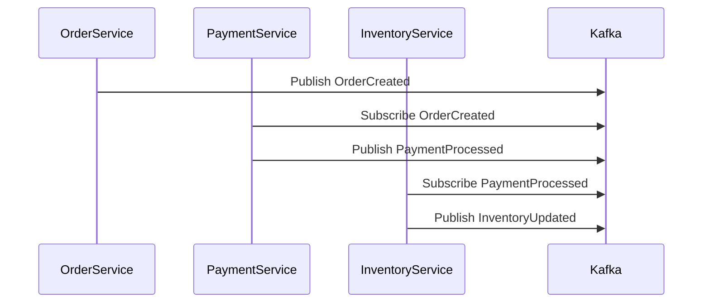
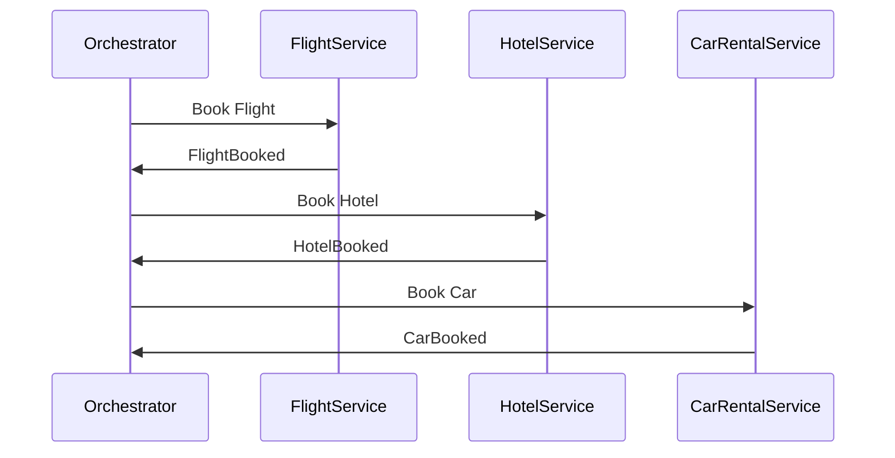

## 9.3 Saga Pattern for Distributed Transactions

### Introduction

In the realm of microservices and distributed systems, maintaining data consistency across multiple services is a formidable challenge. Traditional distributed transactions, often managed through two-phase commit protocols, are not well-suited for microservices due to their complexity and the need for distributed locking, which can lead to bottlenecks and reduced system availability. The Saga Pattern emerges as a robust solution to this problem, enabling distributed transactions without the need for locking, thus maintaining high availability and scalability.

### Challenges of Distributed Transactions

Distributed transactions involve multiple networked resources, each potentially managed by different microservices. The primary challenges include:

- **Data Consistency**: Ensuring that all parts of a transaction are completed successfully or none at all.
- **Network Reliability**: Handling failures in communication between services.
- **Scalability**: Avoiding bottlenecks that can arise from locking resources across distributed systems.
- **Complexity**: Managing the coordination of multiple services to ensure transaction integrity.

### The Saga Pattern

#### Definition

The Saga Pattern is a design pattern that provides a mechanism for managing distributed transactions by breaking them into a series of smaller, isolated transactions. Each transaction in a saga is a local transaction that updates a single service and publishes an event or message. If a transaction fails, the saga executes compensating transactions to undo the changes made by preceding transactions.

#### Approaches

There are two primary approaches to implementing the Saga Pattern:

1. **Choreography**: Each service involved in the saga listens for events and decides when to act and what to do next. This approach is decentralized and relies on event-driven communication.
2. **Orchestration**: A central coordinator or orchestrator manages the saga's workflow, directing each service to perform its transaction and handling compensations if necessary.

### Implementing Sagas with Kafka

Apache Kafka, with its robust event streaming capabilities, is an excellent choice for implementing the Saga Pattern. Kafka's ability to handle high-throughput, low-latency data streams makes it ideal for managing the complex event flows required by sagas.

#### Choreography with Kafka

In a choreography-based saga, each service publishes and subscribes to events on Kafka topics. This approach leverages Kafka's publish-subscribe model to enable services to react to events and perform their part of the transaction.

##### Example: Order Processing Saga

Consider an order processing system where an order must be validated, payment processed, and inventory updated. Each step is a local transaction managed by a separate service.

- **Order Service**: Publishes an `OrderCreated` event.
- **Payment Service**: Subscribes to `OrderCreated`, processes payment, and publishes `PaymentProcessed`.
- **Inventory Service**: Subscribes to `PaymentProcessed`, updates inventory, and publishes `InventoryUpdated`.

```java
// Java example for Order Service
public class OrderService {
    private final KafkaProducer<String, String> producer;

    public OrderService(KafkaProducer<String, String> producer) {
        this.producer = producer;
    }

    public void createOrder(Order order) {
        // Perform local transaction to save order
        saveOrder(order);
        // Publish OrderCreated event
        producer.send(new ProducerRecord<>("OrderTopic", "OrderCreated", order.getId()));
    }

    private void saveOrder(Order order) {
        // Logic to save order to database
    }
}
```

```scala
// Scala example for Payment Service
class PaymentService(consumer: KafkaConsumer[String, String], producer: KafkaProducer[String, String]) {
  def processPayments(): Unit = {
    consumer.subscribe(Collections.singletonList("OrderTopic"))
    while (true) {
      val records = consumer.poll(Duration.ofMillis(100))
      records.forEach { record =>
        if (record.value() == "OrderCreated") {
          // Process payment
          processPayment(record.key())
          // Publish PaymentProcessed event
          producer.send(new ProducerRecord("PaymentTopic", "PaymentProcessed", record.key()))
        }
      }
    }
  }

  private def processPayment(orderId: String): Unit = {
    // Logic to process payment
  }
}
```

#### Orchestration with Kafka

In an orchestration-based saga, a central orchestrator service manages the saga's workflow. This service coordinates the execution of each step and handles compensations if a step fails.

##### Example: Travel Booking Saga

Consider a travel booking system where a trip involves booking a flight, hotel, and car rental. The orchestrator manages the sequence of these bookings.

- **Orchestrator Service**: Initiates the saga and coordinates each booking step.
- **Flight Service**: Books a flight and responds to the orchestrator.
- **Hotel Service**: Books a hotel and responds to the orchestrator.
- **Car Rental Service**: Books a car and responds to the orchestrator.

```kotlin
// Kotlin example for Orchestrator Service
class OrchestratorService(private val kafkaTemplate: KafkaTemplate<String, String>) {

    fun startSaga(tripId: String) {
        // Start the saga by booking a flight
        kafkaTemplate.send("FlightBookingTopic", tripId, "BookFlight")
    }

    @KafkaListener(topics = ["FlightBookingResponseTopic"])
    fun onFlightBooked(record: ConsumerRecord<String, String>) {
        if (record.value() == "FlightBooked") {
            // Proceed to book hotel
            kafkaTemplate.send("HotelBookingTopic", record.key(), "BookHotel")
        } else {
            // Handle flight booking failure
            compensateFlight(record.key())
        }
    }

    private fun compensateFlight(tripId: String) {
        // Logic to compensate flight booking
    }
}
```

```clojure
;; Clojure example for Hotel Service
(defn book-hotel [trip-id]
  ;; Logic to book hotel
  (println "Hotel booked for trip" trip-id))

(defn hotel-service [consumer producer]
  (doto consumer
    (.subscribe ["HotelBookingTopic"])
    (.poll 100)
    (doseq [record (.records consumer)]
      (when (= "BookHotel" (.value record))
        (book-hotel (.key record))
        ;; Send response back to orchestrator
        (.send producer (ProducerRecord. "HotelBookingResponseTopic" (.key record) "HotelBooked")))))
```

### Visualizing the Saga Pattern

#### Choreography Diagram



*Caption*: This diagram illustrates the choreography approach where each service listens to events and performs its transaction independently.

#### Orchestration Diagram



*Caption*: This diagram shows the orchestration approach where a central orchestrator manages the sequence of service calls.

### Participants and Collaborations

- **Order Service**: Initiates the saga by creating an order.
- **Payment Service**: Processes payments and publishes events.
- **Inventory Service**: Updates inventory based on payment events.
- **Orchestrator Service**: Manages the sequence of operations and compensations in orchestration.
- **Flight, Hotel, Car Rental Services**: Perform specific booking tasks and report back to the orchestrator.

### Consequences

- **Benefits**:
  - **Decoupling**: Services are loosely coupled, enhancing scalability and maintainability.
  - **Resilience**: The system can handle partial failures by compensating transactions.
  - **Scalability**: Avoids distributed locking, allowing for high throughput.

- **Drawbacks**:
  - **Complexity**: Managing compensations and ensuring eventual consistency can be complex.
  - **Latency**: Increased latency due to multiple service interactions and compensations.

### Implementation Considerations

- **Idempotency**: Ensure that operations are idempotent to handle retries gracefully.
- **Compensation Logic**: Design compensating transactions carefully to undo changes.
- **Eventual Consistency**: Accept that data may not be immediately consistent across services.

### Sample Use Cases

- **E-commerce**: Managing order fulfillment across inventory, payment, and shipping services.
- **Travel Booking**: Coordinating bookings for flights, hotels, and car rentals.
- **Financial Transactions**: Handling multi-step financial operations with compensations.

### Related Patterns

- **[Event Sourcing and CQRS]( "Event Sourcing and CQRS")**: Often used in conjunction with sagas to manage state changes.
- **[Reliable Data Delivery Patterns]( "Reliable Data Delivery Patterns")**: Ensures messages are delivered reliably in a distributed system.

### Conclusion

The Saga Pattern is a powerful tool for managing distributed transactions in microservices architectures. By leveraging Apache Kafka, developers can implement sagas using either choreography or orchestration, each with its own strengths and trade-offs. Understanding these approaches and their implications is crucial for building resilient, scalable systems.

---

## Test Your Knowledge: Saga Pattern for Distributed Transactions Quiz



### What is a primary challenge of distributed transactions in microservices?

- [x] Ensuring data consistency across multiple services
- [ ] Managing a single database
- [ ] Avoiding network communication
- [ ] Reducing code complexity

> **Explanation:** Distributed transactions require maintaining data consistency across multiple services, which is challenging due to the lack of a central transaction manager.

### Which approach in the Saga Pattern uses a central coordinator?

- [x] Orchestration
- [ ] Choreography
- [ ] Event Sourcing
- [ ] CQRS

> **Explanation:** Orchestration involves a central coordinator that manages the workflow of the saga.

### In a choreography-based saga, how do services communicate?

- [x] By publishing and subscribing to events
- [ ] Through direct API calls
- [ ] Using a central database
- [ ] Via shared memory

> **Explanation:** In choreography, services communicate by publishing and subscribing to events, allowing for decentralized coordination.

### What is a compensating transaction?

- [x] A transaction that undoes the effects of a previous transaction
- [ ] A transaction that increases system throughput
- [ ] A transaction that locks resources
- [ ] A transaction that reduces latency

> **Explanation:** A compensating transaction is used to undo the effects of a previous transaction in case of failure.

### Which Kafka feature is leveraged in the Saga Pattern for event-driven communication?

- [x] Publish-subscribe model
- [ ] Two-phase commit
- [ ] Batch processing
- [ ] Stream processing

> **Explanation:** The publish-subscribe model in Kafka is used for event-driven communication in the Saga Pattern.

### What is a potential drawback of the Saga Pattern?

- [x] Increased complexity in managing compensations
- [ ] Reduced system availability
- [ ] Need for distributed locking
- [ ] Decreased scalability

> **Explanation:** The Saga Pattern can increase complexity due to the need to manage compensating transactions and ensure eventual consistency.

### Which pattern is often used with sagas to manage state changes?

- [x] Event Sourcing
- [ ] Singleton
- [ ] Factory
- [ ] Observer

> **Explanation:** Event Sourcing is often used with sagas to manage state changes and ensure consistency.

### What is the benefit of using the Saga Pattern over traditional distributed transactions?

- [x] Avoids distributed locking
- [ ] Requires fewer services
- [ ] Reduces network traffic
- [ ] Simplifies code

> **Explanation:** The Saga Pattern avoids distributed locking, which can be a bottleneck in traditional distributed transactions.

### How does the Saga Pattern enhance system resilience?

- [x] By allowing for compensating transactions
- [ ] By centralizing all transactions
- [ ] By reducing service interactions
- [ ] By eliminating failures

> **Explanation:** The Saga Pattern enhances resilience by allowing for compensating transactions to handle partial failures.

### True or False: The Saga Pattern can only be implemented using orchestration.

- [ ] True
- [x] False

> **Explanation:** The Saga Pattern can be implemented using either orchestration or choreography, depending on the system requirements.



---
