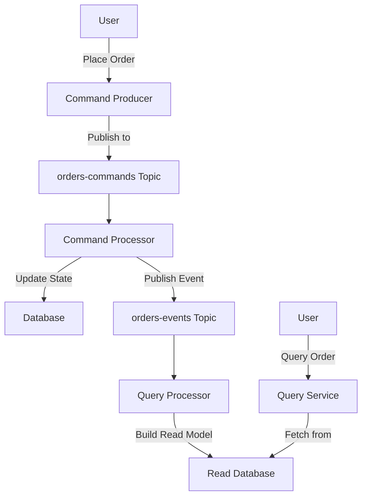

## 9.4 Command Query Responsibility Segregation (CQRS)

### Introduction to CQRS

**Command Query Responsibility Segregation (CQRS)** is an architectural pattern that separates the read and write operations of a system. This separation allows for optimized performance, scalability, and maintainability by handling commands (writes) and queries (reads) differently. In traditional architectures, the same data model is often used for both reading and writing, which can lead to inefficiencies and complexity as systems grow. CQRS addresses these challenges by using distinct models for updating and reading data.

### Principles of CQRS

The core principle of CQRS is the segregation of command and query responsibilities:

- **Commands**: These are operations that change the state of the system. They are often transactional and require validation. In a CQRS architecture, commands are handled by a command model that focuses on the business logic and state changes.
  
- **Queries**: These are operations that retrieve data without modifying it. Queries are handled by a query model optimized for read performance, often using denormalized or materialized views to provide fast access to data.

#### Benefits of CQRS

1. **Scalability**: By separating read and write operations, CQRS allows each to be scaled independently. This is particularly beneficial in systems with a high read-to-write ratio.

2. **Performance Optimization**: Read models can be optimized for specific query patterns, improving performance and reducing latency.

3. **Simplified Complexity**: Each model can be designed and optimized for its specific purpose, reducing the complexity of the overall system.

4. **Improved Security**: By segregating commands and queries, it is easier to enforce security policies and access controls.

5. **Enhanced Maintainability**: Changes to the read or write models can be made independently, reducing the risk of introducing errors.

### Implementing CQRS with Apache Kafka

Apache Kafka, with its robust event streaming capabilities, is an excellent choice for implementing CQRS. Kafka's distributed architecture and support for real-time data processing make it ideal for handling the separation of command and query responsibilities.

#### Using Kafka Topics for Command and Query Segregation

In a Kafka-based CQRS architecture, different topics can be used to separate commands and queries:

- **Command Topics**: These topics capture events related to state changes. Producers publish command events to these topics, which are then consumed by services responsible for processing commands and updating the state.

- **Query Topics**: These topics are used to store events that represent the current state of the system. They are consumed by services that build and maintain read models, providing fast access to data for queries.

##### Example: Building Read Models from Event Streams

Consider a simple e-commerce application where users can place orders. In a CQRS architecture using Kafka, the process might look like this:

1. **Command Handling**: When a user places an order, a command event is published to a `orders-commands` topic. This event includes details such as the user ID, product ID, and quantity.

2. **Event Processing**: A command processor consumes events from the `orders-commands` topic, validates the command, and updates the order state in a database. It then publishes an event to an `orders-events` topic indicating the order has been placed.

3. **Building Read Models**: A separate service consumes events from the `orders-events` topic to build a read model. This service updates a denormalized view of orders in a `orders-read` topic or a database optimized for queries.

4. **Query Handling**: When a user requests order details, the query service retrieves data from the `orders-read` topic or database, providing a fast and efficient response.

### Code Examples

Let's explore how to implement CQRS using Kafka with code examples in Java, Scala, Kotlin, and Clojure.

#### Java Example

```java
import org.apache.kafka.clients.producer.KafkaProducer;
import org.apache.kafka.clients.producer.ProducerRecord;
import org.apache.kafka.clients.consumer.KafkaConsumer;
import org.apache.kafka.clients.consumer.ConsumerRecords;
import org.apache.kafka.clients.consumer.ConsumerRecord;

import java.util.Properties;
import java.util.Collections;

public class OrderService {

    private KafkaProducer<String, String> producer;
    private KafkaConsumer<String, String> consumer;

    public OrderService() {
        // Producer configuration
        Properties producerProps = new Properties();
        producerProps.put("bootstrap.servers", "localhost:9092");
        producerProps.put("key.serializer", "org.apache.kafka.common.serialization.StringSerializer");
        producerProps.put("value.serializer", "org.apache.kafka.common.serialization.StringSerializer");
        producer = new KafkaProducer<>(producerProps);

        // Consumer configuration
        Properties consumerProps = new Properties();
        consumerProps.put("bootstrap.servers", "localhost:9092");
        consumerProps.put("group.id", "order-service");
        consumerProps.put("key.deserializer", "org.apache.kafka.common.serialization.StringDeserializer");
        consumerProps.put("value.deserializer", "org.apache.kafka.common.serialization.StringDeserializer");
        consumer = new KafkaConsumer<>(consumerProps);
        consumer.subscribe(Collections.singletonList("orders-events"));
    }

    public void placeOrder(String orderId, String orderDetails) {
        // Publish command event
        producer.send(new ProducerRecord<>("orders-commands", orderId, orderDetails));
    }

    public void processOrders() {
        // Consume events to build read model
        while (true) {
            ConsumerRecords<String, String> records = consumer.poll(100);
            for (ConsumerRecord<String, String> record : records) {
                System.out.printf("Processing order event: %s%n", record.value());
                // Update read model (e.g., database or cache)
            }
        }
    }
}
```

#### Scala Example

```scala
import org.apache.kafka.clients.producer.{KafkaProducer, ProducerRecord}
import org.apache.kafka.clients.consumer.{KafkaConsumer, ConsumerRecords}

import java.util.Properties
import scala.collection.JavaConverters._

object OrderService {

  val producerProps = new Properties()
  producerProps.put("bootstrap.servers", "localhost:9092")
  producerProps.put("key.serializer", "org.apache.kafka.common.serialization.StringSerializer")
  producerProps.put("value.serializer", "org.apache.kafka.common.serialization.StringSerializer")
  val producer = new KafkaProducer[String, String](producerProps)

  val consumerProps = new Properties()
  consumerProps.put("bootstrap.servers", "localhost:9092")
  consumerProps.put("group.id", "order-service")
  consumerProps.put("key.deserializer", "org.apache.kafka.common.serialization.StringDeserializer")
  consumerProps.put("value.deserializer", "org.apache.kafka.common.serialization.StringDeserializer")
  val consumer = new KafkaConsumer[String, String](consumerProps)
  consumer.subscribe(List("orders-events").asJava)

  def placeOrder(orderId: String, orderDetails: String): Unit = {
    producer.send(new ProducerRecord[String, String]("orders-commands", orderId, orderDetails))
  }

  def processOrders(): Unit = {
    while (true) {
      val records: ConsumerRecords[String, String] = consumer.poll(100)
      for (record <- records.asScala) {
        println(s"Processing order event: ${record.value()}")
        // Update read model (e.g., database or cache)
      }
    }
  }
}
```

#### Kotlin Example

```kotlin
import org.apache.kafka.clients.producer.KafkaProducer
import org.apache.kafka.clients.producer.ProducerRecord
import org.apache.kafka.clients.consumer.KafkaConsumer
import org.apache.kafka.clients.consumer.ConsumerRecords

import java.util.Properties

class OrderService {

    private val producer: KafkaProducer<String, String>
    private val consumer: KafkaConsumer<String, String>

    init {
        val producerProps = Properties()
        producerProps["bootstrap.servers"] = "localhost:9092"
        producerProps["key.serializer"] = "org.apache.kafka.common.serialization.StringSerializer"
        producerProps["value.serializer"] = "org.apache.kafka.common.serialization.StringSerializer"
        producer = KafkaProducer(producerProps)

        val consumerProps = Properties()
        consumerProps["bootstrap.servers"] = "localhost:9092"
        consumerProps["group.id"] = "order-service"
        consumerProps["key.deserializer"] = "org.apache.kafka.common.serialization.StringDeserializer"
        consumerProps["value.deserializer"] = "org.apache.kafka.common.serialization.StringDeserializer"
        consumer = KafkaConsumer(consumerProps)
        consumer.subscribe(listOf("orders-events"))
    }

    fun placeOrder(orderId: String, orderDetails: String) {
        producer.send(ProducerRecord("orders-commands", orderId, orderDetails))
    }

    fun processOrders() {
        while (true) {
            val records: ConsumerRecords<String, String> = consumer.poll(100)
            for (record in records) {
                println("Processing order event: ${record.value()}")
                // Update read model (e.g., database or cache)
            }
        }
    }
}
```

#### Clojure Example

```clojure
(ns order-service
  (:import [org.apache.kafka.clients.producer KafkaProducer ProducerRecord]
           [org.apache.kafka.clients.consumer KafkaConsumer ConsumerRecords]))

(def producer-props
  {"bootstrap.servers" "localhost:9092"
   "key.serializer" "org.apache.kafka.common.serialization.StringSerializer"
   "value.serializer" "org.apache.kafka.common.serialization.StringSerializer"})

(def consumer-props
  {"bootstrap.servers" "localhost:9092"
   "group.id" "order-service"
   "key.deserializer" "org.apache.kafka.common.serialization.StringDeserializer"
   "value.deserializer" "org.apache.kafka.common.serialization.StringDeserializer"})

(def producer (KafkaProducer. producer-props))
(def consumer (doto (KafkaConsumer. consumer-props)
                (.subscribe ["orders-events"])))

(defn place-order [order-id order-details]
  (.send producer (ProducerRecord. "orders-commands" order-id order-details)))

(defn process-orders []
  (while true
    (let [records (.poll consumer 100)]
      (doseq [record records]
        (println "Processing order event:" (.value record))
        ;; Update read model (e.g., database or cache)
        ))))
```

### Visualizing CQRS with Kafka

To better understand how CQRS can be implemented using Kafka, let's visualize the architecture with a diagram.



**Caption**: This diagram illustrates the flow of commands and queries in a CQRS architecture using Kafka. Commands are published to a command topic, processed to update the state, and events are published to an event topic. Queries are handled by a query service that retrieves data from a read model built from the event stream.

### Sample Use Cases

1. **E-Commerce Systems**: In an e-commerce platform, CQRS can be used to handle high volumes of read and write operations separately, ensuring that product availability and order processing are efficient and scalable.

2. **Financial Services**: Financial applications can benefit from CQRS by separating transaction processing from account balance queries, allowing for real-time updates and fast access to account information.

3. **IoT Applications**: In IoT systems, CQRS can be used to manage device commands and telemetry data separately, optimizing the processing and querying of large volumes of sensor data.

### Related Patterns

- **Event Sourcing**: Often used in conjunction with CQRS, event sourcing involves storing all changes to the application state as a sequence of events. This pattern complements CQRS by providing a reliable way to reconstruct state from events.

- **Microservices**: CQRS fits well within a microservices architecture, where services can be designed to handle specific commands or queries, promoting loose coupling and scalability.

### Conclusion

Implementing CQRS with Apache Kafka provides a powerful approach to building scalable, efficient, and maintainable systems. By separating command and query responsibilities, organizations can optimize performance and scalability while maintaining consistent and reliable data models. The use of Kafka topics for command and query segregation enables real-time processing and fast access to data, making it an ideal choice for modern microservices architectures.

## Test Your Knowledge: Mastering CQRS with Apache Kafka



### What is the primary benefit of using CQRS in a microservices architecture?

- [x] It allows independent scaling of read and write operations.
- [ ] It simplifies the codebase by using a single model for all operations.
- [ ] It eliminates the need for a database.
- [ ] It reduces the number of services required.

> **Explanation:** CQRS allows for the independent scaling of read and write operations, which is particularly beneficial in systems with a high read-to-write ratio.

### How does Apache Kafka facilitate the implementation of CQRS?

- [x] By using separate topics for commands and queries.
- [ ] By storing all data in a single topic.
- [ ] By providing built-in support for SQL queries.
- [ ] By eliminating the need for a database.

> **Explanation:** Apache Kafka facilitates CQRS by allowing the use of separate topics for commands and queries, enabling efficient handling of read and write operations.

### In a CQRS architecture, what is the role of a command processor?

- [x] To validate and process commands, updating the system state.
- [ ] To handle all read operations and queries.
- [ ] To store events in a database.
- [ ] To generate reports from query data.

> **Explanation:** The command processor is responsible for validating and processing commands, which involves updating the system state.

### What is a key advantage of using separate read models in CQRS?

- [x] They can be optimized for specific query patterns, improving performance.
- [ ] They eliminate the need for a command model.
- [ ] They reduce the complexity of the command model.
- [ ] They allow for real-time data processing.

> **Explanation:** Separate read models can be optimized for specific query patterns, which improves performance and reduces latency.

### Which of the following is a common use case for CQRS?

- [x] E-commerce systems with high read and write volumes.
- [ ] Static websites with minimal data interaction.
- [ ] Simple CRUD applications.
- [ ] Batch processing systems.

> **Explanation:** E-commerce systems, which often have high read and write volumes, benefit from CQRS by handling these operations separately and efficiently.

### What is the relationship between CQRS and event sourcing?

- [x] Event sourcing is often used with CQRS to store state changes as events.
- [ ] CQRS eliminates the need for event sourcing.
- [ ] Event sourcing is a replacement for CQRS.
- [ ] They are unrelated architectural patterns.

> **Explanation:** Event sourcing is often used with CQRS to store all changes to the application state as events, providing a reliable way to reconstruct state.

### How can Kafka topics be used to implement CQRS?

- [x] By using different topics for command and query events.
- [ ] By storing all data in a single topic.
- [ ] By using Kafka's built-in SQL support.
- [ ] By eliminating the need for a database.

> **Explanation:** Kafka topics can be used to implement CQRS by using different topics for command and query events, allowing for efficient handling of read and write operations.

### What is a potential drawback of implementing CQRS?

- [x] Increased complexity due to maintaining separate models.
- [ ] Reduced performance for read operations.
- [ ] Inability to scale the system.
- [ ] Lack of support for real-time data processing.

> **Explanation:** Implementing CQRS can increase complexity due to the need to maintain separate models for commands and queries.

### What is the purpose of a query service in a CQRS architecture?

- [x] To handle read operations and provide fast access to data.
- [ ] To process and validate commands.
- [ ] To store events in a database.
- [ ] To generate reports from command data.

> **Explanation:** The query service in a CQRS architecture handles read operations and provides fast access to data, often using optimized read models.

### True or False: CQRS eliminates the need for a database in a microservices architecture.

- [ ] True
- [x] False

> **Explanation:** CQRS does not eliminate the need for a database; it separates read and write operations, which may involve different databases or data models.


