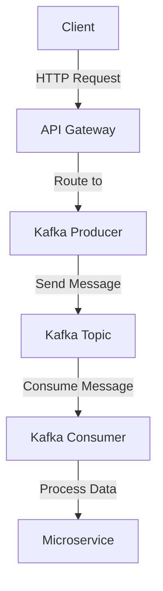

## 9.5.2 Integration with API Gateways

### Introduction

API gateways play a pivotal role in modern microservices architectures by acting as intermediaries that manage, secure, and expose APIs. When integrated with Apache Kafka, they enable seamless communication between microservices and Kafka-based services, facilitating real-time data processing and event-driven architectures. This section delves into the integration of API gateways with Kafka, exploring their roles, benefits, and implementation strategies.

### The Role of API Gateways in Microservices

API gateways serve as the single entry point for client requests in a microservices architecture. They provide a unified interface for accessing multiple services, abstracting the complexity of service interactions. Key functions of API gateways include:

- **Request Routing**: Directing incoming requests to the appropriate microservices.
- **Load Balancing**: Distributing requests evenly across service instances to ensure high availability and reliability.
- **Security**: Implementing authentication, authorization, and encryption to protect APIs.
- **Rate Limiting**: Controlling the number of requests to prevent overloading services.
- **Monitoring and Logging**: Tracking API usage and performance metrics for operational insights.

### Integrating API Gateways with Kafka

API gateways can be configured to route requests to Kafka-based services, enabling real-time data processing and event-driven communication. This integration involves several key considerations:

#### Routing Requests to Kafka Services

API gateways can route HTTP requests to Kafka producers or consumers, allowing external applications to interact with Kafka topics. This is achieved by:

- **Defining Routes**: Configuring the gateway to map specific API endpoints to Kafka topics.
- **Transforming Requests**: Converting HTTP requests into Kafka messages and vice versa.
- **Handling Responses**: Managing the asynchronous nature of Kafka by providing immediate responses or polling for results.

#### Example: Using Kong as an API Gateway

Kong is a popular open-source API gateway that can be integrated with Kafka to manage and expose APIs. Here's how you can set up Kong to route requests to a Kafka producer:

1. **Install Kong**: Deploy Kong on your infrastructure, either on-premises or in the cloud.

2. **Configure Kafka Plugin**: Use Kong's Kafka plugin to define routes that send requests to Kafka topics.

3. **Define Routes and Services**: Create routes in Kong that map API endpoints to Kafka topics.

4. **Secure APIs**: Implement authentication and authorization using Kong's security plugins.

5. **Monitor Traffic**: Use Kong's monitoring tools to track API usage and performance.

#### Example: Using Ambassador as an API Gateway

Ambassador is another API gateway that can be used to integrate with Kafka. It provides a Kubernetes-native solution for managing APIs. Here's how you can use Ambassador to route requests to Kafka:

1. **Deploy Ambassador**: Install Ambassador in your Kubernetes cluster.

2. **Configure Mappings**: Define mappings in Ambassador to route requests to Kafka services.

3. **Implement Security**: Use Ambassador's authentication and authorization features to secure your APIs.

4. **Monitor and Log**: Leverage Ambassador's logging and monitoring capabilities to gain insights into API traffic.

### Considerations for Scaling, Security, and Monitoring

When integrating API gateways with Kafka, several considerations must be addressed to ensure scalability, security, and effective monitoring:

#### Scaling

- **Horizontal Scaling**: Deploy multiple instances of the API gateway to handle increased traffic and ensure high availability.
- **Load Balancing**: Use load balancers to distribute requests evenly across gateway instances.
- **Auto-Scaling**: Implement auto-scaling policies to dynamically adjust the number of gateway instances based on traffic patterns.

#### Security

- **Authentication and Authorization**: Use OAuth, JWT, or API keys to authenticate and authorize requests.
- **Encryption**: Secure data in transit using SSL/TLS encryption.
- **Rate Limiting and Throttling**: Implement rate limiting to prevent abuse and ensure fair usage.

#### Monitoring

- **Metrics Collection**: Use tools like Prometheus and Grafana to collect and visualize metrics related to API performance and usage.
- **Logging**: Implement centralized logging to capture request and response data for troubleshooting and analysis.
- **Alerting**: Set up alerts to notify operators of anomalies or performance issues.

### Code Examples

Below are code examples demonstrating how to integrate API gateways with Kafka using Java, Scala, Kotlin, and Clojure.

#### Java Example

```java
import org.apache.kafka.clients.producer.KafkaProducer;
import org.apache.kafka.clients.producer.ProducerRecord;
import org.apache.kafka.clients.producer.ProducerConfig;
import org.apache.kafka.common.serialization.StringSerializer;

import java.util.Properties;

public class KafkaProducerExample {
    public static void main(String[] args) {
        Properties props = new Properties();
        props.put(ProducerConfig.BOOTSTRAP_SERVERS_CONFIG, "localhost:9092");
        props.put(ProducerConfig.KEY_SERIALIZER_CLASS_CONFIG, StringSerializer.class.getName());
        props.put(ProducerConfig.VALUE_SERIALIZER_CLASS_CONFIG, StringSerializer.class.getName());

        KafkaProducer<String, String> producer = new KafkaProducer<>(props);
        ProducerRecord<String, String> record = new ProducerRecord<>("my-topic", "key", "value");

        producer.send(record, (metadata, exception) -> {
            if (exception != null) {
                exception.printStackTrace();
            } else {
                System.out.printf("Sent record to topic %s partition %d offset %d%n",
                        metadata.topic(), metadata.partition(), metadata.offset());
            }
        });

        producer.close();
    }
}
```

#### Scala Example

```scala
import org.apache.kafka.clients.producer.{KafkaProducer, ProducerRecord, ProducerConfig}
import org.apache.kafka.common.serialization.StringSerializer

import java.util.Properties

object KafkaProducerExample extends App {
  val props = new Properties()
  props.put(ProducerConfig.BOOTSTRAP_SERVERS_CONFIG, "localhost:9092")
  props.put(ProducerConfig.KEY_SERIALIZER_CLASS_CONFIG, classOf[StringSerializer].getName)
  props.put(ProducerConfig.VALUE_SERIALIZER_CLASS_CONFIG, classOf[StringSerializer].getName)

  val producer = new KafkaProducer[String, String](props)
  val record = new ProducerRecord[String, String]("my-topic", "key", "value")

  producer.send(record, (metadata, exception) => {
    if (exception != null) {
      exception.printStackTrace()
    } else {
      println(s"Sent record to topic ${metadata.topic()} partition ${metadata.partition()} offset ${metadata.offset()}")
    }
  })

  producer.close()
}
```

#### Kotlin Example

```kotlin
import org.apache.kafka.clients.producer.KafkaProducer
import org.apache.kafka.clients.producer.ProducerRecord
import org.apache.kafka.clients.producer.ProducerConfig
import org.apache.kafka.common.serialization.StringSerializer

fun main() {
    val props = Properties().apply {
        put(ProducerConfig.BOOTSTRAP_SERVERS_CONFIG, "localhost:9092")
        put(ProducerConfig.KEY_SERIALIZER_CLASS_CONFIG, StringSerializer::class.java.name)
        put(ProducerConfig.VALUE_SERIALIZER_CLASS_CONFIG, StringSerializer::class.java.name)
    }

    val producer = KafkaProducer<String, String>(props)
    val record = ProducerRecord("my-topic", "key", "value")

    producer.send(record) { metadata, exception ->
        if (exception != null) {
            exception.printStackTrace()
        } else {
            println("Sent record to topic ${metadata.topic()} partition ${metadata.partition()} offset ${metadata.offset()}")
        }
    }

    producer.close()
}
```

#### Clojure Example

```clojure
(require '[clojure.java.io :as io])
(import '[org.apache.kafka.clients.producer KafkaProducer ProducerRecord ProducerConfig]
        '[org.apache.kafka.common.serialization StringSerializer])

(defn create-producer []
  (let [props (doto (java.util.Properties.)
                (.put ProducerConfig/BOOTSTRAP_SERVERS_CONFIG "localhost:9092")
                (.put ProducerConfig/KEY_SERIALIZER_CLASS_CONFIG StringSerializer)
                (.put ProducerConfig/VALUE_SERIALIZER_CLASS_CONFIG StringSerializer))]
    (KafkaProducer. props)))

(defn send-message [producer topic key value]
  (let [record (ProducerRecord. topic key value)]
    (.send producer record
           (reify org.apache.kafka.clients.producer.Callback
             (onCompletion [_ metadata exception]
               (if exception
                 (.printStackTrace exception)
                 (println (format "Sent record to topic %s partition %d offset %d"
                                  (.topic metadata) (.partition metadata) (.offset metadata)))))))))

(def producer (create-producer))
(send-message producer "my-topic" "key" "value")
(.close producer)
```

### Visualizing the Integration

To better understand the integration of API gateways with Kafka, consider the following diagram:



**Caption**: This diagram illustrates the flow of requests from a client through an API gateway to a Kafka producer, which sends messages to a Kafka topic. A Kafka consumer then processes the messages and interacts with a microservice.

### Sample Use Cases

- **Real-Time Analytics**: Use API gateways to expose analytics APIs that process real-time data streams from Kafka.
- **IoT Data Processing**: Route IoT device data through API gateways to Kafka for real-time processing and analysis.
- **Financial Services**: Implement secure, scalable APIs for processing financial transactions using Kafka.

### Related Patterns

- **[9.1.1 Decoupling Services with Kafka]( "Decoupling Services with Kafka")**: Explore how Kafka can be used to decouple microservices, enhancing scalability and resilience.
- **[9.4.1 Implementing CQRS with Kafka]( "Implementing CQRS with Kafka")**: Learn about using Kafka to implement the Command Query Responsibility Segregation pattern.

### Conclusion

Integrating API gateways with Kafka provides a powerful solution for managing, securing, and exposing APIs in microservices architectures. By leveraging the capabilities of API gateways, organizations can enhance the scalability, security, and observability of their Kafka-based services, enabling real-time data processing and event-driven communication.

## Test Your Knowledge: API Gateway and Kafka Integration Quiz



### What is the primary role of an API gateway in a microservices architecture?

- [x] To act as a single entry point for client requests
- [ ] To store data for microservices
- [ ] To replace microservices
- [ ] To directly process client requests

> **Explanation:** An API gateway acts as a single entry point for client requests, managing and routing them to the appropriate microservices.

### Which of the following is a key function of an API gateway?

- [x] Request routing
- [ ] Data storage
- [ ] Direct database access
- [ ] Code compilation

> **Explanation:** API gateways are responsible for routing requests to the appropriate services, among other functions like security and load balancing.

### How can API gateways be used with Kafka?

- [x] By routing HTTP requests to Kafka producers or consumers
- [ ] By storing Kafka topics
- [ ] By replacing Kafka brokers
- [ ] By directly consuming Kafka messages

> **Explanation:** API gateways can route HTTP requests to Kafka producers or consumers, enabling interaction with Kafka topics.

### What is a benefit of using Kong as an API gateway with Kafka?

- [x] It provides plugins for Kafka integration
- [ ] It replaces Kafka brokers
- [ ] It stores Kafka messages
- [ ] It compiles Kafka code

> **Explanation:** Kong offers plugins that facilitate integration with Kafka, allowing it to route requests to Kafka services.

### Which API gateway is Kubernetes-native and can be used with Kafka?

- [x] Ambassador
- [ ] Kong
- [ ] Nginx
- [ ] Traefik

> **Explanation:** Ambassador is a Kubernetes-native API gateway that can be used to manage APIs and integrate with Kafka.

### What is a key consideration when scaling API gateways?

- [x] Horizontal scaling
- [ ] Vertical scaling only
- [ ] Reducing instances
- [ ] Disabling load balancing

> **Explanation:** Horizontal scaling involves deploying multiple instances of the API gateway to handle increased traffic.

### Which security feature is important for API gateways?

- [x] Authentication and authorization
- [ ] Direct database access
- [ ] Code execution
- [ ] Data storage

> **Explanation:** Authentication and authorization are crucial for securing APIs exposed by API gateways.

### What tool can be used for monitoring API gateway metrics?

- [x] Prometheus
- [ ] Kafka
- [ ] MySQL
- [ ] Jenkins

> **Explanation:** Prometheus is a popular tool for collecting and visualizing metrics, including those from API gateways.

### How can API gateways handle the asynchronous nature of Kafka?

- [x] By providing immediate responses or polling for results
- [ ] By storing messages in a database
- [ ] By directly executing Kafka code
- [ ] By replacing Kafka brokers

> **Explanation:** API gateways can manage the asynchronous nature of Kafka by providing immediate responses or polling for results.

### True or False: API gateways can replace Kafka brokers.

- [ ] True
- [x] False

> **Explanation:** API gateways do not replace Kafka brokers; they route requests to Kafka services and manage API interactions.


