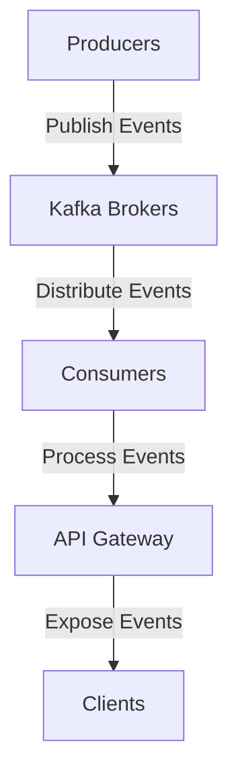

## 9.5.3 Event-Driven API Architectures

### Introduction

In the rapidly evolving landscape of software architecture, event-driven APIs have emerged as a powerful paradigm for enabling real-time interactions and seamless integration across distributed systems. By leveraging the capabilities of Apache Kafka, organizations can build scalable, responsive systems that react to events as they occur, providing a more dynamic and interactive user experience. This section delves into the concept of event-driven APIs, explores key protocols such as WebSockets and Server-Sent Events (SSE), and provides practical guidance on implementing these architectures using Kafka.

### Understanding Event-Driven APIs

Event-driven APIs represent a shift from traditional request-response models to a more dynamic interaction pattern where events are the primary drivers of communication. In this architecture, events are exposed as APIs, allowing clients to subscribe to and consume events in real-time. This approach is particularly beneficial for applications that require immediate updates, such as financial trading platforms, IoT systems, and collaborative tools.

#### Key Characteristics

- **Asynchronous Communication**: Unlike synchronous APIs, event-driven APIs allow for non-blocking communication, enabling clients to receive updates as they occur without polling.
- **Scalability**: By decoupling producers and consumers, event-driven architectures can scale independently, accommodating varying loads and demands.
- **Real-Time Processing**: Events are processed and delivered in real-time, ensuring timely responses to changes and actions.

### Protocols for Event-Driven APIs

To implement event-driven APIs, several protocols can be utilized, each with its own strengths and use cases. Two of the most prominent protocols are WebSockets and Server-Sent Events (SSE).

#### WebSockets

WebSockets provide a full-duplex communication channel over a single TCP connection, allowing for bidirectional data exchange between the client and server. This protocol is ideal for applications that require real-time updates and interactive communication.

- **Use Cases**: Chat applications, live sports updates, collaborative editing tools.
- **Advantages**: Low latency, efficient use of resources, and support for both client-to-server and server-to-client communication.

#### Server-Sent Events (SSE)

SSE is a simpler protocol that allows servers to push updates to clients over a single HTTP connection. Unlike WebSockets, SSE is unidirectional, meaning data flows only from the server to the client.

- **Use Cases**: News feeds, stock tickers, live score updates.
- **Advantages**: Simplicity, built-in reconnection logic, and native support in modern browsers.

### Implementing Event-Driven APIs with Kafka

Apache Kafka serves as an excellent backbone for event-driven APIs, providing a robust platform for managing and processing streams of events. By integrating Kafka with WebSockets or SSE, developers can create powerful, real-time APIs that leverage Kafka's strengths in scalability, fault tolerance, and high throughput.

#### Architecture Overview

The architecture of an event-driven API using Kafka typically involves the following components:

- **Producers**: Applications or services that generate events and publish them to Kafka topics.
- **Kafka Brokers**: The core of Kafka's distributed system, responsible for storing and managing event data.
- **Consumers**: Clients or services that subscribe to Kafka topics and process events in real-time.
- **API Gateway**: A layer that exposes Kafka events as APIs, often using WebSockets or SSE to deliver updates to clients.



*Diagram: An overview of an event-driven API architecture using Kafka, illustrating the flow of events from producers to clients.*

#### Sample Implementation

Let's explore how to implement an event-driven API using Kafka and WebSockets. We'll provide code examples in Java, Scala, Kotlin, and Clojure to demonstrate the versatility of this approach.

##### Java Example

```java
import org.apache.kafka.clients.consumer.ConsumerConfig;
import org.apache.kafka.clients.consumer.KafkaConsumer;
import org.apache.kafka.clients.consumer.ConsumerRecords;
import org.apache.kafka.clients.consumer.ConsumerRecord;
import org.apache.kafka.common.serialization.StringDeserializer;
import org.springframework.web.socket.TextMessage;
import org.springframework.web.socket.WebSocketSession;
import org.springframework.web.socket.handler.TextWebSocketHandler;

import java.util.Collections;
import java.util.Properties;

public class KafkaWebSocketHandler extends TextWebSocketHandler {

    private KafkaConsumer<String, String> consumer;

    public KafkaWebSocketHandler() {
        Properties props = new Properties();
        props.put(ConsumerConfig.BOOTSTRAP_SERVERS_CONFIG, "localhost:9092");
        props.put(ConsumerConfig.GROUP_ID_CONFIG, "websocket-group");
        props.put(ConsumerConfig.KEY_DESERIALIZER_CLASS_CONFIG, StringDeserializer.class.getName());
        props.put(ConsumerConfig.VALUE_DESERIALIZER_CLASS_CONFIG, StringDeserializer.class.getName());
        consumer = new KafkaConsumer<>(props);
        consumer.subscribe(Collections.singletonList("events-topic"));
    }

    @Override
    public void handleTextMessage(WebSocketSession session, TextMessage message) throws Exception {
        while (true) {
            ConsumerRecords<String, String> records = consumer.poll(100);
            for (ConsumerRecord<String, String> record : records) {
                session.sendMessage(new TextMessage(record.value()));
            }
        }
    }
}
```

*Java code demonstrating a WebSocket handler that consumes events from a Kafka topic and sends them to clients.*

##### Scala Example

```scala
import org.apache.kafka.clients.consumer.{ConsumerConfig, KafkaConsumer}
import org.apache.kafka.common.serialization.StringDeserializer
import org.springframework.web.socket.{TextMessage, WebSocketSession}
import org.springframework.web.socket.handler.TextWebSocketHandler

import java.util.{Collections, Properties}

class KafkaWebSocketHandler extends TextWebSocketHandler {

  private val props = new Properties()
  props.put(ConsumerConfig.BOOTSTRAP_SERVERS_CONFIG, "localhost:9092")
  props.put(ConsumerConfig.GROUP_ID_CONFIG, "websocket-group")
  props.put(ConsumerConfig.KEY_DESERIALIZER_CLASS_CONFIG, classOf[StringDeserializer].getName)
  props.put(ConsumerConfig.VALUE_DESERIALIZER_CLASS_CONFIG, classOf[StringDeserializer].getName)

  private val consumer = new KafkaConsumer[String, String](props)
  consumer.subscribe(Collections.singletonList("events-topic"))

  override def handleTextMessage(session: WebSocketSession, message: TextMessage): Unit = {
    while (true) {
      val records = consumer.poll(100)
      records.forEach(record => session.sendMessage(new TextMessage(record.value())))
    }
  }
}
```

*Scala code demonstrating a WebSocket handler that consumes events from a Kafka topic and sends them to clients.*

##### Kotlin Example

```kotlin
import org.apache.kafka.clients.consumer.ConsumerConfig
import org.apache.kafka.clients.consumer.KafkaConsumer
import org.apache.kafka.clients.consumer.ConsumerRecords
import org.apache.kafka.common.serialization.StringDeserializer
import org.springframework.web.socket.TextMessage
import org.springframework.web.socket.WebSocketSession
import org.springframework.web.socket.handler.TextWebSocketHandler
import java.util.*

class KafkaWebSocketHandler : TextWebSocketHandler() {

    private val consumer: KafkaConsumer<String, String>

    init {
        val props = Properties()
        props[ConsumerConfig.BOOTSTRAP_SERVERS_CONFIG] = "localhost:9092"
        props[ConsumerConfig.GROUP_ID_CONFIG] = "websocket-group"
        props[ConsumerConfig.KEY_DESERIALIZER_CLASS_CONFIG] = StringDeserializer::class.java.name
        props[ConsumerConfig.VALUE_DESERIALIZER_CLASS_CONFIG] = StringDeserializer::class.java.name
        consumer = KafkaConsumer(props)
        consumer.subscribe(listOf("events-topic"))
    }

    override fun handleTextMessage(session: WebSocketSession, message: TextMessage) {
        while (true) {
            val records: ConsumerRecords<String, String> = consumer.poll(100)
            for (record in records) {
                session.sendMessage(TextMessage(record.value()))
            }
        }
    }
}
```

*Kotlin code demonstrating a WebSocket handler that consumes events from a Kafka topic and sends them to clients.*

##### Clojure Example

```clojure
(ns kafka-websocket-handler
  (:import [org.apache.kafka.clients.consumer KafkaConsumer ConsumerConfig]
           [org.apache.kafka.common.serialization StringDeserializer]
           [org.springframework.web.socket TextMessage WebSocketSession]
           [org.springframework.web.socket.handler TextWebSocketHandler])
  (:require [clojure.java.io :as io]))

(defn create-consumer []
  (let [props (doto (java.util.Properties.)
                (.put ConsumerConfig/BOOTSTRAP_SERVERS_CONFIG "localhost:9092")
                (.put ConsumerConfig/GROUP_ID_CONFIG "websocket-group")
                (.put ConsumerConfig/KEY_DESERIALIZER_CLASS_CONFIG StringDeserializer)
                (.put ConsumerConfig/VALUE_DESERIALIZER_CLASS_CONFIG StringDeserializer))]
    (doto (KafkaConsumer. props)
      (.subscribe (java.util.Collections/singletonList "events-topic")))))

(defn handle-text-message [^WebSocketSession session ^TextMessage message]
  (let [consumer (create-consumer)]
    (while true
      (let [records (.poll consumer 100)]
        (doseq [record records]
          (.sendMessage session (TextMessage. (.value record))))))))

(defrecord KafkaWebSocketHandler []
  TextWebSocketHandler
  (handleTextMessage [this session message]
    (handle-text-message session message)))
```

*Clojure code demonstrating a WebSocket handler that consumes events from a Kafka topic and sends them to clients.*

### Considerations for Client Compatibility and Network Efficiency

When designing event-driven APIs, it is crucial to consider client compatibility and network efficiency to ensure a seamless experience for users.

#### Client Compatibility

- **Browser Support**: Ensure that the chosen protocol is supported by the target browsers or platforms. WebSockets and SSE are widely supported in modern browsers, but it's essential to verify compatibility for specific use cases.
- **Fallback Mechanisms**: Implement fallback mechanisms for clients that do not support the primary protocol. For example, use long polling as a fallback for WebSockets.

#### Network Efficiency

- **Data Compression**: Use data compression techniques to reduce the size of messages and improve network efficiency.
- **Connection Management**: Optimize connection management to handle a large number of concurrent clients without overwhelming the server.
- **Load Balancing**: Implement load balancing strategies to distribute traffic evenly across servers and prevent bottlenecks.

### Real-World Applications and Use Cases

Event-driven APIs are employed across various industries to enhance real-time interactions and improve system responsiveness. Here are some notable use cases:

- **Financial Services**: Real-time stock trading platforms use event-driven APIs to provide instant updates on market conditions and execute trades swiftly.
- **IoT Systems**: IoT applications leverage event-driven APIs to process sensor data in real-time, enabling immediate responses to environmental changes.
- **Collaborative Tools**: Applications like collaborative document editors use event-driven APIs to synchronize changes across users in real-time.

### Conclusion

Event-driven API architectures, powered by Apache Kafka, offer a robust solution for building scalable, real-time systems that can handle dynamic interactions and high volumes of data. By understanding the key protocols and implementation strategies, developers can create efficient, responsive APIs that meet the demands of modern applications.

## Test Your Knowledge: Event-Driven API Architectures with Kafka



### What is a primary advantage of event-driven APIs over traditional request-response models?

- [x] Asynchronous communication
- [ ] Synchronous processing
- [ ] Lower latency
- [ ] Simpler implementation

> **Explanation:** Event-driven APIs allow for asynchronous communication, enabling clients to receive updates in real-time without blocking.

### Which protocol provides a full-duplex communication channel for event-driven APIs?

- [x] WebSockets
- [ ] Server-Sent Events (SSE)
- [ ] HTTP/2
- [ ] REST

> **Explanation:** WebSockets provide a full-duplex communication channel, allowing bidirectional data exchange between client and server.

### What is a key characteristic of Server-Sent Events (SSE)?

- [x] Unidirectional data flow
- [ ] Bidirectional communication
- [ ] Requires a separate connection for each message
- [ ] Not supported in modern browsers

> **Explanation:** SSE allows unidirectional data flow from server to client, making it suitable for real-time updates.

### In an event-driven API architecture using Kafka, what role does the API Gateway play?

- [x] Exposes Kafka events as APIs
- [ ] Stores event data
- [ ] Generates events
- [ ] Manages Kafka brokers

> **Explanation:** The API Gateway exposes Kafka events as APIs, often using protocols like WebSockets or SSE to deliver updates to clients.

### Which of the following is a consideration for client compatibility in event-driven APIs?

- [x] Browser support for protocols
- [ ] Server hardware specifications
- [ ] Network bandwidth
- [ ] Data storage format

> **Explanation:** Ensuring that the chosen protocol is supported by target browsers or platforms is crucial for client compatibility.

### What technique can improve network efficiency in event-driven APIs?

- [x] Data compression
- [ ] Increasing message size
- [ ] Reducing server capacity
- [ ] Disabling caching

> **Explanation:** Data compression reduces the size of messages, improving network efficiency and reducing latency.

### Which industry commonly uses event-driven APIs for real-time updates?

- [x] Financial services
- [ ] Manufacturing
- [ ] Agriculture
- [ ] Retail

> **Explanation:** Financial services often use event-driven APIs for real-time stock trading platforms and market updates.

### What is a fallback mechanism for WebSockets in event-driven APIs?

- [x] Long polling
- [ ] HTTP/2
- [ ] REST
- [ ] SOAP

> **Explanation:** Long polling can be used as a fallback for WebSockets to ensure compatibility with clients that do not support WebSockets.

### How does Kafka enhance event-driven API architectures?

- [x] Provides scalability and fault tolerance
- [ ] Simplifies client-side implementation
- [ ] Reduces server costs
- [ ] Eliminates the need for data serialization

> **Explanation:** Kafka enhances event-driven API architectures by providing scalability, fault tolerance, and high throughput.

### True or False: Event-driven APIs can only be implemented using WebSockets.

- [ ] True
- [x] False

> **Explanation:** Event-driven APIs can be implemented using various protocols, including WebSockets and Server-Sent Events (SSE).


