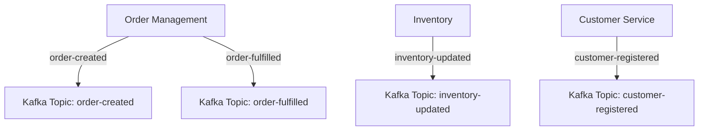

## 9.6.1 Bounded Contexts and Event Storming

### Introduction

In the realm of Domain-Driven Design (DDD), bounded contexts and event storming are pivotal concepts that facilitate the creation of scalable, maintainable, and robust event-driven systems. When integrated with Apache Kafka, these concepts can significantly enhance the design and implementation of microservices architectures. This section delves into the intricacies of bounded contexts and event storming, elucidating their roles in mapping events to Kafka topics and providing practical examples to illustrate their application.

### Understanding Bounded Contexts

#### Definition and Importance

A **bounded context** is a central pattern in Domain-Driven Design that defines the boundaries within which a particular domain model is applicable. It encapsulates the specific language, rules, and logic relevant to a particular part of the system, ensuring that the domain model remains consistent and coherent within its context.

- **Importance**:
  - **Clarity and Focus**: By delineating clear boundaries, bounded contexts prevent the model from becoming overly complex and convoluted.
  - **Decoupling**: They facilitate the decoupling of different parts of the system, allowing teams to work independently on separate contexts.
  - **Consistency**: Within a bounded context, the language and rules are consistent, reducing misunderstandings and errors.

#### Bounded Contexts in Kafka Deployments

In the context of Apache Kafka, bounded contexts help define the scope of events and the corresponding Kafka topics. Each bounded context can be mapped to a set of Kafka topics that represent the events occurring within that context.

- **Mapping Events to Topics**:
  - **Domain Events**: Each significant change or action within a bounded context can be represented as a domain event.
  - **Kafka Topics**: These domain events are published to Kafka topics, which serve as the communication channels between different parts of the system.

### The Process of Event Storming

#### What is Event Storming?

**Event storming** is a collaborative workshop technique used to explore complex domains and design event-driven systems. It involves stakeholders from various domains coming together to map out the events that occur within a system, providing a comprehensive view of the processes and interactions.

- **Key Steps**:
  1. **Identify Domain Events**: Gather stakeholders to brainstorm and identify all possible events within the domain.
  2. **Organize Events**: Arrange these events in a chronological order to visualize the flow of processes.
  3. **Identify Commands and Aggregates**: Determine the commands that trigger events and the aggregates that handle them.
  4. **Define Bounded Contexts**: Group related events and commands into bounded contexts.

#### Benefits of Event Storming

- **Holistic Understanding**: Provides a complete view of the system's processes and interactions.
- **Collaboration**: Encourages collaboration among stakeholders, fostering a shared understanding of the domain.
- **Flexibility**: Allows for rapid iteration and refinement of the domain model.

### Mapping Events to Kafka Topics

#### Designing Kafka Topics within Bounded Contexts

When designing Kafka topics within bounded contexts, it is crucial to ensure that the topics accurately reflect the events and processes within the context. This involves:

- **Naming Conventions**: Use clear and consistent naming conventions for topics to reflect their purpose and context.
- **Partitioning Strategies**: Design partitioning strategies that align with the domain's requirements for scalability and fault tolerance.
- **Schema Management**: Utilize tools like the [1.3.3 Schema Registry]( "Schema Registry") to manage and enforce schemas for events.

#### Example: E-Commerce System

Consider an e-commerce system with bounded contexts such as **Order Management**, **Inventory**, and **Customer Service**. Each context can have its own set of Kafka topics:

- **Order Management**:
  - `order-created`
  - `order-fulfilled`
  - `order-cancelled`

- **Inventory**:
  - `inventory-updated`
  - `stock-levels`

- **Customer Service**:
  - `customer-registered`
  - `customer-feedback`

### Practical Application of Bounded Contexts and Event Storming

#### Case Study: Building a Microservices Architecture

Let's explore a practical scenario where bounded contexts and event storming are applied to design a microservices architecture for a financial services application.

- **Step 1: Identify Bounded Contexts**
  - **Payment Processing**: Handles transactions and payment confirmations.
  - **Account Management**: Manages user accounts and profiles.
  - **Fraud Detection**: Monitors transactions for suspicious activity.

- **Step 2: Conduct Event Storming Workshop**
  - Gather domain experts, developers, and stakeholders.
  - Map out events such as `transaction-initiated`, `payment-confirmed`, `account-updated`, and `fraud-alert`.

- **Step 3: Map Events to Kafka Topics**
  - Create Kafka topics for each event identified during the workshop.
  - Ensure topics are aligned with the bounded contexts.

- **Step 4: Implement Microservices**
  - Develop microservices that consume and produce events to the respective Kafka topics.
  - Use [4.4.2 Idempotent Producers and Transactions]( "Idempotent Producers and Transactions") to ensure reliable message delivery.

### Code Examples

#### Java Example: Publishing Events to Kafka

```java
import org.apache.kafka.clients.producer.KafkaProducer;
import org.apache.kafka.clients.producer.ProducerRecord;
import java.util.Properties;

public class OrderEventProducer {
    public static void main(String[] args) {
        Properties props = new Properties();
        props.put("bootstrap.servers", "localhost:9092");
        props.put("key.serializer", "org.apache.kafka.common.serialization.StringSerializer");
        props.put("value.serializer", "org.apache.kafka.common.serialization.StringSerializer");

        KafkaProducer<String, String> producer = new KafkaProducer<>(props);

        String topic = "order-created";
        String key = "order123";
        String value = "{\"orderId\":\"order123\",\"status\":\"created\"}";

        ProducerRecord<String, String> record = new ProducerRecord<>(topic, key, value);
        producer.send(record, (metadata, exception) -> {
            if (exception == null) {
                System.out.println("Event published to topic " + metadata.topic());
            } else {
                exception.printStackTrace();
            }
        });

        producer.close();
    }
}
```

#### Scala Example: Consuming Events from Kafka

```scala
import org.apache.kafka.clients.consumer.KafkaConsumer
import java.util.Properties
import scala.collection.JavaConverters._

object OrderEventConsumer extends App {
  val props = new Properties()
  props.put("bootstrap.servers", "localhost:9092")
  props.put("group.id", "order-consumer-group")
  props.put("key.deserializer", "org.apache.kafka.common.serialization.StringDeserializer")
  props.put("value.deserializer", "org.apache.kafka.common.serialization.StringDeserializer")

  val consumer = new KafkaConsumer[String, String](props)
  consumer.subscribe(List("order-created").asJava)

  while (true) {
    val records = consumer.poll(100)
    for (record <- records.asScala) {
      println(s"Consumed event: ${record.value()}")
    }
  }
}
```

#### Kotlin Example: Handling Events with Kafka Streams

```kotlin
import org.apache.kafka.streams.KafkaStreams
import org.apache.kafka.streams.StreamsBuilder
import org.apache.kafka.streams.kstream.KStream
import java.util.Properties

fun main() {
    val props = Properties()
    props["bootstrap.servers"] = "localhost:9092"
    props["application.id"] = "order-streams-app"

    val builder = StreamsBuilder()
    val orderStream: KStream<String, String> = builder.stream("order-created")
    orderStream.foreach { key, value -> println("Processing order: $value") }

    val streams = KafkaStreams(builder.build(), props)
    streams.start()
}
```

#### Clojure Example: Publishing Events to Kafka

```clojure
(ns kafka-producer-example
  (:import [org.apache.kafka.clients.producer KafkaProducer ProducerRecord]))

(defn create-producer []
  (let [props (doto (java.util.Properties.)
                (.put "bootstrap.servers" "localhost:9092")
                (.put "key.serializer" "org.apache.kafka.common.serialization.StringSerializer")
                (.put "value.serializer" "org.apache.kafka.common.serialization.StringSerializer"))]
    (KafkaProducer. props)))

(defn publish-event [producer topic key value]
  (let [record (ProducerRecord. topic key value)]
    (.send producer record
           (reify org.apache.kafka.clients.producer.Callback
             (onCompletion [_ metadata exception]
               (if exception
                 (println "Error publishing event:" exception)
                 (println "Event published to topic" (.topic metadata))))))))

(defn -main []
  (let [producer (create-producer)]
    (publish-event producer "order-created" "order123" "{\"orderId\":\"order123\",\"status\":\"created\"}")
    (.close producer)))
```

### Visualizing Bounded Contexts and Event Storming

#### Diagram: Bounded Contexts and Event Flow



**Caption**: This diagram illustrates the flow of events within bounded contexts and their mapping to Kafka topics.

### Conclusion

Bounded contexts and event storming are powerful techniques in Domain-Driven Design that, when combined with Apache Kafka, enable the creation of scalable and maintainable event-driven systems. By clearly defining the boundaries of each context and mapping events to Kafka topics, organizations can achieve greater clarity, consistency, and decoupling in their architectures.

## Test Your Knowledge: Bounded Contexts and Event Storming in Kafka



### What is a bounded context in Domain-Driven Design?

- [x] A boundary within which a particular domain model is applicable.
- [ ] A method for scaling Kafka clusters.
- [ ] A type of Kafka topic.
- [ ] A tool for managing Kafka schemas.

> **Explanation:** A bounded context defines the boundaries within which a particular domain model is applicable, ensuring consistency and clarity.

### What is the primary purpose of event storming?

- [x] To explore complex domains and design event-driven systems.
- [ ] To configure Kafka brokers.
- [ ] To manage Kafka consumer groups.
- [ ] To optimize Kafka topic partitions.

> **Explanation:** Event storming is a collaborative workshop technique used to explore complex domains and design event-driven systems.

### How do bounded contexts relate to Kafka topics?

- [x] Bounded contexts help define the scope of events and the corresponding Kafka topics.
- [ ] Bounded contexts determine the number of Kafka partitions.
- [ ] Bounded contexts are used to configure Kafka brokers.
- [ ] Bounded contexts are unrelated to Kafka topics.

> **Explanation:** Bounded contexts help define the scope of events and the corresponding Kafka topics, ensuring that topics accurately reflect the events within the context.

### What is a key benefit of using bounded contexts?

- [x] They facilitate decoupling of different parts of the system.
- [ ] They increase the number of Kafka partitions.
- [ ] They reduce the need for Kafka brokers.
- [ ] They simplify Kafka consumer configuration.

> **Explanation:** Bounded contexts facilitate the decoupling of different parts of the system, allowing teams to work independently on separate contexts.

### Which of the following is a step in the event storming process?

- [x] Identify domain events.
- [ ] Configure Kafka brokers.
- [ ] Optimize Kafka partitions.
- [ ] Manage Kafka consumer groups.

> **Explanation:** Identifying domain events is a key step in the event storming process, which involves mapping out the events that occur within a system.

### What is the role of Kafka topics in bounded contexts?

- [x] They serve as communication channels between different parts of the system.
- [ ] They determine the number of Kafka brokers.
- [ ] They configure Kafka consumer groups.
- [ ] They optimize Kafka partitions.

> **Explanation:** Kafka topics serve as communication channels between different parts of the system, representing the events occurring within bounded contexts.

### How does event storming encourage collaboration?

- [x] By involving stakeholders from various domains to map out events.
- [ ] By configuring Kafka brokers.
- [ ] By optimizing Kafka partitions.
- [ ] By managing Kafka consumer groups.

> **Explanation:** Event storming encourages collaboration by involving stakeholders from various domains to map out events, fostering a shared understanding of the domain.

### What is a practical application of bounded contexts and event storming?

- [x] Designing a microservices architecture for a financial services application.
- [ ] Configuring Kafka brokers for high throughput.
- [ ] Managing Kafka consumer groups for load balancing.
- [ ] Optimizing Kafka partitions for low latency.

> **Explanation:** A practical application of bounded contexts and event storming is designing a microservices architecture for a financial services application, where events are mapped to Kafka topics.

### What is the significance of naming conventions in Kafka topics?

- [x] They help reflect the purpose and context of the topics.
- [ ] They determine the number of Kafka brokers.
- [ ] They configure Kafka consumer groups.
- [ ] They optimize Kafka partitions.

> **Explanation:** Naming conventions help reflect the purpose and context of Kafka topics, ensuring clarity and consistency in the system.

### True or False: Event storming is only useful for small-scale systems.

- [ ] True
- [x] False

> **Explanation:** False. Event storming is useful for both small-scale and large-scale systems, providing a comprehensive view of the system's processes and interactions.


