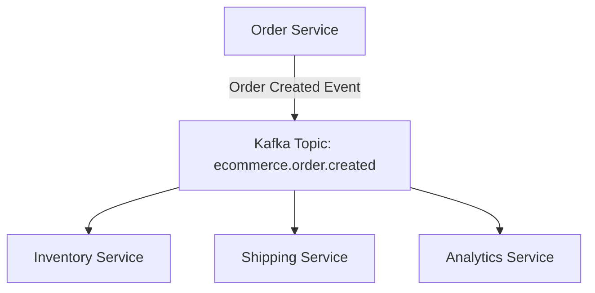

## 9.6.3 Aligning Kafka Topics with Domain Models

In the realm of microservices and event-driven architectures, aligning Kafka topics with domain models is a critical practice that enhances system clarity, maintainability, and scalability. This section delves into the strategies for designing Kafka topics and schemas that closely mirror domain models, providing a robust foundation for event-driven systems.

### Introduction to Domain-Driven Design and Kafka

Domain-Driven Design (DDD) is a strategic approach to software development that emphasizes collaboration between technical and domain experts to create a model that accurately reflects the business domain. When integrated with Apache Kafka, DDD principles can guide the structuring of topics and schemas to ensure they are intuitive and aligned with business processes.

#### The Role of Kafka in Domain-Driven Design

Kafka serves as the backbone for event-driven architectures, facilitating the flow of domain events across distributed systems. By aligning Kafka topics with domain models, developers can ensure that the events captured and processed are meaningful and relevant to the business context.

### Naming Conventions and Topic Organization

A well-structured naming convention for Kafka topics is essential for maintaining clarity and consistency across the system. Here are some best practices:

- **Use Descriptive Names**: Ensure that topic names clearly describe the domain event or entity they represent. For example, `order.created` or `customer.updated`.
- **Incorporate Domain Context**: Include the bounded context or domain area in the topic name to avoid ambiguity. For instance, `ecommerce.order.created` vs. `inventory.order.created`.
- **Adopt a Hierarchical Structure**: Use a hierarchical naming scheme to organize topics logically. This can help in managing permissions and understanding data flow.
- **Consistency Across Services**: Maintain consistent naming conventions across all services to facilitate easier integration and collaboration.

### Schema Design Aligned with Domain Events

Schemas define the structure of the data within Kafka topics. Aligning schemas with domain events ensures that the data is both meaningful and useful for downstream consumers.

#### Best Practices for Schema Design

- **Reflect Domain Models**: Design schemas that closely mirror the domain models. This alignment helps in maintaining a clear understanding of the data's purpose and structure.
- **Use Avro or Protobuf**: Consider using serialization formats like Avro or Protobuf, which support schema evolution and provide efficient data encoding.
- **Include Metadata**: Incorporate metadata such as event type, timestamp, and source to provide context for the event.
- **Versioning**: Implement schema versioning to manage changes over time without breaking existing consumers.

#### Example Schema Design

Below is an example of a schema for an `order.created` event using Avro:

```json
{
  "type": "record",
  "name": "OrderCreated",
  "namespace": "com.example.ecommerce",
  "fields": [
    {"name": "orderId", "type": "string"},
    {"name": "customerId", "type": "string"},
    {"name": "orderDate", "type": "string"},
    {"name": "items", "type": {"type": "array", "items": "string"}},
    {"name": "totalAmount", "type": "double"}
  ]
}
```

This schema captures essential details about the order, aligning with the domain model.

### Benefits of Domain-Aligned Topics

Aligning Kafka topics with domain models offers several advantages:

- **Improved Clarity**: Developers can easily understand the purpose and structure of topics, reducing cognitive load.
- **Enhanced Maintainability**: Changes in the domain model can be more easily reflected in the topic structure, minimizing technical debt.
- **Facilitated Collaboration**: Clear alignment with domain models fosters better communication between technical and domain experts.
- **Scalability**: Well-organized topics and schemas support scalable architectures by ensuring data is efficiently partitioned and processed.

### Best Practices for Evolution and Versioning

As systems evolve, so too must the topics and schemas. Here are some strategies for managing evolution:

- **Backward Compatibility**: Ensure that changes to schemas are backward compatible to prevent breaking existing consumers.
- **Deprecation Policies**: Establish clear policies for deprecating old topics and schemas, providing ample time for consumers to adapt.
- **Automated Testing**: Implement automated tests to verify that changes do not introduce regressions or compatibility issues.
- **Documentation**: Maintain comprehensive documentation of topic structures and schema versions to aid in onboarding and troubleshooting.

### Practical Applications and Real-World Scenarios

Consider a retail company implementing an event-driven architecture for order processing. By aligning Kafka topics with domain models, they can achieve:

- **Seamless Integration**: Different services, such as inventory management and shipping, can consume relevant events without needing to understand the intricacies of other services.
- **Real-Time Analytics**: By structuring topics to reflect domain events, the company can easily aggregate and analyze data for insights into customer behavior and operational efficiency.
- **Resilience and Flexibility**: The system can adapt to changes in business processes or requirements with minimal disruption, thanks to the clear alignment between topics and domain models.

### Code Examples in Multiple Languages

To illustrate the implementation of domain-aligned Kafka topics, let's explore code examples in Java, Scala, Kotlin, and Clojure.

#### Java Example

```java
import org.apache.kafka.clients.producer.KafkaProducer;
import org.apache.kafka.clients.producer.ProducerRecord;
import java.util.Properties;

public class OrderProducer {
    public static void main(String[] args) {
        Properties props = new Properties();
        props.put("bootstrap.servers", "localhost:9092");
        props.put("key.serializer", "org.apache.kafka.common.serialization.StringSerializer");
        props.put("value.serializer", "org.apache.kafka.common.serialization.StringSerializer");

        KafkaProducer<String, String> producer = new KafkaProducer<>(props);
        String topic = "ecommerce.order.created";
        String key = "order123";
        String value = "{\"orderId\":\"order123\",\"customerId\":\"cust456\",\"orderDate\":\"2024-11-25\",\"items\":[\"item1\",\"item2\"],\"totalAmount\":99.99}";

        ProducerRecord<String, String> record = new ProducerRecord<>(topic, key, value);
        producer.send(record);
        producer.close();
    }
}
```

#### Scala Example

```scala
import org.apache.kafka.clients.producer.{KafkaProducer, ProducerRecord}
import java.util.Properties

object OrderProducer extends App {
  val props = new Properties()
  props.put("bootstrap.servers", "localhost:9092")
  props.put("key.serializer", "org.apache.kafka.common.serialization.StringSerializer")
  props.put("value.serializer", "org.apache.kafka.common.serialization.StringSerializer")

  val producer = new KafkaProducer[String, String](props)
  val topic = "ecommerce.order.created"
  val key = "order123"
  val value = """{"orderId":"order123","customerId":"cust456","orderDate":"2024-11-25","items":["item1","item2"],"totalAmount":99.99}"""

  val record = new ProducerRecord[String, String](topic, key, value)
  producer.send(record)
  producer.close()
}
```

#### Kotlin Example

```kotlin
import org.apache.kafka.clients.producer.KafkaProducer
import org.apache.kafka.clients.producer.ProducerRecord
import java.util.Properties

fun main() {
    val props = Properties().apply {
        put("bootstrap.servers", "localhost:9092")
        put("key.serializer", "org.apache.kafka.common.serialization.StringSerializer")
        put("value.serializer", "org.apache.kafka.common.serialization.StringSerializer")
    }

    val producer = KafkaProducer<String, String>(props)
    val topic = "ecommerce.order.created"
    val key = "order123"
    val value = """{"orderId":"order123","customerId":"cust456","orderDate":"2024-11-25","items":["item1","item2"],"totalAmount":99.99}"""

    val record = ProducerRecord(topic, key, value)
    producer.send(record)
    producer.close()
}
```

#### Clojure Example

```clojure
(require '[clojure.java.io :as io])
(import '[org.apache.kafka.clients.producer KafkaProducer ProducerRecord])

(defn create-producer []
  (let [props (doto (java.util.Properties.)
                (.put "bootstrap.servers" "localhost:9092")
                (.put "key.serializer" "org.apache.kafka.common.serialization.StringSerializer")
                (.put "value.serializer" "org.apache.kafka.common.serialization.StringSerializer"))]
    (KafkaProducer. props)))

(defn send-order []
  (let [producer (create-producer)
        topic "ecommerce.order.created"
        key "order123"
        value "{\"orderId\":\"order123\",\"customerId\":\"cust456\",\"orderDate\":\"2024-11-25\",\"items\":[\"item1\",\"item2\"],\"totalAmount\":99.99}"
        record (ProducerRecord. topic key value)]
    (.send producer record)
    (.close producer)))

(send-order)
```

### Visualizing Kafka Topic Alignment

To further illustrate the alignment of Kafka topics with domain models, consider the following diagram depicting a typical event flow in an e-commerce system:



**Caption**: This diagram shows how an `Order Created` event flows from the Order Service to various consumers via a Kafka topic aligned with the domain model.

### Conclusion

Aligning Kafka topics with domain models is a foundational practice for building effective event-driven architectures. By following the strategies outlined in this section, developers can create systems that are not only scalable and maintainable but also closely aligned with business objectives.

### Knowledge Check

To reinforce your understanding of aligning Kafka topics with domain models, consider the following questions and exercises.

## Test Your Knowledge: Kafka Topics and Domain Models Quiz



### What is the primary benefit of aligning Kafka topics with domain models?

- [x] Improved clarity and maintainability
- [ ] Increased data throughput
- [ ] Reduced storage costs
- [ ] Enhanced security

> **Explanation:** Aligning Kafka topics with domain models improves clarity and maintainability by ensuring that the data structure reflects the business context.

### Which naming convention is recommended for Kafka topics?

- [x] Descriptive and hierarchical
- [ ] Random and unique
- [ ] Short and cryptic
- [ ] Numeric identifiers

> **Explanation:** Descriptive and hierarchical naming conventions help in organizing topics logically and maintaining clarity.

### What is a key consideration when designing schemas for Kafka topics?

- [x] Schema evolution and versioning
- [ ] Minimizing field count
- [ ] Using XML format
- [ ] Avoiding metadata

> **Explanation:** Schema evolution and versioning are crucial for managing changes over time without breaking existing consumers.

### Which serialization format is recommended for schema evolution?

- [x] Avro or Protobuf
- [ ] XML
- [ ] CSV
- [ ] Plain text

> **Explanation:** Avro and Protobuf support schema evolution and provide efficient data encoding.

### How can backward compatibility be ensured in schema design?

- [x] By maintaining previous schema versions
- [ ] By removing deprecated fields
- [ ] By using only primitive data types
- [ ] By avoiding schema changes

> **Explanation:** Maintaining previous schema versions ensures that changes do not break existing consumers.

### What is the role of metadata in Kafka schemas?

- [x] Providing context for the event
- [ ] Reducing data size
- [ ] Increasing processing speed
- [ ] Enhancing security

> **Explanation:** Metadata provides context for the event, such as event type and timestamp.

### Which tool can be used for managing schema versions in Kafka?

- [x] Confluent Schema Registry
- [ ] Apache Zookeeper
- [ ] Kafka Connect
- [ ] Apache Flink

> **Explanation:** Confluent Schema Registry is used for managing schema versions and ensuring compatibility.

### What is a common challenge when evolving Kafka topics?

- [x] Maintaining backward compatibility
- [ ] Increasing data throughput
- [ ] Reducing storage costs
- [ ] Enhancing security

> **Explanation:** Maintaining backward compatibility is a common challenge when evolving Kafka topics.

### Which of the following is a benefit of domain-aligned Kafka topics?

- [x] Facilitated collaboration between technical and domain experts
- [ ] Increased data throughput
- [ ] Reduced storage costs
- [ ] Enhanced security

> **Explanation:** Domain-aligned Kafka topics facilitate collaboration by ensuring that the data structure reflects the business context.

### True or False: Aligning Kafka topics with domain models can improve system scalability.

- [x] True
- [ ] False

> **Explanation:** Aligning Kafka topics with domain models can improve system scalability by ensuring data is efficiently partitioned and processed.



By mastering the alignment of Kafka topics with domain models, you can build robust, scalable, and maintainable event-driven architectures that effectively support your organization's business goals.
