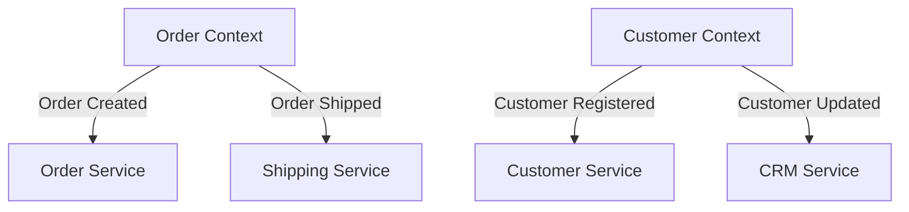
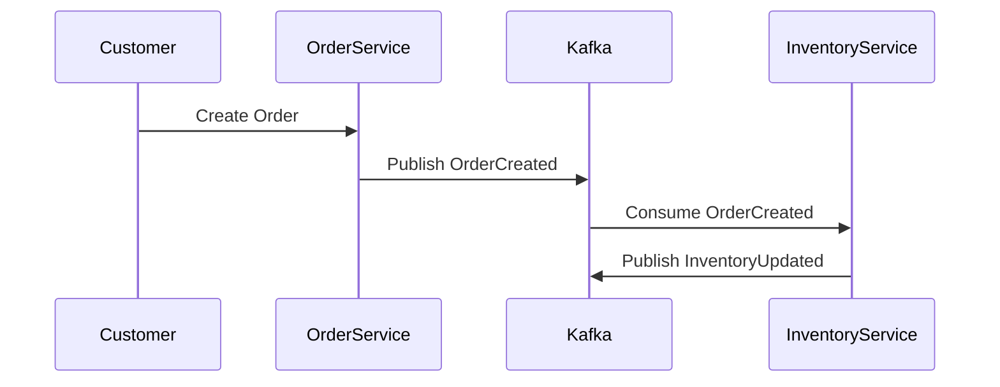

## 9.6 Event Modeling and Domain-Driven Design with Kafka

### Introduction

In the realm of modern software architecture, aligning technical implementations with business domains is crucial for creating scalable, maintainable, and efficient systems. Event modeling and Domain-Driven Design (DDD) are two methodologies that facilitate this alignment. When combined with Apache Kafka, these methodologies empower organizations to build robust event-driven architectures that reflect the complexities of their business domains.

This section delves into the principles of event modeling and DDD, illustrating how they can be applied within Kafka-based systems. We will explore how Kafka topics can represent bounded contexts and aggregates, and provide guidance on aligning event streams with domain events. Through examples and case studies, we will demonstrate the practical applications of these concepts.

### Understanding Event Modeling

Event modeling is a method of designing software systems by focusing on the events that occur within a business domain. It involves identifying and documenting the events that drive business processes, the state changes they cause, and the interactions between different components of the system. This approach helps in visualizing the flow of data and the dependencies between various parts of the system.

#### Key Concepts in Event Modeling

- **Events**: Events are significant occurrences within a system that trigger state changes. They are immutable and represent facts about what has happened.
- **Commands**: Commands are requests to perform actions that may result in events. They represent intentions or actions that need to be taken.
- **Read Models**: Read models are projections of the data that are optimized for querying and reporting. They are derived from events and provide a view of the current state of the system.
- **Event Streams**: Event streams are sequences of events that represent the history of changes within a system. They are used to reconstruct the state of the system at any point in time.

### Domain-Driven Design (DDD) Principles

Domain-Driven Design is an approach to software development that emphasizes collaboration between technical and domain experts to create a shared understanding of the business domain. It focuses on modeling the core domain and its logic, using a common language that is understood by all stakeholders.

#### Core Concepts of DDD

- **Bounded Contexts**: A bounded context is a boundary within which a particular model is defined and applicable. It represents a specific area of the business domain and helps in managing complexity by isolating different parts of the system.
- **Aggregates**: Aggregates are clusters of domain objects that are treated as a single unit for data changes. They ensure consistency within the boundary of the aggregate.
- **Entities and Value Objects**: Entities are objects that have a distinct identity and lifecycle, while value objects are immutable and defined by their attributes.
- **Domain Events**: Domain events are occurrences that are significant to the business domain. They are used to communicate changes across different parts of the system.

### Applying Event Modeling and DDD with Kafka

Apache Kafka, with its distributed event streaming platform, provides an ideal foundation for implementing event modeling and DDD principles. Kafka topics can be used to represent bounded contexts and aggregates, while event streams align with domain events.

#### Kafka Topics as Bounded Contexts

In a Kafka-based system, each bounded context can be represented by one or more Kafka topics. This allows for clear separation of concerns and ensures that each context has its own set of events and data models.



*Diagram: Representation of bounded contexts using Kafka topics.*

#### Aggregates and Kafka

Aggregates can be modeled as Kafka topics, where each topic represents the lifecycle of an aggregate. Events related to the aggregate are published to the topic, ensuring consistency and traceability.

```java
// Java example of publishing an event to a Kafka topic representing an aggregate
Producer<String, OrderEvent> producer = new KafkaProducer<>(props);
OrderEvent orderCreated = new OrderEvent("OrderCreated", orderId, customerId, items);
producer.send(new ProducerRecord<>("OrderAggregate", orderId, orderCreated));
```

```scala
// Scala example of publishing an event to a Kafka topic representing an aggregate
val producer = new KafkaProducer[String, OrderEvent](props)
val orderCreated = OrderEvent("OrderCreated", orderId, customerId, items)
producer.send(new ProducerRecord("OrderAggregate", orderId, orderCreated))
```

```kotlin
// Kotlin example of publishing an event to a Kafka topic representing an aggregate
val producer = KafkaProducer<String, OrderEvent>(props)
val orderCreated = OrderEvent("OrderCreated", orderId, customerId, items)
producer.send(ProducerRecord("OrderAggregate", orderId, orderCreated))
```

```clojure
;; Clojure example of publishing an event to a Kafka topic representing an aggregate
(def producer (KafkaProducer. props))
(def order-created (OrderEvent. "OrderCreated" order-id customer-id items))
(.send producer (ProducerRecord. "OrderAggregate" order-id order-created))
```

### Aligning Event Streams with Domain Events

Domain events are central to both event modeling and DDD. In Kafka, these events are represented as messages within topics. Aligning event streams with domain events involves ensuring that the events published to Kafka accurately reflect the business processes and state changes within the domain.

#### Designing Event Streams

When designing event streams, consider the following:

- **Event Granularity**: Determine the level of detail required for each event. Fine-grained events provide more information but can increase complexity.
- **Event Naming**: Use clear and descriptive names for events to ensure they are easily understood by all stakeholders.
- **Event Versioning**: Implement versioning strategies to handle changes in event schemas over time.

### Case Study: E-Commerce Platform

Consider an e-commerce platform that uses Kafka to implement event modeling and DDD principles. The platform consists of several bounded contexts, including Order Management, Customer Management, and Inventory Management.

#### Order Management Context

In the Order Management context, events such as `OrderCreated`, `OrderShipped`, and `OrderCancelled` are published to the `OrderAggregate` topic. These events represent the lifecycle of an order and are used to update the read models for reporting and analytics.



*Diagram: Sequence of events in the Order Management context.*

#### Customer Management Context

The Customer Management context handles events such as `CustomerRegistered` and `CustomerUpdated`. These events are published to the `CustomerAggregate` topic and are used to maintain the customer profiles and preferences.

### Best Practices for Event Modeling and DDD with Kafka

- **Collaborate with Domain Experts**: Engage with domain experts to ensure a deep understanding of the business processes and events.
- **Use a Ubiquitous Language**: Develop a common language that is used by both technical and domain experts to describe the domain and its events.
- **Focus on Business Value**: Prioritize events and models that deliver the most value to the business.
- **Iterate and Refine**: Continuously iterate on the event models and domain designs to adapt to changing business requirements.

### Conclusion

Event modeling and Domain-Driven Design are powerful methodologies for aligning technical implementations with business domains. When combined with Apache Kafka, they enable the creation of scalable, maintainable, and efficient event-driven architectures. By representing bounded contexts and aggregates with Kafka topics and aligning event streams with domain events, organizations can build systems that accurately reflect their business processes and deliver significant value.

### References and Further Reading

- [Apache Kafka Documentation](https://kafka.apache.org/documentation/)
- [Domain-Driven Design: Tackling Complexity in the Heart of Software](https://www.amazon.com/Domain-Driven-Design-Tackling-Complexity-Software/dp/0321125215)
- [Event Modeling: What is it?](https://eventmodeling.org/)

## Test Your Knowledge: Event Modeling and Domain-Driven Design with Kafka Quiz



### What is the primary purpose of event modeling in software design?

- [x] To focus on the events that occur within a business domain and their impact on the system.
- [ ] To create a detailed database schema for the application.
- [ ] To design the user interface of the application.
- [ ] To optimize the performance of the application.

> **Explanation:** Event modeling focuses on identifying and documenting the events that drive business processes and their impact on the system.

### In Domain-Driven Design, what is a bounded context?

- [x] A boundary within which a particular model is defined and applicable.
- [ ] A database schema used for storing domain data.
- [ ] A user interface component in the application.
- [ ] A network boundary for securing the application.

> **Explanation:** A bounded context is a boundary within which a particular model is defined and applicable, helping to manage complexity by isolating different parts of the system.

### How can Kafka topics be used in Domain-Driven Design?

- [x] As representations of bounded contexts and aggregates.
- [ ] As storage for user interface components.
- [ ] As a replacement for relational databases.
- [ ] As a tool for designing user interfaces.

> **Explanation:** Kafka topics can represent bounded contexts and aggregates, aligning with Domain-Driven Design principles.

### What is the role of domain events in event modeling?

- [x] To communicate changes across different parts of the system.
- [ ] To store user interface data.
- [ ] To optimize database queries.
- [ ] To manage network security.

> **Explanation:** Domain events are occurrences significant to the business domain, used to communicate changes across different parts of the system.

### Which of the following is a key concept in event modeling?

- [x] Events
- [ ] User Interfaces
- [ ] Network Protocols
- [ ] Database Indexes

> **Explanation:** Events are significant occurrences within a system that trigger state changes, a key concept in event modeling.

### What is the significance of using a ubiquitous language in DDD?

- [x] It ensures a common understanding between technical and domain experts.
- [ ] It optimizes database performance.
- [ ] It enhances user interface design.
- [ ] It secures the application network.

> **Explanation:** A ubiquitous language ensures a common understanding between technical and domain experts, facilitating collaboration and alignment.

### How can event streams be aligned with domain events in Kafka?

- [x] By ensuring that the events published to Kafka accurately reflect the business processes and state changes within the domain.
- [ ] By storing user interface data in Kafka topics.
- [ ] By optimizing network protocols for Kafka.
- [ ] By designing complex database schemas.

> **Explanation:** Aligning event streams with domain events involves ensuring that the events published to Kafka accurately reflect the business processes and state changes within the domain.

### What is the benefit of using aggregates in DDD?

- [x] They ensure consistency within the boundary of the aggregate.
- [ ] They optimize user interface design.
- [ ] They enhance network security.
- [ ] They improve database indexing.

> **Explanation:** Aggregates ensure consistency within their boundary, a key benefit in Domain-Driven Design.

### Which of the following is a best practice for event modeling and DDD with Kafka?

- [x] Collaborate with domain experts.
- [ ] Focus solely on technical implementation.
- [ ] Ignore business processes.
- [ ] Prioritize user interface design.

> **Explanation:** Collaborating with domain experts is a best practice for event modeling and DDD with Kafka, ensuring a deep understanding of the business processes and events.

### True or False: Event modeling and DDD can be used to create scalable, maintainable, and efficient event-driven architectures with Kafka.

- [x] True
- [ ] False

> **Explanation:** Event modeling and Domain-Driven Design can be used to create scalable, maintainable, and efficient event-driven architectures with Kafka.


