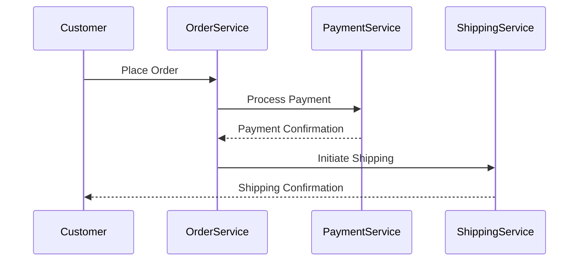

## 9.7 Event Modeling and Discovery

In the realm of event-driven architectures, the ability to effectively model and discover events is paramount. This section delves into the methodologies and practices that enable organizations to align their technical systems with real-world business processes through precise event modeling and discovery.

### Understanding Event Discovery

Event discovery is the foundational step in designing event-driven systems. It involves identifying the key events that occur within an organization's business processes. These events are the triggers that drive the behavior of the system and are crucial for ensuring that the architecture reflects the actual needs and operations of the business.

#### The Process of Event Discovery

1. **Identify Business Processes**: Begin by mapping out the core business processes. This involves collaborating with stakeholders to understand the workflows and operations that are critical to the organization.

2. **Engage with Stakeholders**: Conduct workshops and interviews with stakeholders to gather insights into the events that are significant to them. This engagement ensures that the events identified are relevant and aligned with business objectives.

3. **Document Existing Systems**: Analyze existing systems to identify events that are already being captured. This can provide a baseline for understanding current capabilities and gaps.

4. **Use Event Storming**: Employ techniques such as Event Storming to facilitate collaborative discovery sessions. Event Storming is a workshop-based method that brings together domain experts and technical teams to explore and model events.

5. **Iterate and Refine**: Event discovery is an iterative process. Continuously refine the list of events as more information becomes available and as the understanding of the business processes deepens.

### Techniques for Effective Event Modeling

Once events have been discovered, the next step is to model them effectively. Event modeling involves defining the structure, attributes, and relationships of events within the system.

#### Key Techniques

- **Event Definition**: Clearly define each event, including its name, attributes, and the context in which it occurs. This ensures that all stakeholders have a shared understanding of what each event represents.

- **Event Sourcing**: Implement event sourcing to capture the state changes in the system as a sequence of events. This technique provides a complete audit trail and enables the reconstruction of past states.

- **Domain-Driven Design (DDD)**: Utilize DDD principles to align events with the domain model. This involves identifying aggregates, bounded contexts, and domain events that reflect the business logic.

- **Command Query Responsibility Segregation (CQRS)**: Apply CQRS to separate the read and write models, allowing for more flexible and scalable event processing.

- **Event Schema Design**: Design event schemas that are versioned and evolvable. This ensures that changes to events do not disrupt the system and that backward compatibility is maintained.

### Tools and Practices for Event Modeling

Several tools and practices can aid in the process of event modeling and discovery. These tools facilitate collaboration, visualization, and documentation of events.

#### Event Storming

Event Storming is a powerful workshop-based technique for event discovery and modeling. It involves gathering domain experts and technical teams to collaboratively explore and model the events within a system.

- **Process**: Participants use sticky notes to represent events, commands, and aggregates, arranging them on a large surface to visualize the flow of events.

- **Benefits**: Event Storming promotes a shared understanding of the domain, encourages collaboration, and helps identify gaps and opportunities in the system design.

- **Tools**: Tools such as Miro and MURAL can be used to facilitate remote Event Storming sessions, providing digital canvases for collaboration.

#### Event Modeling

Event Modeling is a technique that extends Event Storming by providing a more detailed and structured approach to modeling events.

- **Blueprint**: Create a blueprint of the system that includes events, commands, views, and read models. This blueprint serves as a guide for implementation.

- **Workshops**: Conduct workshops to refine the event model, involving both technical and business stakeholders to ensure alignment.

- **Tools**: Tools like EventModeling.org provide templates and guidelines for conducting Event Modeling sessions.

### Aligning Technical Events with Business Events

One of the key benefits of effective event modeling and discovery is the alignment of technical events with business events. This alignment ensures that the system accurately reflects the business processes and can adapt to changes in the business environment.

#### Benefits of Alignment

- **Improved Communication**: A shared understanding of events across technical and business teams improves communication and collaboration.

- **Increased Agility**: Systems that are aligned with business events can adapt more quickly to changes in the business environment, enabling greater agility.

- **Enhanced Traceability**: By capturing events that reflect business processes, organizations can achieve greater traceability and accountability.

- **Better Decision Making**: Access to real-time event data enables more informed decision-making and supports data-driven strategies.

### Practical Applications and Real-World Scenarios

Event modeling and discovery have numerous practical applications in real-world scenarios. Here are a few examples:

- **E-commerce Platforms**: In an e-commerce platform, events such as "Order Placed," "Payment Processed," and "Order Shipped" are critical for tracking the order lifecycle and ensuring timely fulfillment.

- **Financial Services**: In financial services, events like "Transaction Initiated," "Fraud Detected," and "Account Updated" are essential for maintaining accurate records and ensuring compliance.

- **IoT Systems**: In IoT systems, events such as "Sensor Reading Captured," "Threshold Exceeded," and "Device Offline" are crucial for monitoring and managing devices.

### Code Examples

To illustrate the concepts of event modeling and discovery, let's explore some code examples in Java, Scala, Kotlin, and Clojure.

#### Java Example

```java
// Define an event class in Java
public class OrderPlacedEvent {
    private String orderId;
    private String customerId;
    private List<String> productIds;
    private LocalDateTime timestamp;

    // Constructor, getters, and setters
    public OrderPlacedEvent(String orderId, String customerId, List<String> productIds, LocalDateTime timestamp) {
        this.orderId = orderId;
        this.customerId = customerId;
        this.productIds = productIds;
        this.timestamp = timestamp;
    }

    // Getters and setters omitted for brevity
}
```

#### Scala Example

```scala
// Define an event case class in Scala
case class OrderPlacedEvent(orderId: String, customerId: String, productIds: List[String], timestamp: LocalDateTime)
```

#### Kotlin Example

```kotlin
// Define an event data class in Kotlin
data class OrderPlacedEvent(
    val orderId: String,
    val customerId: String,
    val productIds: List<String>,
    val timestamp: LocalDateTime
)
```

#### Clojure Example

```clojure
;; Define an event map in Clojure
(def order-placed-event
  {:order-id "12345"
   :customer-id "67890"
   :product-ids ["prod1" "prod2" "prod3"]
   :timestamp (java.time.LocalDateTime/now)})
```

### Visualizing Event Flows

To enhance understanding, let's visualize an event flow using a Mermaid.js diagram.



**Caption**: This diagram illustrates the flow of events in an e-commerce order processing system, highlighting the interactions between different services.

### Knowledge Check

To reinforce your understanding of event modeling and discovery, consider the following questions:

1. What are the key steps in the event discovery process?
2. How does Event Storming facilitate event modeling?
3. Why is it important to align technical events with business events?
4. What are some practical applications of event modeling in real-world scenarios?

### Conclusion

Event modeling and discovery are critical components of designing effective event-driven architectures. By aligning technical events with business processes, organizations can build systems that are agile, traceable, and reflective of real-world operations. Through techniques such as Event Storming and Event Modeling, teams can collaborate effectively to discover and model events, ensuring that their systems are well-suited to meet the needs of the business.

## Test Your Knowledge: Advanced Event Modeling and Discovery Quiz



### What is the primary goal of event discovery in organizations?

- [x] To identify key events that reflect business processes
- [ ] To create detailed technical specifications
- [ ] To replace existing systems
- [ ] To automate business operations

> **Explanation:** Event discovery aims to identify key events that reflect business processes, ensuring that the system aligns with organizational needs.

### Which technique is commonly used for collaborative event discovery?

- [x] Event Storming
- [ ] Code Review
- [ ] Pair Programming
- [ ] Continuous Integration

> **Explanation:** Event Storming is a workshop-based technique used for collaborative event discovery, involving domain experts and technical teams.

### What is the benefit of aligning technical events with business events?

- [x] Improved communication and collaboration
- [ ] Increased system complexity
- [ ] Reduced system performance
- [ ] Decreased traceability

> **Explanation:** Aligning technical events with business events improves communication and collaboration, ensuring that the system reflects business processes.

### What is Event Sourcing?

- [x] A technique to capture state changes as a sequence of events
- [ ] A method for querying databases
- [ ] A process for generating random events
- [ ] A tool for visualizing data

> **Explanation:** Event Sourcing captures state changes as a sequence of events, providing a complete audit trail and enabling state reconstruction.

### Which of the following is a key technique for effective event modeling?

- [x] Domain-Driven Design (DDD)
- [ ] Waterfall Development
- [ ] Manual Testing
- [ ] Static Code Analysis

> **Explanation:** Domain-Driven Design (DDD) is a key technique for effective event modeling, aligning events with the domain model.

### What is the role of Event Storming in event modeling?

- [x] To facilitate collaborative discovery and modeling of events
- [ ] To automate code generation
- [ ] To replace manual testing
- [ ] To enforce coding standards

> **Explanation:** Event Storming facilitates collaborative discovery and modeling of events, promoting a shared understanding of the domain.

### How does Event Modeling extend Event Storming?

- [x] By providing a more detailed and structured approach to modeling events
- [ ] By automating event processing
- [ ] By eliminating the need for stakeholder involvement
- [ ] By focusing solely on technical specifications

> **Explanation:** Event Modeling extends Event Storming by providing a more detailed and structured approach to modeling events, including blueprints and workshops.

### What is a practical application of event modeling in e-commerce platforms?

- [x] Tracking the order lifecycle with events like "Order Placed" and "Order Shipped"
- [ ] Automating customer support
- [ ] Generating marketing content
- [ ] Designing user interfaces

> **Explanation:** In e-commerce platforms, event modeling is used to track the order lifecycle with events like "Order Placed" and "Order Shipped."

### What is the significance of event schema design?

- [x] Ensuring versioned and evolvable event schemas
- [ ] Increasing system latency
- [ ] Reducing system scalability
- [ ] Limiting system flexibility

> **Explanation:** Event schema design ensures versioned and evolvable event schemas, maintaining backward compatibility and system flexibility.

### True or False: Event discovery is a one-time process.

- [ ] True
- [x] False

> **Explanation:** False. Event discovery is an iterative process that requires continuous refinement as more information becomes available.


