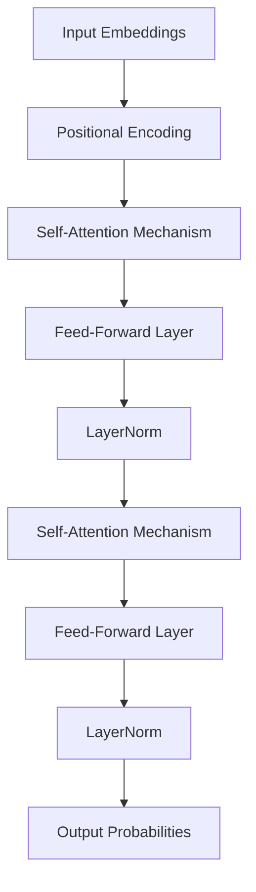

## Overview

The Transformer architecture has revolutionized the field of Natural Language Processing (NLP) and other tasks involving sequential data. Introduced by Vaswani et al. in the paper "[Attention is All You Need](https://arxiv.org/abs/1706.03762)," the Transformer model leverages self-attention mechanisms to efficiently and effectively process and generate sequences without relying on recurrent architecture. This article provides an in-depth exploration of Transformers, their components, and their implementations in various programming languages and frameworks. 

## What are Transformers?

Transformers are models designed to handle sequential data with an emphasis on long-range dependencies. They are particularly prominent in NLP tasks such as machine translation, text generation, and sentiment analysis. Transformers utilize an attention mechanism to weigh the influence of different parts of the input sequence when generating new parts of the sequence.

### Key Components

1. **Self-Attention Mechanism**: Calculates the attention scores for each word in the input sequence concerning all other words to capture dependencies.
2. **Positional Encodings**: Injects order information into input embeddings since Transformers lack inherent sequential structure.
3. **Feed-Forward Neural Networks**: Used after attention mechanisms to further process the data.
4. **Multi-Head Attention**: Enhances model performance by allowing the model to jointly attend to information from different representation subspaces.
5. **Layer Normalization**: Stabilizes training by normalizing inputs to each layer.

### Architecture

Here’s an architectural diagram to explain the transformer model structure:



## Example Implementations

### Python: Using PyTorch

Here, we implement a simple transformer model using PyTorch:

```python
import torch
import torch.nn as nn
import torch.nn.functional as F

class TransformerModel(nn.Module):
    def __init__(self, input_dim, model_dim, num_heads, num_layers):
        super(TransformerModel, self).__init__()
        self.embedding = nn.Embedding(input_dim, model_dim)
        self.pos_encoder = PositionalEncoding(model_dim)
        encoder_layers = nn.TransformerEncoderLayer(model_dim, num_heads)
        self.transformer_encoder = nn.TransformerEncoder(encoder_layers, num_layers)
        self.fc = nn.Linear(model_dim, input_dim)
        
    def forward(self, x):
        x = self.embedding(x) * math.sqrt(model_dim)
        x = self.pos_encoder(x)
        x = self.transformer_encoder(x)
        return F.log_softmax(self.fc(x), dim=-1)
```

### Python: Using TensorFlow

Using TensorFlow's high-level Keras API for implementing a transformer model:

```python
import tensorflow as tf
from tensorflow.keras.layers import Embedding, Dense
from tensorflow.keras import Model

class TransformerModel(tf.keras.Model):
    def __init__(self, input_dim, model_dim, num_heads, num_layers):
        super(TransformerModel, self).__init__()
        self.embedding = Embedding(input_dim, model_dim)
        self.transformer_block = [
            tf.keras.layers.MultiHeadAttention(num_heads, model_dim)
            for _ in range(num_layers)
        ]
        self.dense_output = Dense(input_dim)

    def call(self, inputs):
        x = self.embedding(inputs)
        for attn_layer in self.transformer_block:
            x = attn_layer(x, x)
        return self.dense_output(x)
```

## Related Design Patterns

- **Encoder-Decoder Architecture**: Primarily used in sequence-to-sequence tasks such as translation. Transformers can be seen as an advanced form of the encoder-decoder paradigm.
- **Attention Mechanism**: The crux of the transformer lies in the self-attention mechanism, frequently used in conjunction with RNNs and CNNs to improve model performance.
- **Transfer Learning**: Transformers-based pre-trained models, such as BERT and GPT, are often fine-tuned on specific tasks, highlighting the significance of efficient resource utilization and reducing the demand for large-scale training data.

## Additional Resources

1. **[Attention is All You Need](https://arxiv.org/abs/1706.03762)** - The seminal paper introducing the Transformer model.
2. **[The Annotated Transformer](http://nlp.seas.harvard.edu/2018/04/03/attention.html)** - A comprehensive guide to understanding the Transformer architecture.
3. **[BERT: Pre-training of Deep Bidirectional Transformers for Language Understanding](https://arxiv.org/abs/1810.04805)** - Application of Transformers in BERT, a state-of-the-art language model.
4. **[Introduction to Transformers](https://www.tensorflow.org/text/tutorials/transformer)** - A tutorial on using Transformer models in TensorFlow.

## Summary

Transformers represent an advanced architecture for handling sequential data, characterized by their self-attention mechanism. They overcome many limitations of traditional RNN-based models and have become the foundation of state-of-the-art NLP models. By deeply understanding and leveraging Transformers, practitioners can significantly enhance the performance of tasks such as language understanding, translation, and text generation.

Their ability to parallelize and efficiently manage long-range dependencies enables transformers to handle large data sets, proving their versatility and efficiency in modern machine learning applications. As the community further explores and refines these models, the scope of problem domains addressable by Transformers is expected to continue expanding.
