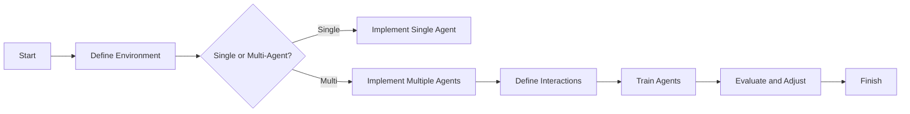

## Introduction

Multi-Agent Systems (MAS) refer to a paradigm in which numerous agents interact within a shared environment to accomplish tasks or solve problems that would be difficult or even impossible for a single agent to handle. The agents in these systems can collaborate, compete, or do both to optimize certain objectives. This approach is particularly powerful in the domain of Reinforcement Learning (RL), providing advanced strategies for problem-solving.

## Core Concepts

### Agents
Agents are autonomous entities that perceive their environment through sensors and act upon it through actuators. In MAS, each agent may have unique characteristics and objectives.

### Environment
The shared environment is the context within which the agents operate. It could be anything from a physical space to a virtual environment like a game or simulation.

### Interaction
Agents interact with each other and the environment. These interactions can be cooperative, competitive, or neutral. The nature of these interactions determines the overall dynamics and emergent behaviors of the system.

### Objectives
Agents in MAS may have individual or shared goals. Their interactions are often aimed at achieving these objectives efficiently and effectively.

## Example Implementations

### Example in Python using OpenAI Gym and RLlib

```python
import gym
from ray import tune
from ray.rllib.agents.ppo import PPOTrainer

class SimpleMultiAgentEnv(gym.Env):
    def __init__(self, config):
        self.observation_space = gym.spaces.Discrete(5)
        self.action_space = gym.spaces.Discrete(2)
        self.n_agents = config["n_agents"]

    def reset(self):
        return {i: self.observation_space.sample() for i in range(self.n_agents)}

    def step(self, actions):
        obs = {i: self.observation_space.sample() for i in range(self.n_agents)}
        rewards = {i: 1 for i in range(self.n_agents)}
        dones = {i: False for i in range(self.n_agents)}
        dones["__all__"] = False
        return obs, rewards, dones, {}

config = {
    "env": SimpleMultiAgentEnv,
    "env_config": {
        "n_agents": 2
    },
    "multiagent": {
        "policies": {
            "policy_1": (None, gym.spaces.Discrete(5), gym.spaces.Discrete(2), {}),
            "policy_2": (None, gym.spaces.Discrete(5), gym.spaces.Discrete(2), {}),
        },
        "policy_mapping_fn": lambda agent_id: "policy_1" if agent_id == 0 else "policy_2"
    }
}

tune.run(PPOTrainer, config=config)
```

### Example in Java Using DL4J

```java
import org.deeplearning4j.rl4j.environment.Environment;
import org.deeplearning4j.rl4j.space.Observation;
import org.deeplearning4j.rl4j.space.DiscreteSpace;

class SimpleMultiAgentEnv implements Environment<Observation> {
    private int numAgents;

    public SimpleMultiAgentEnv(int numAgents) {
        this.numAgents = numAgents;
    }

    @Override
    public Observation reset() {
        return new Observation(new int[]{new Random().nextInt(5)});
    }

    @Override
    public void close() { }

    @Override
    public StepResult<Observation> step(Integer action) {
        Observation observation = new Observation(new int[]{new Random().nextInt(5)});
        double reward = 1.0;
        boolean isDone = false;
        return new StepResult<>(observation, reward, isDone);
    }
}
```

## Related Design Patterns

### Coordinated Reinforcement Learning
In Coordinated RL, multiple agents synergistically optimize their strategies. This is often seen in environments with a high degree of agent interdependence.

### Hierarchical RL
Hierarchical RL involves decomposing complex tasks into simpler subtasks. Each agent in the hierarchy handles a subtask, facilitating clearer goals and faster learning.

## Additional Resources

1. **Books**
   - *Multi-Agent Systems: Algorithmic, Game-Theoretic, and Logical Foundations* by Yoav Shoham and Kevin Leyton-Brown
   - *Reinforcement Learning: An Introduction* by Richard S. Sutton and Andrew G. Barto

2. **Research Papers**
   - "Cooperative Multi-Agent Reinforcement Learning: A Survey" by L. Panait and S. Luke
   - "Learning to Communicate with Deep Multi-Agent Reinforcement Learning" by J. Foerster et al.

3. **Online Courses**
   - [Multi-agent Reinforcement Learning](https://www.coursera.org/learn/multi-agent-reinforcement-learning) on Coursera
   - [Advanced Deep Learning & Reinforcement Learning](https://www.udacity.com/course/deep-reinforcement-learning-nanodegree--nd893) on Udacity

## Summary

Multi-Agent Systems provide a robust framework for solving complex problems that involve multiple interacting agents within a shared environment. By leveraging advanced reinforcement learning strategies, MAS can handle tasks involving collaboration, competition, and communication between agents. As a versatile and powerful technique, MAS finds applications in numerous fields such as robotics, economics, and strategic games, pushing the boundaries of what single-agent systems can achieve.



By understanding and implementing the principles of Multi-Agent Systems, we can create more adaptive and intelligent solutions, advancing the state of the art in machine learning and artificial intelligence.
