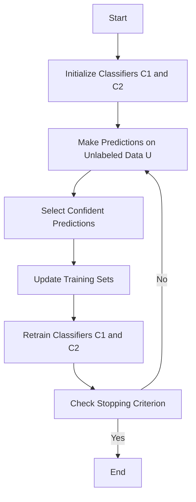

## Introduction

Co-Training is a semi-supervised learning technique that extends the capabilities of machine learning models by using multiple classifiers to iteratively label additional, initially unlabeled, data. This method leverages the consensus and disagreement between different classifiers to enhance the training process, often leading to better generalization on unseen data.

## Detailed Description

In Co-Training, the central idea is to train multiple classifiers on different, ideally independent, views (or feature sets) of the data. Each classifier then makes predictions on a subset of the unlabeled data and adds the most confidently predicted labels to the training set of the other classifier. This iterative labeling continues until a stopping criterion is met, such as a maximum number of iterations or a convergence threshold.

### The Algorithm

1. **Initialization**:
   - Start with a small labeled dataset \\( L \\) and a larger set of unlabeled data \\( U \\).
   - Split the feature set \\( \mathbf{X} \\) into two disjoint subsets \\( \mathbf{X}_1 \\) and \\( \mathbf{X}_2 \\).
   - Train two classifiers: \\( C_1 \\) on \\( \mathbf{X}_1(L) \\) and \\( C_2 \\) on \\( \mathbf{X}_2(L) \\).

2. **Iteration**:
   - Each classifier \\( C_1 \\) and \\( C_2 \\) predicts labels for every instance in \\( U \\).
   - Select the most confidently predicted examples from \\( C_1 \\) to add to the training set of \\( C_2 \\), and vice versa.
   - Retrain \\( C_1 \\) and \\( C_2 \\) on their respective updated training sets.
   - Repeat the process until the stopping criterion is satisfied.

### Mathematical Formulation

Let's denote:

- \\( D = L \cup U \\) as the dataset
- \\( f_1: \mathbf{X}_1 \rightarrow Y \\) and \\( f_2: \mathbf{X}_2 \rightarrow Y \\) as the classifiers
- \\( y \in Y \\) as the label set

Assume \\( X_i \\) and \\( X_j \\) are the feature splits for view \\( i \\) and \\( j \\).

1. Train initial classifiers:
   
   f_1 = \text{train}(\mathbf{X}_1(L), Y)
   
   
   f_2 = \text{train}(\mathbf{X}_2(L), Y)
   

2. Iteratively refine:
   
   y_{1_u} = f_1(U) \quad \text{and} \quad y_{2_u} = f_2(U)
   
   
   L_2 = L_2 \cup \{(x_2, y_{1_u}) \mid \text{conf}(y_{1_u}) > \tau_1\}
   
   
   L_1 = L_1 \cup \{(x_1, y_{2_u}) \mid \text{conf}(y_{2_u}) > \tau_2\}
   
   Retrain:
   
   f_1 = \text{train}(\mathbf{X}_1(L_1), Y)
   
   
   f_2 = \text{train}(\mathbf{X}_2(L_2), Y)
   

## Example Implementation

### Python Example using Scikit-Learn

```python
from sklearn.model_selection import train_test_split
from sklearn.datasets import load_iris
from sklearn.naive_bayes import GaussianNB
from sklearn.svm import SVC
import numpy as np

data = load_iris()
X, y = data.data, data.target

X_labeled, X_unlabeled, y_labeled, _ = train_test_split(X, y, test_size=0.9, stratify=y)

X1_labeled, X2_labeled = X_labeled[:, :2], X_labeled[:, 2:]
X1_unlabeled, X2_unlabeled = X_unlabeled[:, :2], X_unlabeled[:, 2:]

clf1 = GaussianNB()
clf2 = SVC(probability=True)

clf1.fit(X1_labeled, y_labeled)
clf2.fit(X2_labeled, y_labeled)

num_iterations = 10
for iter in range(num_iterations):
    # Predict on unlabeled data
    y1_pred_prob = clf1.predict_proba(X1_unlabeled)
    y2_pred_prob = clf2.predict_proba(X2_unlabeled)
    
    # Select the most confident predictions
    threshold = 0.9
    confident_idx1 = np.where(np.max(y1_pred_prob, axis=1) > threshold)[0]
    confident_idx2 = np.where(np.max(y2_pred_prob, axis=1) > threshold)[0]
    
    # Update labeled sets
    X1_labeled = np.vstack([X1_labeled, X1_unlabeled[confident_idx1]])
    y_labeled = np.append(y_labeled, y1_pred_prob[confident_idx1].argmax(axis=1))
    X2_labeled = np.vstack([X2_labeled, X2_unlabeled[confident_idx2]])
    y_labeled = np.append(y_labeled, y2_pred_prob[confident_idx2].argmax(axis=1))
    
    # Remove the confidently predicted instances from unlabeled sets
    X1_unlabeled = np.delete(X1_unlabeled, confident_idx1, axis=0)
    X2_unlabeled = np.delete(X2_unlabeled, confident_idx2, axis=0)
    
    # Retrain classifiers with the augmented labeled set
    clf1.fit(X1_labeled, y_labeled)
    clf2.fit(X2_labeled, y_labeled)
```

## Related Design Patterns

### Self-Training

Self-Training involves a single classifier iteratively labeling its most confident predictions on unlabeled data and retraining with these newly labeled instances. Co-Training can be considered an extension of Self-Training using multiple classifiers.

### Tri-Training

Tri-Training extends Co-Training by using three classifiers that iterate between predictions and retraining. This adds additional robustness and diversity but also increases computational complexity.

## Additional Resources

- **Books**:
  - _Semi-Supervised Learning_ by Olivier Chapelle, Bernhard Scholkopf, Alexander Zien

- **Research Papers**:
  - Blum, A., & Mitchell, T. (1998). Combining labeled and unlabeled data with co-training. _Proceedings of the Annual Conference on Computational Learning Theory (COLT)_.
  
- **Courses**:
  - Coursera: _Advanced Machine Learning Specialization_

## Summary

Co-Training is a powerful semi-supervised learning design pattern that leverages multiple classifiers and multiple views of data to iteratively expand the labeled dataset. By harnessing the agreement and confidence of different models, it improves the overall performance and generalization of the classifiers. Understanding and implementing Co-Training can provide significant performance enhancements, especially in scenarios with limited labeled data.



This detailed guide on Co-Training showcases its process, implementation, and advantages. By following this pattern, you can effectively utilize limited labeled data for training robust machine learning models.


