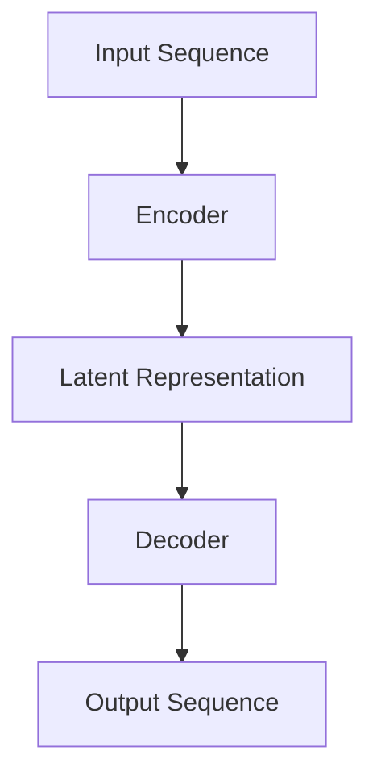

Natural Language Processing (NLP) is an essential domain within machine learning, dedicated to the interaction between computers and human language. This design pattern focuses on specialized NLP models intended for understanding and generating human language. Examples include language models, text classifiers, and sequence-to-sequence models. These models are often pivotal in tasks such as sentiment analysis, machine translation, question answering, and text summarization.

## Key Components and Techniques

### 1. Tokenization
Tokenization is the process of dividing text into smaller chunks, such as words or subwords, which is a crucial step in text processing.

```python
from nltk.tokenize import word_tokenize

example_text = "Natural Language Processing is fascinating!"
tokens = word_tokenize(example_text)
print(tokens)
```

### 2. Embeddings
Embeddings are dense vector representations of words or phrases that capture their meanings in a continuous vector space. 

#### Word2Vec Example
```python
from gensim.models import Word2Vec

sentences = [["natural", "language", "processing", "is", "fun"],
             ["machine", "learning", "and", "nlp", "are", "closely", "related"]]
model = Word2Vec(sentences, vector_size=100, window=5, min_count=1, workers=4)
vector = model.wv['nlp']
print(vector)
```

### 3. Language Models
Language models predict the likelihood of a sequence of words and generate human-like text.

#### GPT-3 Example (using OpenAI API)
```python
import openai

openai.api_key = 'YOUR_API_KEY'
response = openai.Completion.create(
  engine="text-davinci-003",
  prompt="Once upon a time",
  max_tokens=50
)
print(response.choices[0].text.strip())
```

### 4. Sequence-to-Sequence Models
Sequence-to-sequence models are pivotal in applications like machine translation and text summarization.

#### Neural Machine Translation Example (using TensorFlow)
```python
import tensorflow as tf
from tensorflow.keras.layers import Embedding, LSTM, Dense, Input
from tensorflow.keras.models import Model

encoder_inputs = Input(shape=(None,))
encoder_embedding = Embedding(input_dim=vocab_size, output_dim=256)(encoder_inputs)
encoder_lstm = LSTM(256, return_state=True)
encoder_outputs, state_h, state_c = encoder_lstm(encoder_embedding)

decoder_inputs = Input(shape=(None,))
decoder_embedding = Embedding(input_dim=vocab_size, output_dim=256)(decoder_inputs)
decoder_lstm = LSTM(256, return_sequences=True, return_state=True)
decoder_outputs, _, _ = decoder_lstm(decoder_embedding, initial_state=[state_h, state_c])
decoder_dense = Dense(vocab_size, activation='softmax')
decoder_outputs = decoder_dense(decoder_outputs)

model = Model([encoder_inputs, decoder_inputs], decoder_outputs)
model.compile(optimizer='rmsprop', loss='sparse_categorical_crossentropy')
model.summary()
```

### Diagram: Encoder-Decoder Architecture


## Related Design Patterns

### 1. Transfer Learning
Leverage pre-trained models on large datasets and fine-tune them for specific NLP tasks (e.g., BERT, GPT).

### 2. Attention Mechanism
A technique that allows the model to focus on different parts of the input sequence when making predictions (e.g., Transformer models).

### 3. Recurrent Neural Networks (RNNs)
Used for sequential data, such as text, because of their ability to maintain contextual information through hidden states.

## Additional Resources
- **Books**: "Speech and Language Processing" by Jurafsky and Martin, "Deep Learning for Natural Language Processing" by Palash Goyal, et al.
- **Courses**: Coursera's "Natural Language Processing with Classification and Vector Spaces," "Sequence Models" by Deeplearning.ai
- **Papers**: "Attention is All You Need" by Vaswani, et al., "BERT: Pre-training of Deep Bidirectional Transformers for Language Understanding" by Devlin, et al.
- **Libraries**: NLTK, SpaCy, Gensim, Hugging Face's Transformers

## Summary
Natural Language Processing is a vital area of machine learning that encompasses various specialized models and techniques designed to improve a machine’s comprehension and generation of human language. This article reveals the critical components and methodologies, provides implementation examples, and highlights related design patterns and additional resources to deepen understanding. Through advanced models like BERT and GPT, modern NLP continues to transform tasks such as translation, summarization, and conversational agents, propelling the field forward.

For individuals looking to dive deeper, exploring pre-trained models, attention mechanisms, and sequence-to-sequence learning can provide a robust foundation for working in NLP.

By leveraging the models and techniques discussed, practitioners can build sophisticated applications that interact seamlessly with human language, ultimately advancing human-computer interaction.
