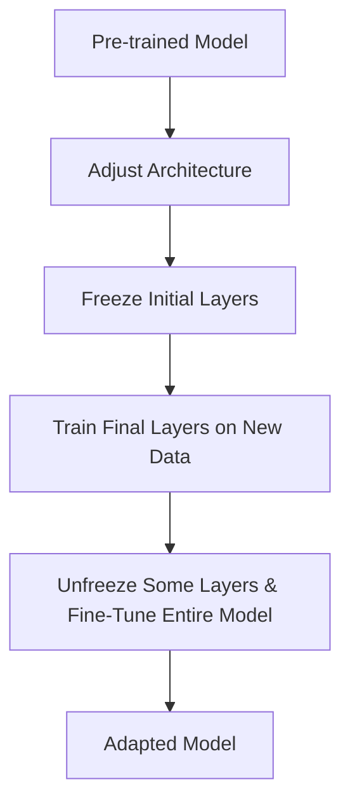

## Introduction

Fine-Tuning is a design pattern in machine learning that involves taking a pre-trained model and retraining one or more of its layers on new data. The goal of Fine-Tuning is to leverage the pre-trained model's learned features and adapt it to a specific new task, often with a relatively small amount of new data. This technique is a subcategory of Transfer Learning Variants and occupies an important space in advanced model optimization techniques.

## Detailed Explanation

Fine-Tuning involves the following steps:

1. **Obtain a Pre-trained Model**: Start with a model pre-trained on a large dataset.
2. **Customizing the Model Architecture**: Adjust the model architecture if necessary, typically modifying the final layers to match the new task's output dimension.
3. **Freeze Initial Layers**: Initially freeze the layers of the network so that their weights are not updated during the training process.
4. **Re-train Final Layers**: Train the final layers on the new dataset, allowing only them to update their weights.
5. **Unfreeze and Fine-Tune**: Optionally, unfreeze some of the earlier layers and fine-tune the entire model by continuing training, typically with a lower learning rate.

### Mathematical Formulation

Suppose we have a pre-trained model \\( M \\) with parameters \\( \theta \\):

 M(x; \theta) 

We can split \\( \theta \\) into two parts: \\( \theta_f \\) (features part, initial layers), and \\( \theta_c \\) (classification part, final layers):

 M(x; \theta) = C(F(x; \theta_f); \theta_c) 

Fine-Tuning, in essence, modifies \\( \theta_c \\) (and possibly fine-tunes \\( \theta_f \\)):

 \theta_f = \theta_f^{\text{initial}} 
 \theta_c = \text{argmin}_{\theta_c} \mathbb{E}_{(x,y)\sim D_{\text{new}}}[\mathcal{L}(C(F(x; \theta_f^{\text{initial}}); \theta_c), y)] 

where \\(\mathcal{L}\\) is the loss function and \\(D_{\text{new}}\\) is the new dataset.

## Code Examples

### TensorFlow/Keras Example

```python
import tensorflow as tf
from tensorflow.keras.applications import VGG16
from tensorflow.keras.layers import Dense, GlobalAveragePooling2D
from tensorflow.keras.models import Model
from tensorflow.keras.optimizers import Adam

base_model = VGG16(weights='imagenet', include_top=False)

for layer in base_model.layers:
    layer.trainable = False

x = base_model.output
x = GlobalAveragePooling2D()(x)
x = Dense(1024, activation='relu')(x)
predictions = Dense(10, activation='softmax')(x) # Assuming 10 new classes

model = Model(inputs=base_model.input, outputs=predictions)

model.compile(optimizer=Adam(learning_rate=1e-4), loss='categorical_crossentropy', metrics=['accuracy'])

model.fit(new_data, new_labels, epochs=10)
```

### PyTorch Example

```python
import torch
import torch.nn as nn
import torch.optim as optim
from torchvision import models, datasets, transforms

model = models.resnet18(pretrained=True)

for param in model.parameters():
    param.requires_grad = False

num_features = model.fc.in_features
model.fc = nn.Linear(num_features, 10)

optimizer = optim.Adam(model.fc.parameters(), lr=1e-4)
criterion = nn.CrossEntropyLoss()

for epoch in range(num_epochs):
    model.train()
    running_loss = 0.0
    for inputs, labels in dataloader:
        optimizer.zero_grad()
        outputs = model(inputs)
        loss = criterion(outputs, labels)
        loss.backward()
        optimizer.step()
        running_loss += loss.item()
    print(f'Epoch [{epoch+1}/{num_epochs}], Loss: {running_loss/len(dataloader)}')
```

## Related Design Patterns

### Transfer Learning
Transfer Learning is the broader parent category of Fine-Tuning, involving the reuse of a pre-trained model on a new problem. It encompasses techniques like feature extraction and Fine-Tuning.

### Feature Extraction
Feature Extraction involves using the representations learned by a pre-trained model as features for a new task, without further training the model's weights. It is less computationally expensive compared to Fine-Tuning but may not yield as customized results.

### Knowledge Distillation
Knowledge Distillation involves training a smaller model (student model) to approximate the output distribution of a larger, pre-trained model (teacher model). This pattern can be combined with Fine-Tuning for efficient deployment.

## Additional Resources

1. **Deep Learning for Computer Vision by Jason Brownlee** - This book covers practical applications of Transfer Learning and Fine-Tuning using popular deep learning frameworks.
2. **Coursera: Deep Learning Specialization** - Offers in-depth courses on various deep learning techniques, including Transfer Learning and Fine-Tuning.

## Summary

Fine-Tuning is a powerful technique for adapting pre-trained models to new tasks, leveraging learned features from extensive datasets, and allowing for new model customization with relatively little data. By understanding both the theoretical and practical implications of Fine-Tuning, machine learning practitioners can effectively repurpose existing models to solve specific domain problems efficiently.


