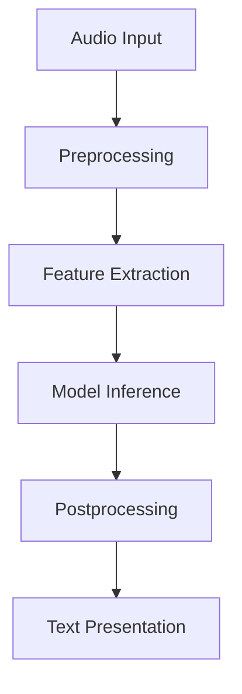

## Speech-to-Text for Accessibility: Enhancing Accessibility using Real-time Speech-to-Text Conversion

One of the transformative applications of machine learning is its ability to convert spoken language into text in real time, thereby enhancing accessibility for people with hearing impairments or in environments where audio cannot be used. This design pattern involves integrating speech-to-text technology within user applications to provide instant text transcriptions of spoken words.

### Overview

Real-time speech-to-text (STT) systems convert spoken language into written text dynamically. These systems use advanced machine learning algorithms, often based on deep learning architectures like Recurrent Neural Networks (RNNs) and Transformer models. By embedding such models within applications, users can benefit from increased accessibility, whether they are attending meetings, watching videos, or participating in live events.

### How It Works

1. **Audio Input**: Capture the spoken language via a microphone or audio stream.
2. **Preprocessing**: Normalize audio, remove background noise, and segment speech.
3. **Feature Extraction**: Convert the audio signal into features such as Mel Frequency Cepstral Coefficients (MFCCs).
4. **Model Inference**: Apply a trained speech-to-text model to convert features into text.
5. **Postprocessing**: Correct grammar and punctuation, filter out non-speech artifacts.
6. **Presentation**: Display the final text in real-time to the user.

### Example Implementations

#### Python with Google Cloud Speech-to-Text

```python
import os
from google.cloud import speech

os.environ["GOOGLE_APPLICATION_CREDENTIALS"] = "path/to/credential.json"
client = speech.SpeechClient()
audio_file = "path/to/audio/file.wav"

with open(audio_file, "rb") as audio:
    content = audio.read()
    audio = speech.RecognitionAudio(content=content)

config = speech.RecognitionConfig(
    encoding=speech.RecognitionConfig.AudioEncoding.LINEAR16,
    sample_rate_hertz=16000,
    language_code="en-US"
)

response = client.recognize(config=config, audio=audio)
for result in response.results:
    print(f'Transcript: {result.alternatives[0].transcript}')
```

#### JavaScript with Web Speech API

```html
<!DOCTYPE html>
<html lang="en">
<head>
  <meta charset="UTF-8">
  <title>Speech-to-Text</title>
</head>
<body>
  <button id="start-button">Start Recognition</button>
  <div id="transcript"></div>
  
  <script>
    const startButton = document.getElementById("start-button");
    const transcriptDiv = document.getElementById("transcript");

    startButton.addEventListener("click", () => {
      const recognition = new (window.SpeechRecognition || window.webkitSpeechRecognition)();
      recognition.lang = 'en-US';
      recognition.interimResults = true;
      recognition.maxAlternatives = 1;

      recognition.start();

      recognition.onresult = (event) => {
        const transcript = event.results[0][0].transcript;
        transcriptDiv.innerHTML = `Transcript: ${transcript}`;
      };

      recognition.onerror = (event) => {
        console.error("Error occurred in recognition: ", event.error);
      }
    });
  </script>
</body>
</html>
```

### Related Design Patterns

1. **Text-to-Speech (TTS)**: Converts text data back into spoken audio, often used in tandem with STT for interactive voice response (IVR) systems.
2. **Translation for Accessibility**: Integrates real-time translation services to convert spoken or written language into another language, further enhancing accessibility for non-native speakers.
3. **Edge Processing**: Applies speech-to-text conversion at the edge of the network, such as on mobile devices, to minimize latency and improve user experience, especially in low-connectivity areas.

### Additional Resources

- [Google Cloud Speech-to-Text Documentation](https://cloud.google.com/speech-to-text/docs)
- [Web Speech API Specification](https://wicg.github.io/speech-api/)
- [TensorFlow ASR Models](https://www.tensorflow.org/tutorials/audio/simple_audio)
- [DeepSpeech by Mozilla](https://github.com/mozilla/DeepSpeech)

### Summary

The Speech-to-Text for Accessibility design pattern leverages cutting-edge machine learning models to convert spoken language into text in real time, greatly enhancing usability for individuals with hearing impairments and in environments where audio can't be used. By understanding how to implement, deploy, and integrate these systems in various programming environments and utilizing related design patterns, developers can create highly accessible and inclusive applications.




Implement these advanced design patterns to ensure your applications are accessible, useful, and cutting-edge, catering to the needs of an increasingly diverse user base.
