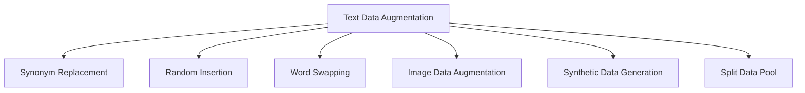

## Introduction
Text Data Augmentation involves techniques used to artificially expand the size and improve the diversity of text datasets. This is particularly important for Natural Language Processing (NLP) tasks, where large datasets are crucial for training robust and accurate models. Common methods include synonym replacement, random insertion, and word swapping.

## Why Augment Text Data?
1. **Combatting Overfitting:** Augmented data helps models generalize better by preventing overfitting to the small available dataset.
2. **Handling Imbalanced Datasets:** Minority classes can be oversampled by generating new, diverse instances.
3. **Enhancing Model Robustness:** Improved model performance on unseen and diverse inputs.

## Methods of Text Data Augmentation

### Synonym Replacement

This technique replaces words in the text with their synonyms. Care needs to be taken to ensure that the meaning and context remain largely unchanged.

#### Example in Python using `nltk` and `wordnet`:

```python
import nltk
from nltk.corpus import wordnet
import random

nltk.download('wordnet')
nltk.download('punkt')

def synonym_replacement(sentence, n):
    words = nltk.word_tokenize(sentence)
    new_words = words.copy()
    random_word_list = list(set([word for word in words if wordnet.synsets(word)]))
    random.shuffle(random_word_list)
    num_replaced = 0
    for random_word in random_word_list:
        synonyms = wordnet.synsets(random_word)
        synonym = synonyms[0].lemmas()[0].name()
        new_words = [synonym if word == random_word else word for word in new_words]
        num_replaced += 1
        if num_replaced >= n:
            break
    return ' '.join(new_words)

original_sentence = "The quick brown fox jumps over the lazy dog"
print(synonym_replacement(original_sentence, 2))
```

### Random Insertion

This method inserts random words into the text. The words to be inserted are typically sampled from the list of all words in the dataset or from a defined vocabulary.

#### Example in Python:

```python
import random
import nltk

nltk.download('averaged_perceptron_tagger')

def random_insertion(sentence, n):
    words = nltk.word_tokenize(sentence)
    new_words = words.copy()
    for _ in range(n):
        new_word = random.choice(words)
        pos_to_insert = random.randint(0, len(new_words))
        new_words.insert(pos_to_insert, new_word)
    return ' '.join(new_words)

original_sentence = "The quick brown fox jumps over the lazy dog"
print(random_insertion(original_sentence, 2))
```

### Word Swapping

This technique randomly selects pairs of words in a sentence and swaps them. This can introduce variations without modifying the overall meaning significantly.

#### Example in Python:

```python
import random
import nltk

nltk.download('punkt')

def word_swap(sentence, n):
    words = nltk.word_tokenize(sentence)
    new_words = words.copy()
    for _ in range(n):
        idx1, idx2 = random.sample(range(len(words)), 2)
        new_words[idx1], new_words[idx2] = new_words[idx2], new_words[idx1]
    return ' '.join(new_words)

original_sentence = "The quick brown fox jumps over the lazy dog"
print(word_swap(original_sentence, 2))
```

## Related Design Patterns

### Image Data Augmentation
Just as text data can be augmented, image data augmentation applies transformations such as rotation, scaling, and flipping to images to artificially increase the dataset size.

### Synthetic Data Generation
Generating entirely new samples by using techniques like GANs (Generative Adversarial Networks) to create synthetic data points in various domains, including text.

### Split Data Pool
Using specialized techniques to smartly split the available data into different pools for training, validation, and testing to ensure robust model performance evaluations.

## Additional Resources

1. **TextAttack**: A Python framework for adversarial attacks, data augmentation, and training in NLP. [TextAttack GitHub](https://github.com/QData/TextAttack)
2. **NLP-Augmenter**: A library specifically designed for augmenting NLP datasets. [NLP-Augmenter GitHub](https://github.com/dsfsi/textaugment)
3. **"Taming Text"** by Grant Ingersoll, Thomas Morton, and Drew Farris: An excellent resource for understanding various NLP techniques.

## Summary
Text Data Augmentation is crucial in NLP tasks for enhancing model performance, preventing overfitting, and addressing data imbalances. Techniques such as synonym replacement, random insertion, and word swapping introduce variability and richness to the dataset. These methods complement various other data management patterns and contribute to creating robust and versatile machine learning models.



Take these methods and tools as part of your AI project's toolkit to ensure you leverage your textual datasets to their fullest potential, ultimately leading to more resilient and accurate NLP models.


